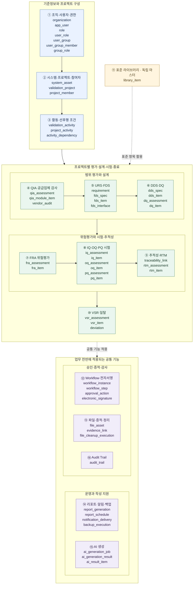

# Validation Management Platform 전체 데이터 구조

전체 **54개 테이블**을 **16개 업무 영역**으로 묶은 구조도입니다. 상자 안에는 실제 테이블명을 표시했습니다.

업무 영역 번호는 이 구조도 내의 구분 번호이며, ERD 명세서의 섹션 번호와 일부 다릅니다.

도식의 실선은 영역 간 구성·업무 흐름을, 점선은 표준 항목 재사용·공통 기능 적용을 나타냅니다. **개별 테이블의 FK나 고정된 실행 순서를 나타내는 선은 아닙니다.** 상세 컬럼과 FK는 테이블 정의서를 참고하세요.

## 전체 구조도

## 핵심 연결

| 구조 | 연결 의미 |
|---|---|
| `organization` → `system_asset` → `validation_project` | 조직에 속한 시스템·장비를 대상으로 프로젝트를 구성합니다. |
| `validation_project` → `project_member` | 프로젝트에 참여하는 사용자와 역할을 연결합니다. |
| `validation_project` → `project_activity` → `validation_activity` | 프로젝트에 배정된 활동을 활동 마스터와 연결하고, 실제 수행 대상 여부는 `is_selected`로 구분합니다. |
| `validation_activity` ↔ `activity_dependency` | 선행·후행 활동과 활성화 조건을 정의합니다. |
| 문서 헤더 → 상세 항목 | `fds_spec`과 `fds_item`처럼 문서 단위 정보와 항목별 내용을 나누어 관리합니다. |
| `traceability_link` → 요구사항·설계·위험·시험 항목 | 대상 유형과 ID를 사용해 산출물 간 추적 관계를 관리합니다. |
| `workflow_instance` → `workflow_step` → `approval_action` | 문서별 승인 절차, 개별 단계, 실제 처리 이력을 관리합니다. 서명이 있는 처리 이력은 `electronic_signature`를 참조합니다. |
| `file_asset` → `evidence_link` → 업무 항목 | 파일을 문서나 시험 항목의 증적으로 연결합니다. 업무 항목과의 연결은 대상 유형과 ID로 관리합니다. |
| `ai_generation_job` → `ai_generation_result` → `ai_result_item` | 생성 요청, 생성 결과, 결과의 상세 항목을 구분합니다. |

`library_item`은 다른 테이블과 직접 FK로 연결되지 않는 독립 마스터이며, URS·IQ·OQ 작성에 사용할 표준 항목을 제공합니다.

공통 기능 영역의 모든 테이블이 프로젝트에 직접 연결되는 것은 아닙니다. Workflow·전자서명·Audit Trail 등의 대상 업무 데이터는 대상 유형과 ID를 함께 저장하는 방식으로 연결합니다. `backup_execution`은 독립적인 운영 실행 이력입니다.
