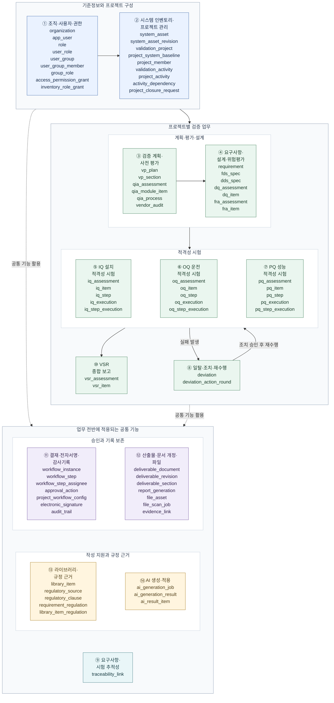

# Validation Management Platform 전체 데이터 구조

전체 **73개 테이블**을 **14개 업무 영역**으로 묶은 구조도입니다. 상자 안에는 실제 테이블명을 표시하며, 각 테이블은 한 번씩만 배치했습니다.

영역 번호와 이름은 [ERD 명세서](./erd-specifications.md)의 1~14번과 일치합니다.

실선은 영역 간 구성과 업무 흐름을, 점선은 공통 기능의 활용을 나타냅니다. **개별 테이블의 FK나 고정된 실행 순서를 나타내는 선은 아닙니다.** 실제 수행 범위와 순서는 프로젝트에서 선택한 활동과 적용한 선후행 조건에 따릅니다. 상세 컬럼과 관계는 [데이터 테이블 정의서](./data-dictionary.md)를 참고하세요.

## 전체 구조도

## 핵심 연결

| 구조 | 연결 의미 |
|---|---|
| `organization` → `system_asset` → `validation_project` | 조직에 속한 시스템·장비를 대상으로 검증 프로젝트를 구성합니다. |
| `system_asset_revision` → `project_system_baseline` | 프로젝트가 채택한 시스템 승인 개정을 식별합니다. 시험 수행과 문서 개정에도 당시 기준을 연결하여 과거 검증 대상을 보존합니다. |
| `validation_project` → `project_member` | 프로젝트에 참여하는 사용자와 역할을 관리합니다. |
| `validation_project` → `project_activity` → `validation_activity` | 프로젝트에서 수행할 활동을 선택합니다. 선후행 조건은 `activity_dependency`를 바탕으로 프로젝트 생성 당시 채택한 기준을 사용합니다. |
| `vp_plan` → `vp_section` / `qia_assessment` → `qia_module_item` → `qia_process` | 검증 계획은 목차·본문으로, 품질 영향 평가는 공통 평가·모듈·프로세스로 나누어 관리합니다. 공급업체 감사는 `vendor_audit`에 기록합니다. |
| `requirement` · `fds_spec` · `dds_spec` → `dq_item` | 요구사항과 설계 문서의 특정 개정을 연결해 설계 적합성을 평가합니다. |
| `requirement` → `fra_item` | 요구사항별 위험을 평가하고, `regulatory_clause`를 통해 내부 SOP 근거를 연결합니다. |
| IQ·OQ·PQ 평가 → 시험 항목·절차 → 수행·절차별 결과 | 시험 내용과 실제 수행 기록을 구분합니다. 평가 개정별 시험 구성을 보존하고, 내용이 바뀌지 않은 시험 개정은 재사용할 수 있습니다. |
| 실패한 수행 → `deviation` → `deviation_action_round` → 새 수행 | 실패 기록을 보존하면서 회차별 조치와 승인을 관리합니다. 재수행에서 다시 실패하면 다음 조치 회차를 추가합니다. |
| 업무 결과 → `vsr_assessment` · `vsr_item` → 프로젝트 종료 판단 | 선택한 수행 활동의 결과를 종합하고 집계 당시 근거를 보존합니다. 프로젝트 종료 요청·승인은 별도의 `project_closure_request`에서 관리합니다. |
| 요구사항·설계·평가·시험 ↔ `traceability_link` | 업무 항목의 특정 개정 사이 추적 관계를 관리합니다. RTM 대시보드는 이 연결과 실제 수행 결과를 함께 조회합니다. |
| `project_workflow_config` → `workflow_instance` → 단계·담당자·처리 이력 | 결재선 설정과 실제 결재 건을 구분합니다. `workflow_step`·`workflow_step_assignee`에서 단계와 담당자를 관리하고, `approval_action`에서 처리 이력과 전자서명을 연결합니다. |
| `deliverable_document` → `deliverable_revision` → `deliverable_section` | 산출물의 식별 정보, 개정, 목차·본문을 나누어 관리합니다. 문서 개정과 근거 업무의 개정·승인은 별도로 보존합니다. |
| 사용자 업로드 → `file_scan_job` → `file_asset` | 격리 원본의 검사 회차·결과를 기록하고, 최신 회차의 위협 미검출 및 원본 동일성 확인 후 파일 자산을 등록합니다. 재시도는 이전 판정을 보존하는 새 회차로 남깁니다. |
| 업무 기록 ↔ `evidence_link` ↔ `file_asset` | 등록 완료한 파일을 시험·문서의 증적으로 연결합니다. `report_generation`은 PDF 생성 작업과 생성 결과 파일을 관리합니다. |
| `regulatory_source` → `regulatory_clause` → 요구사항·라이브러리의 규정 근거 | 규정 문서의 판본과 조항을 구분하고, `requirement_regulation`·`library_item_regulation`으로 적용 근거를 연결합니다. |
| `library_item` → 요구사항·위험평가·시험 항목 | 재사용할 내용을 가져오고 원본 라이브러리를 참조합니다. 가져온 항목은 독립적으로 관리하며 이후 라이브러리 변경을 자동 반영하지 않습니다. |
| `ai_generation_job` → `ai_generation_result` → `ai_result_item` | AI 생성 요청, 결과 묶음, 개별 초안을 구분합니다. 사용자 선택과 업무 적용을 거친 뒤 해당 업무의 검토·승인 절차를 따릅니다. |

## 읽을 때 참고할 점

- **RTM은 수행 단계가 아닌 조회 기능입니다.** 시험 이후의 필수 단계나 VSR의 별도 집계 활동으로 두지 않습니다.
- **일탈은 시험 실패 시 분기합니다.** 조치 승인 후 재수행하거나, 재수행 없이 사유와 전자서명을 남기고 종료할 수 있습니다.
- **FDS와 DDS는 각각 독립된 설계 문서입니다.** 프로젝트 활동에서는 F&DS로 함께 관리합니다.
- **업로드 완료와 파일 사용 가능은 다릅니다.** 사용자 업로드는 검사 작업이 `COMPLETED`·`NO_THREATS_FOUND`이고 파일 자산 등록까지 끝나야 첨부·다운로드·AI 입력에 사용할 수 있습니다. 신뢰된 서버 내부 생성 파일은 `file_origin`으로 구분하며, 생성에 사용하는 외부 업로드 파일은 먼저 검사를 통과해야 합니다.
- **공통 기능은 인벤토리와 프로젝트 업무 전반에 사용됩니다.** 모든 공통 테이블이 프로젝트를 직접 참조하는 것은 아니며, 결재·서명·감사·증적의 업무 대상에는 유형과 식별자를 조합한 연결도 사용합니다.
