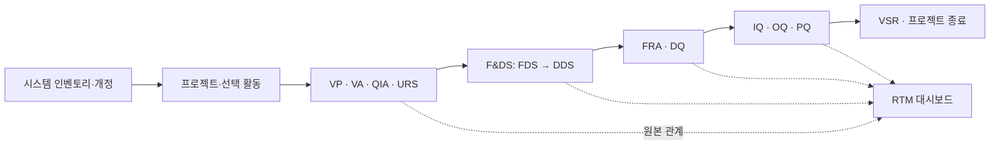
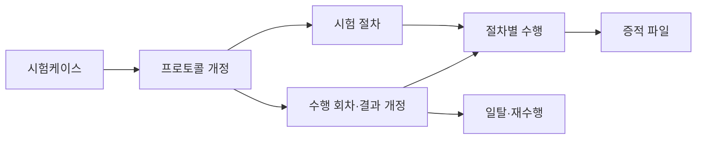
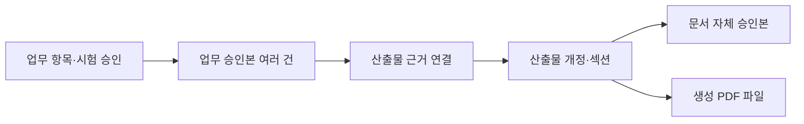

# ValiDocs 데이터 정의서

> **개정일:** 2026-09-16  
> **기준:** [UI 비교 검토 보고서](docs/DATA_DICTIONARY_UI_REVIEW.md) 반영  
> **용도:** 향후 운영 시스템을 위한 PostgreSQL 기준 테이블·컬럼 설계

ValiDocs는 시스템 인벤토리 등록부터 밸리데이션 계획, 요구사항·설계·위험 평가, 적격성 시험, 승인 산출물과 프로젝트 종료까지 관리하는 시스템입니다. 이 명세는 화면의 입력 단위와 승인·개정 단위를 기준으로 초안을 재구성했습니다.

**핵심 업무 59개 테이블·900개 컬럼**, **후속 도입 8개 테이블·158개 컬럼**을 정의합니다. 전체는 **67개 테이블·1,058개 컬럼**입니다. 기존 54개·821개에서 13개 테이블을 통합·조회 전환·범위 제외하고, 누락된 구조 26개를 추가했습니다. 통합 후에도 파일 개정·시험 회차·승인 근거를 보존하기 위해 세부 테이블 수는 증가했습니다.

이 문서는 **설계 명세**이며 DB 마이그레이션이나 애플리케이션 변경을 실행한 결과가 아닙니다. 현재 프로토타입의 실제 DB는 D1/SQLite 테이블 3개와 JSON 상태를 사용합니다. 실제 구현 구조는 [TABLE_SPECIFICATION.md](TABLE_SPECIFICATION.md), JSON 저장 형태는 [JSON_DATA_DICTIONARY.md](docs/JSON_DATA_DICTIONARY.md)를 확인하세요.

처음에는 **변경 요약 → 테이블 목록 → 관심 테이블 상세** 순서로 읽으면 됩니다. 상세 필드 표는 펼치기 영역으로 구성했고, 테이블명과 FK 참조를 클릭하면 해당 명세로 이동합니다.

## 목차

1. [이번 개정의 결정 사항](#decisions)
2. [시스템 구조와 데이터 흐름](#structure)
3. [공통 표기·상태·무결성 규칙](#conventions)
4. [핵심 업무 테이블 목록](#core-index)
5. [핵심 업무 테이블 상세](#core-details)
6. [RTM 대시보드 조회 명세](#rtm-view)
7. [규정 기준 데이터 적재 원칙](#reference-import)
8. [후속 도입 테이블](#deferred)
9. [기존 초안 이관 대응표](#migration)
10. [적용·검증 기준](#validation)

## 1. 이번 개정의 결정 사항

| 주제 | 이번 명세에 반영한 결정 |
| --- | --- |
| RTM | 독립 수행·결재·산출물 필수 단계에서 제외. 대시보드에서 원본 관계와 승인 상태를 계산한다. 과거 SOP·수동 연결은 먼저 이관한다. |
| F&DS | 수행 활동은 `FDS_GROUP` 하나. 문서는 `design_document`에서 **FDS → DDS** 순서로 표시하고 파일 교체를 개정으로 보존한다. |
| IQ/OQ/PQ | 단계별 중복 테이블을 공통 시험 구조로 통합. 프로토콜 개정 / 절차 / 수행 회차 / 결과 정정 / 절차 증적을 구분한다. |
| 승인·산출물 | 업무 승인 스냅샷과 문서 자체 승인을 분리. `deliverable_revision_source`가 한 문서에 포함된 여러 업무 승인본을 연결한다. |
| 규정 근거 | 문서판·조항·URS 연결·라이브러리 연결 4개 테이블 추가. 승인 당시 인용 문구와 판본을 보존한다. |
| UI 누락 보완 | VP 목차, QIA 프로세스, 세부 권한, 다중 결재자, 기본 결재선, 시스템 개정, 종료 요청 이력을 추가한다. |
| 운영 기능 | 백업·자동 파일 정리·예약/서버 리포트·실제 AI 호출·외부 알림은 후속 도입으로 분리한다. |

## 2. 시스템 구조와 데이터 흐름

업무의 기준 관계는 **시스템 1:N 프로젝트**, **프로젝트 1:N 선택 활동**입니다. 사용자 역할, 메뉴·프로젝트 접근권한, 인벤토리 승인 담당자, 실제 결재선은 서로 다른 책임을 가집니다.

화살표는 업무 흐름을 설명합니다. 모든 단계가 항상 필수이거나 모든 전 단계 전체 승인을 강제한다는 뜻은 아닙니다. 실제 선행 조건은 선택 활동과 `activity_dependency`의 승인 범위·대상 개수 규칙으로 판정합니다.

원본 항목 승인, 문서 승인, PDF 파일 생성은 별도 상태입니다. PDF가 생성되었다는 이유만으로 업무나 문서를 승인 처리하지 않습니다.

## 3. 공통 표기·상태·무결성 규칙

### 3.1 컬럼 표 읽는 방법

| 표기 | 의미 |
| --- | --- |
| `NN=Y` | DB에서 NULL 금지. `NN=N`이어도 승인·완료 시 필수가 되는 조건은 제약조건에 명시한다. |
| `PK` / `FK` | 기본키 / 실제 FK 대상. 유형+ID로 연결하는 다형 참조 및 JSON 내부 ID는 물리 FK가 아니다. |
| `UQ` / `IDX` | 단일 컬럼 유일성 / 조회 인덱스 후보. 복합·조건부 UNIQUE는 별도 제약을 적용하며 구성 컬럼 각각에 단일 UQ를 걸지 않는다. |
| `민감` | 개인정보·자격증명·민감한 업무 내용을 포함할 수 있어 접근과 표시를 제한한다. |
| `감사` | 해당 값의 업무 변경을 추적한다. 감사 값이라도 비밀번호·토큰·인증 해시 원문은 감사 JSON에 복사하지 않는다. |
| 기본값 `—` | DB 기본값 없음. 애플리케이션이 값을 제공하거나 NULL을 허용한다. |
| `uuid` / `jsonb` / `timestamptz` | PostgreSQL 논리 타입. 시각은 UTC 저장 후 사용자 시간대로 표시한다. |
| 제약조건 | 구현 계약. CHECK/UNIQUE로 표현 가능한 조건과 조인·서비스 검증 조건을 함께 설명하며, 그대로 실행할 DDL은 아니다. |

### 3.2 공통 상태와 코드

| 대상 | 코드·규칙 |
| --- | --- |
| 업무·문서 승인 | `DRAFT` 작성중 → `REVIEW` 검토중 → `APPROVAL` 승인중 → `APPROVED` 승인완료 / `REJECTED` 반려. 인벤토리에 한해 `REAPPROVAL_REQUIRED` 재승인 필요 허용. |
| 결재 인스턴스 | `DRAFT / IN_PROGRESS / APPROVED / REJECTED / CANCELLED`. 검토·승인 현재 단계는 workflow_step으로 판단한다. |
| 업무 폐기 | `ACTIVE / DISPOSED`. 승인 상태와 분리하며 폐기 사유·서명·시각을 보존한다. `deleted_at`은 폐기 승인을 대신하지 않는다. |
| 시험 수행·판정 | 수행 `NOT_STARTED / IN_PROGRESS / COMPLETED`, 판정 `PASS / FAIL / N_A`. 미판정은 NULL이고 UI의 `N/A`를 `N_A`로 변환한다. |
| 프로젝트 | `IN_PROGRESS / CLOSED_NORMAL / CLOSED_FORCED`. 종료 요청의 검토·승인 진행 상태는 별도 요청 테이블에서 관리한다. |
| 활동 코드 | `VP, VA, QIA, URS, FDS_GROUP, FRA, DQ, IQ, OQ, PQ, VSR`. `RTM`은 신규 수행 활동 코드에서 제외한다. |
| F&DS 표시 | 활동명 F&DS, 내부 코드 `FDS_GROUP`. 문서 종류 `FDS` 표시 우선순위 10, `DDS` 20; 같은 종류 내 `sort_order` 적용. DDS에 단일 FDS 선행 연결을 강제하지 않는다. |
| QIA 응답 | GxP `O / X / ▲`, Part 11 `Yes / No`. 미응답 NULL. 구형 `△`·Closed/Open은 의미 확인 없이 자동 치환하지 않는다. |

### 3.3 개정·승인·조직 범위

- `requirement_id` 등 개정 테이블의 PK는 **정확한 개정행**이다. `requirement_key` 등의 논리키는 여러 개정을 같은 업무 항목으로 묶는다.
- QIA/FRA/DQ/시험 묶음의 헤더는 안정 컨테이너다. 항목 개정과 `approval_release`가 과거 원본을 보존한다. Part 11처럼 안정 헤더에서 작성하는 값은 작성 차수와 승인 스냅샷으로 고정한다.
- 최신 작성 개정, 미승인 초안 중 최신 개정, 최신 유효 승인본은 다른 조회다. 새 초안이 있다는 이유로 과거 승인본이 사라지지 않으며, 과거 PASS만으로 새 미승인 결과를 완료 처리하지 않는다.
- 승인된 본문·연결·질문·규정판·증적은 덮어쓰지 않는다. 개정·재수행·정정은 새 행으로 기록하고, 무효화 사유·원인 승인본과 과거 이력은 보존한다.
- FK만으로는 서로 다른 프로젝트·조직의 데이터 연결을 막을 수 없다. 저장·상신·최종 승인 시 동일 프로젝트, 조직 범위, 대상 개정 및 현재 유효성을 함께 검사한다.
- `validation_project.system_revision_id`는 프로젝트가 채택한 인벤토리 기준 개정이다. 시스템의 현재 작업 값이 바뀌어도 프로젝트의 과거 기준을 자동 변경하지 않는다.
- `created_by/updated_by` 필수 테이블의 자동 처리는 명시적인 서비스 계정을 사용한다. 생성 후 불변인 이력은 수정자 필드를 두지 않는다.
- 참조된 승인본·서명·감사·파일은 업무 삭제에 연쇄 삭제하지 않는다. 물리 삭제 정책은 관계별로 명시하며, 초기 원칙은 `RESTRICT/NO ACTION`이다.

### 3.4 승인·서명 대상 등록표

아래 유형과 실제 PK를 고정된 허용 목록으로 관리합니다. `target_record_id`나 JSON 내부 참조를 테이블명 자유입력으로 해석하지 않습니다. 서명·워크플로우의 대상 유형·PK·버전·내용 해시가 일치해야 하며, `approval_release.signature_id`로 최종 서명에 연결합니다.

공통 버전은 `varchar(100)`입니다. 일반 개정은 해당 `version`, 시스템은 `REV-{revision_number}`, Part 11은 `P11-{part11_draft_number}`, 수행 결과는 `EXEC-{attempt_no}-R{record_revision}`, 종료 요청은 `CLOSE-{request_version}`, 결재선 설정은 `CFG-{config_version}`를 사용합니다. 일탈의 조치·완료·종결은 승인 범위와 별도 작성 차수 `{scope}-{n}`를 사용하고 진행 중 워크플로우 또는 완료 승인본에서 차수를 추적합니다. 표시번호와 대상 PK를 혼용하지 않습니다.

| 대상 코드 | 대상 PK | 허용 용도·승인 범위 |
| --- | --- | --- |
| `VP_PLAN` | [`vp_plan`](#table-vp_plan).`vp_id` | ITEM / DISPOSAL |
| `VENDOR_AUDIT` | [`vendor_audit`](#table-vendor_audit).`audit_id` | ITEM / DISPOSAL |
| `QIA_ASSESSMENT` | [`qia_assessment`](#table-qia_assessment).`qia_id` | ITEM: Part 11 스냅샷 |
| `QIA_MODULE` | [`qia_module_item`](#table-qia_module_item).`qia_module_item_id` | ITEM / DISPOSAL |
| `REQUIREMENT_REVISION` | [`requirement`](#table-requirement).`requirement_id` | ITEM / DISPOSAL |
| `DESIGN_DOCUMENT_REVISION` | [`design_document_revision`](#table-design_document_revision).`design_revision_id` | ITEM; 폐기는 문서의 생명주기 변경 |
| `DESIGN_DOCUMENT` | [`design_document`](#table-design_document).`design_document_id` | DISPOSAL |
| `FRA_ASSESSMENT` | [`fra_assessment`](#table-fra_assessment).`fra_id` | 조회·이력 대상; 항목 승인 대신 사용하지 않음 |
| `FRA_ITEM` | [`fra_item`](#table-fra_item).`fra_item_id` | ITEM / DISPOSAL |
| `DQ_ASSESSMENT` | [`dq_assessment`](#table-dq_assessment).`dq_id` | 조회·이력 대상; 항목 승인 대신 사용하지 않음 |
| `DQ_ITEM` | [`dq_item`](#table-dq_item).`dq_item_id` | ITEM / DISPOSAL |
| `QUALIFICATION_ASSESSMENT` | [`qualification_assessment`](#table-qualification_assessment).`assessment_id` | 조회·이력 대상; 항목 자동 승인 없음 |
| `QUALIFICATION_CASE` | [`qualification_case`](#table-qualification_case).`case_id` | DISPOSAL |
| `QUALIFICATION_CASE_REVISION` | [`qualification_case_revision`](#table-qualification_case_revision).`case_revision_id` | PROTOCOL |
| `QUALIFICATION_EXECUTION` | [`qualification_execution`](#table-qualification_execution).`execution_id` | RESULT; EXECUTE 수행 확인은 별도 |
| `QUALIFICATION_STEP_EXECUTION` | [`qualification_step_execution`](#table-qualification_step_execution).`step_execution_id` | 증적·감사 대상 |
| `DEVIATION` | [`deviation`](#table-deviation).`deviation_id` | DEVIATION_ACTION / DEVIATION_COMPLETION / DEVIATION_CLOSE |
| `VSR_ASSESSMENT` | [`vsr_assessment`](#table-vsr_assessment).`vsr_id` | ITEM: VSR 업무 확인 |
| `DELIVERABLE_REVISION` | [`deliverable_revision`](#table-deliverable_revision).`document_revision_id` | DOCUMENT |
| `DELIVERABLE_SECTION` | [`deliverable_section`](#table-deliverable_section).`section_id` | AI 적용·감사 대상 |
| `SYSTEM_ASSET_REVISION` | [`system_asset_revision`](#table-system_asset_revision).`system_revision_id` | INVENTORY |
| `SYSTEM_ASSET` | [`system_asset`](#table-system_asset).`system_id` | DISPOSAL |
| `PROJECT_CLOSURE_REQUEST` | [`project_closure_request`](#table-project_closure_request).`closure_request_id` | CLOSURE |
| `PROJECT_WORKFLOW_CONFIG` | [`project_workflow_config`](#table-project_workflow_config).`config_id` | CONFIG |
| `PROJECT_ACTIVITY` | [`project_activity`](#table-project_activity).`project_activity_id` | 조회·감사 대상; 집계로 항목 자동 승인 금지 |
| `APPROVAL_RELEASE` | [`approval_release`](#table-approval_release).`release_id` | 기존 승인본 조회·무효화 감사 대상 |

각 기능은 등록표의 필요한 하위 집합만 허용합니다. 추적 관계의 허용 방향은 `traceability_link`, 증적 대상은 `evidence_link`에서 추가 제한합니다. 계정·그룹 등 일반 감사 대상은 이 명세의 실제 테이블명을 대문자 코드로 등록하고 해당 PK에 매핑합니다. 위 별칭이 있는 업무 대상에는 별칭을 일관되게 사용합니다. RTM·삭제된 설계 상세·종류별 시험 테이블 코드는 신규 대상으로 사용하지 않습니다.

일반 개정이 없는 폐기 대상은 현재 개정 번호와 폐기 요청 차수 `DISPOSE-{n}`를 함께 서명 원문에 고정합니다. 설정 직접 적용, 직접 폐기, 시험 수행 확인은 해당 서명 FK로 연결할 수 있으며 실제 결재를 거쳤다면 `APPROVE` 액션과 승인 범위로 구분합니다. 전자서명 해시는 canonical 대상 내용에 대해 계산하고 비밀번호·토큰은 어느 스냅샷에도 포함하지 않습니다.

## 4. 핵심 업무 테이블 목록

| 영역 | 테이블 수 | 컬럼 수 | 상세 |
| --- | --- | --- | --- |
| 조직·계정·권한 | 9 | 92 | [이동](#domain-accounts) |
| 시스템·라이브러리 | 3 | 62 | [이동](#domain-assets) |
| 프로젝트·수행 활동 | 5 | 73 | [이동](#domain-projects) |
| 결재·종료 | 6 | 84 | [이동](#domain-workflow) |
| VP·VA·QIA·URS | 7 | 146 | [이동](#domain-planning) |
| F&DS — FDS 다음 DDS | 2 | 28 | [이동](#domain-design) |
| FRA·DQ | 4 | 77 | [이동](#domain-risk) |
| IQ·OQ·PQ 및 일탈 | 7 | 112 | [이동](#domain-tests) |
| VSR·추적 관계 | 3 | 53 | [이동](#domain-summary) |
| 승인본·산출물 | 5 | 62 | [이동](#domain-documents) |
| 규정·조항 기준 데이터 | 4 | 52 | [이동](#domain-reference) |
| 파일·증적 | 2 | 24 | [이동](#domain-files) |
| 전자서명·감사 | 2 | 35 | [이동](#domain-compliance) |

| No | 테이블 | 역할 | 컬럼 | 개정 구분 |
| --- | --- | --- | --- | --- |
| 1 | [`organization`](#table-organization) | 조직/고객사 | 8 | 유지·보완 |
| 2 | [`app_user`](#table-app_user) | 사용자 | 16 | 유지·보완 |
| 3 | [`role`](#table-role) | 역할 | 6 | 유지·보완 |
| 4 | [`user_role`](#table-user_role) | 사용자 역할 | 4 | 유지·보완 |
| 5 | [`user_group`](#table-user_group) | 사용자 그룹 | 11 | 유지·보완 |
| 6 | [`user_group_member`](#table-user_group_member) | 사용자 그룹 구성원 | 11 | 유지·보완 |
| 7 | [`group_role`](#table-group_role) | 사용자 그룹 역할 | 11 | 유지·보완 |
| 8 | [`access_permission_grant`](#table-access_permission_grant) | 메뉴·프로젝트 권한 부여 | 15 | 신규·통합 |
| 9 | [`inventory_role_grant`](#table-inventory_role_grant) | 인벤토리 업무 역할 부여 | 10 | 신규·통합 |
| 10 | [`system_asset`](#table-system_asset) | 시스템/장비 식별 정보 | 25 | 유지·보완 |
| 11 | [`system_asset_revision`](#table-system_asset_revision) | 시스템 인벤토리 개정 | 13 | 신규·통합 |
| 12 | [`library_item`](#table-library_item) | 라이브러리 항목 마스터 | 24 | 유지·보완 |
| 13 | [`validation_project`](#table-validation_project) | Validation 프로젝트 | 20 | 유지·보완 |
| 14 | [`project_member`](#table-project_member) | 프로젝트 참여자 | 12 | 유지·보완 |
| 15 | [`validation_activity`](#table-validation_activity) | 밸리데이션 활동 마스터 | 10 | 유지·보완 |
| 16 | [`project_activity`](#table-project_activity) | 프로젝트 수행 활동 | 16 | 유지·보완 |
| 17 | [`activity_dependency`](#table-activity_dependency) | 활동 선후행 조건 | 15 | 유지·보완 |
| 18 | [`project_workflow_config`](#table-project_workflow_config) | 프로젝트 기본 결재선 설정 | 14 | 신규·통합 |
| 19 | [`workflow_instance`](#table-workflow_instance) | Workflow 인스턴스 | 18 | 유지·보완 |
| 20 | [`workflow_step`](#table-workflow_step) | Workflow 단계 | 13 | 유지·보완 |
| 21 | [`workflow_step_assignee`](#table-workflow_step_assignee) | 결재 단계 담당자 | 11 | 신규·통합 |
| 22 | [`approval_action`](#table-approval_action) | 승인 처리 이력 | 10 | 유지·보완 |
| 23 | [`project_closure_request`](#table-project_closure_request) | 프로젝트 종료 요청 | 18 | 신규·통합 |
| 24 | [`vp_plan`](#table-vp_plan) | 검증 계획 개정 | 20 | 신규·통합 |
| 25 | [`vp_section`](#table-vp_section) | 검증 계획 목차 | 12 | 신규·통합 |
| 26 | [`vendor_audit`](#table-vendor_audit) | 공급업체 평가 개정 | 24 | 유지·보완 |
| 27 | [`qia_assessment`](#table-qia_assessment) | 품질 영향 평가 헤더 | 16 | 유지·보완 |
| 28 | [`qia_module_item`](#table-qia_module_item) | QIA 모듈 개정 | 23 | 유지·보완 |
| 29 | [`qia_process`](#table-qia_process) | QIA 프로세스 평가 | 23 | 신규·통합 |
| 30 | [`requirement`](#table-requirement) | 사용자 요구사항 개정 | 28 | 유지·보완 |
| 31 | [`design_document`](#table-design_document) | F&DS 설계 문서 | 14 | 신규·통합 |
| 32 | [`design_document_revision`](#table-design_document_revision) | FDS·DDS 파일 개정 | 14 | 신규·통합 |
| 33 | [`fra_assessment`](#table-fra_assessment) | 기능 위험 평가 헤더 | 7 | 유지·보완 |
| 34 | [`fra_item`](#table-fra_item) | 기능 위험 항목 개정 | 34 | 유지·보완 |
| 35 | [`dq_assessment`](#table-dq_assessment) | 설계 적격성 평가 헤더 | 7 | 유지·보완 |
| 36 | [`dq_item`](#table-dq_item) | 설계 적격성 항목 개정 | 29 | 유지·보완 |
| 37 | [`qualification_assessment`](#table-qualification_assessment) | 적격성 시험 활동 묶음 | 10 | 신규·통합 |
| 38 | [`qualification_case`](#table-qualification_case) | 시험 케이스 | 14 | 신규·통합 |
| 39 | [`qualification_case_revision`](#table-qualification_case_revision) | 시험 프로토콜 개정 | 20 | 신규·통합 |
| 40 | [`qualification_step`](#table-qualification_step) | 시험 프로토콜 절차 | 8 | 신규·통합 |
| 41 | [`qualification_execution`](#table-qualification_execution) | 시험 수행 및 결과 개정 | 22 | 신규·통합 |
| 42 | [`qualification_step_execution`](#table-qualification_step_execution) | 수행 회차별 절차 확인 | 10 | 신규·통합 |
| 43 | [`deviation`](#table-deviation) | 일탈 관리 | 28 | 유지·보완 |
| 44 | [`vsr_assessment`](#table-vsr_assessment) | 밸리데이션 종합 보고서 | 21 | 유지·보완 |
| 45 | [`vsr_item`](#table-vsr_item) | VSR 활동 요약 항목 | 19 | 유지·보완 |
| 46 | [`traceability_link`](#table-traceability_link) | 공통 추적 관계 | 13 | 유지·보완 |
| 47 | [`approval_release`](#table-approval_release) | 승인 기준 스냅샷 | 16 | 신규·통합 |
| 48 | [`deliverable_document`](#table-deliverable_document) | 산출물 문서 식별 | 10 | 신규·통합 |
| 49 | [`deliverable_revision`](#table-deliverable_revision) | 산출물 문서 개정 | 19 | 신규·통합 |
| 50 | [`deliverable_revision_source`](#table-deliverable_revision_source) | 산출물 근거 승인본 연결 | 6 | 신규·통합 |
| 51 | [`deliverable_section`](#table-deliverable_section) | 산출물 목차·본문 | 11 | 신규·통합 |
| 52 | [`regulatory_source`](#table-regulatory_source) | 규정·지침·SOP 문서판 | 21 | 신규·통합 |
| 53 | [`regulatory_clause`](#table-regulatory_clause) | 문서판별 조항·근거 | 13 | 신규·통합 |
| 54 | [`requirement_regulation`](#table-requirement_regulation) | 요구사항 개정별 규정 근거 | 8 | 신규·통합 |
| 55 | [`library_item_regulation`](#table-library_item_regulation) | 라이브러리 규정 근거 | 10 | 신규·통합 |
| 56 | [`file_asset`](#table-file_asset) | 파일 자산 | 12 | 유지·보완 |
| 57 | [`evidence_link`](#table-evidence_link) | 증적 파일 연결 | 12 | 유지·보완 |
| 58 | [`electronic_signature`](#table-electronic_signature) | 전자서명 | 14 | 유지·보완 |
| 59 | [`audit_trail`](#table-audit_trail) | Audit Trail | 21 | 유지·보완 |

## 5. 핵심 업무 테이블 상세

## 조직·계정·권한

### 1. `organization` — 조직/고객사

고객사 또는 운영 조직 기본정보

필드 8개 · 제약조건 · 설계 메모 펼치기

| 컬럼 | 한글명 | 타입 | NN | 키·참조 | 기본값 | 속성 | 정의 |
| --- | --- | --- | --- | --- | --- | --- | --- |
| `organization_id` | 조직 ID | `uuid` | Y | PK | `gen_random_uuid()` | 감사 | 조직 고유 식별자 |
| `organization_code` | 조직 코드 | `varchar(50)` | Y | — | — | UQ · IDX · 감사 | 조직/회사 식별 코드 |
| `organization_name` | 조직명 | `varchar(100)` | Y | — | — | IDX · 감사 | 회사/사업장명 |
| `organization_type` | 조직 유형 | `varchar(50)` | N | — | — | 감사 | 선택 조직 유형. HEADQUARTERS/FACTORY/LABORATORY/OVERSEAS 등 운영 시 확정; 현 UI에는 직접 입력 없음 |
| `status` | 상태 | `varchar(20)` | Y | — | `'ACTIVE'` | 감사 | ACTIVE &#124; INACTIVE |
| `description` | 설명 | `text` | N | — | — | 감사 | 조직 설명 |
| `created_at` | 생성시각 | `timestamptz` | Y | — | `CURRENT_TIMESTAMP` | 감사 | 레코드 생성 시각 (UTC) |
| `updated_at` | 수정시각 | `timestamptz` | Y | — | `CURRENT_TIMESTAMP` | 감사 | 레코드 최종 수정 시각 (UTC) |

**제약조건·처리 규칙**

- UNIQUE (organization_code)
- CHECK (status IN ('ACTIVE','INACTIVE'))

**설계·이관 메모**

- 단일 조직 운영이면 기본 조직 1건으로 시작한다. 사용자·그룹·시스템의 소속 기준이며 별도 조직 관리 UI 도입을 전제하지 않는다.
- 참조가 있는 조직은 물리 삭제하지 않는다.

[테이블 목록으로](#core-index)

### 2. `app_user` — 사용자

사용자 계정 및 기본 프로필 정보

필드 16개 · 제약조건 · 설계 메모 펼치기

| 컬럼 | 한글명 | 타입 | NN | 키·참조 | 기본값 | 속성 | 정의 |
| --- | --- | --- | --- | --- | --- | --- | --- |
| `user_id` | 사용자 ID | `uuid` | Y | PK | `gen_random_uuid()` | 감사 | 사용자 계정 고유 식별자 |
| `organization_id` | 조직 ID | `uuid` | Y | FK → [`organization.organization_id`](#table-organization) | — | IDX · 감사 | organization.organization_id 참조 |
| `password_hash` | 비밀번호 해시 | `varchar(255)` | N | — | — | 민감 | LOCAL 인증일 때 필수인 단방향 비밀번호 해시. 외부 인증이면 NULL; 응답·내보내기·Audit Trail에 원문/해시를 기록하지 않음 |
| `full_name` | 사용자 실명 | `varchar(100)` | Y | — | — | IDX · 민감 · 감사 | 사용자 이름 |
| `email` | 이메일 | `varchar(254)` | Y | — | — | IDX · 민감 · 감사 | 이메일 초대·로그인 단일 식별자. 앞뒤 공백 제거와 소문자 정규화 후 저장; 별도 username 입력은 두지 않음 |
| `auth_method` | 인증 방식 | `varchar(20)` | Y | — | `'LOCAL'` | 감사 | LOCAL 또는 EXTERNAL |
| `permission_level` | 관리 권한등급 | `varchar(20)` | Y | — | `'USER'` | 감사 | GLOBAL_ADMIN=전체 관리자, PROJECT_ADMIN=프로젝트 관리자, USER=사용자. 업무 역할과 별도 |
| `department_name` | 부서명 | `varchar(100)` | N | — | — | 감사 | 소속 부서명 |
| `position_title` | 직급/직책 | `varchar(50)` | N | — | — | 감사 | 직급 정보 |
| `status` | 계정 상태 | `varchar(20)` | Y | — | `'ACTIVE'` | 감사 | ACTIVE &#124; INACTIVE &#124; LOCKED |
| `last_login_at` | 최종 로그인 시각 | `timestamptz` | N | — | — | 감사 | 최종 시스템 접속 타임스탬프 |
| `password_changed_at` | 비밀번호 변경일 | `timestamptz` | N | — | — | 감사 | 비밀번호 마지막 변경 시각 |
| `created_at` | 생성시각 | `timestamptz` | Y | — | `CURRENT_TIMESTAMP` | 감사 | 레코드 생성 시각 (UTC) |
| `updated_at` | 수정시각 | `timestamptz` | Y | — | `CURRENT_TIMESTAMP` | 감사 | 레코드 최종 수정 시각 (UTC) |
| `external_issuer` | 외부 인증 발급자 | `varchar(200)` | N | — | — | 민감 | EXTERNAL 인증 제공자 식별; 외부 인증 방식 선택 시 필수 |
| `external_subject` | 외부 인증 주체 | `varchar(255)` | N | — | — | 민감 | EXTERNAL 제공자의 안정적인 사용자 식별자; 이메일 변경과 무관한 값 |

**제약조건·처리 규칙**

- UNIQUE (email); CHECK (email = lower(btrim(email)))
- CHECK (permission_level IN ('GLOBAL_ADMIN','PROJECT_ADMIN','USER'))
- CHECK (status IN ('ACTIVE','INACTIVE','LOCKED'))
- CHECK ((auth_method='LOCAL' AND password_hash IS NOT NULL AND external_issuer IS NULL AND external_subject IS NULL) OR (auth_method='EXTERNAL' AND password_hash IS NULL AND external_issuer IS NOT NULL AND external_subject IS NOT NULL))
- UNIQUE (external_issuer, external_subject) WHERE auth_method='EXTERNAL'

**설계·이관 메모**

- 기존 username과 email이 다르면 계정 식별 정책에 맞춰 매핑·충돌을 확인한 뒤 전환한다. 인증 방식을 UI 데모 동작만으로 확정하지 않으며 LOCAL/EXTERNAL 중 실제 운영 방식을 구성한다.
- department_name/position_title은 선택 운영 속성이다. 잠금·최종 로그인·비밀번호 변경 기록은 인증 운영에 필요하므로 유지한다.
- 관리 권한등급, 역할, 메뉴·프로젝트 grant는 별개의 축이다. 관리자 권한의 예외 범위는 한 권한 판정 서비스에서 적용하고 감사한다.

[테이블 목록으로](#core-index)

### 3. `role` — 역할

작성자·검토자·승인자 등 권한 역할 마스터

필드 6개 · 제약조건 · 설계 메모 펼치기

| 컬럼 | 한글명 | 타입 | NN | 키·참조 | 기본값 | 속성 | 정의 |
| --- | --- | --- | --- | --- | --- | --- | --- |
| `role_id` | 역할 ID | `uuid` | Y | PK | `gen_random_uuid()` | 감사 | 역할/권한 고유 식별자 |
| `role_code` | 역할 코드 | `varchar(50)` | Y | — | — | UQ · IDX · 감사 | 역할 식별 코드 |
| `role_name` | 역할명 | `varchar(100)` | Y | — | — | IDX · 감사 | 역할 명칭 (시스템관리자, 작성자, 승인자 등) |
| `description` | 설명 | `text` | N | — | — | 감사 | 역할 상세 권한 범위 설명 |
| `created_at` | 생성시각 | `timestamptz` | Y | — | `CURRENT_TIMESTAMP` | 감사 | 레코드 생성 시각 (UTC) |
| `role_category` | 역할 구분 | `varchar(20)` | Y | — | `'WORKFLOW'` | 감사 | SYSTEM=시스템 관리 역할, WORKFLOW=작성·검토·승인 업무 역할 |

**제약조건·처리 규칙**

- UNIQUE (role_code)
- CHECK (role_category IN ('SYSTEM','WORKFLOW'))

**설계·이관 메모**

- 초기 role_code: SYSTEM_ADMIN, ADMIN, AUTHOR, REVIEWER, APPROVER, VIEWER. SYSTEM_ADMIN/ADMIN은 SYSTEM, 나머지는 WORKFLOW로 분류한다. 인벤토리 전용 권한은 inventory_role_grant로 별도 부여한다.
- role 행이나 역할 명칭만으로 메뉴/프로젝트 체크박스 권한을 자동 생성하지 않는다.

[테이블 목록으로](#core-index)

### 4. `user_role` — 사용자 역할

사용자-역할 매핑 정보

필드 4개 · 제약조건 · 설계 메모 펼치기

| 컬럼 | 한글명 | 타입 | NN | 키·참조 | 기본값 | 속성 | 정의 |
| --- | --- | --- | --- | --- | --- | --- | --- |
| `user_role_id` | 매핑 ID | `uuid` | Y | PK | `gen_random_uuid()` | 감사 | 사용자-역할 매핑 고유 식별자. 이 테이블의 모든 행에 (user_id, role_id) 복합 UNIQUE를 적용한다. 별도 활성·삭제 컬럼은 없다. |
| `user_id` | 사용자 ID | `uuid` | Y | FK → [`app_user.user_id`](#table-app_user) | — | IDX · 감사 | app_user.user_id 참조 |
| `role_id` | 역할 ID | `uuid` | Y | FK → [`role.role_id`](#table-role) | — | IDX · 감사 | role.role_id 참조 |
| `created_at` | 생성시각 | `timestamptz` | Y | — | `CURRENT_TIMESTAMP` | 감사 | 레코드 생성 시각 (UTC) |

**제약조건·처리 규칙**

- UNIQUE (user_id, role_id)

**설계·이관 메모**

- 사용자 복수 역할 N:M 매핑. 부여·회수는 Audit Trail에 남긴다. 그룹에서 상속된 역할을 이 테이블에 직접 역할로 복제하지 않는다.

[테이블 목록으로](#core-index)

### 5. `user_group` — 사용자 그룹

조직별 사용자 그룹의 기본정보 및 활성 상태 관리

필드 11개 · 제약조건 · 설계 메모 펼치기

| 컬럼 | 한글명 | 타입 | NN | 키·참조 | 기본값 | 속성 | 정의 |
| --- | --- | --- | --- | --- | --- | --- | --- |
| `user_group_id` | 사용자 그룹 ID | `uuid` | Y | PK | `gen_random_uuid()` | 감사 | 사용자 그룹 고유 식별자 |
| `organization_id` | 조직 ID | `uuid` | Y | FK → [`organization.organization_id`](#table-organization) | — | IDX · 감사 | 사용자 그룹이 소속된 조직 |
| `group_code` | 그룹 코드 | `varchar(50)` | Y | — | — | IDX · 감사 | 조직 내 사용자 그룹 식별 코드. deleted_at IS NULL이고 is_active가 TRUE인 행에 (organization_id, group_code) 중복을 허용하지 않는다. |
| `group_name` | 그룹명 | `varchar(100)` | Y | — | — | IDX · 감사 | 사용자에게 표시되는 그룹명 |
| `description` | 그룹 설명 | `text` | N | — | — | 감사 | 그룹의 목적과 권한 범위 설명 |
| `is_active` | 사용 여부 | `boolean` | Y | — | `TRUE` | IDX · 감사 | 사용자 그룹 활성 여부 |
| `created_at` | 생성시각 | `timestamptz` | Y | — | `CURRENT_TIMESTAMP` | 감사 | 사용자 그룹 생성 시각(UTC) |
| `created_by` | 생성자 ID | `uuid` | Y | FK → [`app_user.user_id`](#table-app_user) | — | IDX · 감사 | 사용자 그룹을 생성한 사용자 |
| `updated_at` | 수정시각 | `timestamptz` | Y | — | `CURRENT_TIMESTAMP` | 감사 | 사용자 그룹 최종 수정 시각(UTC) |
| `updated_by` | 수정자 ID | `uuid` | Y | FK → [`app_user.user_id`](#table-app_user) | — | IDX · 감사 | 사용자 그룹을 최종 수정한 사용자 |
| `deleted_at` | 삭제시각 | `timestamptz` | N | — | — | 감사 | 사용자 그룹 소프트 삭제 시각 |

**제약조건·처리 규칙**

- UNIQUE (organization_id, group_code) WHERE deleted_at IS NULL AND is_active = TRUE

**설계·이관 메모**

- 비활성·삭제 그룹의 역할과 권한은 유효 권한 합산에서 제외하되 과거 부여 이력은 보존한다.

[테이블 목록으로](#core-index)

### 6. `user_group_member` — 사용자 그룹 구성원

사용자와 사용자 그룹 간 N:M 관계 및 그룹 참여 상태·기간 관리

필드 11개 · 제약조건 · 설계 메모 펼치기

| 컬럼 | 한글명 | 타입 | NN | 키·참조 | 기본값 | 속성 | 정의 |
| --- | --- | --- | --- | --- | --- | --- | --- |
| `user_group_member_id` | 그룹 구성원 ID | `uuid` | Y | PK | `gen_random_uuid()` | 감사 | 사용자 그룹 구성원 매핑 고유 식별자 |
| `user_group_id` | 사용자 그룹 ID | `uuid` | Y | FK → [`user_group.user_group_id`](#table-user_group) | — | IDX · 감사 | 구성원이 소속된 사용자 그룹 |
| `user_id` | 사용자 ID | `uuid` | Y | FK → [`app_user.user_id`](#table-app_user) | — | IDX · 감사 | 그룹에 포함되는 사용자. deleted_at IS NULL이고 member_status가 ACTIVE인 행에 (user_group_id, user_id) 중복을 허용하지 않는다. |
| `member_status` | 구성원 상태 | `varchar(20)` | Y | — | `'ACTIVE'` | IDX · 감사 | 그룹 구성원 상태. ACTIVE, INACTIVE, WITHDRAWN |
| `joined_at` | 참여 시작 시각 | `timestamptz` | Y | — | `CURRENT_TIMESTAMP` | 감사 | 사용자가 그룹에 포함된 시각 |
| `left_at` | 참여 종료 시각 | `timestamptz` | N | — | — | 감사 | 사용자의 그룹 참여가 종료된 시각. 현재 구성원이면 NULL |
| `created_at` | 생성시각 | `timestamptz` | Y | — | `CURRENT_TIMESTAMP` | 감사 | 그룹 구성원 매핑 생성 시각(UTC) |
| `created_by` | 생성자 ID | `uuid` | Y | FK → [`app_user.user_id`](#table-app_user) | — | IDX · 감사 | 그룹 구성원을 등록한 사용자 |
| `updated_at` | 수정시각 | `timestamptz` | Y | — | `CURRENT_TIMESTAMP` | 감사 | 그룹 구성원 매핑 최종 수정 시각(UTC) |
| `updated_by` | 수정자 ID | `uuid` | Y | FK → [`app_user.user_id`](#table-app_user) | — | IDX · 감사 | 그룹 구성원 매핑을 최종 수정한 사용자 |
| `deleted_at` | 삭제시각 | `timestamptz` | N | — | — | 감사 | 그룹 구성원 매핑 소프트 삭제 시각 |

**제약조건·처리 규칙**

- UNIQUE (user_group_id, user_id) WHERE deleted_at IS NULL AND member_status='ACTIVE'
- CHECK (member_status IN ('ACTIVE','INACTIVE','WITHDRAWN'))
- CHECK (left_at IS NULL OR left_at >= joined_at)
- CHECK (member_status <> 'WITHDRAWN' OR left_at IS NOT NULL)

**설계·이관 메모**

- 동일 조직 사용자만 그룹에 참여할 수 있다. ACTIVE·미삭제 구성원과 활성 그룹에 대해서만 상속을 조회한다. 탈퇴 시 개인에게 복사된 grant를 남기는 방식은 사용하지 않는다.

[테이블 목록으로](#core-index)

### 7. `group_role` — 사용자 그룹 역할

사용자 그룹에 역할을 부여하고 전역 또는 프로젝트별 적용 범위 관리

필드 11개 · 제약조건 · 설계 메모 펼치기

| 컬럼 | 한글명 | 타입 | NN | 키·참조 | 기본값 | 속성 | 정의 |
| --- | --- | --- | --- | --- | --- | --- | --- |
| `group_role_id` | 그룹 역할 ID | `uuid` | Y | PK | `gen_random_uuid()` | 감사 | 사용자 그룹과 역할 간 권한 매핑 고유 식별자 |
| `user_group_id` | 사용자 그룹 ID | `uuid` | Y | FK → [`user_group.user_group_id`](#table-user_group) | — | IDX · 감사 | 역할을 부여받는 사용자 그룹 |
| `role_id` | 역할 ID | `uuid` | Y | FK → [`role.role_id`](#table-role) | — | IDX · 감사 | 그룹에 부여하는 역할 |
| `scope_type` | 권한 범위 유형 | `varchar(20)` | Y | — | `'GLOBAL'` | IDX · 감사 | 그룹 역할 적용 범위. GLOBAL, PROJECT |
| `project_id` | 프로젝트 ID | `uuid` | N | FK → [`validation_project.project_id`](#table-validation_project) | — | IDX · 감사 | scope_type이 PROJECT인 경우 필수. GLOBAL인 경우 NULL. 범위와 NULL 대응은 CHECK 제약으로 검증한다 |
| `is_active` | 사용 여부 | `boolean` | Y | — | `TRUE` | IDX · 감사 | 그룹 역할 매핑 사용 여부. deleted_at IS NULL이고 is_active가 TRUE인 행에 범위별 중복 금지를 적용한다. GLOBAL은 (user_group_id, role_id), PROJECT는 (user_group_id, role_id, project_id)를 기준으로 한다. |
| `created_at` | 생성시각 | `timestamptz` | Y | — | `CURRENT_TIMESTAMP` | 감사 | 그룹 역할 매핑 생성 시각(UTC) |
| `created_by` | 생성자 ID | `uuid` | Y | FK → [`app_user.user_id`](#table-app_user) | — | IDX · 감사 | 그룹 역할을 부여한 사용자 |
| `updated_at` | 수정시각 | `timestamptz` | Y | — | `CURRENT_TIMESTAMP` | 감사 | 그룹 역할 매핑 최종 수정 시각(UTC) |
| `updated_by` | 수정자 ID | `uuid` | Y | FK → [`app_user.user_id`](#table-app_user) | — | IDX · 감사 | 그룹 역할 매핑을 최종 수정한 사용자 |
| `deleted_at` | 삭제시각 | `timestamptz` | N | — | — | 감사 | 그룹 역할 매핑 소프트 삭제 시각 |

**제약조건·처리 규칙**

- CHECK ((scope_type='GLOBAL' AND project_id IS NULL) OR (scope_type='PROJECT' AND project_id IS NOT NULL))
- UNIQUE (user_group_id, role_id) WHERE scope_type='GLOBAL' AND is_active=TRUE AND deleted_at IS NULL
- UNIQUE (user_group_id, role_id, project_id) WHERE scope_type='PROJECT' AND is_active=TRUE AND deleted_at IS NULL

**설계·이관 메모**

- 업무 역할 부여만 담당한다. 실제 조회/편집/폐기 권한은 access_permission_grant에 저장한다. PROJECT 범위는 그룹과 프로젝트 시스템의 조직이 같아야 한다.

[테이블 목록으로](#core-index)

### 8. `access_permission_grant` — 메뉴·프로젝트 권한 부여

개인 또는 그룹에 직접 부여한 메뉴/프로젝트 권한 1건

필드 15개 · 제약조건 · 설계 메모 펼치기

| 컬럼 | 한글명 | 타입 | NN | 키·참조 | 기본값 | 속성 | 정의 |
| --- | --- | --- | --- | --- | --- | --- | --- |
| `grant_id` | 권한 부여 ID | `uuid` | Y | PK | `gen_random_uuid()` | 감사 | 이 행의 고유 식별자 |
| `user_id` | 개인 주체 | `uuid` | N | FK → [`app_user.user_id`](#table-app_user) | — | IDX · 감사 | app_user.user_id 참조 |
| `user_group_id` | 그룹 주체 | `uuid` | N | FK → [`user_group.user_group_id`](#table-user_group) | — | IDX · 감사 | user_group.user_group_id 참조 |
| `scope_type` | 권한 적용 범위 | `varchar(20)` | Y | — | — | 감사 | MENU 또는 PROJECT |
| `menu_code` | 메뉴 코드 | `varchar(40)` | N | — | — | 감사 | SYSTEM_INVENTORY/PROJECT_MANAGEMENT/LIBRARY/AUDIT_TRAIL/ACCOUNT_PERMISSION |
| `project_id` | 프로젝트 | `uuid` | N | FK → [`validation_project.project_id`](#table-validation_project) | — | IDX · 감사 | validation_project.project_id 참조 |
| `can_view` | 조회 권한 | `boolean` | Y | — | `FALSE` | 감사 | 조회 권한 값 |
| `can_edit` | 편집 권한 | `boolean` | Y | — | `FALSE` | 감사 | 편집 권한 값 |
| `can_dispose` | 폐기 권한 | `boolean` | Y | — | `FALSE` | 감사 | 폐기 권한 값 |
| `is_active` | 활성 여부 | `boolean` | Y | — | `TRUE` | 감사 | 활성 여부 값 |
| `revoked_at` | 회수 시각 | `timestamptz` | N | — | — | 감사 | 회수 시각 값 |
| `created_at` | 생성 시각 | `timestamptz` | Y | — | `CURRENT_TIMESTAMP` | 감사 | 생성 시각 값 |
| `created_by` | 생성자 | `uuid` | Y | FK → [`app_user.user_id`](#table-app_user) | — | IDX · 감사 | app_user.user_id 참조 |
| `updated_at` | 수정 시각 | `timestamptz` | Y | — | `CURRENT_TIMESTAMP` | 감사 | 수정 시각 값 |
| `updated_by` | 수정자 | `uuid` | Y | FK → [`app_user.user_id`](#table-app_user) | — | IDX · 감사 | app_user.user_id 참조 |

**제약조건·처리 규칙**

- CHECK ((user_id IS NOT NULL) <> (user_group_id IS NOT NULL))
- CHECK ((scope_type='MENU' AND menu_code IS NOT NULL AND project_id IS NULL) OR (scope_type='PROJECT' AND project_id IS NOT NULL AND menu_code IS NULL))
- CHECK (menu_code IS NULL OR menu_code IN ('SYSTEM_INVENTORY','PROJECT_MANAGEMENT','LIBRARY','AUDIT_TRAIL','ACCOUNT_PERMISSION'))
- CHECK ((NOT can_edit AND NOT can_dispose) OR can_view)
- CHECK (menu_code IS DISTINCT FROM 'AUDIT_TRAIL' OR (can_edit=FALSE AND can_dispose=FALSE))
- 활성 행 4개 조건부 UNIQUE: 개인+MENU(user_id,menu_code), 그룹+MENU(user_group_id,menu_code), 개인+PROJECT(user_id,project_id), 그룹+PROJECT(user_group_id,project_id). 각 인덱스는 is_active=TRUE 및 해당 주체/범위를 조건으로 한다.

**설계·이관 메모**

- 유효 권한 = 개인 직접 부여 OR 현재 활성 소속 그룹의 부여. 상속 결과는 별도 개인 행에 복제하지 않는다. 거부(DENY) 우선 규칙은 이 모델에 포함하지 않는다.
- PROJECT 주체와 프로젝트 시스템의 조직 일치를 검증한다. 메뉴 권한의 조직 범위는 개인/그룹 소속으로 판정한다. 회수 시 is_active=FALSE와 revoked_at을 같은 트랜잭션에서 기록한다.

[테이블 목록으로](#core-index)

### 9. `inventory_role_grant` — 인벤토리 업무 역할 부여

인벤토리 작성·검토·승인·폐기 권한을 개인 또는 그룹에 부여

필드 10개 · 제약조건 · 설계 메모 펼치기

| 컬럼 | 한글명 | 타입 | NN | 키·참조 | 기본값 | 속성 | 정의 |
| --- | --- | --- | --- | --- | --- | --- | --- |
| `grant_id` | 인벤토리 역할 부여 ID | `uuid` | Y | PK | `gen_random_uuid()` | 감사 | 이 행의 고유 식별자 |
| `user_id` | 개인 주체 | `uuid` | N | FK → [`app_user.user_id`](#table-app_user) | — | IDX · 감사 | app_user.user_id 참조 |
| `user_group_id` | 그룹 주체 | `uuid` | N | FK → [`user_group.user_group_id`](#table-user_group) | — | IDX · 감사 | user_group.user_group_id 참조 |
| `role_code` | 업무 역할 | `varchar(20)` | Y | — | — | 감사 | AUTHOR/REVIEWER/APPROVER/DISPOSER |
| `is_active` | 활성 여부 | `boolean` | Y | — | `TRUE` | 감사 | 활성 여부 값 |
| `revoked_at` | 회수 시각 | `timestamptz` | N | — | — | 감사 | 회수 시각 값 |
| `created_at` | 생성 시각 | `timestamptz` | Y | — | `CURRENT_TIMESTAMP` | 감사 | 생성 시각 값 |
| `created_by` | 생성자 | `uuid` | Y | FK → [`app_user.user_id`](#table-app_user) | — | IDX · 감사 | app_user.user_id 참조 |
| `updated_at` | 수정 시각 | `timestamptz` | Y | — | `CURRENT_TIMESTAMP` | 감사 | 수정 시각 값 |
| `updated_by` | 수정자 | `uuid` | Y | FK → [`app_user.user_id`](#table-app_user) | — | IDX · 감사 | app_user.user_id 참조 |

**제약조건·처리 규칙**

- CHECK ((user_id IS NOT NULL) <> (user_group_id IS NOT NULL))
- CHECK (role_code IN ('AUTHOR','REVIEWER','APPROVER','DISPOSER'))
- UNIQUE (user_id, role_code) WHERE is_active=TRUE AND user_id IS NOT NULL
- UNIQUE (user_group_id, role_code) WHERE is_active=TRUE AND user_group_id IS NOT NULL

**설계·이관 메모**

- 주체 소속 조직의 인벤토리에 적용한다. 메뉴 편집권한과 승인·폐기 역할을 각각 검사한다. 실제 워크플로우 담당자 지정 및 전자서명 권한도 함께 충족해야 한다.
- 직접 부여와 그룹 상속을 합산 조회하며 그룹 탈퇴·비활성화 시 상속은 소멸한다.

[테이블 목록으로](#core-index)

## 시스템·라이브러리

### 10. `system_asset` — 시스템/장비 식별 정보

밸리데이션 대상 시스템/장비 기준 정보 (관리번호, GAMP 범주)

필드 25개 · 제약조건 · 설계 메모 펼치기

| 컬럼 | 한글명 | 타입 | NN | 키·참조 | 기본값 | 속성 | 정의 |
| --- | --- | --- | --- | --- | --- | --- | --- |
| `system_id` | 시스템 ID | `uuid` | Y | PK | `gen_random_uuid()` | 감사 | 시스템 고유 식별자 |
| `organization_id` | 조직 ID | `uuid` | Y | FK → [`organization.organization_id`](#table-organization) | — | IDX · 감사 | 시스템/장비가 소속된 고객사 또는 운영 조직 |
| `management_number` | 관리번호 | `varchar(100)` | Y | — | — | IDX · 감사 | 자산/설비 관리번호 |
| `system_name` | 시스템명 | `varchar(200)` | Y | — | — | 감사 | 시스템/장비명 |
| `department_name` | 담당부서 | `varchar(100)` | Y | — | — | — | 관리/운용 담당부서 |
| `location` | 설치위치 | `varchar(200)` | N | — | — | — | 물리적/논리적 설치 장소 |
| `vendor` | 공급업체 | `varchar(100)` | N | — | — | — | 장비/시스템 공급업체명 |
| `model_name` | 모델명 | `varchar(100)` | N | — | — | — | 장비/시스템 모델명 |
| `description` | 시스템 설명 | `text` | N | — | — | — | 시스템 목적 및 운영 범위 설명 |
| `is_cs_included` | CS 포함 여부 | `boolean` | Y | — | `TRUE` | 감사 | Computerized System 포함 여부 |
| `gamp_category` | GAMP 범주 | `varchar(50)` | N | — | — | — | 현재 UI 코드 CATEGORY_1/CATEGORY_2/CATEGORY_3/CATEGORY_4. 규정상 적정성의 확정이 아닌 UI 값 매핑; 미판정은 NULL |
| `created_at` | 생성시각 | `timestamptz` | Y | — | `CURRENT_TIMESTAMP` | 감사 | 레코드 생성 시각 (UTC) |
| `updated_at` | 수정시각 | `timestamptz` | Y | — | `CURRENT_TIMESTAMP` | 감사 | 레코드 최종 수정 시각 (UTC) |
| `major_category` | 대분류 | `varchar(100)` | Y | — | — | 감사 | 시스템 분류 3단계의 값; 허용 조합을 공통 분류 정의로 검증 |
| `middle_category` | 중분류 | `varchar(100)` | Y | — | — | 감사 | 시스템 분류 3단계의 값; 허용 조합을 공통 분류 정의로 검증 |
| `target_type` | 대상 | `varchar(100)` | Y | — | — | 감사 | 시스템 분류 3단계의 값; 허용 조합을 공통 분류 정의로 검증 |
| `software_version` | 소프트웨어 버전 | `varchar(100)` | N | — | — | 감사 | 설치·운영 소프트웨어 버전. 인벤토리 개정번호와 무관 |
| `gxp_applicability` | GxP 대상 여부 | `varchar(20)` | N | — | — | 감사 | APPLICABLE=대상, NOT_APPLICABLE=비대상; 미판정은 NULL |
| `part11_applicability` | Part 11 대상 여부 | `varchar(20)` | N | — | — | 감사 | APPLICABLE/NOT_APPLICABLE; 컴퓨터화 시스템 등록 시 필수, 그 외 NULL |
| `revision_number` | 현재 인벤토리 개정번호 | `integer` | Y | — | `1` | 감사 | 현재 작업 개정의 순번. system_asset_revision의 동일 system_id/revision_number 행에 대응 |
| `approval_status` | 현재 개정 승인 상태 | `varchar(30)` | Y | — | `'DRAFT'` | 감사 | DRAFT/REVIEW/APPROVAL/APPROVED/REJECTED/REAPPROVAL_REQUIRED. 현재 개정 원본 상태의 표시 캐시 |
| `lifecycle_status` | 자산 생명주기 | `varchar(20)` | Y | — | `'ACTIVE'` | 감사 | ACTIVE 또는 DISPOSED; 승인 상태와 별도 |
| `disposed_at` | 폐기 시각 | `timestamptz` | N | — | — | 감사 | 폐기 시각 값 |
| `disposal_reason` | 폐기 사유 | `text` | N | — | — | 감사 | 폐기 사유 값 |
| `disposal_signature_id` | 폐기 서명 | `uuid` | N | FK → [`electronic_signature.signature_id`](#table-electronic_signature) | — | IDX · 감사 | electronic_signature.signature_id 참조 |

**제약조건·처리 규칙**

- UNIQUE (organization_id, management_number); 폐기 후에도 관리번호를 재사용하지 않음
- CHECK (revision_number >= 1)
- CHECK (approval_status IN ('DRAFT','REVIEW','APPROVAL','APPROVED','REJECTED','REAPPROVAL_REQUIRED'))
- CHECK (lifecycle_status IN ('ACTIVE','DISPOSED'))
- CHECK (gxp_applicability IS NULL OR gxp_applicability IN ('APPLICABLE','NOT_APPLICABLE'))
- CHECK (part11_applicability IS NULL OR part11_applicability IN ('APPLICABLE','NOT_APPLICABLE'))
- CHECK (gamp_category IS NULL OR gamp_category IN ('CATEGORY_1','CATEGORY_2','CATEGORY_3','CATEGORY_4'))
- CHECK (lifecycle_status <> 'DISPOSED' OR (disposed_at IS NOT NULL AND NULLIF(btrim(disposal_reason),'') IS NOT NULL AND disposal_signature_id IS NOT NULL))

**설계·이관 메모**

- 현재 작업 개정의 검색·입력용 행이다. 동일 개정의 snapshot_json과 승인 상태를 트랜잭션으로 동기화하며 승인 당시 원본은 system_asset_revision에 보존한다. 승인된 값 변경은 개정번호를 증가시킨 새 개정을 만든다.
- 컴퓨터화 시스템(is_cs_included=TRUE)의 등록 완료·상신 때 software_version/gamp_category/gxp_applicability/part11_applicability의 UI 조건부 필수값을 검사한다. 3단계 분류는 SYSTEM_CLASSIFICATION_MAP의 허용 조합을 한 곳에서 관리한다.
- 연결 프로젝트 목록은 validation_project.system_id 역조회 결과다. 이름 배열이나 별도 관계의 중복 원본을 만들지 않는다. 폐기는 업무 상태이며 소프트 삭제와 다르다.

[테이블 목록으로](#core-index)

### 11. `system_asset_revision` — 시스템 인벤토리 개정

시스템 등록정보의 개정별 스냅샷과 승인 대상

필드 13개 · 제약조건 · 설계 메모 펼치기

| 컬럼 | 한글명 | 타입 | NN | 키·참조 | 기본값 | 속성 | 정의 |
| --- | --- | --- | --- | --- | --- | --- | --- |
| `system_revision_id` | 시스템 개정 ID | `uuid` | Y | PK | `gen_random_uuid()` | 감사 | 이 행의 고유 식별자 |
| `system_id` | 시스템 | `uuid` | Y | FK → [`system_asset.system_id`](#table-system_asset) | — | IDX · 감사 | system_asset.system_id 참조 |
| `revision_number` | 개정 순번 | `integer` | Y | — | — | 감사 | 개정 순번 값 |
| `snapshot_schema_version` | 스냅샷 스키마 버전 | `integer` | Y | — | `1` | 감사 | 스냅샷 스키마 버전 값 |
| `snapshot_json` | 시스템 개정 내용 | `jsonb` | Y | — | — | 감사 | 해당 개정의 자산·분류·컴퓨터화·소프트웨어·GxP/Part11 값. 원본 계약은 아래 업무 규칙 |
| `change_reason` | 개정 사유 | `text` | N | — | — | 감사 | 첫 등록은 NULL 허용, 2차 이상 필수 |
| `approval_status` | 개정 승인 상태 | `varchar(30)` | Y | — | `'DRAFT'` | 감사 | 개정 승인 상태 값 |
| `supersedes_revision_id` | 직전 개정 | `uuid` | N | FK → [`system_asset_revision.system_revision_id`](#table-system_asset_revision) | — | IDX · 감사 | system_asset_revision.system_revision_id 참조 |
| `approved_at` | 최종 승인 시각 | `timestamptz` | N | — | — | 감사 | 최종 승인 시각 값 |
| `created_at` | 생성 시각 | `timestamptz` | Y | — | `CURRENT_TIMESTAMP` | 감사 | 생성 시각 값 |
| `created_by` | 생성자 | `uuid` | Y | FK → [`app_user.user_id`](#table-app_user) | — | IDX · 감사 | app_user.user_id 참조 |
| `updated_at` | 수정 시각 | `timestamptz` | Y | — | `CURRENT_TIMESTAMP` | 감사 | 수정 시각 값 |
| `updated_by` | 수정자 | `uuid` | Y | FK → [`app_user.user_id`](#table-app_user) | — | IDX · 감사 | app_user.user_id 참조 |

**제약조건·처리 규칙**

- UNIQUE (system_id, revision_number)
- CHECK (revision_number >= 1)
- CHECK (revision_number=1 OR NULLIF(btrim(change_reason),'') IS NOT NULL)
- CHECK (approval_status IN ('DRAFT','REVIEW','APPROVAL','APPROVED','REJECTED','REAPPROVAL_REQUIRED'))
- CHECK (jsonb_typeof(snapshot_json)='object')

**설계·이관 메모**

- snapshot_json v1 필수 키: system_name, management_number, organization_id, major_category, middle_category, target_type, department_name, is_cs_included. 선택 키: location, vendor, model_name, description, software_version, gamp_category, gxp_applicability, part11_applicability. 타입·조건부 필수·허용 값은 system_asset 컬럼 정의와 동일하다. 관리번호/조직 변경 허용 여부도 저장 전에 검증한다.
- 상신 후 내용 스냅샷은 고정한다. 반려본 정정은 새 개정으로 처리하고 승인·반려 이력을 지우지 않는다. supersedes_revision_id는 동일 시스템의 낮은 개정번호여야 한다.
- 워크플로우/전자서명의 INVENTORY 대상은 SYSTEM_ASSET_REVISION + system_revision_id + REV-{revision_number}다. 연결 프로젝트의 system_revision_id는 당시 승인 개정을 유지하고 변경 영향은 별도 재승인 판단에 사용한다.

[테이블 목록으로](#core-index)

### 12. `library_item` — 라이브러리 항목 마스터

URS/FRA/IQ/OQ/PQ에서 재사용하는 공용·조직별 템플릿과 모듈별 입력값

필드 24개 · 제약조건 · 설계 메모 펼치기

| 컬럼 | 한글명 | 타입 | NN | 키·참조 | 기본값 | 속성 | 정의 |
| --- | --- | --- | --- | --- | --- | --- | --- |
| `library_id` | 라이브러리 ID | `uuid` | Y | PK | `gen_random_uuid()` | 감사 | 라이브러리 항목 고유 식별자 |
| `module_type` | 모듈 구분 | `varchar(20)` | Y | — | — | IDX · 감사 | URS/FRA/IQ/OQ/PQ 재사용 템플릿 종류 |
| `code` | 코드 | `varchar(50)` | Y | — | — | IDX · 감사 | 모듈 종류 안에서 유일한 라이브러리 항목 코드 |
| `category` | 카테고리 | `varchar(100)` | N | — | — | IDX · 감사 | FRA/IQ/OQ/PQ 분류. URS는 major_category만 원본으로 사용 |
| `title` | 항목명 | `varchar(200)` | N | — | — | 감사 | FRA 위험 항목명 또는 IQ/OQ/PQ 테스트 항목명. URS 기능명은 function_name 사용 |
| `requirement_text` | 요구사항 / 절차 | `text` | N | — | — | 감사 | URS 요구사항 본문. 시험 절차는 test_content에 저장 |
| `expected_result` | 기대 결과 | `text` | N | — | — | 감사 | IQ/OQ/PQ 예상 결과; 해당 종류에 조건부 필수 |
| `acceptance_criteria` | 수용 기준 | `text` | N | — | — | 감사 | IQ/OQ/PQ 수용 기준. URS 적용범위는 application_scope로 이관하여 중복 원본을 없앰 |
| `regulation_note` | 근거 규정 | `text` | N | — | — | 감사 | 조항 마스터에 매핑하지 못한 수기·레거시 근거. 구조화된 근거는 library_item_regulation에서 관리 |
| `is_active` | 사용 여부 | `boolean` | Y | — | `TRUE` | 감사 | 활성 여부 (TRUE/FALSE) |
| `created_at` | 생성시각 | `timestamptz` | Y | — | `CURRENT_TIMESTAMP` | 감사 | 레코드 생성 시각 (UTC) |
| `updated_at` | 수정시각 | `timestamptz` | Y | — | `CURRENT_TIMESTAMP` | 감사 | 레코드 최종 수정 시각 (UTC) |
| `provision_type` | 제공 유형 | `varchar(100)` | N | — | — | 감사 | URS 전용. provision_type은 BUILTIN/CUSTOM; 활성 URS 항목에서 필수 |
| `major_category` | 대분류 | `varchar(100)` | N | — | — | 감사 | URS 전용. provision_type은 BUILTIN/CUSTOM; 활성 URS 항목에서 필수 |
| `middle_category` | 중분류 | `varchar(100)` | N | — | — | 감사 | URS 전용. provision_type은 BUILTIN/CUSTOM; 활성 URS 항목에서 필수 |
| `target_type` | 대상 | `varchar(100)` | N | — | — | 감사 | URS 전용. provision_type은 BUILTIN/CUSTOM; 활성 URS 항목에서 필수 |
| `function_name` | 기능명 | `varchar(100)` | N | — | — | 감사 | URS 전용. provision_type은 BUILTIN/CUSTOM; 활성 URS 항목에서 필수 |
| `application_scope` | 적용범위 | `text` | N | — | — | 감사 | URS 전용. 프로젝트 URS로 복사할 때 acceptance_criteria의 초기값으로 사용 |
| `test_content` | 시험 내용 | `text` | N | — | — | 감사 | IQ/OQ/PQ 시험 절차·내용; 해당 종류에 조건부 필수 |
| `risk_scenario` | 위험 시나리오 | `text` | N | — | — | 감사 | FRA 전용 |
| `severity` | SEV | `smallint` | N | — | — | 감사 | SEV 값 |
| `occurrence` | OCC | `smallint` | N | — | — | 감사 | OCC 값 |
| `detectability` | DET | `char(1)` | N | — | — | 감사 | DET 값 |
| `organization_id` | 소유 조직 | `uuid` | N | FK → [`organization.organization_id`](#table-organization) | — | IDX · 감사 | 공용 템플릿은 NULL, 조직 전용 템플릿은 해당 조직. 내부 SOP를 연결하려면 조직 필수 |

**제약조건·처리 규칙**

- 공용은 UNIQUE(module_type,code) WHERE organization_id IS NULL, 조직 전용은 UNIQUE(organization_id,module_type,code) WHERE organization_id IS NOT NULL.
- CHECK (module_type IN ('URS','FRA','IQ','OQ','PQ'))
- CHECK (provision_type IS NULL OR provision_type IN ('BUILTIN','CUSTOM'))
- CHECK (severity IS NULL OR severity BETWEEN 1 AND 5); CHECK (occurrence IS NULL OR occurrence BETWEEN 1 AND 5)
- CHECK (detectability IS NULL OR detectability IN ('H','M','L'))
- 활성 URS: provision_type/major_category/middle_category/target_type/function_name/requirement_text/application_scope 필수; category/title/acceptance_criteria는 NULL
- 활성 FRA: category/title/risk_scenario/severity/occurrence/detectability 필수
- 활성 IQ/OQ/PQ: category/title/test_content/expected_result/acceptance_criteria 필수; 각 조건부 필수 문자열은 빈 문자열도 금지

**설계·이관 메모**

- 원본 UI의 URS 호환 별칭 category→major_category, title(item)→function_name, acceptance_criteria→application_scope를 이관하고 URS에서는 구 컬럼을 NULL로 둔다. 따라서 같은 의미를 두 컬럼에서 편집하지 않는다.
- 항목을 업무 데이터에 적용할 때 당시 본문·점수·근거판을 복사한다. 이후 템플릿 변경은 생성된 요구사항/시험/위험평가에 자동 전파하지 않는다. 규정 N:M 연결은 library_item_regulation을 사용한다.
- FRA 점수의 pi/ll/dl 같은 구형 입력은 의미를 검토한 뒤 severity/occurrence/detectability로 이관한다. 계산 결과는 라이브러리 원본에 중복 저장하지 않는다.
- 공용 템플릿에는 공유 규정만 연결한다. 조직 전용 템플릿과 내부 SOP 소유 조직은 같아야 하며 해당 조직의 프로젝트에서만 적용한다.

[테이블 목록으로](#core-index)

## 프로젝트·수행 활동

### 13. `validation_project` — Validation 프로젝트

시스템별 밸리데이션 수행 단위 및 범위 (VP)

필드 20개 · 제약조건 · 설계 메모 펼치기

| 컬럼 | 한글명 | 타입 | NN | 키·참조 | 기본값 | 속성 | 정의 |
| --- | --- | --- | --- | --- | --- | --- | --- |
| `project_id` | 프로젝트 ID | `uuid` | Y | PK | `gen_random_uuid()` | 감사 | 프로젝트 고유 식별자 |
| `project_code` | 프로젝트 코드 | `varchar(100)` | Y | — | — | UQ · IDX · 감사 | 프로젝트 식별 코드 |
| `project_name` | 프로젝트명 | `varchar(200)` | Y | — | — | IDX · 감사 | 프로젝트명 |
| `system_id` | 시스템 ID | `uuid` | Y | FK → [`system_asset.system_id`](#table-system_asset) | — | IDX · 감사 | system_asset.system_id 참조 |
| `status` | 상태 | `varchar(20)` | Y | — | `'IN_PROGRESS'` | 감사 | IN_PROGRESS=진행중, CLOSED_NORMAL=정상종료, CLOSED_FORCED=강제종료. 결재 검토중/승인중은 종료요청 상태 |
| `validation_type` | 검증 방식 | `varchar(50)` | Y | — | `'NEW'` | 감사 | NEW=신규, CHANGE=변경, REVALIDATION=재검증 |
| `validation_level` | 밸리데이션 레벨 | `varchar(20)` | Y | — | — | 감사 | LEVEL_1/LEVEL_2/LEVEL_3/CUSTOM. CUSTOM은 선택 활동 집합으로 범위를 명시 |
| `remarks` | 비고 | `text` | N | — | — | 감사 | 추가 메모 사항 |
| `created_at` | 생성시각 | `timestamptz` | Y | — | `CURRENT_TIMESTAMP` | 감사 | 레코드 생성 시각 (UTC) |
| `created_by` | 작성자 ID | `uuid` | Y | FK → [`app_user.user_id`](#table-app_user) | — | IDX · 감사 | 프로젝트 생성자 식별자 |
| `updated_at` | 수정시각 | `timestamptz` | Y | — | `CURRENT_TIMESTAMP` | 감사 | 레코드 최종 수정 시각 (UTC) |
| `updated_by` | 수정자 ID | `uuid` | Y | FK → [`app_user.user_id`](#table-app_user) | — | IDX · 감사 | 프로젝트 수정자 식별자 |
| `deleted_at` | 삭제시각 | `timestamptz` | N | — | — | 감사 | 소프트 삭제 시각 |
| `closure_type` | 종료 유형 | `varchar(20)` | N | — | — | IDX · 감사 | project_closure_request의 현재/최종 요청에서 동기화하는 표시 요약. 독립 편집하지 않음 |
| `closure_reason` | 강제종료 사유 | `text` | N | — | — | 감사 | project_closure_request의 현재/최종 요청에서 동기화하는 표시 요약. 독립 편집하지 않음 |
| `closure_requested_by` | 종료 요청자 ID | `uuid` | N | FK → [`app_user.user_id`](#table-app_user) | — | IDX · 감사 | project_closure_request의 현재/최종 요청에서 동기화하는 표시 요약. 독립 편집하지 않음 |
| `closure_requested_at` | 종료 요청 시각 | `timestamptz` | N | — | — | IDX · 감사 | project_closure_request의 현재/최종 요청에서 동기화하는 표시 요약. 독립 편집하지 않음 |
| `closed_at` | 종료 완료 시각 | `timestamptz` | N | — | — | IDX · 감사 | project_closure_request의 현재/최종 요청에서 동기화하는 표시 요약. 독립 편집하지 않음 ; 정상/강제 최종 승인 전 NULL |
| `system_revision_id` | 기준 시스템 개정 | `uuid` | N | FK → [`system_asset_revision.system_revision_id`](#table-system_asset_revision) | — | IDX · 감사 | 프로젝트 범위 확정·상신 시 채택한 승인 시스템 개정. 초안 선택 전 NULL 허용 |
| `current_closure_request_id` | 현재·최종 종료 요청 | `uuid` | N | FK → [`project_closure_request.closure_request_id`](#table-project_closure_request) | — | IDX · 감사 | 프로젝트 종료 화면에 표시할 요청. 모든 요청 이력의 원본은 project_closure_request |

**제약조건·처리 규칙**

- UNIQUE (project_code)
- CHECK (status IN ('IN_PROGRESS','CLOSED_NORMAL','CLOSED_FORCED'))
- CHECK (validation_type IN ('NEW','CHANGE','REVALIDATION'))
- CHECK (validation_level IN ('LEVEL_1','LEVEL_2','LEVEL_3','CUSTOM'))
- CHECK (closure_type IS NULL OR closure_type IN ('NORMAL','FORCED'))
- CHECK (status='IN_PROGRESS' OR (current_closure_request_id IS NOT NULL AND closed_at IS NOT NULL))

**설계·이관 메모**

- 프로젝트는 system_id 하나에 속한다(시스템 1:N 프로젝트). system_revision_id가 있으면 그 개정은 동일 system_id에 속해야 한다. GAMP는 채택한 시스템 개정에서 조회하며 프로젝트 독립 원본을 두지 않는다.
- 진행률은 선택 수행 활동과 원본 승인에서 계산한다. RTM은 분모·단계·승인조건에서 제외한다. 종료 요청에서는 당시 진행률·미완료 조건을 별도 스냅샷으로 보존한다.
- 종료 요청 검토중/승인중에도 프로젝트는 IN_PROGRESS이다. 최종 승인 시 요청 상태와 프로젝트 요약을 원자적으로 갱신한다. 정상종료는 선택 단계와 필요한 산출물의 승인 및 열린 일탈 유무로 판정하며 추적 커버리지 100%만으로 승인하지 않는다.
- 초안의 start_date/context_status는 이번 UI 범위에서 제외한다. 기존 값은 이관 보관 대상으로 남기고 활동 선행 조건은 실제 선택·승인 원본에 기반한다.

[테이블 목록으로](#core-index)

### 14. `project_member` — 프로젝트 참여자

프로젝트별 참여 사용자와 수행 역할 관리

필드 12개 · 제약조건 · 설계 메모 펼치기

| 컬럼 | 한글명 | 타입 | NN | 키·참조 | 기본값 | 속성 | 정의 |
| --- | --- | --- | --- | --- | --- | --- | --- |
| `project_member_id` | 프로젝트 참여자 ID | `uuid` | Y | PK | `gen_random_uuid()` | 감사 | 프로젝트 참여자 역할 매핑 고유 식별자. deleted_at IS NULL이고 member_status가 ACTIVE인 행에 (project_id, user_id, role_id) 중복을 허용하지 않는다. |
| `project_id` | 프로젝트 ID | `uuid` | Y | FK → [`validation_project.project_id`](#table-validation_project) | — | IDX · 감사 | 참여자가 소속된 Validation 프로젝트 ID |
| `user_id` | 사용자 ID | `uuid` | Y | FK → [`app_user.user_id`](#table-app_user) | — | IDX · 감사 | 프로젝트에 참여하는 사용자 ID |
| `role_id` | 역할 ID | `uuid` | Y | FK → [`role.role_id`](#table-role) | — | IDX · 감사 | 프로젝트 내에서 사용자가 수행하는 역할 ID |
| `member_status` | 참여 상태 | `varchar(20)` | Y | — | `'ACTIVE'` | IDX · 감사 | 프로젝트 참여 상태. ACTIVE, INACTIVE, WITHDRAWN |
| `joined_at` | 참여 시작 시각 | `timestamptz` | Y | — | `CURRENT_TIMESTAMP` | 감사 | 프로젝트 참여가 시작된 시각 |
| `left_at` | 참여 종료 시각 | `timestamptz` | N | — | — | 감사 | 프로젝트 참여가 종료된 시각. 현재 참여 중이면 NULL |
| `created_at` | 생성시각 | `timestamptz` | Y | — | `CURRENT_TIMESTAMP` | 감사 | 프로젝트 참여 정보 생성 시각(UTC) |
| `created_by` | 생성자 ID | `uuid` | Y | FK → [`app_user.user_id`](#table-app_user) | — | IDX · 감사 | 프로젝트 참여 정보를 등록한 사용자 ID |
| `updated_at` | 수정시각 | `timestamptz` | Y | — | `CURRENT_TIMESTAMP` | 감사 | 프로젝트 참여 정보 최종 수정 시각(UTC) |
| `updated_by` | 수정자 ID | `uuid` | Y | FK → [`app_user.user_id`](#table-app_user) | — | IDX · 감사 | 프로젝트 참여 정보를 최종 수정한 사용자 ID |
| `deleted_at` | 삭제시각 | `timestamptz` | N | — | — | 감사 | 프로젝트 참여 정보 소프트 삭제 시각 |

**제약조건·처리 규칙**

- UNIQUE (project_id, user_id, role_id) WHERE deleted_at IS NULL AND member_status='ACTIVE'
- CHECK (member_status IN ('ACTIVE','INACTIVE','WITHDRAWN'))
- CHECK (left_at IS NULL OR left_at >= joined_at)
- CHECK (member_status <> 'WITHDRAWN' OR left_at IS NOT NULL)

**설계·이관 메모**

- 프로젝트 참여자와 업무 역할만 관리한다. role_id는 메뉴/프로젝트 can_view/can_edit/can_dispose를 대체하지 않는다. 프로젝트 시스템과 사용자 조직 일치를 검증한다.

[테이블 목록으로](#core-index)

### 15. `validation_activity` — 밸리데이션 활동 마스터

SYSTEM_IDENTIFICATION, VP, QIA, VA, URS, FDS, DDS, DQ, FRA, IQ, OQ, PQ, RTM, VSR 활동 기준정보 관리

필드 10개 · 제약조건 · 설계 메모 펼치기

| 컬럼 | 한글명 | 타입 | NN | 키·참조 | 기본값 | 속성 | 정의 |
| --- | --- | --- | --- | --- | --- | --- | --- |
| `activity_id` | 활동 ID | `uuid` | Y | PK | `gen_random_uuid()` | 감사 | 밸리데이션 활동 고유 식별자 |
| `activity_code` | 활동 코드 | `varchar(50)` | Y | — | — | UQ · IDX · 감사 | 수행 활동 코드. VP/VA/QIA/URS/FDS_GROUP/FRA/DQ/IQ/OQ/PQ/VSR |
| `activity_name` | 활동명 | `varchar(100)` | Y | — | — | IDX · 감사 | 화면 표시용 활동명 |
| `display_order` | 활동 순서 | `integer` | Y | — | `1` | IDX · 감사 | 화면 및 업무 흐름의 기본 표시 순서 |
| `is_active` | 사용 여부 | `boolean` | Y | — | `TRUE` | IDX · 감사 | 활동 마스터 사용 여부 |
| `created_at` | 생성시각 | `timestamptz` | Y | — | `CURRENT_TIMESTAMP` | 감사 | 활동 마스터 생성 시각(UTC) |
| `created_by` | 생성자 ID | `uuid` | Y | FK → [`app_user.user_id`](#table-app_user) | — | IDX · 감사 | 활동 마스터를 등록한 사용자 |
| `updated_at` | 수정시각 | `timestamptz` | Y | — | `CURRENT_TIMESTAMP` | 감사 | 활동 마스터 최종 수정 시각(UTC) |
| `updated_by` | 수정자 ID | `uuid` | Y | FK → [`app_user.user_id`](#table-app_user) | — | IDX · 감사 | 활동 마스터를 최종 수정한 사용자 |
| `deleted_at` | 삭제시각 | `timestamptz` | N | — | — | 감사 | 활동 마스터 소프트 삭제 시각 |

**제약조건·처리 규칙**

- UNIQUE (activity_code)
- CHECK (activity_code IN ('VP','VA','QIA','URS','FDS_GROUP','FRA','DQ','IQ','OQ','PQ','VSR'))
- CHECK (display_order >= 1)

**설계·이관 메모**

- 초기 표시 순서: 1 VP → 2 VA → 3 QIA → 4 URS → 5 FDS_GROUP(UI: F&DS) → 6 FRA → 7 DQ → 8 IQ → 9 OQ → 10 PQ → 11 VSR. F&DS 내부 문서 표시는 FDS 다음 DDS다.
- RTM은 대시보드 조회이므로 seed·프로젝트 활동·승인 결재선에 생성하지 않는다. SYSTEM_IDENTIFICATION은 인벤토리 관리이고 FDS/DDS는 F&DS 하위 문서 종류이므로 각각 독립 활동 seed에서 제외한다.
- 표시 순서가 모든 활동 필수 수행이나 DDS의 FDS 선행승인을 의미하지 않는다.

[테이블 목록으로](#core-index)

### 16. `project_activity` — 프로젝트 수행 활동

프로젝트별 수행 대상 활동, 활성화 및 진행 상태 관리

필드 16개 · 제약조건 · 설계 메모 펼치기

| 컬럼 | 한글명 | 타입 | NN | 키·참조 | 기본값 | 속성 | 정의 |
| --- | --- | --- | --- | --- | --- | --- | --- |
| `project_activity_id` | 프로젝트 활동 ID | `uuid` | Y | PK | `gen_random_uuid()` | 감사 | 프로젝트 수행 활동 고유 식별자. deleted_at IS NULL인 행에 (project_id, activity_id) 중복을 허용하지 않는다. 수행 대상 선택 여부와 무관하게 적용한다. |
| `project_id` | 프로젝트 ID | `uuid` | Y | FK → [`validation_project.project_id`](#table-validation_project) | — | IDX · 감사 | 활동이 속한 Validation 프로젝트 |
| `activity_id` | 활동 ID | `uuid` | Y | FK → [`validation_activity.activity_id`](#table-validation_activity) | — | IDX · 감사 | 프로젝트에서 수행할 활동 |
| `is_selected` | 수행 대상 여부 | `boolean` | Y | — | `FALSE` | 감사 | VP 수행 활동에 포함된 활동인지 여부 |
| `is_required` | 필수 활동 여부 | `boolean` | Y | — | `FALSE` | 감사 | 해당 프로젝트에서 생략할 수 없는 활동인지 여부 |
| `activity_status` | 활동 상태 | `varchar(20)` | Y | — | `'LOCKED'` | IDX · 감사 | LOCKED/READY/IN_PROGRESS/COMPLETED/APPROVED/SKIPPED. 원본 판정 서비스의 현재 집계 캐시; 사용자 독립 편집 금지 |
| `activated_at` | 활성화 시각 | `timestamptz` | N | — | — | 감사 | 선행 조건 충족으로 활동이 READY가 된 시각 |
| `started_at` | 시작 시각 | `timestamptz` | N | — | — | 감사 | 활동 수행 시작 시각 |
| `completed_at` | 완료 시각 | `timestamptz` | N | — | — | 감사 | 활동 수행 완료 시각 |
| `approved_at` | 승인 시각 | `timestamptz` | N | — | — | 감사 | 활동의 최종 승인 완료 시각 |
| `created_at` | 생성시각 | `timestamptz` | Y | — | `CURRENT_TIMESTAMP` | 감사 | 프로젝트 활동 생성 시각(UTC) |
| `created_by` | 생성자 ID | `uuid` | Y | FK → [`app_user.user_id`](#table-app_user) | — | IDX · 감사 | 프로젝트 활동 등록 사용자 |
| `updated_at` | 수정시각 | `timestamptz` | Y | — | `CURRENT_TIMESTAMP` | 감사 | 프로젝트 활동 최종 수정 시각(UTC) |
| `updated_by` | 수정자 ID | `uuid` | Y | FK → [`app_user.user_id`](#table-app_user) | — | IDX · 감사 | 프로젝트 활동 최종 수정 사용자 |
| `deleted_at` | 삭제시각 | `timestamptz` | N | — | — | 감사 | 프로젝트 활동 소프트 삭제 시각 |
| `evaluated_at` | 상태 집계 시각 | `timestamptz` | N | — | — | 감사 | 원본·승인 변경에 따른 집계 캐시 갱신 시각 |

**제약조건·처리 규칙**

- UNIQUE (project_id, activity_id) WHERE deleted_at IS NULL
- CHECK (activity_status IN ('LOCKED','READY','IN_PROGRESS','COMPLETED','APPROVED','SKIPPED'))
- CHECK (NOT is_required OR is_selected)

**설계·이관 메모**

- Level 1/2/3은 초기 선택 프리셋이며 CUSTOM은 사용자가 선택한 실제 활동 집합이다. 프리셋의 RTM 항목은 제거하고 FDS/DDS는 FDS_GROUP 한 활동으로 합친다. 프로젝트별 선택이 관계의 원본이다.
- 활동 완료, 원본 항목 승인, 산출물 문서 승인을 구분한다. IQ/OQ/PQ의 단계 완료는 선택된 유효 시험의 결과 승인과 관련 일탈 종료를 확인한다. 시험 연결됨·Pass·승인됨을 한 상태로 치환하지 않는다.
- 비선택 활동은 진행률 분모에서 제외한다. 승인 무효화나 새 개정이 생기면 캐시를 재평가한다. 원본이 없는 활동을 단순히 100% 완료로 계산하지 않는다.

[테이블 목록으로](#core-index)

### 17. `activity_dependency` — 활동 선후행 조건

후행 활동의 활성화를 위한 선행 활동, 관계 구분 및 판정 조건 관리

필드 15개 · 제약조건 · 설계 메모 펼치기

| 컬럼 | 한글명 | 타입 | NN | 키·참조 | 기본값 | 속성 | 정의 |
| --- | --- | --- | --- | --- | --- | --- | --- |
| `activity_dependency_id` | 활동 선후행 조건 ID | `uuid` | Y | PK | `gen_random_uuid()` | 감사 | 활동 선후행 조건 고유 식별자 |
| `successor_activity_id` | 후행 활동 ID | `uuid` | Y | FK → [`validation_activity.activity_id`](#table-validation_activity) | — | IDX · 감사 | 조건 충족 후 활성화되는 활동 |
| `predecessor_activity_id` | 선행 활동 ID | `uuid` | N | FK → [`validation_activity.activity_id`](#table-validation_activity) | — | IDX · 감사 | 특정 선행 활동 조건이면 필수; 전체 선택 활동 조건이면 NULL |
| `dependency_type` | 관계 구분 | `varchar(20)` | Y | — | `'REQUIRED'` | IDX · 감사 | 선후행 관계 구분. REQUIRED, RECOMMENDED |
| `required_status` | 요구 상태 | `varchar(20)` | N | — | — | IDX · 감사 | ACTIVITY_STATUS일 때 CREATED/COMPLETED/APPROVED. 다른 조건이면 NULL. CREATED는 원본 존재 판단이며 activity_status 코드가 아님 |
| `condition_type` | 조건 유형 | `varchar(50)` | Y | — | `'ACTIVITY_STATUS'` | IDX · 감사 | ACTIVITY_STATUS/ANY_APPROVED_ITEM/ALL_SELECTED_APPROVED/OPEN_DEVIATION_ZERO; 이번 범위의 명시적 조건 유형 |
| `condition_value` | 조건 값 | `jsonb` | N | — | — | 감사 | 조건별 추가 인자. 대상 개체형과 approval_scope만 허용; 불필요하면 NULL |
| `condition_description` | 조건 설명 | `text` | Y | — | — | 감사 | 사람이 확인할 수 있는 활성화 조건 설명 |
| `evaluation_order` | 평가 순서 | `integer` | Y | — | `1` | IDX · 감사 | 동일 후행 활동의 조건 평가 순서. 평가 순서는 조건 간 AND/OR 관계를 바꾸지 않는다 |
| `is_active` | 사용 여부 | `boolean` | Y | — | `TRUE` | IDX · 감사 | 활성화 조건 사용 여부 |
| `created_at` | 생성시각 | `timestamptz` | Y | — | `CURRENT_TIMESTAMP` | 감사 | 조건 생성 시각(UTC) |
| `created_by` | 생성자 ID | `uuid` | Y | FK → [`app_user.user_id`](#table-app_user) | — | IDX · 감사 | 조건 등록 사용자 |
| `updated_at` | 수정시각 | `timestamptz` | Y | — | `CURRENT_TIMESTAMP` | 감사 | 조건 최종 수정 시각(UTC) |
| `updated_by` | 수정자 ID | `uuid` | Y | FK → [`app_user.user_id`](#table-app_user) | — | IDX · 감사 | 조건 최종 수정 사용자 |
| `deleted_at` | 삭제시각 | `timestamptz` | N | — | — | 감사 | 조건 소프트 삭제 시각 |

**제약조건·처리 규칙**

- CHECK (predecessor_activity_id IS NULL OR predecessor_activity_id <> successor_activity_id)
- CHECK (dependency_type IN ('REQUIRED','RECOMMENDED'))
- CHECK (condition_type IN ('ACTIVITY_STATUS','ANY_APPROVED_ITEM','ALL_SELECTED_APPROVED','OPEN_DEVIATION_ZERO'))
- CHECK ((condition_type='ACTIVITY_STATUS' AND predecessor_activity_id IS NOT NULL AND required_status IS NOT NULL AND required_status IN ('CREATED','COMPLETED','APPROVED')) OR (condition_type <> 'ACTIVITY_STATUS' AND required_status IS NULL))
- CHECK (condition_type <> 'ANY_APPROVED_ITEM' OR predecessor_activity_id IS NOT NULL)
- CHECK (evaluation_order >= 1)

**설계·이관 메모**

- 활성 REQUIRED 조건은 모두 충족해야 하며 RECOMMENDED는 경고만 표시한다. 조건 순서는 평가 순서이며 AND/OR를 바꾸지 않는다. 순환 의존성은 등록 시 금지한다.
- 프로젝트에서 선택하지 않은 선행 활동은 검사 대상에서 제외하고, 직전 선택된 시험 활동의 실행 시작 조건은 ANY_APPROVED_ITEM(scope=RESULT)로 설정할 수 있다. 단계 완료/정상종료 조건인 ALL_SELECTED_APPROVED와 분리한다.
- ACTIVITY_STATUS의 CREATED는 해당 활동의 유효 원본 존재, COMPLETED/APPROVED는 공통 집계 규칙을 의미한다. condition_value의 entity_type/approval_scope 허용 조합 및 동일 프로젝트를 애플리케이션에서 검증한다.
- RTM 선행승인 조건과 CONTEXT_CONFIRMED/GXP_SCOPE_CONFIRMED 같은 별도 입력 원본이 없는 조건 코드는 신규 seed에서 제외한다. 상세 선후행은 선택 활동과 실제 승인 범위에 맞춰 같은 판정 서비스에서 평가한다.

[테이블 목록으로](#core-index)

## 결재·종료

### 18. `project_workflow_config` — 프로젝트 기본 결재선 설정

프로젝트 공통·활동별·종료 결재선의 버전별 설정

필드 14개 · 제약조건 · 설계 메모 펼치기

| 컬럼 | 한글명 | 타입 | NN | 키·참조 | 기본값 | 속성 | 정의 |
| --- | --- | --- | --- | --- | --- | --- | --- |
| `config_id` | 결재선 설정 ID | `uuid` | Y | PK | `gen_random_uuid()` | 감사 | 이 행의 고유 식별자 |
| `project_id` | 프로젝트 | `uuid` | Y | FK → [`validation_project.project_id`](#table-validation_project) | — | IDX · 감사 | validation_project.project_id 참조 |
| `config_scope` | 설정 범위 | `varchar(20)` | Y | — | — | 감사 | PROJECT_DEFAULT/ACTIVITY/CLOSURE |
| `project_activity_id` | 수행 활동 | `uuid` | N | FK → [`project_activity.project_activity_id`](#table-project_activity) | — | IDX · 감사 | project_activity.project_activity_id 참조 |
| `config_version` | 설정 버전 | `integer` | Y | — | — | 감사 | 설정 버전 값 |
| `schema_version` | 경로 JSON 버전 | `integer` | Y | — | `1` | 감사 | 경로 JSON 버전 값 |
| `route_definition` | 기본 결재 경로 | `jsonb` | Y | — | — | 감사 | v1 author_stage/review_stages/approval_stages 객체. 아래 필수 키 계약 참조 |
| `is_active` | 현재 적용 여부 | `boolean` | Y | — | `FALSE` | 감사 | 현재 적용 여부 값 |
| `applied_signature_id` | 적용 전자서명 | `uuid` | N | FK → [`electronic_signature.signature_id`](#table-electronic_signature) | — | IDX · 감사 | electronic_signature.signature_id 참조 |
| `applied_at` | 적용 시각 | `timestamptz` | N | — | — | 감사 | 적용 시각 값 |
| `created_at` | 생성 시각 | `timestamptz` | Y | — | `CURRENT_TIMESTAMP` | 감사 | 생성 시각 값 |
| `created_by` | 생성자 | `uuid` | Y | FK → [`app_user.user_id`](#table-app_user) | — | IDX · 감사 | app_user.user_id 참조 |
| `updated_at` | 수정 시각 | `timestamptz` | Y | — | `CURRENT_TIMESTAMP` | 감사 | 수정 시각 값 |
| `updated_by` | 수정자 | `uuid` | Y | FK → [`app_user.user_id`](#table-app_user) | — | IDX · 감사 | app_user.user_id 참조 |

**제약조건·처리 규칙**

- CHECK ((config_scope='ACTIVITY' AND project_activity_id IS NOT NULL) OR (config_scope IN ('PROJECT_DEFAULT','CLOSURE') AND project_activity_id IS NULL))
- CHECK (config_version >= 1)
- CHECK (jsonb_typeof(route_definition)='object')
- CHECK (NOT is_active OR (applied_signature_id IS NOT NULL AND applied_at IS NOT NULL))
- UNIQUE (project_id, config_scope, config_version) WHERE config_scope IN ('PROJECT_DEFAULT','CLOSURE')
- UNIQUE (project_activity_id, config_version) WHERE config_scope='ACTIVITY'
- UNIQUE (project_id, config_scope) WHERE is_active=TRUE AND config_scope IN ('PROJECT_DEFAULT','CLOSURE')
- UNIQUE (project_activity_id) WHERE is_active=TRUE AND config_scope='ACTIVITY'

**설계·이관 메모**

- route_definition v1 = {author_stage:{stage_key,execution_mode,assignees:[{user_id,substitute_user_id,assignee_order}]},review_stages:[{stage_key,step_order,execution_mode,assignees:[...]}],approval_stages:[{stage_key,step_order,execution_mode,assignees:[...]}]}. execution_mode는 SERIAL/PARALLEL이며 대체자는 UUID 또는 null이다.
- author_stage는 상신 가능한 작성자 후보이다. 실행 시 실제 작성자 1명의 SUBMIT 서명으로 처리하며 여러 작성자의 공동 서명 단계로 해석하지 않는다. review_stages/approval_stages의 단계·배정 순서는 양의 정수, 동일 경로 내 step_order/stage_key 및 단계 내 assignee_order는 유일해야 한다. APPROVE 단계는 최소 1개이며 마지막 실행 단계도 APPROVE여야 한다. 검토 단계는 선택이고 각 실행 단계에는 1명 이상을 배정한다.
- JSON 내부 사용자 ID는 물리 FK가 아니므로 존재·활성·조직/프로젝트 접근·업무 역할·대체자 중복을 검증한다. project_activity_id는 동일 project_id에 속해야 한다. RTM 설정은 허용하지 않는다.
- 설정 적용 때 CONFIG 범위 전자서명의 대상은 이 config_id/CFG-{config_version}이다. 적용 후 내용 변경은 새 config_version을 만들고 이전 적용판을 비활성화한다. 상신된 인스턴스의 경로는 변경하지 않는다.
- 적용 우선순위: 해당 ACTIVITY 설정 → PROJECT_DEFAULT; 프로젝트 종료는 CLOSURE 설정 → PROJECT_DEFAULT. 실제 선택한 config_id와 경로를 workflow_instance에 고정한다.

[테이블 목록으로](#core-index)

### 19. `workflow_instance` — Workflow 인스턴스

문서별 검토·승인 Workflow 진행 정보 관리

필드 18개 · 제약조건 · 설계 메모 펼치기

| 컬럼 | 한글명 | 타입 | NN | 키·참조 | 기본값 | 속성 | 정의 |
| --- | --- | --- | --- | --- | --- | --- | --- |
| `workflow_instance_id` | Workflow 인스턴스 ID | `uuid` | Y | PK | `gen_random_uuid()` | 감사 | 문서별 검토·승인 Workflow 고유 식별자 |
| `target_entity_type` | 대상 테이블명 | `varchar(60)` | Y | — | — | 감사 | 공통 대상 레지스트리의 개체 유형. 물리 테이블명 자유입력 금지 |
| `target_record_id` | 대상 레코드 ID | `uuid` | Y | — | — | 감사 | target_entity_type이 가리키는 정확한 개정·회차·요청 PK. 다형 참조이므로 물리 FK 아님 |
| `target_version` | 대상 문서 버전 | `varchar(100)` | Y | — | — | 감사 | 대상 개정/회차/요청의 고정 버전 식별. 전자서명 target_version과 일치 |
| `requested_by` | 상신자 ID | `uuid` | N | FK → [`app_user.user_id`](#table-app_user) | — | IDX · 감사 | 상신자. DRAFT 준비 중 NULL 허용; 상신 시 필수 |
| `requested_at` | 상신 시각 | `timestamptz` | N | — | `CURRENT_TIMESTAMP` | 감사 | 상신 시각. DRAFT 준비 중 NULL 허용; 상신 시 필수 |
| `workflow_status` | Workflow 상태 | `varchar(20)` | Y | — | `'DRAFT'` | 감사 | 전체 Workflow 상태. DRAFT, IN_PROGRESS, APPROVED, REJECTED, CANCELLED |
| `current_step_order` | 현재 단계 순서 | `integer` | N | — | — | 감사 | 진행 중 단계 순서. 시작 전/종료 후 NULL 허용; 첫 단계 번호는 실제 최솟값으로 결정 |
| `completed_at` | 완료 시각 | `timestamptz` | N | — | — | 감사 | 최종 승인·반려 또는 취소로 Workflow가 종료된 시각 |
| `created_at` | 생성시각 | `timestamptz` | Y | — | `CURRENT_TIMESTAMP` | 감사 | 레코드 생성 시각(UTC) |
| `created_by` | 생성자 ID | `uuid` | Y | FK → [`app_user.user_id`](#table-app_user) | — | IDX · 감사 | Workflow 레코드 생성자 |
| `updated_at` | 수정시각 | `timestamptz` | Y | — | `CURRENT_TIMESTAMP` | 감사 | 레코드 최종 수정 시각(UTC) |
| `updated_by` | 수정자 ID | `uuid` | Y | FK → [`app_user.user_id`](#table-app_user) | — | IDX · 감사 | Workflow 레코드 최종 수정자 |
| `project_id` | 프로젝트 | `uuid` | N | FK → [`validation_project.project_id`](#table-validation_project) | — | IDX · 감사 | 프로젝트 업무 승인 시 필수; 조직 인벤토리 승인에는 NULL |
| `approval_scope` | 승인 범위 | `varchar(30)` | Y | — | — | 감사 | PROTOCOL/RESULT/DOCUMENT/ITEM/INVENTORY/CLOSURE/CONFIG/DISPOSAL/DEVIATION_ACTION/DEVIATION_COMPLETION/DEVIATION_CLOSE |
| `config_id` | 적용 기본 결재선 | `uuid` | N | FK → [`project_workflow_config.config_id`](#table-project_workflow_config) | — | IDX · 감사 | project_workflow_config.config_id 참조 |
| `route_snapshot` | 상신 당시 결재선 | `jsonb` | Y | — | — | 감사 | config의 작성자 후보·단계/모드/주·대체자 및 실제 선택 경로를 고정한 JSON; 스키마는 project_workflow_config v1과 동일 |
| `target_content_hash` | 상신 대상 내용 해시 | `varchar(64)` | N | — | — | 감사 | 상신 시 대상 내용·연결 개정·결재 범위를 묶어 계산하는 SHA-256 |

**제약조건·처리 규칙**

- CHECK (approval_scope IN ('PROTOCOL','RESULT','DOCUMENT','ITEM','INVENTORY','CLOSURE','CONFIG','DISPOSAL','DEVIATION_ACTION','DEVIATION_COMPLETION','DEVIATION_CLOSE'))
- CHECK (workflow_status IN ('DRAFT','IN_PROGRESS','APPROVED','REJECTED','CANCELLED'))
- CHECK (workflow_status IN ('DRAFT','CANCELLED') OR (requested_by IS NOT NULL AND requested_at IS NOT NULL AND target_content_hash IS NOT NULL))
- CHECK (workflow_status <> 'IN_PROGRESS' OR current_step_order IS NOT NULL)
- UNIQUE (target_entity_type, target_record_id, target_version, approval_scope) WHERE workflow_status IN ('DRAFT','IN_PROGRESS')
- CHECK (jsonb_typeof(route_snapshot)='object')

**설계·이관 메모**

- PROTOCOL→QUALIFICATION_CASE_REVISION, RESULT→QUALIFICATION_EXECUTION, INVENTORY→SYSTEM_ASSET_REVISION, CLOSURE→PROJECT_CLOSURE_REQUEST, CONFIG→PROJECT_WORKFLOW_CONFIG. DOCUMENT는 DELIVERABLE_REVISION 등 명세상 승인 가능한 문서 개정, ITEM은 VP/URS/VA/QIA모듈/QIA Part 11/VSR/FRA/DQ/설계 개정 등 항목 대상에만 허용한다. DISPOSAL과 일탈 scope는 해당 업무 대상 조합을 레지스트리에서 검증한다.
- target_record_id는 일반 UUID FK처럼 DB가 참조 무결성을 보장하지 않는다. 대상 존재·버전·동일 프로젝트·scope 조합·현재 승인 가능성·내용 해시를 상신과 처리 때 검증한다.
- 기본 설정은 실제 인스턴스 생성 때 복사해 고정한다. 상신 후 단계·담당자·대상 해시를 변경하지 않고 취소/반려 뒤 새 인스턴스로 재상신한다. 이미 끝난 인스턴스와 승인 이력은 삭제하지 않는다.
- 상신 전에 APPROVE 단계를 최소 하나 만들며 마지막 실행 단계도 APPROVE여야 한다. REVIEW 단계는 선택이다. 작성자 후보는 route_snapshot에 보존하되 실행 단계 AUTHOR는 생성하지 않고 SUBMIT 액션으로 기록한다. SUBMIT은 최초 단계, CANCEL은 현재(시작 전 최초) 단계에 귀속한다.
- 모든 검토/승인 담당자 완료 후 다음 단계로 이동한다. 실제 처리·서명·상태 변경을 같은 트랜잭션에서 반영한다.
- 미상신 초안 취소는 요청자/요청시각/대상 해시 NULL을 허용한다. 최초 단계가 없는 초안 취소는 approval_action 없이 audit_trail에 기록하고, 제출 이후 취소는 기존 요청값을 보존한다.

[테이블 목록으로](#core-index)

### 20. `workflow_step` — Workflow 단계

Workflow 내 단계별 처리 상태 및 담당자 관리

필드 13개 · 제약조건 · 설계 메모 펼치기

| 컬럼 | 한글명 | 타입 | NN | 키·참조 | 기본값 | 속성 | 정의 |
| --- | --- | --- | --- | --- | --- | --- | --- |
| `workflow_step_id` | Workflow 단계 ID | `uuid` | Y | PK | `gen_random_uuid()` | 감사 | Workflow 검토·승인 단계 고유 식별자. deleted_at IS NULL인 행에 (workflow_instance_id, step_order) 중복을 허용하지 않는다. |
| `workflow_instance_id` | Workflow 인스턴스 ID | `uuid` | Y | FK → [`workflow_instance.workflow_instance_id`](#table-workflow_instance) | — | IDX · 감사 | 단계가 소속된 Workflow 식별자 |
| `step_order` | 단계 순서 | `integer` | Y | — | — | IDX · 감사 | 동일 Workflow 내 검토·승인 처리 순서 |
| `step_type` | 단계 유형 | `varchar(20)` | Y | — | — | 감사 | 처리 단계 유형. REVIEW 또는 APPROVE. SUBMIT/CANCEL은 단계 유형이 아닌 처리 이력의 action_type으로 기록한다 |
| `step_name` | 단계명 | `varchar(100)` | Y | — | — | 감사 | 화면에 표시할 검토·승인 단계명 |
| `step_status` | 단계 상태 | `varchar(20)` | Y | — | `'PENDING'` | IDX · 감사 | PENDING/IN_PROGRESS/APPROVED/REJECTED/SKIPPED. 검토 단계도 전체 담당자 완료 시 APPROVED 코드 사용 |
| `due_at` | 처리 기한 | `timestamptz` | N | — | — | 감사 | 선택 운영 기한. 현 UI 미입력 시 NULL; 자동 SLA 기능은 이번 범위 아님 |
| `completed_at` | 처리 완료 시각 | `timestamptz` | N | — | — | 감사 | 해당 단계가 승인·반려 등으로 완료된 시각 |
| `created_at` | 생성시각 | `timestamptz` | Y | — | `CURRENT_TIMESTAMP` | 감사 | 레코드 생성 시각(UTC) |
| `created_by` | 생성자 ID | `uuid` | Y | FK → [`app_user.user_id`](#table-app_user) | — | IDX · 감사 | Workflow 단계 생성자 |
| `updated_at` | 수정시각 | `timestamptz` | Y | — | `CURRENT_TIMESTAMP` | 감사 | 레코드 최종 수정 시각(UTC) |
| `updated_by` | 수정자 ID | `uuid` | Y | FK → [`app_user.user_id`](#table-app_user) | — | IDX · 감사 | Workflow 단계 최종 수정자 |
| `execution_mode` | 단계 내부 처리 모드 | `varchar(20)` | Y | — | `'SERIAL'` | 감사 | SERIAL=담당자 순서대로, PARALLEL=동일 단계 담당자 동시 처리 |

**제약조건·처리 규칙**

- UNIQUE (workflow_instance_id, step_order)
- CHECK (step_order >= 1)
- CHECK (step_type IN ('REVIEW','APPROVE'))
- CHECK (execution_mode IN ('SERIAL','PARALLEL'))
- CHECK (step_status IN ('PENDING','IN_PROGRESS','APPROVED','REJECTED','SKIPPED'))

**설계·이관 메모**

- 실행 담당자는 workflow_step_assignee에 저장한다. 상신 전에 모든 단계에 담당자 1명 이상을 확정한다. 서로 다른 단계는 step_order 순서대로 실행하며 execution_mode는 한 단계 내부 순서만 제어한다.
- PARALLEL도 모든 배정 완료를 기본 조건으로 한다(임의 1명 승인 규칙 아님). REVIEW 단계의 성공 액션은 REVIEW, APPROVE 단계는 APPROVE다. 하나의 유효 REJECT는 인스턴스를 반려하고 남은 배정을 SKIPPED로 처리한다.

[테이블 목록으로](#core-index)

### 21. `workflow_step_assignee` — 결재 단계 담당자

한 단계 내부의 주 담당자·대체자 배정 1건

필드 11개 · 제약조건 · 설계 메모 펼치기

| 컬럼 | 한글명 | 타입 | NN | 키·참조 | 기본값 | 속성 | 정의 |
| --- | --- | --- | --- | --- | --- | --- | --- |
| `assignment_id` | 담당자 배정 ID | `uuid` | Y | PK | `gen_random_uuid()` | 감사 | 이 행의 고유 식별자 |
| `workflow_step_id` | 결재 단계 | `uuid` | Y | FK → [`workflow_step.workflow_step_id`](#table-workflow_step) | — | IDX · 감사 | workflow_step.workflow_step_id 참조 |
| `assignee_id` | 주 담당자 | `uuid` | Y | FK → [`app_user.user_id`](#table-app_user) | — | IDX · 감사 | app_user.user_id 참조 |
| `substitute_user_id` | 대체 담당자 | `uuid` | N | FK → [`app_user.user_id`](#table-app_user) | — | IDX · 감사 | app_user.user_id 참조 |
| `assignee_order` | 단계 내부 순서 | `integer` | Y | — | — | 감사 | 단계 내부 순서 값 |
| `assignment_status` | 배정 상태 | `varchar(20)` | Y | — | `'PENDING'` | 감사 | PENDING/IN_PROGRESS/APPROVED/REJECTED/SKIPPED |
| `completed_at` | 처리 완료 시각 | `timestamptz` | N | — | — | 감사 | 처리 완료 시각 값 |
| `created_at` | 생성 시각 | `timestamptz` | Y | — | `CURRENT_TIMESTAMP` | 감사 | 생성 시각 값 |
| `created_by` | 생성자 | `uuid` | Y | FK → [`app_user.user_id`](#table-app_user) | — | IDX · 감사 | app_user.user_id 참조 |
| `updated_at` | 수정 시각 | `timestamptz` | Y | — | `CURRENT_TIMESTAMP` | 감사 | 수정 시각 값 |
| `updated_by` | 수정자 | `uuid` | Y | FK → [`app_user.user_id`](#table-app_user) | — | IDX · 감사 | app_user.user_id 참조 |

**제약조건·처리 규칙**

- UNIQUE (workflow_step_id, assignee_order)
- UNIQUE (workflow_step_id, assignee_id)
- CHECK (assignee_order >= 1)
- CHECK (substitute_user_id IS NULL OR substitute_user_id <> assignee_id)
- CHECK (assignment_status IN ('PENDING','IN_PROGRESS','APPROVED','REJECTED','SKIPPED'))

**설계·이관 메모**

- 실제 처리자는 approval_action.actor_id에 기록한다. assignee_id 또는 유효 substitute_user_id와 일치해야 하며 하나의 배정은 둘 중 한 명만 처리한다. 대체자도 해당 처리 시점의 역할·접근권한을 충족해야 한다.
- SERIAL은 아직 완료되지 않은 최소 assignee_order만 처리 가능하다. PARALLEL은 현재 단계의 모든 미완료 담당자가 처리 가능하다. 동일 단계에서 한 사용자를 다른 사람의 대체자로 중복 배정해 독립된 검토를 중복 충족하지 않도록 상신 시 검사한다.
- 승인 이력은 사용자 비활성화·권한 변경 이후에도 원래 배정과 실제 처리자를 보존한다.

[테이블 목록으로](#core-index)

### 22. `approval_action` — 승인 처리 이력

검토·승인·반려 등 단계별 실제 처리 이력 관리

필드 10개 · 제약조건 · 설계 메모 펼치기

| 컬럼 | 한글명 | 타입 | NN | 키·참조 | 기본값 | 속성 | 정의 |
| --- | --- | --- | --- | --- | --- | --- | --- |
| `approval_action_id` | 승인 처리 이력 ID | `uuid` | Y | PK | `gen_random_uuid()` | 감사 | 검토·승인 처리 이력 고유 식별자 |
| `workflow_step_id` | Workflow 단계 ID | `uuid` | Y | FK → [`workflow_step.workflow_step_id`](#table-workflow_step) | — | IDX · 감사 | 처리 이력이 귀속되는 Workflow 단계. SUBMIT은 최초 비삭제 단계, CANCEL은 진행 중인 현재 단계(시작 전이면 최초 단계), REVIEW/APPROVE/REJECT는 실제 처리 단계에 연결한다. 귀속 단계가 없으면 이력을 생성하지 않는다. |
| `workflow_step_assignee_id` | 처리 담당 배정 | `uuid` | N | FK → [`workflow_step_assignee.assignment_id`](#table-workflow_step_assignee) | — | IDX · 감사 | REVIEW/APPROVE/REJECT는 필수. SUBMIT/CANCEL은 해당 담당자 배정이 없으므로 NULL |
| `action_type` | 처리 유형 | `varchar(20)` | Y | — | — | IDX · 감사 | 수행한 처리 유형. SUBMIT, REVIEW, APPROVE, REJECT, CANCEL |
| `actor_id` | 처리자 ID | `uuid` | Y | FK → [`app_user.user_id`](#table-app_user) | — | IDX · 감사 | 실제 검토·승인·반려 처리를 수행한 사용자 |
| `action_comment` | 처리 의견 | `text` | N | — | — | 감사 | 검토·승인 처리 시 입력한 의견 |
| `rejection_reason` | 반려 사유 | `text` | N | — | — | 감사 | REJECT 처리 시 입력하는 반려 사유 |
| `signature_id` | 전자서명 ID | `uuid` | N | FK → [`electronic_signature.signature_id`](#table-electronic_signature) | — | IDX · 감사 | 처리에 연결된 전자서명 기록. 서명이 있으면 signer_id는 actor_id와 같고 대상 테이블·레코드·버전은 Workflow 대상과 일치해야 한다. SUBMIT/REVIEW/APPROVE/REJECT의 서명 동작은 action_type과 같아야 한다. CANCEL은 서명 없이 취소 사유와 Audit Trail을 기록한다. |
| `acted_at` | 처리 시각 | `timestamptz` | Y | — | `CURRENT_TIMESTAMP` | IDX · 감사 | 상신·검토·승인·반려가 실제 처리된 시각 |
| `created_at` | 생성시각 | `timestamptz` | Y | — | `CURRENT_TIMESTAMP` | 감사 | 레코드 생성 시각(UTC) |

**제약조건·처리 규칙**

- CHECK (action_type IN ('SUBMIT','REVIEW','APPROVE','REJECT','CANCEL'))
- CHECK ((action_type IN ('REVIEW','APPROVE','REJECT') AND workflow_step_assignee_id IS NOT NULL) OR (action_type IN ('SUBMIT','CANCEL') AND workflow_step_assignee_id IS NULL))
- CHECK (action_type <> 'REJECT' OR NULLIF(btrim(rejection_reason),'') IS NOT NULL)
- CHECK (action_type <> 'CANCEL' OR (signature_id IS NULL AND NULLIF(btrim(action_comment),'') IS NOT NULL))
- CHECK (action_type='CANCEL' OR signature_id IS NOT NULL)
- UNIQUE (workflow_step_assignee_id) WHERE action_type IN ('REVIEW','APPROVE','REJECT')

**설계·이관 메모**

- 추가 전용 이력이다. 담당 배정의 workflow_step_id와 액션 단계가 같아야 한다. actor_id는 해당 배정 주 담당자 또는 대체자이고 REVIEW/APPROVE는 단계 유형과 일치해야 한다.
- SUBMIT/CANCEL은 단계 완료가 아니다. SUBMIT은 최초 단계, 진행 중 CANCEL은 현재 단계, 시작 전 CANCEL은 최초 단계에 귀속한다. 취소 시 Workflow는 CANCELLED, 미완료 단계/배정은 SKIPPED로 갱신한다. 종료된 Workflow 취소는 허용하지 않는다.
- 서명의 signer_id=actor_id, target_entity_type/target_record_id/target_version=Workflow 대상, signature_action=action_type, 내용 해시/재인증 성공을 검사한다. 서명과 처리 기록을 원자적으로 저장한다.
- CONFIG_APPLY와 직접 DISPOSE·EXECUTE는 업무별 서명 FK로 연결하며 approval_action을 강제로 만들지 않는다. 결재 절차로 처리한 폐기/설정은 최종 APPROVE 서명과 scope로 구분한다.

[테이블 목록으로](#core-index)

### 23. `project_closure_request` — 프로젝트 종료 요청

정상·강제 종료 요청의 버전별 원본과 승인 진행 이력

필드 18개 · 제약조건 · 설계 메모 펼치기

| 컬럼 | 한글명 | 타입 | NN | 키·참조 | 기본값 | 속성 | 정의 |
| --- | --- | --- | --- | --- | --- | --- | --- |
| `closure_request_id` | 종료 요청 ID | `uuid` | Y | PK | `gen_random_uuid()` | 감사 | 이 행의 고유 식별자 |
| `project_id` | 프로젝트 | `uuid` | Y | FK → [`validation_project.project_id`](#table-validation_project) | — | IDX · 감사 | validation_project.project_id 참조 |
| `request_version` | 요청 버전 | `integer` | Y | — | — | 감사 | 요청 버전 값 |
| `closure_type` | 종료 유형 | `varchar(20)` | Y | — | — | 감사 | NORMAL 또는 FORCED |
| `reason` | 종료 사유 | `text` | N | — | — | 감사 | FORCED이면 필수 |
| `status` | 요청 상태 | `varchar(20)` | Y | — | `'DRAFT'` | 감사 | DRAFT/REVIEW/APPROVAL/APPROVED/REJECTED/CANCELLED |
| `progress_snapshot` | 상신 시 진행률 | `numeric(5,2)` | Y | — | — | 감사 | 선택 실제 수행 단계 기준 0~100; RTM 제외 |
| `readiness_snapshot` | 종료 조건 스냅샷 | `jsonb` | Y | — | — | 감사 | v1 selected_activity_ids, activity_results, required_document_revision_ids, open_deviation_ids, source_revision_refs, traceability_summary, captured_at |
| `snapshot_schema_version` | 스냅샷 버전 | `integer` | Y | — | `1` | 감사 | 스냅샷 버전 값 |
| `source_fingerprint` | 종료 검증 원본 해시 | `varchar(64)` | Y | — | — | 감사 | 선택 활동·승인 원본·산출물·일탈 상태를 묶은 SHA-256 |
| `requested_by` | 종료 요청자 | `uuid` | N | FK → [`app_user.user_id`](#table-app_user) | — | IDX · 감사 | app_user.user_id 참조 |
| `requested_at` | 요청 시각 | `timestamptz` | N | — | — | 감사 | 요청 시각 값 |
| `workflow_instance_id` | 종료 결재 인스턴스 | `uuid` | N | FK → [`workflow_instance.workflow_instance_id`](#table-workflow_instance) | — | IDX · 감사 | workflow_instance.workflow_instance_id 참조 |
| `completed_at` | 요청 처리 종료 시각 | `timestamptz` | N | — | — | 감사 | 요청 처리 종료 시각 값 |
| `created_at` | 생성 시각 | `timestamptz` | Y | — | `CURRENT_TIMESTAMP` | 감사 | 생성 시각 값 |
| `created_by` | 생성자 | `uuid` | Y | FK → [`app_user.user_id`](#table-app_user) | — | IDX · 감사 | app_user.user_id 참조 |
| `updated_at` | 수정 시각 | `timestamptz` | Y | — | `CURRENT_TIMESTAMP` | 감사 | 수정 시각 값 |
| `updated_by` | 수정자 | `uuid` | Y | FK → [`app_user.user_id`](#table-app_user) | — | IDX · 감사 | app_user.user_id 참조 |

**제약조건·처리 규칙**

- UNIQUE (project_id, request_version)
- CHECK (request_version >= 1)
- CHECK (progress_snapshot BETWEEN 0 AND 100)
- CHECK (closure_type IN ('NORMAL','FORCED'))
- CHECK (closure_type <> 'FORCED' OR NULLIF(btrim(reason),'') IS NOT NULL)
- CHECK (status IN ('DRAFT','REVIEW','APPROVAL','APPROVED','REJECTED','CANCELLED'))
- CHECK (status IN ('DRAFT','CANCELLED') OR (requested_by IS NOT NULL AND requested_at IS NOT NULL AND workflow_instance_id IS NOT NULL))
- UNIQUE (project_id) WHERE status IN ('DRAFT','REVIEW','APPROVAL')
- CHECK (jsonb_typeof(readiness_snapshot)='object')

**설계·이관 메모**

- 상신 시 진행률과 원본 개정 식별을 고정한다. readiness_snapshot의 각 활동 결과에는 완료/업무승인/필요 산출물 승인 여부를 구분하고 원본 개체형·PK·버전 목록을 보관한다. JSON 내부 참조는 물리 FK가 아니므로 캡처 시 검증한다.
- NORMAL 요청은 선택 활동 완료·요구 산출물 승인·열린 일탈 없음 등 공통 종료 판정을 충족해야 한다. RTM 독립 승인 없이 판정하고 추적 커버리지와 종료 준비 상태를 구분한다. FORCED 요청은 사유와 별도 결재를 요구한다.
- 최종 승인 시 source_fingerprint를 재확인한다. 원본 상태가 바뀌면 기존 스냅샷을 덮어쓰지 않고 반려/취소 후 새 요청 버전으로 검토한다. 요청 원본과 결재 경로는 상신 후 고정한다.
- 전자서명은 PROJECT_CLOSURE_REQUEST/closure_request_id/CLOSE-{request_version} 대상으로 연결한다. 구형 프로젝트 PK + CLOSE-n 기록은 요청 행으로 매핑하며 기존 서명 내용·해시를 재작성하지 않는다.
- 최종 승인 시 프로젝트 상태를 CLOSED_NORMAL/CLOSED_FORCED로, closed_at과 종료 요약을 함께 갱신한다. 반려/취소는 프로젝트를 종료시키지 않는다.
- 미상신 초안은 요청자/시각/워크플로우 없이 CANCELLED로 취소 가능하다. 상신 이후 취소에서는 이미 기록된 요청·결재 데이터를 지우지 않는다.

[테이블 목록으로](#core-index)

## VP·VA·QIA·URS

### 24. `vp_plan` — 검증 계획 개정

프로젝트 검증 계획의 개정 1건. 목차 구성과 업무 승인의 원본이다.

필드 20개 · 제약조건 · 설계 메모 펼치기

| 컬럼 | 한글명 | 타입 | NN | 키·참조 | 기본값 | 속성 | 정의 |
| --- | --- | --- | --- | --- | --- | --- | --- |
| `vp_id` | VP 개정 ID | `uuid` | Y | PK | `gen_random_uuid()` | 감사 | 이 행의 고유 식별자 |
| `project_id` | 프로젝트 | `uuid` | Y | FK → [`validation_project.project_id`](#table-validation_project) | — | IDX · 감사 | validation_project.project_id 참조 |
| `vp_key` | VP 논리 ID | `uuid` | Y | — | `gen_random_uuid()` | IDX · 감사 | 개정 간 유지하는 논리 객체 식별자. FK 대상은 이 값이 아니라 각 개정행 PK |
| `version` | 표시 버전 | `varchar(20)` | Y | — | `'ver1'` | 감사 | 해당 개정의 표시 버전 |
| `revision_number` | 개정 순번 | `integer` | Y | — | `1` | 감사 | 논리키별 1부터 증가 |
| `revision_reason` | 개정 사유 | `text` | N | — | — | 감사 | 2판 이상 개정에는 필수 |
| `title` | 계획 제목 | `varchar(255)` | Y | — | — | 감사 | 계획 제목 |
| `approval_number` | 승인 번호 | `varchar(100)` | N | — | — | IDX · 감사 | 최초 승인 시 부여한다. 초안은 NULL이며 동일 논리 객체의 후속 개정은 같은 번호 유지 |
| `approval_status` | 업무 승인 상태 | `varchar(20)` | Y | — | `'DRAFT'` | 감사 | DRAFT(작성중) / REVIEW(검토중) / APPROVAL(승인중) / APPROVED(승인완료) / REJECTED(반려) |
| `workflow_instance_id` | 업무 승인 절차 | `uuid` | N | FK → [`workflow_instance.workflow_instance_id`](#table-workflow_instance) | — | IDX · 감사 | workflow_instance.workflow_instance_id 참조 |
| `approval_release_id` | 해당 개정 승인 기준본 | `uuid` | N | FK → [`approval_release.release_id`](#table-approval_release) | — | IDX · 감사 | approval_release.release_id 참조 |
| `lifecycle_status` | 사용 상태 | `varchar(20)` | Y | — | `'ACTIVE'` | 감사 | ACTIVE / DISPOSED. 승인 진행 상태와 구분 |
| `disposed_at` | 폐기 시각 | `timestamptz` | N | — | — | 감사 | 폐기 시각 |
| `disposal_reason` | 폐기 사유 | `text` | N | — | — | 감사 | 폐기 사유 |
| `disposal_workflow_id` | 폐기 승인 절차 | `uuid` | N | FK → [`workflow_instance.workflow_instance_id`](#table-workflow_instance) | — | IDX · 감사 | workflow_instance.workflow_instance_id 참조 |
| `disposal_signature_id` | 최종 폐기 서명 | `uuid` | N | FK → [`electronic_signature.signature_id`](#table-electronic_signature) | — | IDX · 감사 | electronic_signature.signature_id 참조 |
| `created_at` | 생성 시각 | `timestamptz` | Y | — | `CURRENT_TIMESTAMP` | 감사 | 생성 시각 |
| `created_by` | 생성자 | `uuid` | Y | FK → [`app_user.user_id`](#table-app_user) | — | IDX · 감사 | app_user.user_id 참조 |
| `updated_at` | 수정 시각 | `timestamptz` | Y | — | `CURRENT_TIMESTAMP` | 감사 | 수정 시각 |
| `updated_by` | 수정자 | `uuid` | Y | FK → [`app_user.user_id`](#table-app_user) | — | IDX · 감사 | app_user.user_id 참조 |

**제약조건·처리 규칙**

- UNIQUE (vp_key, revision_number); CHECK (revision_number >= 1). 2판 이상에는 revision_reason 필수.
- approval_number는 초안에서 NULL 허용. APPROVED에는 번호와 approval_release_id 필수. 같은 프로젝트의 서로 다른 논리 객체는 같은 번호를 사용할 수 없다(트랜잭션 번호 배정 검증).
- CHECK (approval_status IN ('DRAFT','REVIEW','APPROVAL','APPROVED','REJECTED')); CHECK (lifecycle_status IN ('ACTIVE','DISPOSED')).
- DISPOSED 전환 시 disposed_at·disposal_reason·disposal_workflow_id·disposal_signature_id 필수. 폐기는 승인된 본문 삭제가 아니다.
- 프로젝트당 하나의 vp_key를 유지하며 동일 시점 작성 가능한 초안은 1개이다.

**설계·이관 메모**

- 1행은 특정 개정이다. 새 개정은 새 PK로 복제하고 논리키를 유지하며 revision_number를 증가시킨다. 승인된 본문·첨부·참조·계산 결과는 불변이며 개정·폐기 처리 이력은 별도로 남긴다. 최신 초안은 같은 논리키의 미승인 개정 중 최대 개정 번호(없으면 NULL), 최신 유효 승인본은 approval_release의 유효 승인 집합에서 조회한다. 두 기준을 is_current_version 한 컬럼으로 합치지 않는다.
- vp_section을 해당 VP 개정과 함께 복제·동결한다. VP 승인 절차와 생성 산출물(deliverable_revision)의 문서 승인 절차는 별개이다. 산출물 생성 시 승인된 VP를 입력으로 고정하고, 계획 원문을 산출물에서 독립적으로 덮어쓰지 않는다.
- 이 테이블은 업무 원본 개정을 저장한다. 업무 항목 승인 시 approval_release.payload_snapshot에 해당 개정·참조·승인 시점 결과를 동결하며, 전자서명은 실제 업무 개정 PK·버전·내용 해시를 가리키며 approval_release.signature_id로 동일 서명에 연결한다. 산출물의 편집·문서 승인 상태는 별도 deliverable_revision이 담당한다.

[테이블 목록으로](#core-index)

### 25. `vp_section` — 검증 계획 목차

특정 VP 개정에 포함된 목차와 본문 1건.

필드 12개 · 제약조건 · 설계 메모 펼치기

| 컬럼 | 한글명 | 타입 | NN | 키·참조 | 기본값 | 속성 | 정의 |
| --- | --- | --- | --- | --- | --- | --- | --- |
| `vp_section_id` | 목차 ID | `uuid` | Y | PK | `gen_random_uuid()` | 감사 | 이 행의 고유 식별자 |
| `vp_id` | VP 개정 | `uuid` | Y | FK → [`vp_plan.vp_id`](#table-vp_plan) | — | IDX · 감사 | vp_plan.vp_id 참조 |
| `section_key` | 목차 논리 키 | `varchar(100)` | Y | — | — | 감사 | 개정 간 유지하는 목차 키. purpose/scope/role/strategy/deliverables/change 또는 생성한 사용자 목차 키 |
| `title` | 목차 제목 | `varchar(255)` | Y | — | — | 감사 | 목차 제목 |
| `content` | 본문 | `text` | Y | — | `''` | 감사 | 본문 |
| `is_enabled` | 산출물 포함 여부 | `boolean` | Y | — | `true` | 감사 | 산출물 포함 여부 |
| `sort_order` | 표시 순서 | `integer` | Y | — | — | 감사 | 표시 순서 |
| `source_type` | 본문 출처 | `varchar(20)` | Y | — | `'MANUAL'` | 감사 | MANUAL / TEMPLATE / AI_DRAFT |
| `created_at` | 생성 시각 | `timestamptz` | Y | — | `CURRENT_TIMESTAMP` | 감사 | 생성 시각 |
| `created_by` | 생성자 | `uuid` | Y | FK → [`app_user.user_id`](#table-app_user) | — | IDX · 감사 | app_user.user_id 참조 |
| `updated_at` | 수정 시각 | `timestamptz` | Y | — | `CURRENT_TIMESTAMP` | 감사 | 수정 시각 |
| `updated_by` | 수정자 | `uuid` | Y | FK → [`app_user.user_id`](#table-app_user) | — | IDX · 감사 | app_user.user_id 참조 |

**제약조건·처리 규칙**

- UNIQUE (vp_id, section_key); UNIQUE (vp_id, sort_order); CHECK (sort_order >= 1).
- CHECK (source_type IN ('MANUAL','TEMPLATE','AI_DRAFT')).

**설계·이관 메모**

- 승인된 VP의 섹션 추가·삭제·정렬·포함 여부·본문 변경은 금지한다. 새 VP 개정에서 행을 복제한 뒤 수정한다. 제외한 목차도 원본에 남기며 승인 산출물 생성 시 is_enabled=true만 출력한다.

[테이블 목록으로](#core-index)

### 26. `vendor_audit` — 공급업체 평가 개정

업체·평가일·감사자·첨부를 관리하는 개별 공급업체 평가의 특정 개정.

필드 24개 · 제약조건 · 설계 메모 펼치기

| 컬럼 | 한글명 | 타입 | NN | 키·참조 | 기본값 | 속성 | 정의 |
| --- | --- | --- | --- | --- | --- | --- | --- |
| `audit_id` | 공급업체 평가 개정 ID | `uuid` | Y | PK | `gen_random_uuid()` | 감사 | 이 행의 고유 식별자 |
| `project_id` | 프로젝트 | `uuid` | Y | FK → [`validation_project.project_id`](#table-validation_project) | — | IDX · 감사 | validation_project.project_id 참조 |
| `audit_key` | 평가 논리 ID | `uuid` | Y | — | `gen_random_uuid()` | IDX · 감사 | 개정 간 유지하는 논리 객체 식별자. FK 대상은 이 값이 아니라 각 개정행 PK |
| `version` | 표시 버전 | `varchar(20)` | Y | — | `'ver1'` | 감사 | 해당 개정의 표시 버전 |
| `revision_number` | 개정 순번 | `integer` | Y | — | `1` | 감사 | 논리키별 1부터 증가 |
| `revision_reason` | 개정 사유 | `text` | N | — | — | 감사 | 2판 이상 개정에는 필수 |
| `vendor_name` | 공급업체명 | `varchar(100)` | Y | — | — | 감사 | 공급업체명 |
| `audit_date` | 평가일 | `date` | N | — | — | 감사 | 승인 전 필수 |
| `auditor_user_id` | 감사자 계정 | `uuid` | N | FK → [`app_user.user_id`](#table-app_user) | — | IDX · 감사 | 내부 감사자 계정. 외부 감사자는 표시명으로 기록 |
| `auditor_name_snapshot` | 감사자 표시명 | `varchar(100)` | N | — | — | 감사 | 승인 당시 감사자 이름. 계정 없는 외부 감사자를 포함하며 승인 전 필수 |
| `file_id` | 평가 첨부 파일 | `uuid` | N | FK → [`file_asset.file_id`](#table-file_asset) | — | IDX · 감사 | 이 개정의 원본 첨부. 승인 전 필수이며 교체 시 새 개정 생성 |
| `approval_number` | 승인 번호 | `varchar(100)` | N | — | — | IDX · 감사 | 최초 승인 시 부여한다. 초안은 NULL이며 동일 논리 객체의 후속 개정은 같은 번호 유지 |
| `approval_status` | 업무 승인 상태 | `varchar(20)` | Y | — | `'DRAFT'` | 감사 | DRAFT(작성중) / REVIEW(검토중) / APPROVAL(승인중) / APPROVED(승인완료) / REJECTED(반려) |
| `workflow_instance_id` | 업무 승인 절차 | `uuid` | N | FK → [`workflow_instance.workflow_instance_id`](#table-workflow_instance) | — | IDX · 감사 | workflow_instance.workflow_instance_id 참조 |
| `approval_release_id` | 해당 개정 승인 기준본 | `uuid` | N | FK → [`approval_release.release_id`](#table-approval_release) | — | IDX · 감사 | approval_release.release_id 참조 |
| `lifecycle_status` | 사용 상태 | `varchar(20)` | Y | — | `'ACTIVE'` | 감사 | ACTIVE / DISPOSED. 승인 진행 상태와 구분 |
| `disposed_at` | 폐기 시각 | `timestamptz` | N | — | — | 감사 | 폐기 시각 |
| `disposal_reason` | 폐기 사유 | `text` | N | — | — | 감사 | 폐기 사유 |
| `disposal_workflow_id` | 폐기 승인 절차 | `uuid` | N | FK → [`workflow_instance.workflow_instance_id`](#table-workflow_instance) | — | IDX · 감사 | workflow_instance.workflow_instance_id 참조 |
| `disposal_signature_id` | 최종 폐기 서명 | `uuid` | N | FK → [`electronic_signature.signature_id`](#table-electronic_signature) | — | IDX · 감사 | electronic_signature.signature_id 참조 |
| `created_at` | 생성 시각 | `timestamptz` | Y | — | `CURRENT_TIMESTAMP` | 감사 | 생성 시각 |
| `created_by` | 생성자 | `uuid` | Y | FK → [`app_user.user_id`](#table-app_user) | — | IDX · 감사 | app_user.user_id 참조 |
| `updated_at` | 수정 시각 | `timestamptz` | Y | — | `CURRENT_TIMESTAMP` | 감사 | 수정 시각 |
| `updated_by` | 수정자 | `uuid` | Y | FK → [`app_user.user_id`](#table-app_user) | — | IDX · 감사 | app_user.user_id 참조 |

**제약조건·처리 규칙**

- UNIQUE (audit_key, revision_number); CHECK (revision_number >= 1). 2판 이상에는 revision_reason 필수.
- approval_number는 초안에서 NULL 허용. APPROVED에는 번호와 approval_release_id 필수. 같은 프로젝트의 서로 다른 논리 객체는 같은 번호를 사용할 수 없다(트랜잭션 번호 배정 검증).
- CHECK (approval_status IN ('DRAFT','REVIEW','APPROVAL','APPROVED','REJECTED')); CHECK (lifecycle_status IN ('ACTIVE','DISPOSED')).
- DISPOSED 전환 시 disposed_at·disposal_reason·disposal_workflow_id·disposal_signature_id 필수. 폐기는 승인된 본문 삭제가 아니다.
- APPROVED 전 vendor_name·audit_date·auditor_name_snapshot·file_id 필수. 내부 계정 선택 시 감사자 표시명을 저장 시점에 함께 고정한다.

**설계·이관 메모**

- 1행은 특정 개정이다. 새 개정은 새 PK로 복제하고 논리키를 유지하며 revision_number를 증가시킨다. 승인된 본문·첨부·참조·계산 결과는 불변이며 개정·폐기 처리 이력은 별도로 남긴다. 최신 초안은 같은 논리키의 미승인 개정 중 최대 개정 번호(없으면 NULL), 최신 유효 승인본은 approval_release의 유효 승인 집합에서 조회한다. 두 기준을 is_current_version 한 컬럼으로 합치지 않는다.
- audit_type/audit_result 및 critical_defects/major_defects/minor_defects는 현 범위에서 제외한다. system_name은 프로젝트가 참조한 시스템에서 표시하며 별도 편집 원본을 두지 않는다. 기존 값이 있으면 이관 보관 자료로 남긴 뒤 제거한다.
- 추가 증빙은 evidence_link에서 이 평가 개정에 연결한다. 첨부 문자열 대신 file_asset FK를 사용하고 파일명·크기·경로는 파일 메타데이터에서 조회한다.
- 이 테이블은 업무 원본 개정을 저장한다. 업무 항목 승인 시 approval_release.payload_snapshot에 해당 개정·참조·승인 시점 결과를 동결하며, 전자서명은 실제 업무 개정 PK·버전·내용 해시를 가리키며 approval_release.signature_id로 동일 서명에 연결한다. 산출물의 편집·문서 승인 상태는 별도 deliverable_revision이 담당한다.

[테이블 목록으로](#core-index)

### 27. `qia_assessment` — 품질 영향 평가 헤더

프로젝트별 QIA 원본 컨테이너와 현재 Part 11 응답 초안. 모듈 승인과 산출물 문서 승인을 구분한다.

필드 16개 · 제약조건 · 설계 메모 펼치기

| 컬럼 | 한글명 | 타입 | NN | 키·참조 | 기본값 | 속성 | 정의 |
| --- | --- | --- | --- | --- | --- | --- | --- |
| `qia_id` | QIA ID | `uuid` | Y | PK | `gen_random_uuid()` | 감사 | 이 행의 고유 식별자 |
| `project_id` | 프로젝트 | `uuid` | Y | FK → [`validation_project.project_id`](#table-validation_project) | — | IDX · 감사 | validation_project.project_id 참조 |
| `question_set_version` | Part 11 질문 세트판 | `varchar(50)` | Y | — | `'UI-P11-2026-09-16'` | 감사 | p11_q1~p11_q6의 문구·의미·응답형을 고정한 세트판 |
| `rule_version` | Part 11 판정 규칙판 | `varchar(50)` | Y | — | `'UI-P11-2026-09-16'` | 감사 | Part 11 판정 규칙판 |
| `p11_q1` | Part 11 Q1 | `varchar(3)` | N | — | — | 감사 | 전자 기록이 종이 기록을 대체합니까? Yes / No; 미응답 NULL |
| `p11_q2` | Part 11 Q2 | `varchar(3)` | N | — | — | 감사 | 전자 서명을 사용합니까? Yes / No; 미응답 NULL |
| `p11_q3` | Part 11 Q3 | `varchar(3)` | N | — | — | 감사 | 기록 생성·변경 이력이 규제 증빙입니까? Yes / No; 미응답 NULL |
| `p11_q4` | Part 11 Q4 | `varchar(3)` | N | — | — | 감사 | 접근 통제와 사용자 식별이 필요합니까? Yes / No; 미응답 NULL |
| `p11_q5` | Part 11 Q5 | `varchar(3)` | N | — | — | 감사 | 기록의 장기 보관과 검색이 필요합니까? Yes / No; 미응답 NULL |
| `p11_q6` | Part 11 Q6 | `varchar(3)` | N | — | — | 감사 | 시스템 간 전자 기록 전송이 있습니까? Yes / No; 미응답 NULL |
| `part11_draft_number` | Part 11 작성 차수 | `integer` | Y | — | `1` | 감사 | 승인 기준본 이후 변경을 시작할 때 증가. 승인본 내용은 release에 불변 보존 |
| `latest_part11_release_id` | 최신 Part 11 승인 스냅샷 | `uuid` | N | FK → [`approval_release.release_id`](#table-approval_release) | — | IDX · 감사 | 질문·응답·규칙판·계산 결과를 포함하는 최신 유효 승인 기준본 |
| `created_at` | 생성 시각 | `timestamptz` | Y | — | `CURRENT_TIMESTAMP` | 감사 | 생성 시각 |
| `created_by` | 생성자 | `uuid` | Y | FK → [`app_user.user_id`](#table-app_user) | — | IDX · 감사 | app_user.user_id 참조 |
| `updated_at` | 수정 시각 | `timestamptz` | Y | — | `CURRENT_TIMESTAMP` | 감사 | 수정 시각 |
| `updated_by` | 수정자 | `uuid` | Y | FK → [`app_user.user_id`](#table-app_user) | — | IDX · 감사 | app_user.user_id 참조 |

**제약조건·처리 규칙**

- UNIQUE (project_id); CHECK (part11_draft_number >= 1).
- 각 p11_q1~p11_q6는 NULL 또는 'Yes'/'No'만 허용. 승인 스냅샷 확정 시 6문항 모두 응답 필수.

**설계·이관 메모**

- Part 11 현재 결과는 저장하지 않고 응답에서 계산한다: 미응답이 있으면 UNASSESSED, 6개 응답 완료 후 Yes가 하나 이상이면 APPLICABLE, 모두 No이면 NOT_APPLICABLE. 완전 응답에 대한 실제 UI 판정식을 UI-P11-2026-09-16으로 고정하며 법적 적용 자동 판정을 뜻하지 않는다.
- Part 11 승인 시 approval_release.payload_snapshot에 질문 문구·세트판·규칙판·6응답·계산 결과·작성 차수를 함께 고정한다. 전자서명은 QIA_ASSESSMENT/qia_id와 P11-{part11_draft_number} 버전 및 고정한 payload_hash를 대상으로 한다. 이후 원본 초안 변경은 새 차수와 새 승인 기준본으로 보존하며 과거 release는 수정하지 않는다. qia_assessment는 개정 이력 테이블이 아닌 프로젝트당 안정 컨테이너이다.
- QIA 모듈 승인 원본은 qia_module_item이며, 별도 문서 개정·승인 상태는 QIA 활동의 deliverable_document와 deliverable_revision이 담당한다. 헤더 status/version/is_current_version/gxp_scope_status와 독립 입력 part11_result는 제거한다.
- 기존 p11_q1~q6는 번호만으로 이관하지 않는다. 특히 q6의 Closed/Open은 이 질문의 Yes/No로 자동 변환하지 않고 원문·질문 의미를 확인한다.

[테이블 목록으로](#core-index)

### 28. `qia_module_item` — QIA 모듈 개정

모듈 이름·설명과 여러 프로세스를 포함하는 독립 승인 단위의 개정 1건.

필드 23개 · 제약조건 · 설계 메모 펼치기

| 컬럼 | 한글명 | 타입 | NN | 키·참조 | 기본값 | 속성 | 정의 |
| --- | --- | --- | --- | --- | --- | --- | --- |
| `qia_module_item_id` | 모듈 개정 ID | `uuid` | Y | PK | `gen_random_uuid()` | 감사 | 이 행의 고유 식별자 |
| `qia_id` | QIA 헤더 | `uuid` | Y | FK → [`qia_assessment.qia_id`](#table-qia_assessment) | — | IDX · 감사 | qia_assessment.qia_id 참조 |
| `module_key` | 모듈 논리 ID | `uuid` | Y | — | `gen_random_uuid()` | IDX · 감사 | 개정 간 유지하는 논리 객체 식별자. FK 대상은 이 값이 아니라 각 개정행 PK |
| `version` | 표시 버전 | `varchar(20)` | Y | — | `'ver1'` | 감사 | 해당 개정의 표시 버전 |
| `revision_number` | 개정 순번 | `integer` | Y | — | `1` | 감사 | 논리키별 1부터 증가 |
| `revision_reason` | 개정 사유 | `text` | N | — | — | 감사 | 2판 이상 개정에는 필수 |
| `module_code` | 내부 모듈 코드 | `varchar(50)` | N | — | — | 감사 | UI에서 별도 필수 입력하지 않는 선택 내부 코드. 승인 번호와 구분 |
| `module_name` | 모듈명 | `varchar(100)` | Y | — | — | 감사 | 모듈명 |
| `module_description` | 모듈 설명 | `text` | N | — | — | 감사 | 모듈 설명 |
| `sort_order` | 모듈 표시 순서 | `integer` | Y | — | `1` | 감사 | 모듈 표시 순서 |
| `item_number` | 승인 번호 | `varchar(100)` | N | — | — | IDX · 감사 | 최초 승인 시 부여한다. 초안은 NULL이며 동일 논리 객체의 후속 개정은 같은 번호 유지 |
| `approval_status` | 업무 승인 상태 | `varchar(20)` | Y | — | `'DRAFT'` | 감사 | DRAFT(작성중) / REVIEW(검토중) / APPROVAL(승인중) / APPROVED(승인완료) / REJECTED(반려) |
| `workflow_instance_id` | 업무 승인 절차 | `uuid` | N | FK → [`workflow_instance.workflow_instance_id`](#table-workflow_instance) | — | IDX · 감사 | workflow_instance.workflow_instance_id 참조 |
| `approval_release_id` | 해당 개정 승인 기준본 | `uuid` | N | FK → [`approval_release.release_id`](#table-approval_release) | — | IDX · 감사 | approval_release.release_id 참조 |
| `lifecycle_status` | 사용 상태 | `varchar(20)` | Y | — | `'ACTIVE'` | 감사 | ACTIVE / DISPOSED. 승인 진행 상태와 구분 |
| `disposed_at` | 폐기 시각 | `timestamptz` | N | — | — | 감사 | 폐기 시각 |
| `disposal_reason` | 폐기 사유 | `text` | N | — | — | 감사 | 폐기 사유 |
| `disposal_workflow_id` | 폐기 승인 절차 | `uuid` | N | FK → [`workflow_instance.workflow_instance_id`](#table-workflow_instance) | — | IDX · 감사 | workflow_instance.workflow_instance_id 참조 |
| `disposal_signature_id` | 최종 폐기 서명 | `uuid` | N | FK → [`electronic_signature.signature_id`](#table-electronic_signature) | — | IDX · 감사 | electronic_signature.signature_id 참조 |
| `created_at` | 생성 시각 | `timestamptz` | Y | — | `CURRENT_TIMESTAMP` | 감사 | 생성 시각 |
| `created_by` | 생성자 | `uuid` | Y | FK → [`app_user.user_id`](#table-app_user) | — | IDX · 감사 | app_user.user_id 참조 |
| `updated_at` | 수정 시각 | `timestamptz` | Y | — | `CURRENT_TIMESTAMP` | 감사 | 수정 시각 |
| `updated_by` | 수정자 | `uuid` | Y | FK → [`app_user.user_id`](#table-app_user) | — | IDX · 감사 | app_user.user_id 참조 |

**제약조건·처리 규칙**

- UNIQUE (module_key, revision_number); CHECK (revision_number >= 1). 2판 이상에는 revision_reason 필수.
- item_number는 초안에서 NULL 허용. APPROVED에는 번호와 approval_release_id 필수. 같은 프로젝트의 서로 다른 논리 객체는 같은 번호를 사용할 수 없다(트랜잭션 번호 배정 검증).
- CHECK (approval_status IN ('DRAFT','REVIEW','APPROVAL','APPROVED','REJECTED')); CHECK (lifecycle_status IN ('ACTIVE','DISPOSED')).
- DISPOSED 전환 시 disposed_at·disposal_reason·disposal_workflow_id·disposal_signature_id 필수. 폐기는 승인된 본문 삭제가 아니다.
- 모듈 초안은 프로세스 0개로 등록 가능. 승인 시 실제 평가 대상 프로세스와 모든 질문 응답을 검증한다.

**설계·이관 메모**

- 1행은 특정 개정이다. 새 개정은 새 PK로 복제하고 논리키를 유지하며 revision_number를 증가시킨다. 승인된 본문·첨부·참조·계산 결과는 불변이며 개정·폐기 처리 이력은 별도로 남긴다. 최신 초안은 같은 논리키의 미승인 개정 중 최대 개정 번호(없으면 NULL), 최신 유효 승인본은 approval_release의 유효 승인 집합에서 조회한다. 두 기준을 is_current_version 한 컬럼으로 합치지 않는다.
- 모듈 개정 시 하위 qia_process를 새 모듈 개정 ID 아래 복제한다. 승인된 모듈의 프로세스·문구·응답 변경은 금지한다. 모듈 판정은 한 프로세스라도 GXP이면 GXP, 모두 NON_GXP이면 NON_GXP, 평가 대상 없음/미완료는 UNASSESSED로 조회한다. 승인 결과는 release에 고정한다.
- 이 테이블은 업무 원본 개정을 저장한다. 업무 항목 승인 시 approval_release.payload_snapshot에 해당 개정·참조·승인 시점 결과를 동결하며, 전자서명은 실제 업무 개정 PK·버전·내용 해시를 가리키며 approval_release.signature_id로 동일 서명에 연결한다. 산출물의 편집·문서 승인 상태는 별도 deliverable_revision이 담당한다.

[테이블 목록으로](#core-index)

### 29. `qia_process` — QIA 프로세스 평가

특정 모듈 개정의 프로세스 1건과 GxP 질문 10개의 응답.

필드 23개 · 제약조건 · 설계 메모 펼치기

| 컬럼 | 한글명 | 타입 | NN | 키·참조 | 기본값 | 속성 | 정의 |
| --- | --- | --- | --- | --- | --- | --- | --- |
| `qia_process_id` | 프로세스 개정 ID | `uuid` | Y | PK | `gen_random_uuid()` | 감사 | 이 행의 고유 식별자 |
| `qia_module_item_id` | 모듈 개정 | `uuid` | Y | FK → [`qia_module_item.qia_module_item_id`](#table-qia_module_item) | — | IDX · 감사 | qia_module_item.qia_module_item_id 참조 |
| `process_key` | 프로세스 논리 ID | `uuid` | Y | — | `gen_random_uuid()` | 감사 | 모듈 개정 간 유지하는 프로세스 식별자 |
| `process_code` | 프로세스 내부 코드 | `varchar(50)` | N | — | — | 감사 | 프로세스 내부 코드 |
| `process_name` | 프로세스명 | `varchar(100)` | Y | — | — | 감사 | 프로세스명 |
| `process_description` | 프로세스 설명 | `text` | N | — | — | 감사 | 프로세스 설명 |
| `sort_order` | 표시 순서 | `integer` | Y | — | `1` | 감사 | 표시 순서 |
| `question_set_version` | GxP 질문 세트판 | `varchar(50)` | Y | — | `'UI-GXP-2026-09-16'` | 감사 | GxP 질문 세트판 |
| `rule_version` | GxP 판정 규칙판 | `varchar(50)` | Y | — | `'UI-GXP-2026-09-16'` | 감사 | GxP 판정 규칙판 |
| `q1_val` | GxP Q1 | `varchar(5)` | N | — | — | 감사 | 제품 품질, 환자 안전 또는 데이터 무결성에 직접 영향을 주는가? 응답 O / X / ▲; 미응답 NULL |
| `q2_val` | GxP Q2 | `varchar(5)` | N | — | — | 감사 | GxP 의사결정에 사용되는 데이터를 생성하거나 처리하는가? 응답 O / X / ▲; 미응답 NULL |
| `q3_val` | GxP Q3 | `varchar(5)` | N | — | — | 감사 | 배치 출하 또는 품질 승인 절차를 지원하는가? 응답 O / X / ▲; 미응답 NULL |
| `q4_val` | GxP Q4 | `varchar(5)` | N | — | — | 감사 | 규제기관 제출 또는 검사 증빙에 사용되는가? 응답 O / X / ▲; 미응답 NULL |
| `q5_val` | GxP Q5 | `varchar(5)` | N | — | — | 감사 | 전자 기록의 생성·수정·보관을 수행하는가? 응답 O / X / ▲; 미응답 NULL |
| `q6_val` | GxP Q6 | `varchar(5)` | N | — | — | 감사 | 장비 또는 공정의 중요 파라미터를 제어하는가? 응답 O / X / ▲; 미응답 NULL |
| `q7_val` | GxP Q7 | `varchar(5)` | N | — | — | 감사 | 일탈, CAPA, 변경 관리 프로세스를 지원하는가? 응답 O / X / ▲; 미응답 NULL |
| `q8_val` | GxP Q8 | `varchar(5)` | N | — | — | 감사 | 사용자 권한이 품질 관련 기능 접근을 통제하는가? 응답 O / X / ▲; 미응답 NULL |
| `q9_val` | GxP Q9 | `varchar(5)` | N | — | — | 감사 | 외부 GxP 시스템과 중요 데이터를 교환하는가? 응답 O / X / ▲; 미응답 NULL |
| `q10_val` | GxP Q10 | `varchar(5)` | N | — | — | 감사 | 백업·복구 실패가 GxP 기록에 영향을 주는가? 응답 O / X / ▲; 미응답 NULL |
| `created_at` | 생성 시각 | `timestamptz` | Y | — | `CURRENT_TIMESTAMP` | 감사 | 생성 시각 |
| `created_by` | 생성자 | `uuid` | Y | FK → [`app_user.user_id`](#table-app_user) | — | IDX · 감사 | app_user.user_id 참조 |
| `updated_at` | 수정 시각 | `timestamptz` | Y | — | `CURRENT_TIMESTAMP` | 감사 | 수정 시각 |
| `updated_by` | 수정자 | `uuid` | Y | FK → [`app_user.user_id`](#table-app_user) | — | IDX · 감사 | app_user.user_id 참조 |

**제약조건·처리 규칙**

- UNIQUE (qia_module_item_id, process_key); UNIQUE (qia_module_item_id, sort_order); CHECK (sort_order >= 1).
- q1_val~q10_val는 NULL 또는 O/X/▲. 모듈 승인 전 10개 응답 필수.

**설계·이관 메모**

- 판정 규칙 UI-GXP-2026-09-16: Q1=O이면서 Q2~Q10 중 O가 하나 이상이면 GXP, 완전 응답한 그 외는 NON_GXP. ▲는 O 조건에 포함하지 않는다. 미응답은 UNASSESSED로 분리한다. 판정은 조회 계산하며 모듈 approval_release에 질문·응답·규칙과 결과를 함께 보존한다.
- 기존 △ 응답은 원래 문항과 기호 의미를 확인해 ▲로 이관한다. 문항 번호만 같다는 이유로 응답을 자동 이동하지 않는다. 질문 편집 마스터는 현 범위에서 만들지 않으며 위 세트판 정의는 변경 불가이다.

[테이블 목록으로](#core-index)

### 30. `requirement` — 사용자 요구사항 개정

요구사항 본문·수용 기준·등록 출처 및 승인 정보를 가진 특정 개정행.

필드 28개 · 제약조건 · 설계 메모 펼치기

| 컬럼 | 한글명 | 타입 | NN | 키·참조 | 기본값 | 속성 | 정의 |
| --- | --- | --- | --- | --- | --- | --- | --- |
| `requirement_id` | 요구사항 개정 ID | `uuid` | Y | PK | `gen_random_uuid()` | 감사 | 이 행의 고유 식별자 |
| `project_id` | 프로젝트 | `uuid` | Y | FK → [`validation_project.project_id`](#table-validation_project) | — | IDX · 감사 | validation_project.project_id 참조 |
| `requirement_key` | 요구사항 논리 ID | `uuid` | Y | — | `gen_random_uuid()` | IDX · 감사 | 개정 간 유지하는 논리 객체 식별자. FK 대상은 이 값이 아니라 각 개정행 PK |
| `version` | 표시 버전 | `varchar(20)` | Y | — | `'ver1'` | 감사 | 해당 개정의 표시 버전 |
| `revision_number` | 개정 순번 | `integer` | Y | — | `1` | 감사 | 논리키별 1부터 증가 |
| `revision_reason` | 개정 사유 | `text` | N | — | — | 감사 | 2판 이상 개정에는 필수 |
| `category` | 카테고리 | `varchar(100)` | Y | — | — | 감사 | 카테고리 |
| `title` | 항목·기능명 | `varchar(200)` | Y | — | — | 감사 | 항목·기능명 |
| `requirement_text` | 요구사항 내용 | `text` | Y | — | — | 감사 | 요구사항 내용 |
| `acceptance_criteria` | 수용 기준 | `text` | N | — | — | 감사 | 화면의 수용 기준. 승인 시 업무 정책에 따라 내용 확인 |
| `regulation_note` | 수기 규정 근거 | `text` | N | — | — | 감사 | 마스터 조항에 아직 연결하지 못한 수기 보조 근거 원문만 보관. 정규 규정 연결의 대체 원본이 아님 |
| `source_type` | 등록 출처 | `varchar(30)` | Y | — | `'MANUAL'` | 감사 | MANUAL(직접 입력) / LIBRARY(라이브러리) / SYSTEM_PACKAGE(시스템 패키지) / AI_DRAFT(AI 초안) |
| `source_library_id` | 원본 라이브러리 | `uuid` | N | FK → [`library_item.library_id`](#table-library_item) | — | IDX · 감사 | library_item.library_id 참조 |
| `source_reference` | 기타 출처 식별 | `text` | N | — | — | 감사 | 시스템 패키지 코드·버전 또는 AI 생성 항목 식별값. 다형 외부 식별값으로 DB FK 아님 |
| `source_snapshot` | 등록 당시 출처 | `jsonb` | N | — | — | 감사 | 가져온 원문·표시명·버전. 이후 원본 변경을 소급 반영하지 않음 |
| `item_number` | 승인 번호 | `varchar(100)` | N | — | — | IDX · 감사 | 최초 승인 시 부여한다. 초안은 NULL이며 동일 논리 객체의 후속 개정은 같은 번호 유지 |
| `approval_status` | 업무 승인 상태 | `varchar(20)` | Y | — | `'DRAFT'` | 감사 | DRAFT(작성중) / REVIEW(검토중) / APPROVAL(승인중) / APPROVED(승인완료) / REJECTED(반려) |
| `workflow_instance_id` | 업무 승인 절차 | `uuid` | N | FK → [`workflow_instance.workflow_instance_id`](#table-workflow_instance) | — | IDX · 감사 | workflow_instance.workflow_instance_id 참조 |
| `approval_release_id` | 해당 개정 승인 기준본 | `uuid` | N | FK → [`approval_release.release_id`](#table-approval_release) | — | IDX · 감사 | approval_release.release_id 참조 |
| `lifecycle_status` | 사용 상태 | `varchar(20)` | Y | — | `'ACTIVE'` | 감사 | ACTIVE / DISPOSED. 승인 진행 상태와 구분 |
| `disposed_at` | 폐기 시각 | `timestamptz` | N | — | — | 감사 | 폐기 시각 |
| `disposal_reason` | 폐기 사유 | `text` | N | — | — | 감사 | 폐기 사유 |
| `disposal_workflow_id` | 폐기 승인 절차 | `uuid` | N | FK → [`workflow_instance.workflow_instance_id`](#table-workflow_instance) | — | IDX · 감사 | workflow_instance.workflow_instance_id 참조 |
| `disposal_signature_id` | 최종 폐기 서명 | `uuid` | N | FK → [`electronic_signature.signature_id`](#table-electronic_signature) | — | IDX · 감사 | electronic_signature.signature_id 참조 |
| `created_at` | 생성 시각 | `timestamptz` | Y | — | `CURRENT_TIMESTAMP` | 감사 | 생성 시각 |
| `created_by` | 생성자 | `uuid` | Y | FK → [`app_user.user_id`](#table-app_user) | — | IDX · 감사 | app_user.user_id 참조 |
| `updated_at` | 수정 시각 | `timestamptz` | Y | — | `CURRENT_TIMESTAMP` | 감사 | 수정 시각 |
| `updated_by` | 수정자 | `uuid` | Y | FK → [`app_user.user_id`](#table-app_user) | — | IDX · 감사 | app_user.user_id 참조 |

**제약조건·처리 규칙**

- UNIQUE (requirement_key, revision_number); CHECK (revision_number >= 1). 2판 이상에는 revision_reason 필수.
- item_number는 초안에서 NULL 허용. APPROVED에는 번호와 approval_release_id 필수. 같은 프로젝트의 서로 다른 논리 객체는 같은 번호를 사용할 수 없다(트랜잭션 번호 배정 검증).
- CHECK (approval_status IN ('DRAFT','REVIEW','APPROVAL','APPROVED','REJECTED')); CHECK (lifecycle_status IN ('ACTIVE','DISPOSED')).
- DISPOSED 전환 시 disposed_at·disposal_reason·disposal_workflow_id·disposal_signature_id 필수. 폐기는 승인된 본문 삭제가 아니다.
- CHECK (source_type IN ('MANUAL','LIBRARY','SYSTEM_PACKAGE','AI_DRAFT')); LIBRARY이면 source_library_id 필수; SYSTEM_PACKAGE/AI_DRAFT이면 source_reference 필수.

**설계·이관 메모**

- 1행은 특정 개정이다. 새 개정은 새 PK로 복제하고 논리키를 유지하며 revision_number를 증가시킨다. 승인된 본문·첨부·참조·계산 결과는 불변이며 개정·폐기 처리 이력은 별도로 남긴다. 최신 초안은 같은 논리키의 미승인 개정 중 최대 개정 번호(없으면 NULL), 최신 유효 승인본은 approval_release의 유효 승인 집합에서 조회한다. 두 기준을 is_current_version 한 컬럼으로 합치지 않는다.
- requirement_id는 논리 ID가 아니라 개정행 PK이다. FRA·DQ·시험·규정 연결 모두 해당 개정행을 참조한다. requirement_key별 단일 최신 초안과 최신 유효 승인본을 구분하여 조회한다.
- 규정은 requirement_regulation → regulatory_clause → regulatory_source로 N:M 연결한다. 개정 복제 시 연결·인용 스냅샷도 복제하고 승인 후에는 문서판을 자동 최신화하지 않는다.
- is_rtm_linked는 저장하지 않는다. DQ·FRA·시험·추적 관계로 대시보드에서 계산한다. 승인 번호 없는 초안을 지원하며 번호는 최초 승인 시 같은 프로젝트 내에서 중복 없이 발급한다.
- 이 테이블은 업무 원본 개정을 저장한다. 업무 항목 승인 시 approval_release.payload_snapshot에 해당 개정·참조·승인 시점 결과를 동결하며, 전자서명은 실제 업무 개정 PK·버전·내용 해시를 가리키며 approval_release.signature_id로 동일 서명에 연결한다. 산출물의 편집·문서 승인 상태는 별도 deliverable_revision이 담당한다.

[테이블 목록으로](#core-index)

## F&DS — FDS 다음 DDS

**화면 표시 순서는 FDS → DDS입니다.** 공통 테이블의 `document_type`로 구분하며, 각 문서는 여러 파일 개정을 보존합니다. 업로드 문서 내부의 기능·인터페이스를 따로 입력하는 테이블은 현재 범위에서 제외했습니다.

### 31. `design_document` — F&DS 설계 문서

FDS 또는 DDS 업로드 문서의 지속 식별자. 한 프로젝트에 종류별 여러 문서를 등록할 수 있다.

필드 14개 · 제약조건 · 설계 메모 펼치기

| 컬럼 | 한글명 | 타입 | NN | 키·참조 | 기본값 | 속성 | 정의 |
| --- | --- | --- | --- | --- | --- | --- | --- |
| `design_document_id` | 설계 문서 ID | `uuid` | Y | PK | `gen_random_uuid()` | 감사 | 이 행의 고유 식별자 |
| `project_id` | 프로젝트 | `uuid` | Y | FK → [`validation_project.project_id`](#table-validation_project) | — | IDX · 감사 | validation_project.project_id 참조 |
| `document_type` | 설계 문서 유형 | `varchar(3)` | Y | — | — | 감사 | FDS / DDS. 같은 F&DS 활동 안에서 FDS 다음 DDS 순서로 표시 |
| `approval_number` | 승인 문서 번호 | `varchar(100)` | N | — | — | 감사 | 최초 승인 전 NULL, 이후 개정 간 유지 |
| `sort_order` | 유형 내 문서 순서 | `integer` | Y | — | `1` | 감사 | 유형 내 문서 순서 |
| `lifecycle_status` | 사용 상태 | `varchar(20)` | Y | — | `'ACTIVE'` | 감사 | ACTIVE / DISPOSED. 승인 진행 상태와 구분 |
| `disposed_at` | 폐기 시각 | `timestamptz` | N | — | — | 감사 | 폐기 시각 |
| `disposal_reason` | 폐기 사유 | `text` | N | — | — | 감사 | 폐기 사유 |
| `disposal_workflow_id` | 폐기 승인 절차 | `uuid` | N | FK → [`workflow_instance.workflow_instance_id`](#table-workflow_instance) | — | IDX · 감사 | workflow_instance.workflow_instance_id 참조 |
| `disposal_signature_id` | 최종 폐기 서명 | `uuid` | N | FK → [`electronic_signature.signature_id`](#table-electronic_signature) | — | IDX · 감사 | electronic_signature.signature_id 참조 |
| `created_at` | 생성 시각 | `timestamptz` | Y | — | `CURRENT_TIMESTAMP` | 감사 | 생성 시각 |
| `created_by` | 생성자 | `uuid` | Y | FK → [`app_user.user_id`](#table-app_user) | — | IDX · 감사 | app_user.user_id 참조 |
| `updated_at` | 수정 시각 | `timestamptz` | Y | — | `CURRENT_TIMESTAMP` | 감사 | 수정 시각 |
| `updated_by` | 수정자 | `uuid` | Y | FK → [`app_user.user_id`](#table-app_user) | — | IDX · 감사 | app_user.user_id 참조 |

**제약조건·처리 규칙**

- CHECK (document_type IN ('FDS','DDS')); CHECK (sort_order >= 1).
- UNIQUE (project_id, approval_number) WHERE approval_number IS NOT NULL. 승인 이력이 생기면 번호 재사용 금지.
- DISPOSED에는 폐기 시각·사유·워크플로우·서명 필수. 참조 중인 문서·개정은 물리 삭제하지 않는다.

**설계·이관 메모**

- fds_spec와 dds_spec를 이 테이블 및 design_document_revision으로 통합한다. FDS → DDS 순서로 목록과 탭을 구성한다. 종류·프로젝트는 최초 승인 후 불변이다.
- fds_item/dds_item/fds_interface는 만들지 않는다. 파일 내부 상세 항목을 편집하는 UI는 현재 범위가 아니며, DQ는 파일의 승인 개정과 코멘트를 직접 참조한다.

[테이블 목록으로](#core-index)

### 32. `design_document_revision` — FDS·DDS 파일 개정

설계 문서의 파일 교체 또는 본문 변경에 따른 개정 1건.

필드 14개 · 제약조건 · 설계 메모 펼치기

| 컬럼 | 한글명 | 타입 | NN | 키·참조 | 기본값 | 속성 | 정의 |
| --- | --- | --- | --- | --- | --- | --- | --- |
| `design_revision_id` | 설계 개정 ID | `uuid` | Y | PK | `gen_random_uuid()` | 감사 | 이 행의 고유 식별자 |
| `design_document_id` | 설계 문서 | `uuid` | Y | FK → [`design_document.design_document_id`](#table-design_document) | — | IDX · 감사 | design_document.design_document_id 참조 |
| `title` | 설계 문서 제목 | `varchar(255)` | Y | — | — | 감사 | 설계 문서 제목 |
| `version` | 표시 버전 | `varchar(20)` | Y | — | `'ver1'` | 감사 | 표시 버전 |
| `revision_number` | 개정 순번 | `integer` | Y | — | `1` | 감사 | 개정 순번 |
| `revision_reason` | 개정 사유 | `text` | N | — | — | 감사 | 개정 사유 |
| `file_id` | 업로드 파일 | `uuid` | Y | FK → [`file_asset.file_id`](#table-file_asset) | — | IDX · 감사 | 해당 개정의 파일. 교체 업로드는 새로운 개정과 새로운 파일 ID를 생성 |
| `approval_status` | 파일 승인 상태 | `varchar(20)` | Y | — | `'DRAFT'` | 감사 | DRAFT(작성중) / REVIEW(검토중) / APPROVAL(승인중) / APPROVED(승인완료) / REJECTED(반려) |
| `workflow_instance_id` | 파일 승인 절차 | `uuid` | N | FK → [`workflow_instance.workflow_instance_id`](#table-workflow_instance) | — | IDX · 감사 | workflow_instance.workflow_instance_id 참조 |
| `approval_release_id` | 파일 승인 기준본 | `uuid` | N | FK → [`approval_release.release_id`](#table-approval_release) | — | IDX · 감사 | approval_release.release_id 참조 |
| `created_at` | 생성 시각 | `timestamptz` | Y | — | `CURRENT_TIMESTAMP` | 감사 | 생성 시각 |
| `created_by` | 생성자 | `uuid` | Y | FK → [`app_user.user_id`](#table-app_user) | — | IDX · 감사 | app_user.user_id 참조 |
| `updated_at` | 수정 시각 | `timestamptz` | Y | — | `CURRENT_TIMESTAMP` | 감사 | 수정 시각 |
| `updated_by` | 수정자 | `uuid` | Y | FK → [`app_user.user_id`](#table-app_user) | — | IDX · 감사 | app_user.user_id 참조 |

**제약조건·처리 규칙**

- UNIQUE (design_document_id, revision_number); CHECK (revision_number >= 1). 2판 이상 개정 사유 필수.
- CHECK (approval_status IN ('DRAFT','REVIEW','APPROVAL','APPROVED','REJECTED')). APPROVED이면 approval_release_id와 상위 문서 approval_number 필수.

**설계·이관 메모**

- design_document_id가 논리 ID이고 design_revision_id가 개정행 PK이다. 승인 파일·제목·해시는 불변이며 파일 교체는 새 개정으로 생성한다. 최신 초안과 최신 유효 승인 개정은 별도 조회한다.
- DQ와 추적 연결은 design_revision_id로 고정한다. 새 파일 등록 또는 승인 무효화 후에도 기존 승인 파일을 덮어쓰지 않으며 과거 DQ의 참조는 유지한다.
- 이 테이블은 업무 원본 개정을 저장한다. 업무 항목 승인 시 approval_release.payload_snapshot에 해당 개정·참조·승인 시점 결과를 동결하며, 전자서명은 실제 업무 개정 PK·버전·내용 해시를 가리키며 approval_release.signature_id로 동일 서명에 연결한다. 산출물의 편집·문서 승인 상태는 별도 deliverable_revision이 담당한다.

[테이블 목록으로](#core-index)

## FRA·DQ

### 33. `fra_assessment` — 기능 위험 평가 헤더

프로젝트별 기능 위험 평가 항목을 묶는 안정적인 컨테이너. 항목의 승인·개정은 자식 테이블이 담당한다.

필드 7개 · 제약조건 · 설계 메모 펼치기

| 컬럼 | 한글명 | 타입 | NN | 키·참조 | 기본값 | 속성 | 정의 |
| --- | --- | --- | --- | --- | --- | --- | --- |
| `fra_id` | FRA ID | `uuid` | Y | PK | `gen_random_uuid()` | 감사 | 이 행의 고유 식별자 |
| `project_id` | 프로젝트 | `uuid` | Y | FK → [`validation_project.project_id`](#table-validation_project) | — | IDX · 감사 | validation_project.project_id 참조 |
| `title` | 평가 제목 | `varchar(255)` | Y | — | — | 감사 | 평가 제목 |
| `created_at` | 생성 시각 | `timestamptz` | Y | — | `CURRENT_TIMESTAMP` | 감사 | 생성 시각 |
| `created_by` | 생성자 | `uuid` | Y | FK → [`app_user.user_id`](#table-app_user) | — | IDX · 감사 | app_user.user_id 참조 |
| `updated_at` | 수정 시각 | `timestamptz` | Y | — | `CURRENT_TIMESTAMP` | 감사 | 수정 시각 |
| `updated_by` | 수정자 | `uuid` | Y | FK → [`app_user.user_id`](#table-app_user) | — | IDX · 감사 | app_user.user_id 참조 |

**제약조건·처리 규칙**

- UNIQUE (project_id).

**설계·이관 메모**

- 헤더의 version/revision_number/is_current_version/status 및 문서 번호는 공통 deliverable_document/deliverable_revision으로 이관한다. 산출물은 승인된 개별 항목의 정확한 개정 ID를 approval_release 스냅샷으로 고정한다.
- 상위 문서 승인으로 하위 항목을 자동 승인하지 않는다. 동일 헤더 아래에서 항목별 승인·개정·폐기를 수행하며 항목 승인과 생성 문서 승인은 별도 절차이다.

[테이블 목록으로](#core-index)

### 34. `fra_item` — 기능 위험 항목 개정

승인 URS 개정에 연결한 위험 시나리오·SEV/OCC/DET와 조치 근거의 개정.

필드 34개 · 제약조건 · 설계 메모 펼치기

| 컬럼 | 한글명 | 타입 | NN | 키·참조 | 기본값 | 속성 | 정의 |
| --- | --- | --- | --- | --- | --- | --- | --- |
| `fra_item_id` | 위험 항목 개정 ID | `uuid` | Y | PK | `gen_random_uuid()` | 감사 | 이 행의 고유 식별자 |
| `fra_id` | FRA 헤더 | `uuid` | Y | FK → [`fra_assessment.fra_id`](#table-fra_assessment) | — | IDX · 감사 | fra_assessment.fra_id 참조 |
| `fra_item_key` | 위험 항목 논리 ID | `uuid` | Y | — | `gen_random_uuid()` | IDX · 감사 | 개정 간 유지하는 논리 객체 식별자. FK 대상은 이 값이 아니라 각 개정행 PK |
| `version` | 표시 버전 | `varchar(20)` | Y | — | `'ver1'` | 감사 | 해당 개정의 표시 버전 |
| `revision_number` | 개정 순번 | `integer` | Y | — | `1` | 감사 | 논리키별 1부터 증가 |
| `revision_reason` | 개정 사유 | `text` | N | — | — | 감사 | 2판 이상 개정에는 필수 |
| `requirement_id` | 승인 URS 개정 | `uuid` | N | FK → [`requirement.requirement_id`](#table-requirement) | — | IDX · 감사 | 동일 프로젝트의 유효 승인 URS 개정. 승인 요청 전 필수 |
| `feature_name` | 대상 기능명 | `varchar(200)` | Y | — | — | 감사 | 대상 기능명 |
| `risk_scenario` | 위험 시나리오 | `text` | Y | — | — | 감사 | 위험 시나리오 |
| `severity` | 심각도 SEV | `smallint` | Y | — | — | 감사 | 1~5 |
| `occurrence` | 발생가능성 OCC | `smallint` | Y | — | — | 감사 | 1~5 |
| `detectability` | 검출도 DET | `varchar(1)` | Y | — | — | 감사 | H / M / L |
| `rule_version` | 위험 판정 규칙판 | `varchar(50)` | Y | — | `'UI-FRA-2026-09-16'` | 감사 | 위험 판정 규칙판 |
| `risk_result_snapshot` | 승인 계산 결과 | `jsonb` | N | — | — | 감사 | 승인 시 자동 저장한 RP/RC/RPG/NT/control_type. 초안은 NULL이며 독립 편집 금지 |
| `sop_clause_id` | 조치 SOP 근거 | `uuid` | N | FK → [`regulatory_clause.regulatory_clause_id`](#table-regulatory_clause) | — | IDX · 감사 | 수동 연결하는 INTERNAL_SOP 문서판의 조항 |
| `sop_reference_note` | 수기 SOP 참조 | `text` | N | — | — | 감사 | SOP 문서판이 아직 마스터에 없는 경우의 원문 참조와 적용 설명 |
| `control_implementation_note` | 조치 이행 기록 | `text` | N | — | — | 감사 | 자동 Action Plan과 구분하는 수동 SOP 수정·삭제 또는 이행 설명 |
| `source_type` | 등록 출처 | `varchar(30)` | Y | — | `'MANUAL'` | 감사 | MANUAL(직접 입력) / LIBRARY(라이브러리) / SYSTEM_PACKAGE(시스템 패키지) / AI_DRAFT(AI 초안) |
| `source_library_id` | 원본 라이브러리 | `uuid` | N | FK → [`library_item.library_id`](#table-library_item) | — | IDX · 감사 | library_item.library_id 참조 |
| `source_reference` | 기타 출처 식별 | `text` | N | — | — | 감사 | 시스템 패키지 코드·버전 또는 AI 생성 항목 식별값. 다형 외부 식별값으로 DB FK 아님 |
| `source_snapshot` | 등록 당시 출처 | `jsonb` | N | — | — | 감사 | 가져온 원문·표시명·버전. 이후 원본 변경을 소급 반영하지 않음 |
| `item_number` | 승인 번호 | `varchar(100)` | N | — | — | IDX · 감사 | 최초 승인 시 부여한다. 초안은 NULL이며 동일 논리 객체의 후속 개정은 같은 번호 유지 |
| `approval_status` | 업무 승인 상태 | `varchar(20)` | Y | — | `'DRAFT'` | 감사 | DRAFT(작성중) / REVIEW(검토중) / APPROVAL(승인중) / APPROVED(승인완료) / REJECTED(반려) |
| `workflow_instance_id` | 업무 승인 절차 | `uuid` | N | FK → [`workflow_instance.workflow_instance_id`](#table-workflow_instance) | — | IDX · 감사 | workflow_instance.workflow_instance_id 참조 |
| `approval_release_id` | 해당 개정 승인 기준본 | `uuid` | N | FK → [`approval_release.release_id`](#table-approval_release) | — | IDX · 감사 | approval_release.release_id 참조 |
| `lifecycle_status` | 사용 상태 | `varchar(20)` | Y | — | `'ACTIVE'` | 감사 | ACTIVE / DISPOSED. 승인 진행 상태와 구분 |
| `disposed_at` | 폐기 시각 | `timestamptz` | N | — | — | 감사 | 폐기 시각 |
| `disposal_reason` | 폐기 사유 | `text` | N | — | — | 감사 | 폐기 사유 |
| `disposal_workflow_id` | 폐기 승인 절차 | `uuid` | N | FK → [`workflow_instance.workflow_instance_id`](#table-workflow_instance) | — | IDX · 감사 | workflow_instance.workflow_instance_id 참조 |
| `disposal_signature_id` | 최종 폐기 서명 | `uuid` | N | FK → [`electronic_signature.signature_id`](#table-electronic_signature) | — | IDX · 감사 | electronic_signature.signature_id 참조 |
| `created_at` | 생성 시각 | `timestamptz` | Y | — | `CURRENT_TIMESTAMP` | 감사 | 생성 시각 |
| `created_by` | 생성자 | `uuid` | Y | FK → [`app_user.user_id`](#table-app_user) | — | IDX · 감사 | app_user.user_id 참조 |
| `updated_at` | 수정 시각 | `timestamptz` | Y | — | `CURRENT_TIMESTAMP` | 감사 | 수정 시각 |
| `updated_by` | 수정자 | `uuid` | Y | FK → [`app_user.user_id`](#table-app_user) | — | IDX · 감사 | app_user.user_id 참조 |

**제약조건·처리 규칙**

- UNIQUE (fra_item_key, revision_number); CHECK (revision_number >= 1). 2판 이상에는 revision_reason 필수.
- item_number는 초안에서 NULL 허용. APPROVED에는 번호와 approval_release_id 필수. 같은 프로젝트의 서로 다른 논리 객체는 같은 번호를 사용할 수 없다(트랜잭션 번호 배정 검증).
- CHECK (approval_status IN ('DRAFT','REVIEW','APPROVAL','APPROVED','REJECTED')); CHECK (lifecycle_status IN ('ACTIVE','DISPOSED')).
- DISPOSED 전환 시 disposed_at·disposal_reason·disposal_workflow_id·disposal_signature_id 필수. 폐기는 승인된 본문 삭제가 아니다.
- CHECK (severity BETWEEN 1 AND 5); CHECK (occurrence BETWEEN 1 AND 5); CHECK (detectability IN ('H','M','L')).
- 승인 요청 시 requirement_id 필수이며 동일 프로젝트의 유효 승인 URS인지 검증한다. APPROVED에는 규칙판과 계산 결과 스냅샷 필수.
- sop_clause_id를 지정하면 참조 regulatory_source.source_type='INTERNAL_SOP'인지 검증한다. source_type별 출처 필수 규칙은 requirement와 동일하다.
- sop_clause_id의 문서판은 VERIFIED이고 활성 조항이어야 하며, 그 소유 조직은 프로젝트 시스템의 organization_id와 같아야 한다. 과거 승인에 사용한 참조는 이후 비활성화해도 보존한다.

**설계·이관 메모**

- 1행은 특정 개정이다. 새 개정은 새 PK로 복제하고 논리키를 유지하며 revision_number를 증가시킨다. 승인된 본문·첨부·참조·계산 결과는 불변이며 개정·폐기 처리 이력은 별도로 남긴다. 최신 초안은 같은 논리키의 미승인 개정 중 최대 개정 번호(없으면 NULL), 최신 유효 승인본은 approval_release의 유효 승인 집합에서 조회한다. 두 기준을 is_current_version 한 컬럼으로 합치지 않는다.
- UI-FRA-2026-09-16: RP=SEV×OCC; RC는 RP<5이면 3, RP<10이면 2, 나머지는 1. RPG는 RC1에서 DET(H/M/L)→(M/H/H), RC2→(L/M/H), RC3→(L/L/M). NT는 RP>24이면 Y, 아니면 N.
- control_type은 RPG에 따라 L→NO_ACTION, M→SOP, H→TEST로 계산한다. Action Plan 표시명은 각각 No Action / SOP 수정·삭제 / Test 수행이다. 초안 결과는 조회 계산하고 승인 결과만 risk_result_snapshot에 고정한다. 계산값을 수동 입력 원본으로 두지 않는다.
- pi_score/ll_score/dl_score·risk_value/risk_level/mitigation_strategy 원본은 새 점수와 중복 보관하지 않는다. 과거 H/M/L 점수를 SEV/OCC 숫자로 임의 치환하지 않고 이관 검토한다. test_reference 문자열은 FRA_ITEM → QUALIFICATION_CASE_REVISION / MITIGATED_BY 추적 관계로 옮긴다.
- 이 테이블은 업무 원본 개정을 저장한다. 업무 항목 승인 시 approval_release.payload_snapshot에 해당 개정·참조·승인 시점 결과를 동결하며, 전자서명은 실제 업무 개정 PK·버전·내용 해시를 가리키며 approval_release.signature_id로 동일 서명에 연결한다. 산출물의 편집·문서 승인 상태는 별도 deliverable_revision이 담당한다.

[테이블 목록으로](#core-index)

### 35. `dq_assessment` — 설계 적격성 평가 헤더

프로젝트별 설계 적격성 평가 항목을 묶는 안정적인 컨테이너. 항목의 승인·개정은 자식 테이블이 담당한다.

필드 7개 · 제약조건 · 설계 메모 펼치기

| 컬럼 | 한글명 | 타입 | NN | 키·참조 | 기본값 | 속성 | 정의 |
| --- | --- | --- | --- | --- | --- | --- | --- |
| `dq_id` | DQ ID | `uuid` | Y | PK | `gen_random_uuid()` | 감사 | 이 행의 고유 식별자 |
| `project_id` | 프로젝트 | `uuid` | Y | FK → [`validation_project.project_id`](#table-validation_project) | — | IDX · 감사 | validation_project.project_id 참조 |
| `title` | 평가 제목 | `varchar(255)` | Y | — | — | 감사 | 평가 제목 |
| `created_at` | 생성 시각 | `timestamptz` | Y | — | `CURRENT_TIMESTAMP` | 감사 | 생성 시각 |
| `created_by` | 생성자 | `uuid` | Y | FK → [`app_user.user_id`](#table-app_user) | — | IDX · 감사 | app_user.user_id 참조 |
| `updated_at` | 수정 시각 | `timestamptz` | Y | — | `CURRENT_TIMESTAMP` | 감사 | 수정 시각 |
| `updated_by` | 수정자 | `uuid` | Y | FK → [`app_user.user_id`](#table-app_user) | — | IDX · 감사 | app_user.user_id 참조 |

**제약조건·처리 규칙**

- UNIQUE (project_id).

**설계·이관 메모**

- 헤더의 version/revision_number/is_current_version/status 및 문서 번호는 공통 deliverable_document/deliverable_revision으로 이관한다. 산출물은 승인된 개별 항목의 정확한 개정 ID를 approval_release 스냅샷으로 고정한다.
- 상위 문서 승인으로 하위 항목을 자동 승인하지 않는다. 동일 헤더 아래에서 항목별 승인·개정·폐기를 수행하며 항목 승인과 생성 문서 승인은 별도 절차이다.

[테이블 목록으로](#core-index)

### 36. `dq_item` — 설계 적격성 항목 개정

승인 URS와 FDS/DDS 승인 파일 개정을 대조하고 판정·사유·수행을 저장하는 항목 개정.

필드 29개 · 제약조건 · 설계 메모 펼치기

| 컬럼 | 한글명 | 타입 | NN | 키·참조 | 기본값 | 속성 | 정의 |
| --- | --- | --- | --- | --- | --- | --- | --- |
| `dq_item_id` | DQ 항목 개정 ID | `uuid` | Y | PK | `gen_random_uuid()` | 감사 | 이 행의 고유 식별자 |
| `dq_id` | DQ 헤더 | `uuid` | Y | FK → [`dq_assessment.dq_id`](#table-dq_assessment) | — | IDX · 감사 | dq_assessment.dq_id 참조 |
| `dq_item_key` | DQ 항목 논리 ID | `uuid` | Y | — | `gen_random_uuid()` | IDX · 감사 | 개정 간 유지하는 논리 객체 식별자. FK 대상은 이 값이 아니라 각 개정행 PK |
| `version` | 표시 버전 | `varchar(20)` | Y | — | `'ver1'` | 감사 | 해당 개정의 표시 버전 |
| `revision_number` | 개정 순번 | `integer` | Y | — | `1` | 감사 | 논리키별 1부터 증가 |
| `revision_reason` | 개정 사유 | `text` | N | — | — | 감사 | 2판 이상 개정에는 필수 |
| `requirement_id` | 승인 URS 개정 | `uuid` | Y | FK → [`requirement.requirement_id`](#table-requirement) | — | IDX · 감사 | requirement.requirement_id 참조 |
| `fds_revision_id` | 승인 FDS 개정 | `uuid` | N | FK → [`design_document_revision.design_revision_id`](#table-design_document_revision) | — | IDX · 감사 | design_document_revision.design_revision_id 참조 |
| `dds_revision_id` | 승인 DDS 개정 | `uuid` | N | FK → [`design_document_revision.design_revision_id`](#table-design_document_revision) | — | IDX · 감사 | design_document_revision.design_revision_id 참조 |
| `fds_comment` | FDS 검토 코멘트 | `text` | N | — | — | 감사 | FDS 검토 코멘트 |
| `dds_comment` | DDS 검토 코멘트 | `text` | N | — | — | 감사 | DDS 검토 코멘트 |
| `result_status` | 판정 | `varchar(10)` | N | — | — | 감사 | PASS / FAIL / N/A. 미판정은 NULL, 초안 PENDING은 이관 시 NULL로 정리 |
| `fail_reason` | Fail 사유 | `text` | N | — | — | 감사 | Fail 사유 |
| `executed_by` | 판정 수행자 | `uuid` | N | FK → [`app_user.user_id`](#table-app_user) | — | IDX · 감사 | app_user.user_id 참조 |
| `executed_at` | 판정 수행 시각 | `timestamptz` | N | — | — | 감사 | 판정 수행 시각 |
| `remarks` | 비고 | `text` | N | — | — | 감사 | 비고 |
| `item_number` | 승인 번호 | `varchar(100)` | N | — | — | IDX · 감사 | 최초 승인 시 부여한다. 초안은 NULL이며 동일 논리 객체의 후속 개정은 같은 번호 유지 |
| `approval_status` | 업무 승인 상태 | `varchar(20)` | Y | — | `'DRAFT'` | 감사 | DRAFT(작성중) / REVIEW(검토중) / APPROVAL(승인중) / APPROVED(승인완료) / REJECTED(반려) |
| `workflow_instance_id` | 업무 승인 절차 | `uuid` | N | FK → [`workflow_instance.workflow_instance_id`](#table-workflow_instance) | — | IDX · 감사 | workflow_instance.workflow_instance_id 참조 |
| `approval_release_id` | 해당 개정 승인 기준본 | `uuid` | N | FK → [`approval_release.release_id`](#table-approval_release) | — | IDX · 감사 | approval_release.release_id 참조 |
| `lifecycle_status` | 사용 상태 | `varchar(20)` | Y | — | `'ACTIVE'` | 감사 | ACTIVE / DISPOSED. 승인 진행 상태와 구분 |
| `disposed_at` | 폐기 시각 | `timestamptz` | N | — | — | 감사 | 폐기 시각 |
| `disposal_reason` | 폐기 사유 | `text` | N | — | — | 감사 | 폐기 사유 |
| `disposal_workflow_id` | 폐기 승인 절차 | `uuid` | N | FK → [`workflow_instance.workflow_instance_id`](#table-workflow_instance) | — | IDX · 감사 | workflow_instance.workflow_instance_id 참조 |
| `disposal_signature_id` | 최종 폐기 서명 | `uuid` | N | FK → [`electronic_signature.signature_id`](#table-electronic_signature) | — | IDX · 감사 | electronic_signature.signature_id 참조 |
| `created_at` | 생성 시각 | `timestamptz` | Y | — | `CURRENT_TIMESTAMP` | 감사 | 생성 시각 |
| `created_by` | 생성자 | `uuid` | Y | FK → [`app_user.user_id`](#table-app_user) | — | IDX · 감사 | app_user.user_id 참조 |
| `updated_at` | 수정 시각 | `timestamptz` | Y | — | `CURRENT_TIMESTAMP` | 감사 | 수정 시각 |
| `updated_by` | 수정자 | `uuid` | Y | FK → [`app_user.user_id`](#table-app_user) | — | IDX · 감사 | app_user.user_id 참조 |

**제약조건·처리 규칙**

- UNIQUE (dq_item_key, revision_number); CHECK (revision_number >= 1). 2판 이상에는 revision_reason 필수.
- item_number는 초안에서 NULL 허용. APPROVED에는 번호와 approval_release_id 필수. 같은 프로젝트의 서로 다른 논리 객체는 같은 번호를 사용할 수 없다(트랜잭션 번호 배정 검증).
- CHECK (approval_status IN ('DRAFT','REVIEW','APPROVAL','APPROVED','REJECTED')); CHECK (lifecycle_status IN ('ACTIVE','DISPOSED')).
- DISPOSED 전환 시 disposed_at·disposal_reason·disposal_workflow_id·disposal_signature_id 필수. 폐기는 승인된 본문 삭제가 아니다.
- CHECK (result_status IS NULL OR result_status IN ('PASS','FAIL','N/A')); FAIL이면 공백이 아닌 fail_reason 필수.
- 승인 요청 시 판정·executed_by·executed_at 및 FDS/DDS 중 1개 이상 유효 승인 개정 연결 필수. FDS 참조는 document_type=FDS, DDS 참조는 document_type=DDS이며 모두 동일 프로젝트여야 한다.
- requirement_id는 동일 프로젝트의 승인된 URS 개정이어야 한다. 연결 승인 유효성은 승인 요청 트랜잭션에서 다시 검증한다.

**설계·이관 메모**

- 1행은 특정 개정이다. 새 개정은 새 PK로 복제하고 논리키를 유지하며 revision_number를 증가시킨다. 승인된 본문·첨부·참조·계산 결과는 불변이며 개정·폐기 처리 이력은 별도로 남긴다. 최신 초안은 같은 논리키의 미승인 개정 중 최대 개정 번호(없으면 NULL), 최신 유효 승인본은 approval_release의 유효 승인 집합에서 조회한다. 두 기준을 is_current_version 한 컬럼으로 합치지 않는다.
- fds_mapping/dds_mapping 문자열을 제거하고 정확한 설계 개정 FK로 연결한다. fds_feature_name/dds_description은 fds_comment/dds_comment로 의미를 정리한다. URS 번호·본문은 FK의 불변 승인행에서 조회하고, 문서 출력 당시 표현은 approval_release 스냅샷으로 보존한다.
- N/A는 유효 판정이며 미판정과 다르다. 현재 UI와 같이 N/A에서도 필요한 승인 설계 연결을 검증한다. DQ FAIL은 시험 일탈을 자동 생성하지 않는다. 항목 수행자와 검토/승인자는 별개이며 후자는 workflow_step_assignee/approval_action에서 조회한다.
- 이 테이블은 업무 원본 개정을 저장한다. 업무 항목 승인 시 approval_release.payload_snapshot에 해당 개정·참조·승인 시점 결과를 동결하며, 전자서명은 실제 업무 개정 PK·버전·내용 해시를 가리키며 approval_release.signature_id로 동일 서명에 연결한다. 산출물의 편집·문서 승인 상태는 별도 deliverable_revision이 담당한다.

[테이블 목록으로](#core-index)

## IQ·OQ·PQ 및 일탈

### 37. `qualification_assessment` — 적격성 시험 활동 묶음

1행 = 프로젝트의 선택된 IQ/OQ/PQ 활동 1개. 시험 프로토콜과 수행 결과는 자식 개정·수행행에서 개별 승인한다.

필드 10개 · 제약조건 · 설계 메모 펼치기

| 컬럼 | 한글명 | 타입 | NN | 키·참조 | 기본값 | 속성 | 정의 |
| --- | --- | --- | --- | --- | --- | --- | --- |
| `assessment_id` | 시험 활동 묶음 ID | `uuid` | Y | PK | `gen_random_uuid()` | 감사 | 이 행의 고유 식별자 |
| `project_id` | 프로젝트 ID | `uuid` | Y | FK → [`validation_project.project_id`](#table-validation_project) | — | IDX · 감사 | validation_project.project_id 참조 |
| `project_activity_id` | 선택 활동 ID | `uuid` | Y | FK → [`project_activity.project_activity_id`](#table-project_activity) | — | IDX · 감사 | project_activity.project_activity_id 참조 |
| `kind` | 시험 종류 | `varchar(2)` | Y | — | — | 감사 | IQ / OQ / PQ |
| `title` | 활동 제목 | `varchar(255)` | Y | — | — | 감사 | 설치·운전·성능 적격성 평가 묶음의 표시 제목 |
| `created_at` | 생성 시각 | `timestamptz` | Y | — | `CURRENT_TIMESTAMP` | 감사 | 생성 시각 |
| `created_by` | 생성자 | `uuid` | Y | FK → [`app_user.user_id`](#table-app_user) | — | IDX · 감사 | app_user.user_id 참조 |
| `updated_at` | 수정 시각 | `timestamptz` | Y | — | `CURRENT_TIMESTAMP` | 감사 | 수정 시각 |
| `updated_by` | 수정자 | `uuid` | Y | FK → [`app_user.user_id`](#table-app_user) | — | IDX · 감사 | app_user.user_id 참조 |
| `deleted_at` | 초안 삭제 시각 | `timestamptz` | N | — | — | 감사 | 아직 참조·승인되지 않은 초안의 소프트 삭제만 허용 |

**제약조건·처리 규칙**

- UNIQUE(project_activity_id); CHECK(kind IN (IQ, OQ, PQ)).
- project_activity의 프로젝트 및 활동 코드가 각각 project_id와 kind에 일치해야 한다. 미선택 활동의 시험 묶음을 생성하지 않는다.
- 상위 묶음에는 protocol_status / record_status를 중복 저장하지 않는다. 화면의 완료 상태는 사용 중인 케이스의 유효 프로토콜·최신 유효 결과·미종료 일탈에서 계산한다.

**설계·이관 메모**

- 기존 iq_assessment / oq_assessment / pq_assessment를 통합한다. 문서번호·문서 버전·본문·문서 승인 상태는 deliverable_document / deliverable_revision으로 이관한다.
- PQ 전용 예정일·수행 방식·주 담당 팀은 현재 UI의 필수 입력이 아니므로 본 핵심 모델에서 제외한다. 과거 값은 원본 보존 대상이며 임의로 버리지 않는다.

[테이블 목록으로](#core-index)

### 38. `qualification_case` — 시험 케이스

1행 = 개정되어도 지속되는 시험 1건. 프로토콜 내용은 qualification_case_revision에 저장한다.

필드 14개 · 제약조건 · 설계 메모 펼치기

| 컬럼 | 한글명 | 타입 | NN | 키·참조 | 기본값 | 속성 | 정의 |
| --- | --- | --- | --- | --- | --- | --- | --- |
| `case_id` | 시험 케이스 ID | `uuid` | Y | PK | `gen_random_uuid()` | 감사 | 이 행의 고유 식별자 |
| `assessment_id` | 시험 활동 묶음 ID | `uuid` | Y | FK → [`qualification_assessment.assessment_id`](#table-qualification_assessment) | — | IDX · 감사 | qualification_assessment.assessment_id 참조 |
| `test_code` | 시험 식별 코드 | `varchar(50)` | Y | — | — | IDX · 감사 | 활동 내 지속 코드. 기존 test_id의 표시 코드이며 절차 순번·개정행 PK와 구분 |
| `sort_order` | 표시 순서 | `integer` | Y | — | `1` | 감사 | 시험 목록 표시 순서; 양의 정수 |
| `lifecycle_status` | 사용 상태 | `varchar(20)` | Y | — | `'ACTIVE'` | 감사 | ACTIVE / DISPOSED. 업무상 폐기와 초안 삭제를 구분 |
| `disposal_reason` | 폐기 사유 | `text` | N | — | — | 감사 | 폐기 사유 |
| `disposed_by` | 폐기 처리자 | `uuid` | N | FK → [`app_user.user_id`](#table-app_user) | — | IDX · 감사 | app_user.user_id 참조 |
| `disposed_at` | 폐기 시각 | `timestamptz` | N | — | — | 감사 | 폐기 시각 |
| `disposal_signature_id` | 폐기 서명 ID | `uuid` | N | FK → [`electronic_signature.signature_id`](#table-electronic_signature) | — | IDX · 감사 | 폐기한 시험의 당시 정확한 프로토콜 개정을 대상으로 한 서명 |
| `created_at` | 생성 시각 | `timestamptz` | Y | — | `CURRENT_TIMESTAMP` | 감사 | 생성 시각 |
| `created_by` | 생성자 | `uuid` | Y | FK → [`app_user.user_id`](#table-app_user) | — | IDX · 감사 | app_user.user_id 참조 |
| `updated_at` | 수정 시각 | `timestamptz` | Y | — | `CURRENT_TIMESTAMP` | 감사 | 수정 시각 |
| `updated_by` | 수정자 | `uuid` | Y | FK → [`app_user.user_id`](#table-app_user) | — | IDX · 감사 | app_user.user_id 참조 |
| `deleted_at` | 초안 삭제 시각 | `timestamptz` | N | — | — | 감사 | 초안 삭제 시각 |

**제약조건·처리 규칙**

- UNIQUE(assessment_id, test_code); CHECK(sort_order > 0); CHECK(lifecycle_status IN (ACTIVE, DISPOSED)).
- DISPOSED이면 disposal_reason / disposed_by / disposed_at / disposal_signature_id가 모두 필요하다. ACTIVE이면 해당 값은 NULL이다.
- 승인·수행·일탈·서명에서 참조한 시험은 삭제하지 않는다. 폐기는 기존 수행·프로토콜·증적을 보존한 상태로 신규 수행과 현재 완료 분모에서 제외한다.

[테이블 목록으로](#core-index)

### 39. `qualification_case_revision` — 시험 프로토콜 개정

1행 = 시험 1건의 특정 프로토콜 개정. 프로토콜 승인 대상은 이 행의 case_revision_id이다.

필드 20개 · 제약조건 · 설계 메모 펼치기

| 컬럼 | 한글명 | 타입 | NN | 키·참조 | 기본값 | 속성 | 정의 |
| --- | --- | --- | --- | --- | --- | --- | --- |
| `case_revision_id` | 프로토콜 개정 ID | `uuid` | Y | PK | `gen_random_uuid()` | 감사 | 이 행의 고유 식별자 |
| `case_id` | 시험 케이스 ID | `uuid` | Y | FK → [`qualification_case.case_id`](#table-qualification_case) | — | IDX · 감사 | qualification_case.case_id 참조 |
| `revision_number` | 개정 순번 | `integer` | Y | — | `1` | 감사 | 케이스 내 1부터 증가하는 개정 순번 |
| `version` | 표시 버전 | `varchar(20)` | Y | — | `'ver1'` | 감사 | UI 표시 버전. 내부 개정 순번과 별개 |
| `revision_reason` | 개정 사유 | `text` | N | — | — | 감사 | 개정 사유 |
| `approval_number` | 프로토콜 승인번호 | `varchar(100)` | N | — | — | IDX · 감사 | 최초 승인 전 NULL 허용. 승인 개정에 부여한 업무 번호 |
| `title` | 시험명 | `varchar(255)` | Y | — | — | 감사 | 기존 IQ/OQ test_case, PQ category 및 UI title에 대응 |
| `test_description` | 시험 내용 | `text` | Y | — | — | 감사 | 검증 내용; 반복 절차는 qualification_step으로 분리 |
| `expected_result` | 예상 결과 | `text` | Y | — | — | 감사 | 예상 결과 |
| `acceptance_criteria` | 수용 기준 | `text` | Y | — | — | 감사 | 수용 기준 |
| `source_type` | 등록 출처 | `varchar(20)` | Y | — | `'MANUAL'` | 감사 | MANUAL / LIBRARY / PACKAGE / AI |
| `source_library_id` | 원본 라이브러리 ID | `uuid` | N | FK → [`library_item.library_id`](#table-library_item) | — | IDX · 감사 | library_item.library_id 참조 |
| `source_reference` | 출처 식별 스냅샷 | `jsonb` | N | — | — | 감사 | 패키지 코드·판본·항목 코드 또는 AI 작업/결과 ID 및 당시 표시명; 출처의 후속 변경은 본문에 전파하지 않음 |
| `protocol_status` | 프로토콜 승인 상태 | `varchar(20)` | Y | — | `'DRAFT'` | IDX · 감사 | DRAFT / REVIEW / APPROVAL / APPROVED / REJECTED |
| `protocol_approval_release_id` | 프로토콜 승인본 ID | `uuid` | N | FK → [`approval_release.release_id`](#table-approval_release) | — | IDX · 감사 | approval_release.release_id 참조 |
| `created_at` | 생성 시각 | `timestamptz` | Y | — | `CURRENT_TIMESTAMP` | 감사 | 생성 시각 |
| `created_by` | 생성자 | `uuid` | Y | FK → [`app_user.user_id`](#table-app_user) | — | IDX · 감사 | app_user.user_id 참조 |
| `updated_at` | 수정 시각 | `timestamptz` | Y | — | `CURRENT_TIMESTAMP` | 감사 | 수정 시각 |
| `updated_by` | 수정자 | `uuid` | Y | FK → [`app_user.user_id`](#table-app_user) | — | IDX · 감사 | app_user.user_id 참조 |
| `deleted_at` | 초안 삭제 시각 | `timestamptz` | N | — | — | 감사 | 초안 삭제 시각 |

**제약조건·처리 규칙**

- UNIQUE(case_id, revision_number); CHECK(revision_number > 0); revision_number > 1이면 revision_reason이 필요하다.
- CHECK(source_type IN (MANUAL, LIBRARY, PACKAGE, AI)); LIBRARY이면 source_library_id 필수, PACKAGE / AI이면 source_reference에 출처 식별값 필수.
- protocol_status는 공통 승인 코드만 허용한다. APPROVED이면 승인번호와 scope=PROTOCOL인 protocol_approval_release_id가 필요하며 source_revision_refs에 본 개정 ID가 포함되어야 한다.
- 프로토콜 상신 시 내용·수용 기준·연결된 승인 URS 개정·절차를 검증한다. 승인 후 본문, 절차, URS 연결은 고정하고 변경은 새 개정으로 처리한다.
- 최신 작성 개정은 MAX(revision_number)로, 최신 유효 승인 개정은 승인본 무효화 여부를 포함해 별도로 조회한다. 최신 초안을 승인본으로 오인하지 않는다.

**설계·이관 메모**

- 여러 URS는 traceability_link의 REQUIREMENT_REVISION → QUALIFICATION_CASE_REVISION / VERIFIED_BY 관계로 연결한다. urs_no 문자열 1개로 제한하지 않는다.
- 선택 항목별 프로토콜 승인과 결과 승인을 유지한다. 묶음 헤더 승인으로 모든 항목 상태를 강제 동기화하지 않는다.

[테이블 목록으로](#core-index)

### 40. `qualification_step` — 시험 프로토콜 절차

1행 = 특정 프로토콜 개정의 절차 1개. 절차 정의와 수행 시 확인·첨부를 분리한다.

필드 8개 · 제약조건 · 설계 메모 펼치기

| 컬럼 | 한글명 | 타입 | NN | 키·참조 | 기본값 | 속성 | 정의 |
| --- | --- | --- | --- | --- | --- | --- | --- |
| `step_id` | 절차 ID | `uuid` | Y | PK | `gen_random_uuid()` | 감사 | 이 행의 고유 식별자 |
| `case_revision_id` | 프로토콜 개정 ID | `uuid` | Y | FK → [`qualification_case_revision.case_revision_id`](#table-qualification_case_revision) | — | IDX · 감사 | qualification_case_revision.case_revision_id 참조 |
| `step_order` | 절차 순번 | `integer` | Y | — | — | 감사 | 개정 내 1부터 증가; 기존 *_item.step_no에서 분리 |
| `instruction` | 절차 내용 | `text` | Y | — | — | 감사 | UI steps[].text |
| `created_at` | 생성 시각 | `timestamptz` | Y | — | `CURRENT_TIMESTAMP` | 감사 | 생성 시각 |
| `created_by` | 생성자 | `uuid` | Y | FK → [`app_user.user_id`](#table-app_user) | — | IDX · 감사 | app_user.user_id 참조 |
| `updated_at` | 수정 시각 | `timestamptz` | Y | — | `CURRENT_TIMESTAMP` | 감사 | 수정 시각 |
| `updated_by` | 수정자 | `uuid` | Y | FK → [`app_user.user_id`](#table-app_user) | — | IDX · 감사 | app_user.user_id 참조 |

**제약조건·처리 규칙**

- UNIQUE(case_revision_id, step_order); CHECK(step_order > 0).
- 승인된 프로토콜의 절차는 수정·재정렬·삭제하지 않는다. 새 프로토콜 개정에 새 step_id로 복사한다.

[테이블 목록으로](#core-index)

### 41. `qualification_execution` — 시험 수행 및 결과 개정

1행 = 특정 프로토콜의 한 수행 회차에서 작성한 결과 개정 1개. 재수행과 동일 회차의 결과 정정을 구분하여 과거 결과·서명을 보존한다.

필드 22개 · 제약조건 · 설계 메모 펼치기

| 컬럼 | 한글명 | 타입 | NN | 키·참조 | 기본값 | 속성 | 정의 |
| --- | --- | --- | --- | --- | --- | --- | --- |
| `execution_id` | 수행 결과 개정 ID | `uuid` | Y | PK | `gen_random_uuid()` | 감사 | 이 행의 고유 식별자 |
| `case_revision_id` | 수행 프로토콜 개정 ID | `uuid` | Y | FK → [`qualification_case_revision.case_revision_id`](#table-qualification_case_revision) | — | IDX · 감사 | qualification_case_revision.case_revision_id 참조 |
| `attempt_no` | 수행 회차 | `integer` | Y | — | `1` | 감사 | 같은 프로토콜 개정의 실제 수행 회차; 실제 재수행 시 증가 |
| `record_revision` | 결과 정정 순번 | `integer` | Y | — | `1` | 감사 | 동일 회차 기록의 개정 순번. 정정은 새 execution_id로 저장 |
| `supersedes_execution_id` | 정정 전 결과 ID | `uuid` | N | FK → [`qualification_execution.execution_id`](#table-qualification_execution) | — | IDX · 감사 | qualification_execution.execution_id 참조 |
| `rerun_of_execution_id` | 재수행 대상 결과 ID | `uuid` | N | FK → [`qualification_execution.execution_id`](#table-qualification_execution) | — | IDX · 감사 | qualification_execution.execution_id 참조 |
| `rerun_deviation_id` | 재수행 근거 일탈 ID | `uuid` | N | FK → [`deviation.deviation_id`](#table-deviation) | — | IDX · 감사 | deviation.deviation_id 참조 |
| `correction_reason` | 결과 정정 사유 | `text` | N | — | — | 감사 | 결과 정정 사유 |
| `execution_status` | 수행 상태 | `varchar(20)` | Y | — | `'NOT_STARTED'` | 감사 | NOT_STARTED / IN_PROGRESS / COMPLETED. 미수행을 N/A 판정으로 저장하지 않음 |
| `actual_result` | 실제 결과 | `text` | N | — | — | 감사 | 실제 결과 |
| `qualification_result` | 최종 판정 | `varchar(10)` | N | — | — | 감사 | PASS / FAIL / N_A. 미수행·미판정은 NULL; UI N/A는 N_A로 저장 |
| `result_reason` | 판정 사유 | `text` | N | — | — | 감사 | N_A 적용 이유. FAIL의 일탈 사유는 deviation.description과 연결 |
| `performed_on` | 수행일 | `date` | N | — | — | 감사 | UI performedOn의 업무 일자 |
| `executed_by` | 수행자 ID | `uuid` | N | FK → [`app_user.user_id`](#table-app_user) | — | IDX · 감사 | app_user.user_id 참조 |
| `executed_at` | 수행 확정 시각 | `timestamptz` | N | — | — | 감사 | 수행 확정 시각 |
| `execution_signature_id` | 수행 확인 서명 ID | `uuid` | N | FK → [`electronic_signature.signature_id`](#table-electronic_signature) | — | IDX · 감사 | electronic_signature.signature_id 참조 |
| `record_status` | 결과 승인 상태 | `varchar(20)` | Y | — | `'DRAFT'` | IDX · 감사 | DRAFT / REVIEW / APPROVAL / APPROVED / REJECTED |
| `record_approval_release_id` | 결과 승인본 ID | `uuid` | N | FK → [`approval_release.release_id`](#table-approval_release) | — | IDX · 감사 | approval_release.release_id 참조 |
| `created_at` | 생성 시각 | `timestamptz` | Y | — | `CURRENT_TIMESTAMP` | 감사 | 생성 시각 |
| `created_by` | 생성자 | `uuid` | Y | FK → [`app_user.user_id`](#table-app_user) | — | IDX · 감사 | app_user.user_id 참조 |
| `updated_at` | 수정 시각 | `timestamptz` | Y | — | `CURRENT_TIMESTAMP` | 감사 | 수정 시각 |
| `updated_by` | 수정자 | `uuid` | Y | FK → [`app_user.user_id`](#table-app_user) | — | IDX · 감사 | app_user.user_id 참조 |

**제약조건·처리 규칙**

- UNIQUE(case_revision_id, attempt_no, record_revision); CHECK(attempt_no > 0 AND record_revision > 0).
- CHECK(execution_status IN (NOT_STARTED, IN_PROGRESS, COMPLETED)); CHECK(qualification_result IS NULL OR qualification_result IN (PASS, FAIL, N_A)); record_status는 공통 승인 코드만 허용한다.
- record_revision=1이면 supersedes_execution_id와 correction_reason은 NULL이다. record_revision>1이면 같은 case_revision_id·attempt_no의 직전 결과를 참조하고 정정 사유가 필요하다. 자기참조·순환을 금지한다.
- attempt_no>1인 새 수행의 최초 결과 개정은 동일 case_revision_id의 앞선 회차 결과를 rerun_of_execution_id로 참조한다. 일탈 재수행이면 rerun_deviation_id도 필요하며 해당 일탈의 조치 승인 후에만 수행한다.
- 새 수행은 사용 중인 시험의 현재 유효 승인 프로토콜에 대해서만 생성한다. 상위 활동 진행 허용 규칙은 activity_dependency에서 판정하며 모든 항목 승인으로 임의 강화하지 않는다.
- NOT_STARTED이면 판정·수행자·수행 확정시각·수행 확인 서명은 NULL이다. COMPLETED이면 판정·performed_on·executed_by·executed_at·수행 서명이 필요하다. N_A이면 result_reason을 필수로 기록한다.
- FAIL 확정 시 발생 execution_id를 참조하는 deviation을 같은 트랜잭션에서 등록한다. PASS/N_A 처리와 일탈 종료는 별개 조건이다.
- APPROVED이면 COMPLETED이며 scope=RESULT인 record_approval_release_id가 필요하다. 승인본 source_revision_refs와 수행/결과 서명은 정확한 execution_id를 가리켜야 한다.
- 서명 또는 승인한 결과·절차 결과·증적은 덮어쓰지 않는다. 정정은 같은 attempt_no의 새 record_revision, 실제 재수행은 새 attempt_no와 초기 record_revision=1로 생성한다.
- 대시보드는 최신 회차와 해당 회차의 최신 유효 승인 결과를 구분하여 조회한다. 새 회차나 정정이 미승인이면 이전 PASS만으로 현재 완료 처리하지 않는다.
- execution_signature_id는 EXECUTE/EXECUTION_CONFIRMATION 서명이며 대상 QUALIFICATION_EXECUTION/execution_id, 버전 EXEC-{attempt_no}-R{record_revision}, 수행자가 일치해야 한다. 결과 승인 서명과 구분한다.

**설계·이관 메모**

- 기존 실제 결과·판정·수행자·시각을 이관한다. executionHistory는 날짜만으로 회차를 추정해 합치지 않고 원본 이력을 보존하며 회차를 확정한다.
- 새 실제 재수행은 절차 확인과 증적을 초기화한다. 기록 정정은 수정 근거를 남기고 기존 절차 결과를 새 execution_id에 복사하되 과거 첨부·서명 관계는 보존한다.

[테이블 목록으로](#core-index)

### 42. `qualification_step_execution` — 수행 회차별 절차 확인

1행 = 특정 수행 결과 개정에서 절차 1개의 완료 여부. 절차별 첨부는 evidence_link에서 이 행을 참조한다.

필드 10개 · 제약조건 · 설계 메모 펼치기

| 컬럼 | 한글명 | 타입 | NN | 키·참조 | 기본값 | 속성 | 정의 |
| --- | --- | --- | --- | --- | --- | --- | --- |
| `step_execution_id` | 절차 수행 ID | `uuid` | Y | PK | `gen_random_uuid()` | 감사 | 이 행의 고유 식별자 |
| `execution_id` | 수행 결과 개정 ID | `uuid` | Y | FK → [`qualification_execution.execution_id`](#table-qualification_execution) | — | IDX · 감사 | qualification_execution.execution_id 참조 |
| `step_id` | 프로토콜 절차 ID | `uuid` | Y | FK → [`qualification_step.step_id`](#table-qualification_step) | — | IDX · 감사 | qualification_step.step_id 참조 |
| `confirmed` | 절차 확인 여부 | `boolean` | Y | — | `false` | 감사 | 절차 확인 여부 |
| `confirmed_by` | 확인자 ID | `uuid` | N | FK → [`app_user.user_id`](#table-app_user) | — | IDX · 감사 | app_user.user_id 참조 |
| `confirmed_at` | 확인 시각 | `timestamptz` | N | — | — | 감사 | 확인 시각 |
| `created_at` | 생성 시각 | `timestamptz` | Y | — | `CURRENT_TIMESTAMP` | 감사 | 생성 시각 |
| `created_by` | 생성자 | `uuid` | Y | FK → [`app_user.user_id`](#table-app_user) | — | IDX · 감사 | app_user.user_id 참조 |
| `updated_at` | 수정 시각 | `timestamptz` | Y | — | `CURRENT_TIMESTAMP` | 감사 | 수정 시각 |
| `updated_by` | 수정자 | `uuid` | Y | FK → [`app_user.user_id`](#table-app_user) | — | IDX · 감사 | app_user.user_id 참조 |

**제약조건·처리 규칙**

- UNIQUE(execution_id, step_id). 해당 step_id의 case_revision_id가 수행행의 case_revision_id와 같아야 한다.
- confirmed=true이면 confirmed_by / confirmed_at이 모두 필요하고 false이면 모두 NULL이다. 완료 확정 시 요구 절차가 모두 확인되었는지 검사한다.
- 부모 수행 결과가 서명·승인된 뒤에는 행과 증적을 변경하지 않는다. 정정 또는 재수행은 새 부모 실행행에 귀속한다.
- 증적 연결 대상은 QUALIFICATION_STEP_EXECUTION / step_execution_id이다. 시험 전체 첨부는 QUALIFICATION_EXECUTION / execution_id를 사용한다.

[테이블 목록으로](#core-index)

### 43. `deviation` — 일탈 관리

1행 = 시험의 특정 수행 결과에서 발생한 일탈 1건. 업무 처리 상태와 각 단계의 승인 상태를 분리한다.

필드 28개 · 제약조건 · 설계 메모 펼치기

| 컬럼 | 한글명 | 타입 | NN | 키·참조 | 기본값 | 속성 | 정의 |
| --- | --- | --- | --- | --- | --- | --- | --- |
| `deviation_id` | 일탈 ID | `uuid` | Y | PK | `gen_random_uuid()` | 감사 | 일탈 고유 식별자 |
| `project_id` | 프로젝트 ID | `uuid` | Y | FK → [`validation_project.project_id`](#table-validation_project) | — | IDX · 감사 | 일탈이 발생한 Validation 프로젝트 |
| `execution_id` | 일탈 발생 수행 결과 ID | `uuid` | Y | FK → [`qualification_execution.execution_id`](#table-qualification_execution) | — | IDX · 감사 | qualification_execution.execution_id 참조 |
| `deviation_no` | 일탈 번호 | `varchar(50)` | Y | — | — | IDX · 감사 | 프로젝트 내 일탈 관리 번호 |
| `title` | 일탈 제목 | `varchar(200)` | Y | — | — | 감사 | 일탈 제목 |
| `description` | 일탈 설명 | `text` | Y | — | — | 감사 | 일탈 내용 및 발생 상황 |
| `severity` | 심각도 | `varchar(20)` | N | — | — | IDX · 감사 | 선택적 후속 분류: MINOR / MAJOR / CRITICAL. 현 UI에 입력이 없으므로 자동 기본값을 강제하지 않음 |
| `deviation_status` | 일탈 상태 | `varchar(30)` | Y | — | `'ACTION_PENDING'` | IDX · 감사 | ACTION_PENDING(사유·조치 승인 대기) / RERUN_READY(재수행 가능) / COMPLETION_PENDING(완료보고 대기) / CLOSED(종료) |
| `resolved_at` | 해결 시각 | `timestamptz` | N | — | — | 감사 | 조치 수행 또는 재수행 후 완료보고를 작성한 시각. 종결 승인 시각과 구분 |
| `resolved_by` | 해결자 ID | `uuid` | N | FK → [`app_user.user_id`](#table-app_user) | — | IDX · 감사 | 조치 수행 또는 완료보고 작성자. 결재자는 release·workflow로 조회 |
| `created_at` | 생성시각 | `timestamptz` | Y | — | `CURRENT_TIMESTAMP` | 감사 | 일탈 생성 시각(UTC) |
| `created_by` | 생성자 ID | `uuid` | Y | FK → [`app_user.user_id`](#table-app_user) | — | IDX · 감사 | 일탈 등록 사용자 |
| `updated_at` | 수정시각 | `timestamptz` | Y | — | `CURRENT_TIMESTAMP` | 감사 | 일탈 최종 수정 시각(UTC) |
| `updated_by` | 수정자 ID | `uuid` | Y | FK → [`app_user.user_id`](#table-app_user) | — | IDX · 감사 | 일탈 최종 수정 사용자 |
| `deleted_at` | 삭제시각 | `timestamptz` | N | — | — | 감사 | 일탈 소프트 삭제 시각 |
| `immediate_action` | 즉시 조치 | `text` | N | — | — | 감사 | 즉시 조치 |
| `corrective_action` | 시정조치 | `text` | N | — | — | 감사 | 시정조치 |
| `completion_report` | 완료 보고 | `text` | N | — | — | 감사 | 완료 보고 |
| `closure_reason` | 재수행 없는 종결 사유 | `text` | N | — | — | 감사 | 재수행 없는 종결 사유 |
| `closure_mode` | 종결 방식 | `varchar(20)` | N | — | — | 감사 | AFTER_RERUN / WITHOUT_RERUN. 종결 전 NULL 허용 |
| `legacy_resolution_note` | 기존 해결 내용 원문 | `text` | N | — | — | 감사 | 기존 resolution의 해석이 불명확한 경우 원문을 보존. 신규 조치 입력값으로 사용하지 않음 |
| `action_approval_status` | 사유·조치 승인 상태 | `varchar(20)` | Y | — | `'DRAFT'` | 감사 | DRAFT / REVIEW / APPROVAL / APPROVED / REJECTED |
| `action_approval_release_id` | 사유·조치 승인본 ID | `uuid` | N | FK → [`approval_release.release_id`](#table-approval_release) | — | IDX · 감사 | approval_release.release_id 참조 |
| `completion_approval_status` | 완료보고 승인 상태 | `varchar(20)` | Y | — | `'DRAFT'` | 감사 | DRAFT / REVIEW / APPROVAL / APPROVED / REJECTED |
| `completion_approval_release_id` | 완료보고 승인본 ID | `uuid` | N | FK → [`approval_release.release_id`](#table-approval_release) | — | IDX · 감사 | approval_release.release_id 참조 |
| `closure_approval_status` | 재수행 없는 종결 승인 상태 | `varchar(20)` | Y | — | `'DRAFT'` | 감사 | DRAFT / REVIEW / APPROVAL / APPROVED / REJECTED |
| `closure_approval_release_id` | 재수행 없는 종결 승인본 ID | `uuid` | N | FK → [`approval_release.release_id`](#table-approval_release) | — | IDX · 감사 | approval_release.release_id 참조 |
| `closed_at` | 종료 시각 | `timestamptz` | N | — | — | 감사 | 종료 시각 |

**제약조건·처리 규칙**

- UNIQUE(project_id, deviation_no); 발생 execution_id가 속한 프로젝트가 project_id와 같아야 한다.
- CHECK(deviation_status IN (ACTION_PENDING, RERUN_READY, COMPLETION_PENDING, CLOSED)); severity는 NULL 또는 MINOR / MAJOR / CRITICAL이다.
- 세 승인 상태는 각각 공통 승인 코드만 허용한다. APPROVED인 단계는 같은 일탈 ID를 source_revision_refs에 포함하는 해당 범위의 release가 필요하다.
- action / completion / closure 승인본 범위는 각각 DEVIATION_ACTION / DEVIATION_COMPLETION / DEVIATION_CLOSE이다. 승인 당시 조치·보고·사유를 release.payload_snapshot에 고정한다.
- ACTION_PENDING에서 사유·즉시 조치·시정조치의 검토 및 승인을 완료하면 RERUN_READY로 전환한다. 승인된 조치 내용을 고치면 새 결재·새 release로 기록하고 과거 승인본을 보존한다.
- 재수행들은 qualification_execution.rerun_deviation_id로 연결한다. 같은 시험의 새 회차여야 하며 여러 재수행 이력을 단일 rerun_result 값으로 덮어쓰지 않는다.
- AFTER_RERUN으로 CLOSED 전환하려면 연결된 최신 재수행 결과와 completion_report, 완료보고 승인, closed_at이 필요하다. WITHOUT_RERUN이면 closure_reason과 별도 종결 승인, closed_at이 필요하다.
- CLOSED이면 closure_mode가 필수이다. 종료시각·종결 근거를 승인 snapshot과 일치시킨다. 과거 승인·서명·첨부는 삭제하지 않는다.

**설계·이관 메모**

- 기존 OPEN / INVESTIGATING / RESOLVED / CLOSED를 새 상태에 문자열만 바꿔 일괄 이관하지 않는다. 조치 승인·재수행·완료보고의 실제 기록으로 상태를 판정한다.
- 다형 발생 대상 대신 현재 시험 UI에 맞는 execution_id FK를 사용한다. 시험 외 문서 일탈의 기존 기록이 있다면 원본을 보존하고 발생 대상 확장 범위를 별도로 확정한다.

[테이블 목록으로](#core-index)

## VSR·추적 관계

### 44. `vsr_assessment` — 밸리데이션 종합 보고서

1행 = 프로젝트 VSR 업무 확인의 특정 개정. 승인 시점의 활동·문서·추적 결과를 고정하며 생성 산출물의 문서 승인은 별도로 관리한다.

필드 21개 · 제약조건 · 설계 메모 펼치기

| 컬럼 | 한글명 | 타입 | NN | 키·참조 | 기본값 | 속성 | 정의 |
| --- | --- | --- | --- | --- | --- | --- | --- |
| `vsr_id` | VSR ID | `uuid` | Y | PK | `gen_random_uuid()` | 감사 | VSR 평가 문서 식별자 (PK) |
| `project_id` | 프로젝트 ID | `uuid` | Y | FK → [`validation_project.project_id`](#table-validation_project) | — | 감사 | 연관 Validation 프로젝트 ID |
| `project_activity_id` | VSR 선택 활동 ID | `uuid` | Y | FK → [`project_activity.project_activity_id`](#table-project_activity) | — | IDX · 감사 | project_activity.project_activity_id 참조 |
| `vsr_no` | VSR 번호 | `varchar(50)` | N | — | — | 감사 | VSR 업무 승인번호; 최초 승인 전 NULL 허용. 생성 산출물의 document_number와 구분 |
| `title` | 문서명 | `varchar(255)` | Y | — | — | 감사 | 밸리데이션 종합 보고서 제목 |
| `overall_conclusion` | 밸리데이션 결론 | `varchar(100)` | N | — | — | 감사 | 선택적 최종 적합성 결론. 현재 입력 UI가 없으므로 필수값·자동 결론을 강제하지 않음 |
| `conclusion_remarks` | 결론 상세 설명 | `text` | N | — | — | 감사 | 결론 사유 및 조건사항 (예: OQ-GMP-02 일탈 해결 완료 후 최종 승인 가능) |
| `version` | 문서 표시 버전 | `varchar(20)` | Y | — | — | 감사 | VSR 평가 문서 표시 버전 (예: v1.0, v1.1) |
| `revision_number` | 개정 순번 | `integer` | Y | — | — | 감사 | VSR 평가 문서 개정 순번 (예: 1, 2, 3...) |
| `revision_reason` | 개정 사유 | `text` | N | — | — | 감사 | VSR 평가 문서 신규 생성 및 개정 사유 |
| `is_current_version` | 현재 최신 버전 여부 | `boolean` | Y | — | `TRUE` | IDX · 감사 | 프로젝트의 최신 작성 개정 표시. 최신 유효 승인본 여부는 approval_release로 별도 판단 |
| `approval_status` | 문서 상태 | `varchar(20)` | Y | — | `'DRAFT'` | 감사 | VSR 업무 확인 승인: DRAFT / REVIEW / APPROVAL / APPROVED / REJECTED |
| `created_at` | 생성시각 | `timestamptz` | Y | — | `CURRENT_TIMESTAMP` | 감사 | 레코드 생성 시각 (UTC) |
| `created_by` | 작성자 ID | `uuid` | Y | FK → [`app_user.user_id`](#table-app_user) | — | 감사 | VSR 작성자 식별자 |
| `updated_at` | 수정시각 | `timestamptz` | Y | — | `CURRENT_TIMESTAMP` | 감사 | 레코드 최종 수정 시각 (UTC) |
| `updated_by` | 수정자 ID | `uuid` | Y | FK → [`app_user.user_id`](#table-app_user) | — | 감사 | VSR 수정자 식별자 |
| `deleted_at` | 삭제시각 | `timestamptz` | N | — | — | 감사 | 소프트 삭제 시각 |
| `approval_release_id` | VSR 업무 확인 승인본 ID | `uuid` | N | FK → [`approval_release.release_id`](#table-approval_release) | — | IDX · 감사 | approval_release.release_id 참조 |
| `source_fingerprint` | 원본 집합 해시 | `varchar(64)` | N | — | — | 감사 | 고정한 원본 개정·승인본 목록과 집계 내용의 SHA-256 |
| `captured_at` | 원본 수집 시각 | `timestamptz` | N | — | — | 감사 | 원본 수집 시각 |
| `source_snapshot` | 원본 및 추적 요약 스냅샷 | `jsonb` | N | — | — | 감사 | 선택 활동 목록, 정확한 원본 개정 및 release ID, 집계 규칙 버전, RTM 연결·누락·불일치 결과. RTM 독립 승인행은 생성하지 않음 |

**제약조건·처리 규칙**

- UNIQUE(project_id, revision_number); CHECK(revision_number > 0); 프로젝트별 is_current_version=true인 미삭제 행은 최대 1개이다.
- project_activity_id는 같은 프로젝트의 선택된 VSR 활동이어야 한다.
- approval_status는 공통 승인 코드만 허용한다. 승인 요청 전 captured_at / source_fingerprint / source_snapshot과 필요한 활동의 상세행을 완성한다.
- APPROVED이면 vsr_no와 scope=ITEM인 approval_release_id가 필요하며 source_revision_refs에 본 vsr_id가 포함되어야 한다. VSR 업무 확인 승인이 문서의 DOCUMENT 승인을 대신하지 않는다.
- 승인한 헤더·상세행·스냅샷은 고정한다. 원본 변경으로 재확인이 필요하면 새 VSR 개정을 작성하고 기존 승인본은 유지한다.

**설계·이관 메모**

- RTM은 대시보드 집계이며 VSR의 독립 활동 상세행이 아니다. VSR 자신의 승인 결과도 자기 상세행으로 재귀 포함하지 않는다.
- VSR 산출물은 deliverable_revision_source.release_id=이 VSR의 approval_release_id로 역조회한다. 산출물 생성 시 승인된 VSR 헤더에 문서 FK를 후속 기록하지 않는다.

[테이블 목록으로](#core-index)

### 45. `vsr_item` — VSR 활동 요약 항목

1행 = VSR가 수집한 특정 활동의 승인본 1개. 해당 승인본의 source_revision_refs로 정확한 원본 개정들을 식별한다. 각 표시값은 수집 당시 스냅샷이다.

필드 19개 · 제약조건 · 설계 메모 펼치기

| 컬럼 | 한글명 | 타입 | NN | 키·참조 | 기본값 | 속성 | 정의 |
| --- | --- | --- | --- | --- | --- | --- | --- |
| `vsr_item_id` | VSR 항목 ID | `uuid` | Y | PK | `gen_random_uuid()` | 감사 | VSR 활동 요약 항목 식별자 (PK) |
| `vsr_id` | VSR ID | `uuid` | Y | FK → [`vsr_assessment.vsr_id`](#table-vsr_assessment) | — | 감사 | 상위 VSR 문서 식별자 |
| `project_activity_id` | 요약 대상 활동 ID | `uuid` | Y | FK → [`project_activity.project_activity_id`](#table-project_activity) | — | IDX · 감사 | project_activity.project_activity_id 참조 |
| `document_revision_id` | 생성 산출물 개정 ID | `uuid` | N | FK → [`deliverable_revision.document_revision_id`](#table-deliverable_revision) | — | IDX · 감사 | 대응 산출물 개정이 있을 때 연결. 업로드 설계파일 등 업무 원본은 source_approval_release_id로 식별 |
| `source_approval_release_id` | 원본 활동 승인본 ID | `uuid` | Y | FK → [`approval_release.release_id`](#table-approval_release) | — | IDX · 감사 | 정확한 원본 개정 목록과 승인 payload_snapshot을 가진 승인본 |
| `doc_no` | 문서 번호 | `varchar(100)` | Y | — | — | 감사 | 수집 당시 문서번호의 표시 스냅샷 |
| `revision_no` | 개정 차수 | `varchar(20)` | Y | — | `'1'` | 감사 | 수집 당시 문서 표시 버전·개정의 스냅샷 |
| `execution_date` | 수행일 | `date` | N | — | — | 감사 | 수집 당시 활동 완료일 집계 스냅샷; 원본으로부터 생성 |
| `pass_count` | 성공 건수 | `integer` | N | — | — | 감사 | 수집 당시 PASS 수 집계 스냅샷; 시험이 아닌 활동은 NULL 허용 |
| `fail_count` | 실패 건수 | `integer` | N | — | — | 감사 | 수집 당시 FAIL 수 집계 스냅샷; 시험이 아닌 활동은 NULL 허용 |
| `deviation_info` | 일탈 건수 | `varchar(100)` | N | — | — | 감사 | 수집 당시 일탈 발생·종료·미종료 현황 표시 스냅샷 |
| `item_status` | 결론/상태 | `varchar(20)` | Y | — | `'대기'` | 감사 | 수집 당시 원본 승인 상태 스냅샷; 승인된 원본은 APPROVED |
| `approver_name` | 승인자명 | `varchar(50)` | N | — | — | 민감 · 감사 | 수집 당시 최종 승인자 표시명 스냅샷; 복수 승인자는 source_approval_release_id로 전체 조회 |
| `approval_date` | 승인일 | `date` | N | — | — | 감사 | 수집 당시 문서 최종 승인일 스냅샷 |
| `created_at` | 생성시각 | `timestamptz` | Y | — | `CURRENT_TIMESTAMP` | 감사 | 레코드 생성 시각 (UTC) |
| `created_by` | 작성자 ID | `uuid` | Y | FK → [`app_user.user_id`](#table-app_user) | — | 감사 | 항목 작성자 식별자 |
| `updated_at` | 수정시각 | `timestamptz` | Y | — | `CURRENT_TIMESTAMP` | 감사 | 레코드 최종 수정 시각 (UTC) |
| `updated_by` | 수정자 ID | `uuid` | Y | FK → [`app_user.user_id`](#table-app_user) | — | 감사 | 항목 수정자 식별자 |
| `captured_at` | 상세행 수집 시각 | `timestamptz` | Y | — | `CURRENT_TIMESTAMP` | 감사 | 상세행 수집 시각 |

**제약조건·처리 규칙**

- UNIQUE(vsr_id, project_activity_id, source_approval_release_id). 요약 활동은 같은 프로젝트에서 실제 선택한 활동이어야 하며 원본 승인본의 project_activity_id와 일치해야 한다. document_revision_id가 있으면 동일 프로젝트·해당 활동의 산출물이어야 한다.
- 요약 활동 코드는 project_activity를 통해 VP / VA / QIA / URS / FDS_GROUP / FRA / DQ / IQ / OQ / PQ로 조회한다. RTM과 VSR은 허용하지 않는다.
- FDS_GROUP은 source_revision_refs의 DESIGN_DOCUMENT_REVISION으로 각 FDS/DDS 업로드 파일 개정을 식별한다. 같은 활동 안에 복수 승인본 행을 허용하고 FDS 다음 DDS 순서로 표시한다.
- 원본 release_scope는 업무 원본에 따라 ITEM / PROTOCOL / RESULT / DOCUMENT를 사용한다. source_revision_refs가 비어 있으면 안 되며 수집 시 각 원본의 존재·정확한 개정·유효 승인을 검증한다. DOCUMENT 승인본이면 그 source_revision_refs에 document_revision_id가 포함되어야 한다. 이후 무효화되어도 과거 스냅샷을 삭제하지 않는다.
- PASS/FAIL 수는 NULL 또는 0 이상이다. 스냅샷은 원본으로부터 생성하고 수동 수정하지 않는다. 승인한 VSR의 상세행은 추가·수정·삭제하지 않는다.

[테이블 목록으로](#core-index)

### 46. `traceability_link` — 공통 추적 관계

정확한 업무 개정 간 추적 관계의 원본. RTM 대시보드는 이 관계와 FRA/DQ의 직접 FK에서 계산한다.

필드 13개 · 제약조건 · 설계 메모 펼치기

| 컬럼 | 한글명 | 타입 | NN | 키·참조 | 기본값 | 속성 | 정의 |
| --- | --- | --- | --- | --- | --- | --- | --- |
| `traceability_link_id` | 추적 관계 ID | `uuid` | Y | PK | `gen_random_uuid()` | 감사 | 개정 간 관계 1건의 고유 식별자 |
| `project_id` | 프로젝트 ID | `uuid` | Y | FK → [`validation_project.project_id`](#table-validation_project) | — | IDX · 감사 | 추적 관계가 속한 프로젝트 ID |
| `source_entity_type` | 출발 엔터티 유형 | `varchar(50)` | Y | — | — | IDX · 감사 | 허용 대상: REQUIREMENT_REVISION / DESIGN_DOCUMENT_REVISION / FRA_ITEM / DQ_ITEM / QUALIFICATION_CASE_REVISION |
| `source_entity_id` | 출발 엔터티 ID | `uuid` | Y | — | — | IDX · 감사 | 출발 대상의 정확한 개정행 PK. 공통 대상 레지스트리로 검사하는 다형 참조이며 물리 FK가 아님 |
| `target_entity_type` | 연결 엔터티 유형 | `varchar(50)` | Y | — | — | IDX · 감사 | 허용 대상: REQUIREMENT_REVISION / DESIGN_DOCUMENT_REVISION / FRA_ITEM / DQ_ITEM / QUALIFICATION_CASE_REVISION |
| `target_entity_id` | 연결 엔터티 ID | `uuid` | Y | — | — | IDX · 감사 | 연결 대상의 정확한 개정행 PK. 논리 ID나 최신 버전 자동 해석을 저장하지 않으며 물리 FK가 아님 |
| `link_type` | 관계 유형 | `varchar(50)` | Y | — | — | IDX · 감사 | IMPLEMENTED_BY / ASSESSED_BY / VERIFIED_BY / MITIGATED_BY / DERIVED_FROM; 허용 방향은 아래 관계 규칙 적용 |
| `link_reason` | 연결 근거 | `text` | N | — | — | 감사 | 두 산출물 항목을 연결한 업무적 근거 |
| `created_at` | 생성시각 | `timestamptz` | Y | — | `CURRENT_TIMESTAMP` | 감사 | 추적 관계 생성 시각(UTC) |
| `created_by` | 작성자 ID | `uuid` | Y | FK → [`app_user.user_id`](#table-app_user) | — | IDX · 감사 | 추적 관계를 생성한 사용자 ID |
| `updated_at` | 수정시각 | `timestamptz` | Y | — | `CURRENT_TIMESTAMP` | 감사 | 추적 관계 최종 수정 시각(UTC) |
| `updated_by` | 수정자 ID | `uuid` | Y | FK → [`app_user.user_id`](#table-app_user) | — | IDX · 감사 | 추적 관계를 최종 수정한 사용자 ID |
| `deleted_at` | 삭제시각 | `timestamptz` | N | — | — | 감사 | 미승인 초안 관계만 소프트 삭제 허용. 승인 근거 관계는 변경·삭제하지 않음 |

**제약조건·처리 규칙**

- 조건부 UNIQUE(project_id, source_entity_type, source_entity_id, target_entity_type, target_entity_id, link_type) WHERE deleted_at IS NULL.
- 대상 유형은 허용 목록만 사용하며 FDS_ITEM / DDS_ITEM / IQ_ITEM / OQ_ITEM / PQ_ITEM / RTM 계열은 신규 코드에서 제외한다.
- REQUIREMENT_REVISION → QUALIFICATION_CASE_REVISION / VERIFIED_BY가 시험의 여러 URS 연결 원본이다. REQUIREMENT_REVISION → DESIGN_DOCUMENT_REVISION / IMPLEMENTED_BY는 문서 연결 원본이다.
- DESIGN_DOCUMENT_REVISION(DDS) → DESIGN_DOCUMENT_REVISION(FDS) / DERIVED_FROM은 필요한 경우에만 등록하는 선택 관계이다. DDS에 단일 FDS 연결을 강제하지 않는다.
- ASSESSED_BY는 REQUIREMENT_REVISION → FRA_ITEM 또는 DQ_ITEM에, MITIGATED_BY는 FRA_ITEM → QUALIFICATION_CASE_REVISION에만 사용한다. FRA/DQ 직접 FK로 이미 알 수 있는 동일 관계는 본 테이블에 중복 저장하지 않고 조회 시 합친다.
- 모든 대상의 존재·종류·동일 프로젝트·정확한 개정·업무상 유효성을 저장 시 트랜잭션 내에서 검증한다. 다형 ID 컬럼에 물리 FK가 있는 것으로 표기하지 않는다.
- 승인 프로토콜의 URS 연결 등 승인본이 사용하는 관계는 변경하지 않는다. 대상 개정 변경 시 새 관계를 만들고 과거 개정 관계는 유지한다.
- 대시보드의 최신 커버리지는 프로젝트에서 선택한 kind의 시험만 대상으로 하고 현재 승인 URS/설계/프로토콜과 연결 개정이 일치하는지 검증한다. 오래된 개정, 승인 대기, 미연결, FAIL을 구분한다.
- 시험과 SOP 통제의 적용 필요 여부는 FRA의 risk_result_snapshot.control_type(초안은 규칙 기반 계산값) 및 sop_clause_id / sop_reference_note / control_implementation_note으로 판정한다. 미선택 IQ/OQ/PQ의 연결이나 독립 RTM 승인 상태를 완료 조건으로 요구하지 않는다.

**설계·이관 메모**

- source_entity_id / target_entity_id 자체가 정확한 개정행 PK이므로 별도의 source_revision_id / target_revision_id를 중복 저장하지 않는다.
- 기존 RTM의 sopId·수동 조치·수동 연결은 FRA 통제와 이 추적 관계로 먼저 이관한다. rtm_assessment / rtm_item 및 연결률·복사 본문은 수정 가능한 원본에서 제외한다.

[테이블 목록으로](#core-index)

## 승인본·산출물

### 47. `approval_release` — 승인 기준 스냅샷

업무 항목 또는 산출물 문서의 승인 당시 데이터를 고정한다. ITEM/PROTOCOL/RESULT와 DOCUMENT는 서로 다른 승인 범위이다.

필드 16개 · 제약조건 · 설계 메모 펼치기

| 컬럼 | 한글명 | 타입 | NN | 키·참조 | 기본값 | 속성 | 정의 |
| --- | --- | --- | --- | --- | --- | --- | --- |
| `release_id` | 승인본 ID | `uuid` | Y | PK | `gen_random_uuid()` | 감사 | 이 행의 고유 식별자 |
| `project_activity_id` | 수행 활동 | `uuid` | N | FK → [`project_activity.project_activity_id`](#table-project_activity) | — | IDX · 감사 | project_activity.project_activity_id 참조 |
| `release_scope` | 승인 범위 | `varchar(40)` | Y | — | — | 감사 | ITEM / PROTOCOL / RESULT / DOCUMENT / INVENTORY / CONFIG / CLOSURE / DISPOSAL / DEVIATION_ACTION / DEVIATION_COMPLETION / DEVIATION_CLOSE |
| `target_entity_type` | 대상 유형 | `varchar(60)` | Y | — | — | 감사 | 대상 유형 |
| `target_record_id` | 대상 ID | `uuid` | Y | — | — | 감사 | 공통 대상 등록표의 실제 PK. 안정 헤더는 release_version과 payload_hash로 승인 시점을 고정하며 물리 FK는 아님 |
| `release_version` | 승인본 버전 | `varchar(100)` | Y | — | — | 감사 | 승인본 버전 |
| `source_revision_refs` | 원본 개정 목록 | `jsonb` | Y | — | — | 감사 | [{entity_type,record_id,version}] 배열. 표시번호가 아닌 정확한 개정 PK; 허용유형/존재/프로젝트 검증 |
| `payload_snapshot` | 승인 데이터 스냅샷 | `jsonb` | Y | — | — | 민감 · 감사 | 항목값/표/질문판/규칙판/규정문서판/연결된 원본 버전을 승인 당시 값으로 보존 |
| `payload_hash` | 승인 데이터 해시 | `varchar(64)` | Y | — | — | 감사 | 승인 데이터 해시 |
| `approved_by` | 최종 승인자 | `uuid` | Y | FK → [`app_user.user_id`](#table-app_user) | — | IDX · 감사 | app_user.user_id 참조 |
| `approved_at` | 최종 승인 시각 | `timestamptz` | Y | — | — | 감사 | 최종 승인 시각 |
| `signature_id` | 최종 승인 서명 | `uuid` | Y | FK → [`electronic_signature.signature_id`](#table-electronic_signature) | — | IDX · 감사 | electronic_signature.signature_id 참조 |
| `invalidated_at` | 무효화 시각 | `timestamptz` | N | — | — | 감사 | 무효화 시각 |
| `invalidated_reason` | 무효화 사유 | `text` | N | — | — | 감사 | 무효화 사유 |
| `invalidated_by_release_id` | 원인 승인본 | `uuid` | N | FK → [`approval_release.release_id`](#table-approval_release) | — | IDX · 감사 | approval_release.release_id 참조 |
| `created_at` | 생성 시각 | `timestamptz` | Y | — | `CURRENT_TIMESTAMP` | 감사 | 생성 시각 |

**제약조건·처리 규칙**

- UNIQUE(target_entity_type,target_record_id,release_scope,release_version).
- payload_snapshot/source_revision_refs/payload_hash/승인자/시각은 생성 후 불변. 무효화 메타만 사유와 감사 이벤트를 동반해 기록한다.
- project_activity_id는 수행 활동의 업무/산출물 승인에 필수다. 전역 인벤토리, 프로젝트 공통 결재선(CONFIG), 종료 요청(CLOSURE)은 NULL을 허용하며 실제 대상에서 조직·프로젝트를 확인한다.
- 최종 서명 이외의 단계별 서명은 workflow/approval_action에서 조회한다. scope별 승인 절차를 만족해야 release를 생성한다.
- 안정 헤더의 서명은 target_version과 payload_hash로 이 스냅샷에 결합한다. 최신 헤더 값을 과거 서명 원문으로 대체하지 않는다.
- DOCUMENT는 target_entity_type=DELIVERABLE_REVISION 및 실제 document_revision_id를 대상으로 한다. 산출물의 근거 업무 승인본과 별도 release이며 순환 참조를 금지한다.
- 승인본을 여러 항목 집계용으로 임의 생성하지 않는다. 산출물의 여러 근거 승인본은 deliverable_revision_source에 연결하고, 이미 승인된 항목을 다시 승인 처리하지 않는다.
- 일반 결재 승인본은 최종 APPROVE 서명을 요구한다. 직접 적용/폐기 승인본을 생성하는 경우 CONFIG는 CONFIG_APPLY, DISPOSAL은 DISPOSE 서명을 허용한다. EXECUTE는 수행 확인이므로 RESULT 승인본을 대신하지 않는다.

**설계·이관 메모**

- payload_snapshot 최상위에 schema_version을 보존하고 해당 구조의 canonical 직렬화 규칙을 고정한다. 서명 대상 원문과 동일한 내용을 보존하며 상태 표시·결과 포인터를 되돌려 포함하는 순환 구조를 만들지 않는다.

[테이블 목록으로](#core-index)

### 48. `deliverable_document` — 산출물 문서 식별

프로젝트 활동별 문서의 지속 식별자

필드 10개 · 제약조건 · 설계 메모 펼치기

| 컬럼 | 한글명 | 타입 | NN | 키·참조 | 기본값 | 속성 | 정의 |
| --- | --- | --- | --- | --- | --- | --- | --- |
| `document_id` | 문서 ID | `uuid` | Y | PK | `gen_random_uuid()` | 감사 | 이 행의 고유 식별자 |
| `project_id` | 프로젝트 | `uuid` | Y | FK → [`validation_project.project_id`](#table-validation_project) | — | IDX · 감사 | validation_project.project_id 참조 |
| `project_activity_id` | 수행 활동 | `uuid` | Y | FK → [`project_activity.project_activity_id`](#table-project_activity) | — | IDX · 감사 | project_activity.project_activity_id 참조 |
| `document_type` | 문서 유형 | `varchar(30)` | Y | — | — | 감사 | STAGE_DELIVERABLE / PROTOCOL / RECORD / SUMMARY |
| `document_number` | 문서 번호 | `varchar(100)` | N | — | — | 감사 | 문서 번호 |
| `lifecycle_status` | 문서 생명주기 | `varchar(20)` | Y | — | `'ACTIVE'` | 감사 | ACTIVE / DISPOSED |
| `created_at` | 생성 시각 | `timestamptz` | Y | — | `CURRENT_TIMESTAMP` | 감사 | 생성 시각 |
| `created_by` | 생성자 | `uuid` | Y | FK → [`app_user.user_id`](#table-app_user) | — | IDX · 감사 | app_user.user_id 참조 |
| `updated_at` | 수정 시각 | `timestamptz` | Y | — | `CURRENT_TIMESTAMP` | 감사 | 수정 시각 |
| `updated_by` | 수정자 | `uuid` | Y | FK → [`app_user.user_id`](#table-app_user) | — | IDX · 감사 | app_user.user_id 참조 |

**제약조건·처리 규칙**

- UNIQUE(project_id,document_number) WHERE document_number IS NOT NULL.
- project_activity_id가 같은 project_id에 속해야 한다.
- RTM을 수행 활동이나 필수 산출물로 만들지 않는다. 대시보드 추적성 내보내기는 선택 보고서이며 종료조건에서 제외한다.

[테이블 목록으로](#core-index)

### 49. `deliverable_revision` — 산출물 문서 개정

편집·검토·승인하는 산출물의 특정 개정

필드 19개 · 제약조건 · 설계 메모 펼치기

| 컬럼 | 한글명 | 타입 | NN | 키·참조 | 기본값 | 속성 | 정의 |
| --- | --- | --- | --- | --- | --- | --- | --- |
| `document_revision_id` | 문서 개정 ID | `uuid` | Y | PK | `gen_random_uuid()` | 감사 | 이 행의 고유 식별자 |
| `document_id` | 문서 | `uuid` | Y | FK → [`deliverable_document.document_id`](#table-deliverable_document) | — | IDX · 감사 | deliverable_document.document_id 참조 |
| `version` | 표시 버전 | `varchar(30)` | Y | — | — | 감사 | 표시 버전 |
| `revision_number` | 개정 순번 | `integer` | Y | — | — | 감사 | 개정 순번 |
| `title` | 문서 제목 | `varchar(300)` | Y | — | — | 감사 | 문서 제목 |
| `approval_status` | 문서 승인 상태 | `varchar(20)` | Y | — | `'DRAFT'` | 감사 | DRAFT / REVIEW / APPROVAL / APPROVED / REJECTED |
| `source_fingerprint` | 원본 비교 식별값 | `varchar(64)` | Y | — | — | 감사 | 근거 release/원본 참조를 정규화한 해시 |
| `revision_reason` | 개정 사유 | `text` | N | — | — | 감사 | 개정 사유 |
| `table_snapshots` | 문서 표 스냅샷 | `jsonb` | Y | — | — | 감사 | {approved:{columns,rows},part11:{columns,rows}&#124;null,revision:{columns,rows}}. 각 columns는 string[],rows는 string[][] |
| `structure_version` | 구조 버전 | `integer` | Y | — | `1` | 감사 | 구조 버전 |
| `is_current_version` | 최신 작성 개정 여부 | `boolean` | Y | — | `TRUE` | 감사 | 최신 작성 개정 여부 |
| `reapproval_source_release_id` | 재승인 원인 | `uuid` | N | FK → [`approval_release.release_id`](#table-approval_release) | — | IDX · 감사 | approval_release.release_id 참조 |
| `reapproval_reason` | 재승인 사유 | `text` | N | — | — | 감사 | 재승인 사유 |
| `invalidated_at` | 승인 유효성 상실 시각 | `timestamptz` | N | — | — | 감사 | 승인 유효성 상실 시각 |
| `file_id` | 생성 PDF 파일 | `uuid` | N | FK → [`file_asset.file_id`](#table-file_asset) | — | IDX · 감사 | file_asset.file_id 참조 |
| `created_at` | 생성 시각 | `timestamptz` | Y | — | `CURRENT_TIMESTAMP` | 감사 | 생성 시각 |
| `created_by` | 생성자 | `uuid` | Y | FK → [`app_user.user_id`](#table-app_user) | — | IDX · 감사 | app_user.user_id 참조 |
| `updated_at` | 수정 시각 | `timestamptz` | Y | — | `CURRENT_TIMESTAMP` | 감사 | 수정 시각 |
| `updated_by` | 수정자 | `uuid` | Y | FK → [`app_user.user_id`](#table-app_user) | — | IDX · 감사 | app_user.user_id 참조 |

**제약조건·처리 규칙**

- UNIQUE(document_id,revision_number), UNIQUE(document_id,version). 최신 작성 개정은 문서별 최대 1개.
- 최신 작성본과 최신 유효 승인본은 별도 조회한다. is_current_version은 최신 승인본을 뜻하지 않는다.
- 승인된 본문/표/섹션/근거 승인본 연결 목록은 수정하지 않는다. 수정은 새 개정에 복사한다. 무효화 메타만 감사와 함께 기록 가능.
- 업무 approval_release 승인과 이 문서의 승인은 별도이다. approval_status를 근거 데이터 상태로 자동 동기화하지 않는다.
- 근거 승인본 중 하나가 무효화 시 기존 산출물 보존 후 새 개정·재승인으로 연결한다.
- 초안 저장 시 deliverable_revision_source로 근거 승인본 1개 이상을 연결한다. 프로젝트/활동·유효 승인·문서 유형을 검증하고 source_fingerprint는 순서가 고정된 전체 근거 집합에서 계산한다.
- APPROVED에는 이 개정을 대상으로 하는 scope=DOCUMENT 승인 이력이 존재해야 한다. 현재 사용 가능 여부는 문서 및 승인본의 invalidated_at으로 별도 판정하며, 무효화 후에도 과거 승인 사실은 보존한다. 문서 자체 승인본은 approval_release(target_entity_type,target_record_id,release_scope)로 역조회하며 근거 연결에 포함하지 않는다.

[테이블 목록으로](#core-index)

### 50. `deliverable_revision_source` — 산출물 근거 승인본 연결

산출물 개정 하나에 포함된 업무 승인본 1건. 여러 항목·시험의 승인본을 N:M으로 연결한다.

필드 6개 · 제약조건 · 설계 메모 펼치기

| 컬럼 | 한글명 | 타입 | NN | 키·참조 | 기본값 | 속성 | 정의 |
| --- | --- | --- | --- | --- | --- | --- | --- |
| `source_id` | 근거 연결 ID | `uuid` | Y | PK | `gen_random_uuid()` | 감사 | 이 행의 고유 식별자 |
| `document_revision_id` | 산출물 개정 | `uuid` | Y | FK → [`deliverable_revision.document_revision_id`](#table-deliverable_revision) | — | IDX · 감사 | deliverable_revision.document_revision_id 참조 |
| `release_id` | 근거 업무 승인본 | `uuid` | Y | FK → [`approval_release.release_id`](#table-approval_release) | — | IDX · 감사 | approval_release.release_id 참조 |
| `sort_order` | 표시 순서 | `integer` | Y | — | — | 감사 | 표시 순서 |
| `created_at` | 생성 시각 | `timestamptz` | Y | — | `CURRENT_TIMESTAMP` | 감사 | 생성 시각 |
| `created_by` | 생성자 | `uuid` | Y | FK → [`app_user.user_id`](#table-app_user) | — | IDX · 감사 | app_user.user_id 참조 |

**제약조건·처리 규칙**

- UNIQUE(document_revision_id,release_id), UNIQUE(document_revision_id,sort_order); sort_order>=1.
- 연결할 승인본은 같은 프로젝트/활동의 유효 ITEM/PROTOCOL/RESULT 등 해당 문서 유형이 요구하는 업무 승인 범위여야 한다.
- 일반 단계 산출물은 같은 활동의 승인본을 사용한다. VSR SUMMARY는 VSR 업무 승인본을 사용하며 그 payload에 타 활동의 원본 참조를 고정한다.
- 자기 문서의 DOCUMENT 승인본을 근거로 연결하지 않는다. 승인된 문서의 근거 연결은 수정·삭제하지 않고 새 개정에 새 집합을 기록한다.

[테이블 목록으로](#core-index)

### 51. `deliverable_section` — 산출물 목차·본문

문서 개정에 포함된 섹션의 내용과 표시 순서

필드 11개 · 제약조건 · 설계 메모 펼치기

| 컬럼 | 한글명 | 타입 | NN | 키·참조 | 기본값 | 속성 | 정의 |
| --- | --- | --- | --- | --- | --- | --- | --- |
| `section_id` | 섹션 ID | `uuid` | Y | PK | `gen_random_uuid()` | 감사 | 이 행의 고유 식별자 |
| `document_revision_id` | 문서 개정 | `uuid` | Y | FK → [`deliverable_revision.document_revision_id`](#table-deliverable_revision) | — | IDX · 감사 | deliverable_revision.document_revision_id 참조 |
| `section_key` | 섹션 논리 키 | `varchar(100)` | Y | — | — | 감사 | 섹션 논리 키 |
| `title` | 목차 제목 | `varchar(300)` | Y | — | — | 감사 | 목차 제목 |
| `content` | 본문 | `text` | Y | — | — | 감사 | 문서 승인 전 편집하며 승인 후 불변 |
| `sort_order` | 표시 순서 | `integer` | Y | — | — | 감사 | 표시 순서 |
| `source_type` | 내용 출처 | `varchar(20)` | Y | — | — | 감사 | MANUAL / AI / APPROVED_DATA / HISTORY / PART11 |
| `created_at` | 생성 시각 | `timestamptz` | Y | — | `CURRENT_TIMESTAMP` | 감사 | 생성 시각 |
| `created_by` | 생성자 | `uuid` | Y | FK → [`app_user.user_id`](#table-app_user) | — | IDX · 감사 | app_user.user_id 참조 |
| `updated_at` | 수정 시각 | `timestamptz` | Y | — | `CURRENT_TIMESTAMP` | 감사 | 수정 시각 |
| `updated_by` | 수정자 | `uuid` | Y | FK → [`app_user.user_id`](#table-app_user) | — | IDX · 감사 | app_user.user_id 참조 |

**제약조건·처리 규칙**

- UNIQUE(document_revision_id,section_key), UNIQUE(document_revision_id,sort_order). sort_order>=1.
- 직접/AI 작성 본문과 승인데이터·이력 자동 섹션을 구분한다. 자동 섹션은 원본 스냅샷으로 생성한다.
- VP 업무 원본 vp_section과 산출물 본문은 독립 편집 원본이 아니다. VP 승인본을 참조하여 생성하고 출처를 보존한다.

[테이블 목록으로](#core-index)

## 규정·조항 기준 데이터

### 52. `regulatory_source` — 규정·지침·SOP 문서판

기준 문서의 특정 판본. 법규 적용을 자동 판정하는 테이블이 아니다.

필드 21개 · 제약조건 · 설계 메모 펼치기

| 컬럼 | 한글명 | 타입 | NN | 키·참조 | 기본값 | 속성 | 정의 |
| --- | --- | --- | --- | --- | --- | --- | --- |
| `regulatory_source_id` | 기준 문서판 ID | `uuid` | Y | PK | `gen_random_uuid()` | 감사 | 이 행의 고유 식별자 |
| `organization_id` | 내부 문서 소유 조직 | `uuid` | N | FK → [`organization.organization_id`](#table-organization) | — | IDX · 감사 | organization.organization_id 참조 |
| `source_code` | 지속 문서 코드 | `varchar(100)` | Y | — | — | 감사 | 지속 문서 코드 |
| `source_type` | 기준 유형 | `varchar(30)` | Y | — | — | 감사 | REGULATION / GUIDELINE / INTERNAL_SOP |
| `title` | 문서명 | `text` | Y | — | — | 감사 | 문서명 |
| `issuing_body` | 발행기관·부서 | `varchar(200)` | N | — | — | 감사 | 발행기관·부서 |
| `edition` | 판본·개정번호 | `varchar(100)` | Y | — | — | 감사 | 판본·개정번호 |
| `language_code` | 언어 코드 | `varchar(20)` | Y | — | — | 감사 | 언어 코드 |
| `published_on` | 발행일 | `date` | N | — | — | 감사 | 발행일 |
| `effective_from` | 적용 시작일 | `date` | N | — | — | 감사 | 적용 시작일 |
| `effective_to` | 적용 종료일 | `date` | N | — | — | 감사 | 적용 종료일 |
| `source_url` | 원문 URL | `text` | N | — | — | 감사 | 원문 URL |
| `source_file_id` | 보관 원문 파일 | `uuid` | N | FK → [`file_asset.file_id`](#table-file_asset) | — | IDX · 감사 | file_asset.file_id 참조 |
| `content_hash` | 원문 파일 해시 | `varchar(64)` | N | — | — | 감사 | 원문 파일 해시 |
| `status` | 자료 검토 상태 | `varchar(20)` | Y | — | `'DRAFT'` | 감사 | DRAFT / VERIFIED / RETIRED |
| `verified_by` | 검토자 | `uuid` | N | FK → [`app_user.user_id`](#table-app_user) | — | IDX · 감사 | app_user.user_id 참조 |
| `verified_at` | 검토 시각 | `timestamptz` | N | — | — | 감사 | 검토 시각 |
| `created_at` | 생성 시각 | `timestamptz` | Y | — | `CURRENT_TIMESTAMP` | 감사 | 생성 시각 |
| `created_by` | 생성자 | `uuid` | Y | FK → [`app_user.user_id`](#table-app_user) | — | IDX · 감사 | app_user.user_id 참조 |
| `updated_at` | 수정 시각 | `timestamptz` | Y | — | `CURRENT_TIMESTAMP` | 감사 | 수정 시각 |
| `updated_by` | 수정자 | `uuid` | Y | FK → [`app_user.user_id`](#table-app_user) | — | IDX · 감사 | app_user.user_id 참조 |

**제약조건·처리 규칙**

- 내부 SOP는 organization_id 필수. 공유 규정/지침은 NULL이며 검토자가 내부 소유 범위를 선택하는 값이 아니다.
- 공유 문서판: UNIQUE(source_code,edition,language_code) WHERE organization_id IS NULL. 내부 문서판: UNIQUE(organization_id,source_code,edition,language_code) WHERE organization_id IS NOT NULL.
- VERIFIED이면 verified_by/verified_at 및 원문 URL 또는 STORED 원문 파일 중 하나 이상 필수.
- 두 적용일이 있으면 effective_to>=effective_from. 미확인 날짜는 추측하지 않고 NULL.
- 승인 업무에서 참조한 판본은 덮어쓰지 않는다. 내용 변경은 새 edition 행, 선택중지는 RETIRED로 처리.
- VERIFIED는 자료 검토 완료이며 특정 프로젝트의 규정 준수를 자동 보장하지 않는다.

[테이블 목록으로](#core-index)

### 53. `regulatory_clause` — 문서판별 조항·근거

특정 판본의 조항 또는 절과 업무용 요약

필드 13개 · 제약조건 · 설계 메모 펼치기

| 컬럼 | 한글명 | 타입 | NN | 키·참조 | 기본값 | 속성 | 정의 |
| --- | --- | --- | --- | --- | --- | --- | --- |
| `regulatory_clause_id` | 조항 ID | `uuid` | Y | PK | `gen_random_uuid()` | 감사 | 이 행의 고유 식별자 |
| `regulatory_source_id` | 문서판 | `uuid` | Y | FK → [`regulatory_source.regulatory_source_id`](#table-regulatory_source) | — | IDX · 감사 | regulatory_source.regulatory_source_id 참조 |
| `clause_code` | 조항·절 코드 | `varchar(100)` | Y | — | — | 감사 | 조항·절 코드 |
| `title` | 조항 제목 | `text` | N | — | — | 감사 | 조항 제목 |
| `summary` | 업무용 요약 | `text` | Y | — | — | 감사 | 업무용 요약 |
| `source_locator` | 원문 위치 | `text` | N | — | — | 감사 | 원문 위치 |
| `original_text` | 보관 원문 | `text` | N | — | — | 감사 | 보관 가능한 원문만 저장. 요약과 구분 |
| `sort_order` | 표시 순서 | `integer` | Y | — | — | 감사 | 표시 순서 |
| `is_active` | 신규 선택 가능 | `boolean` | Y | — | `TRUE` | 감사 | 신규 선택 가능 |
| `created_at` | 생성 시각 | `timestamptz` | Y | — | `CURRENT_TIMESTAMP` | 감사 | 생성 시각 |
| `created_by` | 생성자 | `uuid` | Y | FK → [`app_user.user_id`](#table-app_user) | — | IDX · 감사 | app_user.user_id 참조 |
| `updated_at` | 수정 시각 | `timestamptz` | Y | — | `CURRENT_TIMESTAMP` | 감사 | 수정 시각 |
| `updated_by` | 수정자 | `uuid` | Y | FK → [`app_user.user_id`](#table-app_user) | — | IDX · 감사 | app_user.user_id 참조 |

**제약조건·처리 규칙**

- UNIQUE(regulatory_source_id,clause_code), sort_order>=1.
- 승인본에서 참조한 조항의 의미는 수정하지 않는다. 원문 변경은 새 문서판/조항으로 추가한다.
- 비활성화해도 과거 requirement_regulation/library_item_regulation을 삭제하지 않는다.

[테이블 목록으로](#core-index)

### 54. `requirement_regulation` — 요구사항 개정별 규정 근거

정확한 URS 개정에 적용한 조항과 당시 표시문구

필드 8개 · 제약조건 · 설계 메모 펼치기

| 컬럼 | 한글명 | 타입 | NN | 키·참조 | 기본값 | 속성 | 정의 |
| --- | --- | --- | --- | --- | --- | --- | --- |
| `requirement_regulation_id` | 요구사항 근거 연결 ID | `uuid` | Y | PK | `gen_random_uuid()` | 감사 | 이 행의 고유 식별자 |
| `requirement_id` | 요구사항 개정 | `uuid` | Y | FK → [`requirement.requirement_id`](#table-requirement) | — | IDX · 감사 | requirement.requirement_id 참조 |
| `regulatory_clause_id` | 조항 | `uuid` | Y | FK → [`regulatory_clause.regulatory_clause_id`](#table-regulatory_clause) | — | IDX · 감사 | regulatory_clause.regulatory_clause_id 참조 |
| `application_note` | 적용 이유·범위 | `text` | N | — | — | 감사 | 적용 이유·범위 |
| `citation_snapshot` | 적용 당시 인용문구 | `text` | Y | — | — | 감사 | 문서명·조항·판본의 표시 문자열. 원문 전체와 구분 |
| `sort_order` | 표시 순서 | `integer` | Y | — | — | 감사 | 표시 순서 |
| `created_at` | 생성 시각 | `timestamptz` | Y | — | `CURRENT_TIMESTAMP` | 감사 | 생성 시각 |
| `created_by` | 생성자 | `uuid` | Y | FK → [`app_user.user_id`](#table-app_user) | — | IDX · 감사 | app_user.user_id 참조 |

**제약조건·처리 규칙**

- UNIQUE(requirement_id,regulatory_clause_id), sort_order>=1.
- 승인된 URS의 연결과 인용문구는 불변. 변경은 새 requirement 개정에 새 관계 생성.
- 내부 SOP이면 해당 요구사항 프로젝트와 문서 소유 조직이 같아야 한다.
- 자동 문자열 매칭 결과는 사용자가 확인한 뒤 연결. 미확인 수기 값은 requirement.regulation_note에 보존.
- 신규 연결·승인에는 VERIFIED 문서판의 활성 조항을 사용한다. 이후 문서판 RETIRED/조항 비활성 전환은 과거 승인 참조를 삭제·재작성하지 않는다.

[테이블 목록으로](#core-index)

### 55. `library_item_regulation` — 라이브러리 규정 근거

재사용 템플릿이 인용하는 특정 판본의 조항

필드 10개 · 제약조건 · 설계 메모 펼치기

| 컬럼 | 한글명 | 타입 | NN | 키·참조 | 기본값 | 속성 | 정의 |
| --- | --- | --- | --- | --- | --- | --- | --- |
| `library_item_regulation_id` | 라이브러리 근거 연결 ID | `uuid` | Y | PK | `gen_random_uuid()` | 감사 | 이 행의 고유 식별자 |
| `library_id` | 라이브러리 항목 | `uuid` | Y | FK → [`library_item.library_id`](#table-library_item) | — | IDX · 감사 | library_item.library_id 참조 |
| `regulatory_clause_id` | 조항 | `uuid` | Y | FK → [`regulatory_clause.regulatory_clause_id`](#table-regulatory_clause) | — | IDX · 감사 | regulatory_clause.regulatory_clause_id 참조 |
| `application_note` | 적용 설명 | `text` | N | — | — | 감사 | 적용 설명 |
| `citation_snapshot` | 표시 인용문구 | `text` | Y | — | — | 감사 | 표시 인용문구 |
| `sort_order` | 표시 순서 | `integer` | Y | — | — | 감사 | 표시 순서 |
| `created_at` | 생성 시각 | `timestamptz` | Y | — | `CURRENT_TIMESTAMP` | 감사 | 생성 시각 |
| `created_by` | 생성자 | `uuid` | Y | FK → [`app_user.user_id`](#table-app_user) | — | IDX · 감사 | app_user.user_id 참조 |
| `updated_at` | 수정 시각 | `timestamptz` | Y | — | `CURRENT_TIMESTAMP` | 감사 | 수정 시각 |
| `updated_by` | 수정자 | `uuid` | Y | FK → [`app_user.user_id`](#table-app_user) | — | IDX · 감사 | app_user.user_id 참조 |

**제약조건·처리 규칙**

- UNIQUE(library_id,regulatory_clause_id), sort_order>=1.
- 라이브러리에서 URS를 생성하면 당시 조항 FK와 인용문구를 requirement_regulation에 복사한다.
- 라이브러리 변경은 이미 생성한 요구사항에 자동 전파하지 않는다. 내부 SOP는 소유 조직 범위에서만 적용한다.
- INTERNAL_SOP이면 library_item.organization_id가 NULL이 아니고 regulatory_source.organization_id와 같아야 한다. 신규 연결은 VERIFIED 문서판의 활성 조항만 허용한다.

[테이블 목록으로](#core-index)

## 파일·증적

### 56. `file_asset` — 파일 자산

스토리지 파일의 메타데이터와 실제 보관 상태

필드 12개 · 제약조건 · 설계 메모 펼치기

| 컬럼 | 한글명 | 타입 | NN | 키·참조 | 기본값 | 속성 | 정의 |
| --- | --- | --- | --- | --- | --- | --- | --- |
| `file_id` | 파일 ID | `uuid` | Y | PK | `gen_random_uuid()` | 감사 | 첨부파일 메타데이터 고유 식별자 |
| `uploader_id` | 업로드자 ID | `uuid` | N | FK → [`app_user.user_id`](#table-app_user) | — | IDX · 감사 | 사용자 업로드 파일은 업로드자 ID 필수. 시스템·정기 배치 생성 파일은 NULL 허용 |
| `original_file_name` | 원본 파일명 | `varchar(255)` | Y | — | — | 감사 | 업로드 당시 파일명 |
| `object_key` | 스토리지 객체 키 | `text` | N | — | — | 감사 | 실제 객체 저장 키. METADATA_ONLY/FAILED에서는 NULL 허용 |
| `file_category` | 파일 구분 | `varchar(30)` | Y | — | `'ATTACHMENT'` | IDX · 감사 | 파일 업무 구분. ATTACHMENT, EVIDENCE, REPORT, EXPORT |
| `file_size_bytes` | 파일 용량 | `bigint` | Y | — | `0` | 감사 | 파일 크기 (Byte) |
| `mime_type` | MIME 타입 | `varchar(100)` | N | — | — | 감사 | 업로드가 MIME 정보를 제공하지 않으면 NULL. 저장 시 검출/기본값 정책 적용 |
| `created_at` | 생성시각 | `timestamptz` | Y | — | `CURRENT_TIMESTAMP` | 감사 | 레코드 생성 시각 (UTC) |
| `storage_provider` | 저장소 구분 | `varchar(30)` | Y | — | — | 감사 | R2 또는 구성한 외부 저장소 코드 |
| `storage_status` | 원본 보관 상태 | `varchar(20)` | Y | — | `'PENDING'` | 감사 | PENDING / STORED / METADATA_ONLY / FAILED |
| `content_hash` | 파일 내용 해시 | `varchar(64)` | N | — | — | 감사 | 파일 바이트의 SHA-256. STORED 확정 시 계산 |
| `stored_at` | 저장 완료 시각 | `timestamptz` | N | — | — | 감사 | 저장 완료 시각 |

**제약조건·처리 규칙**

- STORED이면 object_key,content_hash,stored_at이 모두 필요하다. file_size_bytes >= 0.
- 저장 완료 객체 키는 (storage_provider,object_key)로 유일하다. 임시 업로드와 확정 증적의 보관정책을 구분한다.
- 업로드자 ID는 사용자 업로드에 필수이며 시스템 생성 파일이면 NULL 가능.
- 업무 승인에 필요한 증적은 STORED 상태를 검증한다. 메타데이터만 있는 행을 원본 파일 존재로 간주하지 않는다.
- 파일 원본과 DB 저장은 서로 다른 저장소 처리이므로 실패 복구/중복업로드 정책이 필요하다. 승인 증적은 자동 정리하지 않는다.

**설계·이관 메모**

- 자동 정리 컬럼과 file_cleanup_execution 연동은 후속 기능으로 이동했다.

[테이블 목록으로](#core-index)

### 57. `evidence_link` — 증적 파일 연결

정확한 문서 개정·평가 항목·시험 회차 또는 절차 수행과 원본 파일의 연결

필드 12개 · 제약조건 · 설계 메모 펼치기

| 컬럼 | 한글명 | 타입 | NN | 키·참조 | 기본값 | 속성 | 정의 |
| --- | --- | --- | --- | --- | --- | --- | --- |
| `evidence_link_id` | 증적 연결 ID | `uuid` | Y | PK | `gen_random_uuid()` | 감사 | 문서·시험 항목과 증적 파일 간 연결 고유 식별자. deleted_at IS NULL인 행에 (project_id, file_id, target_entity_type, target_entity_id, evidence_type) 중복을 허용하지 않는다. |
| `project_id` | 프로젝트 ID | `uuid` | Y | FK → [`validation_project.project_id`](#table-validation_project) | — | IDX · 감사 | 증적 연결이 속한 프로젝트 ID |
| `file_id` | 파일 ID | `uuid` | Y | FK → [`file_asset.file_id`](#table-file_asset) | — | IDX · 감사 | 연결되는 증적 파일 ID |
| `target_entity_type` | 대상 엔터티 유형 | `varchar(60)` | Y | — | — | IDX · 감사 | VP_PLAN/VENDOR_AUDIT/DESIGN_DOCUMENT_REVISION/REQUIREMENT_REVISION/QIA_MODULE/FRA_ITEM/DQ_ITEM/QUALIFICATION_EXECUTION/QUALIFICATION_STEP_EXECUTION/DEVIATION/DELIVERABLE_REVISION 등 공통 등록표 |
| `target_entity_id` | 대상 엔터티 ID | `uuid` | Y | — | — | IDX · 감사 | 대상의 정확한 PK. 다형 참조는 애플리케이션이 존재·프로젝트·개정을 검사 |
| `evidence_type` | 증적 유형 | `varchar(50)` | Y | — | `'TEST_RESULT'` | IDX · 감사 | TEST_RESULT / SCREENSHOT / LOG / REPORT / SOURCE_DOCUMENT / APPROVAL_DOCUMENT |
| `description` | 증적 설명 | `text` | N | — | — | 감사 | 증적 파일의 내용 및 연결 목적 |
| `created_at` | 생성시각 | `timestamptz` | Y | — | `CURRENT_TIMESTAMP` | 감사 | 증적 연결 생성 시각(UTC) |
| `created_by` | 작성자 ID | `uuid` | Y | FK → [`app_user.user_id`](#table-app_user) | — | IDX · 감사 | 증적 연결을 생성한 사용자 ID |
| `updated_at` | 수정시각 | `timestamptz` | Y | — | `CURRENT_TIMESTAMP` | 감사 | 증적 연결 최종 수정 시각(UTC) |
| `updated_by` | 수정자 ID | `uuid` | Y | FK → [`app_user.user_id`](#table-app_user) | — | IDX · 감사 | 증적 연결을 최종 수정한 사용자 ID |
| `deleted_at` | 삭제시각 | `timestamptz` | N | — | — | 감사 | 증적 연결 소프트 삭제 시각 |

**제약조건·처리 규칙**

- 활성 행(deleted_at IS NULL)에 (project_id,file_id,target_entity_type,target_entity_id,evidence_type) UNIQUE.
- 시험 절차 증적은 QUALIFICATION_STEP_EXECUTION을 대상으로 한다. 회차 전체 증적은 QUALIFICATION_EXECUTION을 사용한다.
- 설계 파일은 design_document_revision.file_id가 원본 관계다. 동일 파일 연결을 여기서 중복 편집하지 않는다.
- 기준 문서/규정 파일은 regulatory_source.source_file_id가 원본 관계다.
- 승인된 대상의 증적 연결은 수정·삭제 불가. 교체는 새 개정/수행회차에 새 연결을 생성한다.
- 현재 범위의 신규 대상 enum에서 FDS_ITEM/DDS_ITEM/FDS_INTERFACE/RTM_ASSESSMENT/RTM_ITEM은 제외한다. 과거 연결은 이관 대응표로 보존한다.

[테이블 목록으로](#core-index)

## 전자서명·감사

### 58. `electronic_signature` — 전자서명

대상 개정의 내용과 서명 당시 신원을 고정한 전자서명 기록

필드 14개 · 제약조건 · 설계 메모 펼치기

| 컬럼 | 한글명 | 타입 | NN | 키·참조 | 기본값 | 속성 | 정의 |
| --- | --- | --- | --- | --- | --- | --- | --- |
| `signature_id` | 전자서명 ID | `uuid` | Y | PK | `gen_random_uuid()` | 감사 | 전자서명 기록 고유 식별자 |
| `signer_id` | 서명자 ID | `uuid` | Y | FK → [`app_user.user_id`](#table-app_user) | — | IDX · 감사 | app_user.user_id 참조 |
| `target_record_id` | 대상 레코드 ID | `uuid` | Y | — | — | IDX · 감사 | 대상 유형에 대응하는 PK. 다형 참조이며 물리 FK가 아님 |
| `signature_action` | 서명 단계 | `varchar(50)` | Y | — | — | 감사 | SUBMIT / REVIEW / APPROVE / REJECT / DISPOSE / CONFIG_APPLY / EXECUTE / CANCEL |
| `signature_meaning` | 서명 목적 | `varchar(200)` | Y | — | — | 감사 | PROJECT_CLOSE_NORMAL/FORCED, PROTOCOL, EXECUTION_CONFIRMATION, RESULT, DOCUMENT, DEVIATION_ACTION/COMPLETION/CLOSE 등 서명의 업무 의미 |
| `signed_at` | 서명 타임스탬프 | `timestamptz` | Y | — | `CURRENT_TIMESTAMP` | 감사 | 전자서명 수행 타임스탬프 |
| `target_version` | 대상 버전 | `varchar(100)` | Y | — | — | 감사 | 정확한 서명 대상 버전. 안정 헤더는 승인 릴리스 버전, 종료 요청은 CLOSE-n 요청 버전 |
| `content_hash` | 서명 대상 내용 해시 | `varchar(128)` | Y | — | — | 감사 | 서명 당시 canonical payload의 SHA-256. signature payload 또는 approval_release.payload_hash와 일치 |
| `authentication_method` | 재인증 방식 | `varchar(50)` | Y | — | — | 감사 | 전자서명 수행 시 서명자 본인 확인에 사용한 재인증 방식 |
| `authentication_result` | 재인증 결과 | `varchar(20)` | Y | — | `'SUCCEEDED'` | 감사 | 유효한 서명은 SUCCEEDED만 허용. 인증 실패 시 서명을 생성하지 않고 audit_trail에 기록 |
| `target_entity_type` | 서명 대상 유형 | `varchar(60)` | Y | — | — | 감사 | 공통 대상 등록표의 허용 코드. 업무/문서 개정 또는 승인 릴리스 |
| `signer_name_snapshot` | 서명 당시 이름 | `varchar(100)` | Y | — | — | 민감 · 감사 | 서명 당시 이름 |
| `signer_role_snapshot` | 서명 당시 역할 | `varchar(100)` | Y | — | — | 민감 · 감사 | 서명 당시 역할 |
| `signed_payload` | 서명 원문 스냅샷 | `jsonb` | Y | — | — | 민감 · 감사 | canonical 대상 본문과 정확한 원본 개정 참조. content_hash 및 승인본 payload_hash와 동일한 대상 내용을 검증한다. 서명 의미·사용자 메타는 별도 컬럼에 보관하며 비밀번호·토큰·자격증명은 제외 |

**제약조건·처리 규칙**

- signed_at은 서버 시각으로 생성한다. 서명 완료 행은 수정·삭제하지 않는다.
- 공통 대상 등록표로 유형·PK·조직·프로젝트·버전을 검사한다. 다형 대상은 DB FK로 표시하지 않는다.
- 같은 대상이어도 protocol/result/document/폐기/종료 요청을 서로 다른 의미와 버전으로 구분한다.
- 인증 결과 SUCCEEDED와 64자리 SHA-256 검증을 만족한 경우만 서명을 확정한다.
- signed_payload의 정규화 방법(키 정렬, UTF-8, 숫자/시각/NULL 표현)을 구현에서 하나로 고정한다.
- 기존 프로젝트 ID+CLOSE-n 서명은 새 project_closure_request PK로 이관할 때 대응표를 보존한다.
- 최종 승인 서명의 signed_payload와 approval_release.payload_snapshot은 같은 canonical 대상 내용이어야 한다. signature_id로 연결하며 대상 유형/PK/버전/서명자/해시를 검사한다.

**설계·이관 메모**

- canonical 대상 내용은 본문·정확한 원본 개정·내용 구조 버전을 포함한다. 진행 상태, 최신 표시, 처리 시각, 생성될 signature_id/release_id와 같은 결과 포인터는 해시 입력에서 제외한다. 같은 승인 대상은 검토·최종 승인 중 상태가 바뀌어도 본문 해시가 유지되어야 한다.

[테이블 목록으로](#core-index)

### 59. `audit_trail` — Audit Trail

행위자·메뉴·업무 대상·변경 전후 값을 보존하는 감사 이벤트

필드 21개 · 제약조건 · 설계 메모 펼치기

| 컬럼 | 한글명 | 타입 | NN | 키·참조 | 기본값 | 속성 | 정의 |
| --- | --- | --- | --- | --- | --- | --- | --- |
| `audit_id` | 감사추적 ID | `uuid` | Y | PK | `gen_random_uuid()` | 감사 | 감사추적 레코드 고유 식별자 |
| `actor_id` | 수행자 ID | `uuid` | N | FK → [`app_user.user_id`](#table-app_user) | — | IDX · 감사 | USER 행위자면 필수. SYSTEM 이벤트는 NULL 허용 |
| `action_type` | 작업 유형 | `varchar(20)` | Y | — | — | IDX · 감사 | CREATE, UPDATE, DELETE, EXPORT, LOGIN, LOGOUT, REPORT_GENERATE, REPORT_DOWNLOAD, REPORT_CANCEL, PROJECT_CLOSE, PROJECT_FORCE_CLOSE |
| `target_record_id` | 대상 레코드 ID | `uuid` | N | — | — | IDX · 감사 | 유형과 함께 NULL이거나 대상 PK. 다형 참조 |
| `old_values` | 변경 전 데이터 | `jsonb` | N | — | — | 민감 · 감사 | 변경 전 JSON. 자격증명/인증토큰 제외 |
| `new_values` | 변경 후 데이터 | `jsonb` | N | — | — | 민감 · 감사 | 변경 후 JSON. 자격증명/인증토큰 제외 |
| `reason_for_change` | 변경 사유 | `text` | N | — | — | 감사 | 21 CFR Part 11 데이터 변경 사유 |
| `client_ip` | 접속 IP 주소 | `varchar(45)` | N | — | — | 민감 · 감사 | 사용자 클라이언트 IP |
| `created_at` | 발생 시각 | `timestamptz` | Y | — | `CURRENT_TIMESTAMP` | 감사 | 감사추적 로그 생성 시각 (UTC) |
| `actor_type` | 수행 주체 유형 | `varchar(20)` | Y | — | `'USER'` | IDX · 감사 | 변경 수행 주체 유형. USER, SYSTEM, BATCH로 구분하며 USER인 경우 actor_id를 필수로 저장 |
| `request_id` | 요청 ID | `uuid` | N | — | — | IDX · 감사 | 하나의 화면·API 요청에서 발생한 여러 감사추적 기록을 동일 요청으로 묶기 위한 식별자 |
| `session_id` | 세션 ID | `uuid` | N | — | — | IDX · 감사 | 변경 작업이 발생한 사용자 로그인 세션 식별자. 시스템·배치 처리 또는 세션이 없는 요청은 NULL 허용 |
| `target_version` | 대상 문서 버전 | `varchar(100)` | N | — | — | 감사 | Revision 관리 문서인 경우 변경 발생 당시의 표시 버전을 저장하며 일반 테이블은 NULL 허용. 프로젝트 종료 요청·종료 기록에는 전자서명과 동일한 CLOSE-n 버전을 저장한다 |
| `target_revision_number` | 대상 개정 순번 | `integer` | N | — | — | 감사 | Revision 관리 문서인 경우 변경 발생 당시의 숫자형 개정 순번을 저장하며 일반 테이블은 NULL 허용 |
| `request_uri` | 요청 경로 | `varchar(500)` | N | — | — | 감사 | 변경을 발생시킨 화면 또는 API 요청 경로. 시스템·배치 처리 등 경로가 없는 경우 NULL 허용 |
| `user_agent` | 접속 클라이언트 정보 | `text` | N | — | — | 민감 · 감사 | 변경 요청에 사용된 브라우저, 운영체제 또는 클라이언트 애플리케이션 정보 |
| `target_entity_type` | 대상 유형 | `varchar(60)` | N | — | — | 감사 | 공통 대상 등록표. 로그인·시스템 이벤트는 NULL 가능 |
| `menu_code` | 발생 메뉴 | `varchar(60)` | Y | — | — | 감사 | INVENTORY/PROJECT/LIBRARY/ACCOUNTS/VP/VA/QIA/URS/FDS_GROUP/FRA/DQ/IQ/OQ/PQ/VSR/DASHBOARD/AUTH 등 |
| `actor_role_snapshot` | 행위 당시 역할 | `varchar(100)` | N | — | — | 민감 · 감사 | 행위 당시 역할 |
| `actor_display_snapshot` | 행위 당시 표시명 | `varchar(200)` | N | — | — | 민감 · 감사 | 행위 당시 표시명 |
| `field_path` | 변경 필드 경로 | `text` | N | — | — | 감사 | 필드별 감사 시 JSON 경로. 전체 이벤트는 NULL |

**제약조건·처리 규칙**

- actor_type=USER이면 actor_id 필수, SYSTEM이면 NULL 허용.
- target_entity_type과 target_record_id는 모두 NULL 또는 모두 존재한다. 로그인/로그아웃은 대상 없이 기록 가능.
- 생성된 감사 행은 불변이다. 데모의 특정 사용자 로그 삭제 규칙은 운영 모델에 적용하지 않는다.
- 보안·서명·승인·폐기·개정·종료 관련 이벤트를 기록한다. password_hash/비밀번호/세션토큰/접근키는 old_values/new_values에 넣지 않는다.
- 주요 조회 인덱스는 (created_at), (actor_id,created_at), (menu_code,created_at), (target_entity_type,target_record_id,created_at).

[테이블 목록으로](#core-index)

## 6. RTM 대시보드 조회 명세

`project_traceability_view`는 **물리 테이블 수에 포함하지 않는 읽기 전용 조회 모델**입니다. FK와 `traceability_link`를 조합하며 별도 RTM 작성·결재 상태를 저장하지 않습니다. 과거 종료·VSR 판단이 필요하면 해당 승인 스냅샷에 당시 조회 결과와 원본 개정 목록을 고정합니다.

**조회 단위:** 프로젝트의 요구사항 개정 1건. 여러 FRA/DQ/설계/시험 연결은 하위 목록으로 제공하며, 단순 JOIN으로 같은 URS를 여러 번 집계하지 않습니다.

| 조회 항목 | 원본·계산 기준 |
| --- | --- |
| 프로젝트·URS 번호·본문·수용 기준 | `validation_project` + `requirement`. 최신 작성본과 유효 승인본을 구분 표시. |
| FDS/DDS 연결 | `traceability_link`의 문서 개정 연결 및 DQ의 정확한 `fds_revision_id/dds_revision_id`를 합쳐 조회. 문서 종류 FDS 다음 DDS. |
| 위험·통제 | `fra_item`의 점수, 규칙 버전, 승인 결과 스냅샷, SOP 조항·수기 근거·이행 기록. |
| DQ 결과 | `dq_item`의 정확한 URS·설계 개정, 판정·코멘트·Fail 사유. |
| IQ/OQ/PQ 연결 | `VERIFIED_BY` 관계의 URS 개정 → 시험 프로토콜 개정. 프로젝트에서 선택한 시험 종류만 대상. |
| 수행·결과 | 현재 회차 및 결과 정정 버전, 프로토콜 승인, 결과 승인, 판정·열린 일탈을 각각 표시. |
| 연결 상태 | `NOT_APPLICABLE / MISSING / LINKED / REVISION_MISMATCH / PENDING_APPROVAL` 등 조회 코드로 구분. 최신 개정 불일치나 미승인을 연결 완료와 혼용하지 않음. |
| 연결률 | 적용 대상 URS 중 필요한 연결을 갖춘 URS 수 / 적용 대상 URS 수 × 100. 분모 0이면 N/A. URS 중복 집계 금지. 시험/SOP 필요 여부는 FRA 규칙·통제 근거로 판단. |
| 진행률·종료 준비 | 선택된 실제 활동의 공통 완료 규칙으로 계산. RTM은 활동 개수·승인·필수 산출물·종료조건의 분모에서 제외. |
| 조회·스냅샷 시점 | 최신 대시보드는 현재 조회 시점, VSR·종료는 당시 `source_revision_refs`와 fingerprint 및 집계 규칙 버전으로 고정. |

연결률은 시험 PASS 비율이나 승인 완료율이 아닙니다. 필수 관계가 없는 경우, 연결은 있으나 개정이 다른 경우, 시험 FAIL, 열린 일탈을 각각 표시해야 합니다. 조회 뷰나 캐시를 도입하더라도 수정 가능한 별도 원본을 만들지 않습니다.

## 7. 규정 기준 데이터 적재 원칙

CSV 규정 근거는 컴퓨터화 시스템 밸리데이션 관련 문서·조항을 뜻합니다. 파일 형식 CSV/XLSX로 가져오는 경우에도 아래 판본·검증 절차를 적용합니다. 코드에 들어 있는 규정 문자열을 검증된 공식 조항으로 자동 승격하지 않습니다.

1. **문서판 등록:** `regulatory_source`에 문서 코드·판본·언어·출처 URL 또는 원본 파일을 등록합니다. 내부 SOP는 소유 조직을 지정합니다.
2. **조항 적재:** `regulatory_clause`에 조항 코드·제목·요약·원문 위치를 등록합니다. 문서판+조항 코드의 중복, 필수값, 파일 보관 상태를 검사합니다.
3. **검토 후 공개:** 초기 상태는 `DRAFT`입니다. 확인자·확인 시각을 남긴 `VERIFIED` 문서판의 활성 조항만 신규 업무 연결·승인에 사용합니다.
4. **업무 연결:** URS 개정과 라이브러리의 연결 테이블에 조항 FK와 적용 이유·인용 스냅샷을 기록합니다. 템플릿 적용 시 해당 시점의 인용을 요구사항으로 복사합니다.
5. **새 판본 관리:** 원본을 덮어쓰지 않고 새 문서판·조항을 등록합니다. 과거 승인에서 참조한 `RETIRED` 판본이나 비활성 조항은 계속 보존합니다.
6. **미확인 데이터 이관:** 코드/문자열이 특정 판본·조항으로 확정되지 않으면 원문을 `regulation_note` 등에 보존합니다. 존재하지 않는 조항 FK나 검증일을 만들어 채우지 않습니다.

공용 라이브러리는 공유 규정만, 조직 전용 라이브러리는 동일 조직의 내부 SOP까지 연결할 수 있습니다. 문서판 유효기간이 겹치거나 출처를 확인할 수 없는 자료는 검토 대상으로 남깁니다. 이 명세는 규정의 법적 적용성을 자동 판정하는 기준이 아닙니다.

## 8. 후속 도입 테이블

다음 구조는 기존 초안에서 유효한 확장 가능성을 보존한 **조건부 명세**입니다. 핵심 업무 테이블은 이 테이블에 의존하지 않습니다. 운영 서비스·화면·보관정책이 확정될 때 도입하며, 현재 데모에 실제 작업 실행·AI 호출·외부 알림이 구현되어 있다고 해석하지 않습니다.

| No | 테이블 | 도입 조건 | 컬럼 |
| --- | --- | --- | --- |
| 60 | [`file_cleanup_execution`](#table-file_cleanup_execution) | 임시 파일 자동 정리 서비스 | 22 |
| 61 | [`backup_execution`](#table-backup_execution) | 플랫폼 자체 백업 제어 | 21 |
| 62 | [`report_generation`](#table-report_generation) | 서버 PDF/리포트 작업 처리 | 26 |
| 63 | [`report_schedule`](#table-report_schedule) | 예약 리포트 스케줄러 | 18 |
| 64 | [`ai_generation_job`](#table-ai_generation_job) | 실제 AI 요청·실행 추적 | 24 |
| 65 | [`ai_generation_result`](#table-ai_generation_result) | 실제 AI 결과 검토·적용 | 11 |
| 66 | [`ai_result_item`](#table-ai_result_item) | 생성 항목별 선택·적용 추적 | 15 |
| 67 | [`notification_delivery`](#table-notification_delivery) | 이메일/메신저 등 실제 발송 | 21 |

### 60. `file_cleanup_execution` — 파일 정리 실행 이력

임시파일 및 만료파일 정리 작업의 실행 조건, 처리 건수, 실행 상태, 실패 및 재시도 이력 관리

필드 22개 · 제약조건 · 설계 메모 펼치기

| 컬럼 | 한글명 | 타입 | NN | 키·참조 | 기본값 | 속성 | 정의 |
| --- | --- | --- | --- | --- | --- | --- | --- |
| `file_cleanup_execution_id` | 파일 정리 실행 ID | `uuid` | Y | PK | `gen_random_uuid()` | 감사 | 임시파일·만료파일 정리 작업 고유 식별자 |
| `cleanup_type` | 정리 유형 | `varchar(30)` | Y | — | — | IDX · 감사 | 정리 유형. TEMPORARY_FILE, EXPIRED_FILE, ORPHAN_FILE |
| `execution_type` | 실행 방식 | `varchar(20)` | Y | — | `'SCHEDULED'` | IDX · 감사 | 실행 방식. SCHEDULED, ON_DEMAND |
| `target_base_at` | 대상 기준시각 | `timestamptz` | Y | — | `CURRENT_TIMESTAMP` | 감사 | 해당 시각 이전에 만료되거나 정리 대상이 된 파일을 조회하는 기준시각 |
| `execution_status` | 실행 상태 | `varchar(20)` | Y | — | `'PENDING'` | IDX · 감사 | 실행 상태. PENDING, PROCESSING, COMPLETED, RETRY_WAIT, FAILED, CANCELLED |
| `scanned_file_count` | 조회 파일 건수 | `integer` | Y | — | `0` | 감사 | 정리 대상 판정을 위해 조회한 파일 건수. 0 이상 |
| `target_file_count` | 정리 대상 건수 | `integer` | Y | — | `0` | 감사 | 정리 대상으로 판정된 파일 건수. 0 이상 |
| `cleaned_file_count` | 정리 완료 건수 | `integer` | Y | — | `0` | 감사 | 실제 파일과 메타데이터 정리가 완료된 건수. 0 이상 |
| `failed_file_count` | 정리 실패 건수 | `integer` | Y | — | `0` | 감사 | 정리 처리에 실패한 파일 건수. 0 이상 |
| `requested_by` | 요청자 ID | `uuid` | N | FK → [`app_user.user_id`](#table-app_user) | — | IDX · 감사 | 수동 정리를 요청한 사용자. 정기 배치 실행은 NULL 허용 |
| `requested_at` | 요청 시각 | `timestamptz` | Y | — | `CURRENT_TIMESTAMP` | IDX · 감사 | 수동 요청이 접수되거나 정기 작업이 등록된 시각 |
| `started_at` | 실행 시작 시각 | `timestamptz` | N | — | — | 감사 | 파일 정리 작업이 실제 시작된 시각 |
| `completed_at` | 실행 완료 시각 | `timestamptz` | N | — | — | 감사 | 정리 작업이 성공 또는 최종 실패로 종료된 시각 |
| `retry_count` | 재시도 횟수 | `integer` | Y | — | `0` | 감사 | 최초 실행 실패 후 수행한 재시도 횟수. 0 이상 |
| `max_retry_count` | 최대 재시도 횟수 | `integer` | Y | — | `3` | 감사 | 자동 재시도 최대 허용 횟수. 0 이상 |
| `next_retry_at` | 다음 재시도 시각 | `timestamptz` | N | — | — | IDX · 감사 | RETRY_WAIT 상태 작업의 다음 실행 예정 시각 |
| `error_code` | 오류 코드 | `varchar(50)` | N | — | — | IDX · 감사 | 파일 정리 실패 원인을 분류하는 시스템 오류 코드 |
| `error_message` | 오류 메시지 | `text` | N | — | — | 민감 · 감사 | 파일 정리 실패 상세 내용. 접근키 등 민감정보 저장 금지 |
| `created_at` | 생성시각 | `timestamptz` | Y | — | `CURRENT_TIMESTAMP` | 감사 | 파일 정리 실행이력 생성 시각(UTC) |
| `created_by` | 생성자 ID | `uuid` | N | FK → [`app_user.user_id`](#table-app_user) | — | IDX · 감사 | 사용자 생성 시 사용자 ID를 저장하며 시스템·배치 생성 시 NULL 허용 |
| `updated_at` | 수정시각 | `timestamptz` | Y | — | `CURRENT_TIMESTAMP` | 감사 | 파일 정리 실행이력 최종 수정 시각(UTC) |
| `updated_by` | 수정자 ID | `uuid` | N | FK → [`app_user.user_id`](#table-app_user) | — | IDX · 감사 | 사용자 수정 시 사용자 ID를 저장하며 시스템·배치 처리 시 NULL 허용 |

**제약조건·처리 규칙**

- 재시도 횟수/상한은 0 이상, RETRY_WAIT이면 next_retry_at 필수.
- 상태 전이와 작업 ID를 감사로 추적하고 비밀번호·토큰·접근키를 오류/입력 JSON에 넣지 않는다.
- 완료 시각은 시작 시각보다 빠를 수 없다. 사용자 요청이면 requested_by 또는 업무상 요청자 필드 필수.
- 처리 파일 수는 음수가 될 수 없고 cleaned_file_count+failed_file_count<=target_file_count<=scanned_file_count.

**설계·이관 메모**

- 현재 필수 범위와 분리한 후속 운영 설계. 관련 서비스/화면 도입 전에는 생성·운영하지 않는다.
- 보관기간과 승인증적 보호정책을 먼저 확정한다. file_asset에 임시 여부·만료시각·정리상태·최근 정리작업 참조를 추가하는 마이그레이션은 이 기능 도입 시 함께 설계한다.

[후속 테이블 목록으로](#deferred)

### 61. `backup_execution` — 백업 실행 이력

시스템 데이터 및 파일의 정기·수동 백업 실행 상태, 백업 범위, 저장 위치, 실패 및 재시도 이력 관리

필드 21개 · 제약조건 · 설계 메모 펼치기

| 컬럼 | 한글명 | 타입 | NN | 키·참조 | 기본값 | 속성 | 정의 |
| --- | --- | --- | --- | --- | --- | --- | --- |
| `backup_execution_id` | 백업 실행 ID | `uuid` | Y | PK | `gen_random_uuid()` | 감사 | 백업 실행이력 고유 식별자 |
| `backup_type` | 백업 유형 | `varchar(30)` | Y | — | — | IDX · 감사 | 백업 유형. FULL, INCREMENTAL, DATABASE, FILE |
| `execution_type` | 실행 방식 | `varchar(20)` | Y | — | `'SCHEDULED'` | IDX · 감사 | 실행 방식. SCHEDULED, ON_DEMAND |
| `backup_target` | 백업 대상 | `varchar(50)` | Y | — | — | IDX · 감사 | 백업 대상 구분. DATABASE, FILE_STORAGE, ALL |
| `backup_base_at` | 백업 기준시각 | `timestamptz` | Y | — | `CURRENT_TIMESTAMP` | 감사 | 백업 대상 데이터의 기준시각 |
| `execution_status` | 실행 상태 | `varchar(20)` | Y | — | `'PENDING'` | IDX · 감사 | 실행 상태. PENDING, PROCESSING, COMPLETED, RETRY_WAIT, FAILED, CANCELLED |
| `backup_location` | 백업 저장 위치 | `text` | N | — | — | 감사 | 백업 파일 저장 위치 또는 스토리지 경로. 접근 토큰 등 인증정보 저장 금지 |
| `backup_size_bytes` | 백업 파일 크기 | `bigint` | N | — | — | 감사 | 생성된 전체 백업 파일 크기(Byte) |
| `requested_by` | 요청자 ID | `uuid` | N | FK → [`app_user.user_id`](#table-app_user) | — | IDX · 감사 | 수동 실행 요청 사용자. 정기 배치 실행은 NULL 허용 |
| `requested_at` | 요청 시각 | `timestamptz` | Y | — | `CURRENT_TIMESTAMP` | IDX · 감사 | 수동 요청이 접수되거나 정기 백업이 등록된 시각 |
| `started_at` | 실행 시작 시각 | `timestamptz` | N | — | — | 감사 | 백업 작업이 실제 시작된 시각 |
| `completed_at` | 실행 완료 시각 | `timestamptz` | N | — | — | 감사 | 백업 성공 또는 최종 실패로 작업이 종료된 시각 |
| `retry_count` | 재시도 횟수 | `integer` | Y | — | `0` | 감사 | 최초 실행 실패 후 수행한 재시도 횟수. 0 이상 |
| `max_retry_count` | 최대 재시도 횟수 | `integer` | Y | — | `3` | 감사 | 자동 재시도 최대 허용 횟수. 0 이상 |
| `next_retry_at` | 다음 재시도 시각 | `timestamptz` | N | — | — | IDX · 감사 | RETRY_WAIT 상태 작업의 다음 실행 예정 시각 |
| `error_code` | 오류 코드 | `varchar(50)` | N | — | — | IDX · 감사 | 백업 실패 원인을 분류하는 시스템 오류 코드 |
| `error_message` | 오류 메시지 | `text` | N | — | — | 민감 · 감사 | 백업 실패 상세 내용. 비밀번호와 접근키 등 민감정보 저장 금지 |
| `created_at` | 생성시각 | `timestamptz` | Y | — | `CURRENT_TIMESTAMP` | 감사 | 백업 실행이력 생성 시각(UTC) |
| `created_by` | 생성자 ID | `uuid` | N | FK → [`app_user.user_id`](#table-app_user) | — | IDX · 감사 | 사용자 생성 시 사용자 ID를 저장하며 시스템·배치 생성 시 NULL 허용 |
| `updated_at` | 수정시각 | `timestamptz` | Y | — | `CURRENT_TIMESTAMP` | 감사 | 백업 실행이력 최종 수정 시각(UTC) |
| `updated_by` | 수정자 ID | `uuid` | N | FK → [`app_user.user_id`](#table-app_user) | — | IDX · 감사 | 사용자 수정 시 사용자 ID를 저장하며 시스템·배치 처리 시 NULL 허용 |

**제약조건·처리 규칙**

- 재시도 횟수/상한은 0 이상, RETRY_WAIT이면 next_retry_at 필수.
- 상태 전이와 작업 ID를 감사로 추적하고 비밀번호·토큰·접근키를 오류/입력 JSON에 넣지 않는다.
- 완료 시각은 시작 시각보다 빠를 수 없다. 사용자 요청이면 requested_by 또는 업무상 요청자 필드 필수.

**설계·이관 메모**

- 현재 필수 범위와 분리한 후속 운영 설계. 관련 서비스/화면 도입 전에는 생성·운영하지 않는다.
- 검증 대상 시스템의 백업 시험과 플랫폼 자체의 백업 실행 관리는 별개다.

[후속 테이블 목록으로](#deferred)

### 62. `report_generation` — 리포트 생성 작업

Audit 및 운영 리포트의 생성 요청, 실행 상태, 실패, 재시도 및 결과 파일 관리

필드 26개 · 제약조건 · 설계 메모 펼치기

| 컬럼 | 한글명 | 타입 | NN | 키·참조 | 기본값 | 속성 | 정의 |
| --- | --- | --- | --- | --- | --- | --- | --- |
| `report_generation_id` | 리포트 생성 ID | `uuid` | Y | PK | `gen_random_uuid()` | 감사 | 리포트 생성 작업 고유 식별자 |
| `project_id` | 프로젝트 ID | `uuid` | N | FK → [`validation_project.project_id`](#table-validation_project) | — | IDX · 감사 | 프로젝트 단위 리포트인 경우 연결하며 전체 시스템 또는 조직 단위 리포트는 NULL 허용 |
| `report_type` | 리포트 유형 | `varchar(50)` | Y | — | — | IDX · 감사 | AUDIT_TRAIL / PROJECT_STATUS / WORKFLOW_STATUS / DEVIATION_STATUS / TRACEABILITY / SYSTEM_OPERATION / DELIVERABLE |
| `report_name` | 리포트명 | `varchar(200)` | Y | — | — | 감사 | 사용자에게 표시되는 생성 리포트명 |
| `execution_type` | 실행 방식 | `varchar(20)` | Y | — | `'ON_DEMAND'` | IDX · 감사 | 실행 방식. ON_DEMAND는 사용자 요청, SCHEDULED는 정기 배치 실행 |
| `period_from` | 조회 시작일시 | `timestamptz` | N | — | — | 감사 | 리포트 원천 데이터 조회 시작일시. 조회기간이 없는 리포트는 NULL 허용 |
| `period_to` | 조회 종료일시 | `timestamptz` | N | — | — | 감사 | 리포트 원천 데이터 조회 종료일시. period_from보다 빠를 수 없음 |
| `report_parameters` | 조회 조건 | `jsonb` | N | — | — | 민감 · 감사 | 조직, 프로젝트, 사용자, 작업 유형, 상태 등 리포트 생성 조건을 JSON으로 저장 |
| `output_format` | 출력 형식 | `varchar(20)` | Y | — | `'PDF'` | IDX · 감사 | 출력 파일 형식. PDF, XLSX, CSV |
| `generation_status` | 생성 상태 | `varchar(20)` | Y | — | `'PENDING'` | IDX · 감사 | 처리 상태. PENDING, PROCESSING, COMPLETED, RETRY_WAIT, FAILED, CANCELLED |
| `requested_by` | 요청자 ID | `uuid` | N | FK → [`app_user.user_id`](#table-app_user) | — | IDX · 감사 | 사용자 요청 시 요청자 ID. 시스템 또는 정기 배치 생성 시 NULL 허용 |
| `requested_at` | 요청 시각 | `timestamptz` | Y | — | `CURRENT_TIMESTAMP` | IDX · 감사 | 리포트 생성 요청이 접수되거나 배치 작업이 등록된 시각 |
| `started_at` | 실행 시작 시각 | `timestamptz` | N | — | — | 감사 | 리포트 생성 Worker가 실제 작업을 시작한 시각 |
| `completed_at` | 실행 완료 시각 | `timestamptz` | N | — | — | 감사 | 리포트 생성 성공 또는 최종 실패로 작업이 종료된 시각 |
| `result_file_id` | 결과 파일 ID | `uuid` | N | FK → [`file_asset.file_id`](#table-file_asset) | — | UQ · IDX · 감사 | 생성 완료된 리포트 파일 ID. COMPLETED 상태에서는 필수이며 완료 전에는 NULL 허용 |
| `retry_count` | 재시도 횟수 | `integer` | Y | — | `0` | 감사 | 최초 실행 실패 후 수행한 재시도 횟수. 0 이상이어야 함 |
| `max_retry_count` | 최대 재시도 횟수 | `integer` | Y | — | `3` | 감사 | 자동 재시도 최대 허용 횟수. 0 이상이어야 함 |
| `next_retry_at` | 다음 재시도 시각 | `timestamptz` | N | — | — | IDX · 감사 | RETRY_WAIT 상태 작업의 다음 실행 예정 시각 |
| `error_code` | 오류 코드 | `varchar(50)` | N | — | — | IDX · 감사 | 실패 원인을 분류하는 시스템 오류 코드 |
| `error_message` | 오류 메시지 | `text` | N | — | — | 민감 · 감사 | 리포트 생성 실패 상세 내용. 비밀번호, 토큰 등 민감정보는 저장하지 않음 |
| `created_at` | 생성시각 | `timestamptz` | Y | — | `CURRENT_TIMESTAMP` | 감사 | 리포트 생성 작업 레코드 생성 시각(UTC) |
| `created_by` | 생성자 ID | `uuid` | N | FK → [`app_user.user_id`](#table-app_user) | — | IDX · 감사 | 사용자가 생성한 경우 사용자 ID를 저장하며 시스템·배치가 생성한 경우 NULL 허용 |
| `updated_at` | 수정시각 | `timestamptz` | Y | — | `CURRENT_TIMESTAMP` | 감사 | 리포트 생성 작업 최종 수정 시각(UTC) |
| `updated_by` | 수정자 ID | `uuid` | N | FK → [`app_user.user_id`](#table-app_user) | — | IDX · 감사 | 사용자 수정 시 사용자 ID를 저장하며 시스템·배치 처리 시 NULL 허용 |
| `report_schedule_id` | 리포트 일정 ID | `uuid` | N | FK → [`report_schedule.report_schedule_id`](#table-report_schedule) | — | IDX · 감사 | 정기 실행으로 생성된 경우 원본 리포트 일정 ID 저장. 사용자 요청 실행은 NULL 허용 |
| `source_document_revision_id` | 변환할 승인 문서 개정 | `uuid` | N | FK → [`deliverable_revision.document_revision_id`](#table-deliverable_revision) | — | IDX · 감사 | deliverable_revision.document_revision_id 참조 |

**제약조건·처리 규칙**

- 재시도 횟수/상한은 0 이상, RETRY_WAIT이면 next_retry_at 필수.
- 상태 전이와 작업 ID를 감사로 추적하고 비밀번호·토큰·접근키를 오류/입력 JSON에 넣지 않는다.
- 완료 시각은 시작 시각보다 빠를 수 없다. 사용자 요청이면 requested_by 또는 업무상 요청자 필드 필수.
- COMPLETED이면 result_file_id가 STORED 파일을 참조한다.
- DELIVERABLE은 source_document_revision_id 필수. 문서 내용/승인 상태는 deliverable_revision이 원본이다.
- execution_type=SCHEDULED이면 report_schedule_id 필수. ON_DEMAND면 NULL.
- period_from/period_to가 모두 있으면 period_to>=period_from.

**설계·이관 메모**

- 현재 필수 범위와 분리한 후속 운영 설계. 관련 서비스/화면 도입 전에는 생성·운영하지 않는다.

[후속 테이블 목록으로](#deferred)

### 63. `report_schedule` — 리포트 실행 일정

Audit 및 운영 리포트의 실행주기, 조회기간, 출력형식, 다음 실행시각 및 활성 상태 관리

필드 18개 · 제약조건 · 설계 메모 펼치기

| 컬럼 | 한글명 | 타입 | NN | 키·참조 | 기본값 | 속성 | 정의 |
| --- | --- | --- | --- | --- | --- | --- | --- |
| `report_schedule_id` | 리포트 일정 ID | `uuid` | Y | PK | `gen_random_uuid()` | 감사 | 정기 리포트 실행 일정 고유 식별자 |
| `project_id` | 프로젝트 ID | `uuid` | N | FK → [`validation_project.project_id`](#table-validation_project) | — | IDX · 감사 | 프로젝트 단위 리포트 일정인 경우 연결하며 조직·시스템 단위는 NULL 허용 |
| `schedule_name` | 일정명 | `varchar(200)` | Y | — | — | 감사 | 사용자에게 표시되는 정기 리포트 일정명 |
| `report_type` | 리포트 유형 | `varchar(50)` | Y | — | — | IDX · 감사 | 리포트 유형. AUDIT_TRAIL, PROJECT_STATUS, WORKFLOW_STATUS, DEVIATION_STATUS, TRACEABILITY, SYSTEM_OPERATION |
| `schedule_type` | 실행주기 유형 | `varchar(20)` | Y | — | — | IDX · 감사 | 실행주기 유형. DAILY, WEEKLY, MONTHLY, CRON |
| `schedule_expression` | 실행주기 설정 | `varchar(100)` | Y | — | — | 감사 | 실행일·요일·시각 또는 Cron 표현식 등 실행주기 설정값 |
| `period_type` | 조회기간 유형 | `varchar(30)` | Y | — | `'PREVIOUS_MONTH'` | 감사 | 원천 데이터 조회기간 산정 기준. PREVIOUS_DAY, PREVIOUS_WEEK, PREVIOUS_MONTH, CUSTOM |
| `report_parameters` | 조회 조건 | `jsonb` | N | — | — | 감사 | 조직, 프로젝트, 사용자, 작업유형, 상태 등 정기 리포트 조회 조건 |
| `output_format` | 출력 형식 | `varchar(20)` | Y | — | `'PDF'` | IDX · 감사 | 출력 파일 형식. PDF, XLSX, CSV |
| `next_run_at` | 다음 실행 시각 | `timestamptz` | Y | — | — | IDX · 감사 | 해당 일정이 다음으로 실행될 예정 시각 |
| `last_run_at` | 마지막 실행 시각 | `timestamptz` | N | — | — | 감사 | 해당 일정이 마지막으로 실행된 시각 |
| `last_report_generation_id` | 마지막 생성 작업 ID | `uuid` | N | FK → [`report_generation.report_generation_id`](#table-report_generation) | — | IDX · 감사 | 해당 일정으로 가장 최근 생성된 리포트 작업 |
| `is_active` | 사용 여부 | `boolean` | Y | — | `TRUE` | IDX · 감사 | 정기 리포트 일정의 활성 여부 |
| `created_at` | 생성시각 | `timestamptz` | Y | — | `CURRENT_TIMESTAMP` | 감사 | 리포트 일정 생성 시각(UTC) |
| `created_by` | 생성자 ID | `uuid` | Y | FK → [`app_user.user_id`](#table-app_user) | — | IDX · 감사 | 리포트 일정을 등록한 사용자 |
| `updated_at` | 수정시각 | `timestamptz` | Y | — | `CURRENT_TIMESTAMP` | 감사 | 리포트 일정 최종 수정 시각(UTC) |
| `updated_by` | 수정자 ID | `uuid` | Y | FK → [`app_user.user_id`](#table-app_user) | — | IDX · 감사 | 리포트 일정을 최종 수정한 사용자 |
| `deleted_at` | 삭제시각 | `timestamptz` | N | — | — | 감사 | 리포트 일정 소프트 삭제 시각 |

**제약조건·처리 규칙**

- 일정은 DAILY/WEEKLY/MONTHLY/CRON 중 하나. 서버 시간대와 조회 기간 산정 규칙을 고정한다.
- last_report_generation_id는 이 일정의 실행 결과만 참조한다.
- 정기 리포트 생성은 결과 문서의 업무 승인으로 간주하지 않는다.

**설계·이관 메모**

- 현재 필수 범위와 분리한 후속 운영 설계. 관련 서비스/화면 도입 전에는 생성·운영하지 않는다.

[후속 테이블 목록으로](#deferred)

### 64. `ai_generation_job` — AI 생성 작업

AI 생성 요청, 모델, 입력조건, 실행상태, 실패·재시도 관리

필드 24개 · 제약조건 · 설계 메모 펼치기

| 컬럼 | 한글명 | 타입 | NN | 키·참조 | 기본값 | 속성 | 정의 |
| --- | --- | --- | --- | --- | --- | --- | --- |
| `ai_job_id` | AI 작업 ID | `uuid` | Y | PK | `gen_random_uuid()` | 감사 | AI 생성 작업 식별자 |
| `project_id` | 프로젝트 ID | `uuid` | N | FK → [`validation_project.project_id`](#table-validation_project) | — | IDX · 감사 | 프로젝트 연결 |
| `job_type` | 작업 유형 | `varchar(50)` | Y | — | — | IDX · 감사 | ITEM_GENERATION, DOCUMENT_GENERATION |
| `target_entity_type` | 대상 엔터티 유형 | `varchar(60)` | Y | — | — | IDX · 감사 | 공통 대상 등록표. REQUIREMENT_REVISION/FRA_ITEM/QUALIFICATION_CASE_REVISION/DELIVERABLE_REVISION 등 |
| `target_entity_id` | 대상 엔터티 ID | `uuid` | N | — | — | IDX · 감사 | 기존 대상을 수정하는 요청이면 대상 PK. 신규 생성이면 NULL 허용. 다형 참조 |
| `model_name` | AI 모델명 | `varchar(100)` | Y | — | — | IDX · 감사 | 실제 호출한 모델 식별자. 모델 공급자 이름만 기록하지 않는다. |
| `input_parameters` | 입력 파라미터 | `jsonb` | Y | — | — | 민감 · 감사 | 생성 조건 JSON 저장 |
| `generation_status` | 생성 상태 | `varchar(20)` | Y | — | `'PENDING'` | IDX · 감사 | PENDING, PROCESSING, COMPLETED, FAILED, RETRY_WAIT, CANCELLED |
| `requested_by` | 요청자 ID | `uuid` | N | FK → [`app_user.user_id`](#table-app_user) | — | IDX · 감사 | 생성 요청 사용자 |
| `requested_at` | 요청 시각 | `timestamptz` | Y | — | `CURRENT_TIMESTAMP` | IDX · 감사 | 요청 접수 시각 |
| `started_at` | 실행 시작 시각 | `timestamptz` | N | — | — | 감사 | AI 처리 시작 시각 |
| `completed_at` | 실행 완료 시각 | `timestamptz` | N | — | — | 감사 | AI 처리 완료 시각 |
| `retry_count` | 재시도 횟수 | `integer` | Y | — | `0` | 감사 | 재실행 횟수 |
| `max_retry_count` | 최대 재시도 횟수 | `integer` | Y | — | `3` | 감사 | 재시도 상한 |
| `next_retry_at` | 다음 재시도 시각 | `timestamptz` | N | — | — | IDX · 감사 | 재시도 예정 시각 |
| `error_code` | 오류 코드 | `varchar(50)` | N | — | — | IDX · 감사 | 실패 원인 코드 |
| `error_message` | 오류 메시지 | `text` | N | — | — | 민감 · 감사 | 실패 상세 메시지 |
| `created_at` | 생성시각 | `timestamptz` | Y | — | `CURRENT_TIMESTAMP` | 감사 | 생성 시각 |
| `created_by` | 생성자 ID | `uuid` | N | FK → [`app_user.user_id`](#table-app_user) | — | IDX · 감사 | 생성 사용자 |
| `updated_at` | 수정시각 | `timestamptz` | Y | — | `CURRENT_TIMESTAMP` | 감사 | 수정 시각 |
| `updated_by` | 수정자 ID | `uuid` | N | FK → [`app_user.user_id`](#table-app_user) | — | IDX · 감사 | 수정 사용자 |
| `provider` | 모델 제공자 | `varchar(100)` | Y | — | — | 감사 | 모델 제공자 |
| `model_version` | 모델 버전 | `varchar(100)` | N | — | — | 감사 | 모델 버전 |
| `input_hash` | 입력 스냅샷 해시 | `varchar(64)` | Y | — | — | 감사 | 실제 전송 입력의 정규화 해시. 비밀정보 제외 |

**제약조건·처리 규칙**

- 재시도 횟수/상한은 0 이상, RETRY_WAIT이면 next_retry_at 필수.
- 상태 전이와 작업 ID를 감사로 추적하고 비밀번호·토큰·접근키를 오류/입력 JSON에 넣지 않는다.
- 완료 시각은 시작 시각보다 빠를 수 없다. 사용자 요청이면 requested_by 또는 업무상 요청자 필드 필수.
- 현재 UI의 deterministic/타이머 기반 데모는 실제 모델 호출 성공 이력으로 저장하지 않는다.

**설계·이관 메모**

- 현재 필수 범위와 분리한 후속 운영 설계. 관련 서비스/화면 도입 전에는 생성·운영하지 않는다.

[후속 테이블 목록으로](#deferred)

### 65. `ai_generation_result` — AI 생성 결과

AI 생성 결과 집합 및 채택 상태 관리

필드 11개 · 제약조건 · 설계 메모 펼치기

| 컬럼 | 한글명 | 타입 | NN | 키·참조 | 기본값 | 속성 | 정의 |
| --- | --- | --- | --- | --- | --- | --- | --- |
| `ai_result_id` | AI 결과 ID | `uuid` | Y | PK | `gen_random_uuid()` | 감사 | AI 결과 식별자 |
| `ai_job_id` | AI 작업 ID | `uuid` | Y | FK → [`ai_generation_job.ai_job_id`](#table-ai_generation_job) | — | IDX · 감사 | 상위 AI 작업 |
| `result_title` | 결과 제목 | `varchar(300)` | N | — | — | 감사 | 결과 제목 |
| `is_selected` | 선택 여부 | `boolean` | Y | — | `FALSE` | IDX · 감사 | 사용자 채택 여부 |
| `is_applied` | 반영 여부 | `boolean` | Y | — | `FALSE` | IDX · 감사 | 실제 산출물 반영 여부 |
| `selected_by` | 선택 사용자 ID | `uuid` | N | FK → [`app_user.user_id`](#table-app_user) | — | IDX · 감사 | 채택 사용자 |
| `selected_at` | 선택 시각 | `timestamptz` | N | — | — | 감사 | 채택 시각 |
| `created_at` | 생성시각 | `timestamptz` | Y | — | `CURRENT_TIMESTAMP` | 감사 | 생성 시각 |
| `created_by` | 생성자 ID | `uuid` | N | FK → [`app_user.user_id`](#table-app_user) | — | IDX · 감사 | 생성 사용자 |
| `updated_at` | 수정시각 | `timestamptz` | Y | — | `CURRENT_TIMESTAMP` | 감사 | 수정 시각 |
| `updated_by` | 수정자 ID | `uuid` | N | FK → [`app_user.user_id`](#table-app_user) | — | IDX · 감사 | 수정 사용자 |

**제약조건·처리 규칙**

- 선택/적용은 별도 상태이다. selected_at/selected_by는 채택 시 필수.
- is_applied=true이면 하위 적용 항목에 실제 저장 대상이 하나 이상 있어야 한다.

**설계·이관 메모**

- 현재 필수 범위와 분리한 후속 운영 설계. 관련 서비스/화면 도입 전에는 생성·운영하지 않는다.

[후속 테이블 목록으로](#deferred)

### 66. `ai_result_item` — AI 생성 결과 항목

AI가 생성한 URS/FRA/IQ/OQ/PQ 항목 및 문서 섹션 상세 관리

필드 15개 · 제약조건 · 설계 메모 펼치기

| 컬럼 | 한글명 | 타입 | NN | 키·참조 | 기본값 | 속성 | 정의 |
| --- | --- | --- | --- | --- | --- | --- | --- |
| `ai_result_item_id` | AI 결과 항목 ID | `uuid` | Y | PK | `gen_random_uuid()` | 감사 | 결과 항목 식별자 |
| `ai_result_id` | AI 결과 ID | `uuid` | Y | FK → [`ai_generation_result.ai_result_id`](#table-ai_generation_result) | — | IDX · 감사 | 상위 결과 참조 |
| `item_order` | 항목 순번 | `integer` | Y | — | `1` | IDX · 감사 | 결과 표시 순서 |
| `item_type` | 항목 유형 | `varchar(50)` | Y | — | — | IDX · 감사 | REQUIREMENT, FRA_SCENARIO, IQ_TEST, OQ_TEST, PQ_TEST, DOCUMENT_SECTION |
| `title` | 제목 | `varchar(500)` | N | — | — | 감사 | 생성 항목 제목 |
| `content` | 본문 내용 | `text` | Y | — | — | 감사 | 생성 결과 본문 |
| `target_entity_type` | 적용 대상 유형 | `varchar(60)` | N | — | — | IDX · 감사 | 공통 대상 등록표 또는 DELIVERABLE_SECTION. 적용 전에는 NULL 가능 |
| `target_entity_id` | 적용 대상 ID | `uuid` | N | — | — | IDX · 감사 | 실제 저장 대상 PK |
| `is_selected` | 채택 여부 | `boolean` | Y | — | `FALSE` | IDX · 감사 | 사용자 채택 여부 |
| `created_at` | 생성시각 | `timestamptz` | Y | — | `CURRENT_TIMESTAMP` | 감사 | 생성 시각 |
| `created_by` | 생성자 ID | `uuid` | N | FK → [`app_user.user_id`](#table-app_user) | — | IDX · 감사 | 생성 사용자 |
| `updated_at` | 수정시각 | `timestamptz` | Y | — | `CURRENT_TIMESTAMP` | 감사 | 수정 시각 |
| `updated_by` | 수정자 ID | `uuid` | N | FK → [`app_user.user_id`](#table-app_user) | — | IDX · 감사 | 수정 사용자 |
| `is_applied` | 실제 적용 여부 | `boolean` | Y | — | `FALSE` | 감사 | 실제 적용 여부 |
| `applied_at` | 적용 시각 | `timestamptz` | N | — | — | 감사 | 적용 시각 |

**제약조건·처리 규칙**

- UNIQUE(ai_result_id,item_order), item_order>=1.
- 선택 is_selected와 실제 적용 is_applied를 구분. 적용 시 대상 유형/ID/applied_at 필수.
- 생성 문구는 검토 전 초안이다. 적용이 업무 승인을 자동 완료하지 않는다.

**설계·이관 메모**

- 현재 필수 범위와 분리한 후속 운영 설계. 관련 서비스/화면 도입 전에는 생성·운영하지 않는다.

[후속 테이블 목록으로](#deferred)

### 67. `notification_delivery` — 알림 발송

검토·승인 요청, 처리 지연 및 시스템 업무 알림의 발송 대상, 발송 상태, 실패 및 재시도 이력 관리

필드 21개 · 제약조건 · 설계 메모 펼치기

| 컬럼 | 한글명 | 타입 | NN | 키·참조 | 기본값 | 속성 | 정의 |
| --- | --- | --- | --- | --- | --- | --- | --- |
| `notification_delivery_id` | 알림 발송 ID | `uuid` | Y | PK | `gen_random_uuid()` | 감사 | 알림 발송 작업 고유 식별자 |
| `project_id` | 프로젝트 ID | `uuid` | N | FK → [`validation_project.project_id`](#table-validation_project) | — | IDX · 감사 | 프로젝트 관련 알림인 경우 연결하며 시스템 공통 알림은 NULL 허용 |
| `workflow_instance_id` | Workflow 인스턴스 ID | `uuid` | N | FK → [`workflow_instance.workflow_instance_id`](#table-workflow_instance) | — | IDX · 감사 | 검토·승인 Workflow 관련 알림인 경우 연결 |
| `workflow_step_id` | Workflow 단계 ID | `uuid` | N | FK → [`workflow_step.workflow_step_id`](#table-workflow_step) | — | IDX · 감사 | 검토·승인 단계 관련 알림인 경우 연결 |
| `notification_type` | 알림 유형 | `varchar(50)` | Y | — | — | IDX · 감사 | 알림 업무 유형. APPROVAL_REQUEST, REVIEW_REQUEST, DUE_REMINDER, OVERDUE, REJECTION, COMPLETION, SYSTEM |
| `delivery_channel` | 발송 채널 | `varchar(20)` | Y | — | `'EMAIL'` | IDX · 감사 | 발송 채널. EMAIL, MESSENGER, PUSH, IN_APP |
| `recipient_id` | 수신자 ID | `uuid` | Y | FK → [`app_user.user_id`](#table-app_user) | — | IDX · 민감 · 감사 | 알림을 수신하는 사용자 ID |
| `notification_title` | 알림 제목 | `varchar(200)` | Y | — | — | 감사 | 사용자에게 발송되는 알림 제목 |
| `notification_content` | 알림 내용 | `text` | Y | — | — | 민감 · 감사 | 사용자에게 발송되는 알림 본문. 비밀번호, 토큰 등 민감정보 저장 금지 |
| `delivery_status` | 발송 상태 | `varchar(20)` | Y | — | `'PENDING'` | IDX · 감사 | 발송 상태. PENDING, PROCESSING, SENT, RETRY_WAIT, FAILED, CANCELLED |
| `scheduled_at` | 발송 예정 시각 | `timestamptz` | N | — | — | IDX · 감사 | 알림 발송 예정 시각. 즉시 발송은 NULL 허용 |
| `sent_at` | 발송 시각 | `timestamptz` | N | — | — | 감사 | 외부 발송 채널에 정상 전달된 시각 |
| `retry_count` | 재시도 횟수 | `integer` | Y | — | `0` | 감사 | 최초 발송 실패 이후 재시도한 횟수. 0 이상 |
| `max_retry_count` | 최대 재시도 횟수 | `integer` | Y | — | `3` | 감사 | 자동 발송 재시도 최대 허용 횟수. 0 이상 |
| `next_retry_at` | 다음 재시도 시각 | `timestamptz` | N | — | — | IDX · 감사 | RETRY_WAIT 상태 알림의 다음 발송 예정 시각 |
| `error_code` | 오류 코드 | `varchar(50)` | N | — | — | IDX · 감사 | 알림 발송 실패 원인을 분류하는 시스템 오류 코드 |
| `error_message` | 오류 메시지 | `text` | N | — | — | 민감 · 감사 | 알림 발송 실패 상세 내용. 인증정보 등 민감정보 저장 금지 |
| `created_at` | 생성시각 | `timestamptz` | Y | — | `CURRENT_TIMESTAMP` | 감사 | 알림 발송 작업 생성 시각(UTC) |
| `created_by` | 생성자 ID | `uuid` | N | FK → [`app_user.user_id`](#table-app_user) | — | IDX · 감사 | 사용자 생성 시 사용자 ID를 저장하며 시스템·배치 생성 시 NULL 허용 |
| `updated_at` | 수정시각 | `timestamptz` | Y | — | `CURRENT_TIMESTAMP` | 감사 | 알림 발송 작업 최종 수정 시각(UTC) |
| `updated_by` | 수정자 ID | `uuid` | N | FK → [`app_user.user_id`](#table-app_user) | — | IDX · 감사 | 사용자 수정 시 사용자 ID를 저장하며 시스템·배치 처리 시 NULL 허용 |

**제약조건·처리 규칙**

- 재시도 횟수/상한은 0 이상, RETRY_WAIT이면 next_retry_at 필수.
- 상태 전이와 작업 ID를 감사로 추적하고 비밀번호·토큰·접근키를 오류/입력 JSON에 넣지 않는다.
- 완료 시각은 시작 시각보다 빠를 수 없다. 사용자 요청이면 requested_by 또는 업무상 요청자 필드 필수.

**설계·이관 메모**

- 현재 필수 범위와 분리한 후속 운영 설계. 관련 서비스/화면 도입 전에는 생성·운영하지 않는다.
- 화면 토스트나 승인 대기 조회는 발송 이력이 아니다. 실제 채널 발송 기능 도입 시 사용한다.

[후속 테이블 목록으로](#deferred)

## 9. 기존 초안 이관 대응표

아래는 **테이블·필드를 바꾸는 설계 대응표**입니다. 기존 데이터 삭제 작업을 의미하지 않습니다. 현재 프로토타입의 JSON을 이관할 때도 원본 ID·버전·승인·파일·서명 대응표를 보존해야 합니다.

### 9.1 통합·조회 전환·현재 범위 제외

이 절의 구형 테이블 앵커는 이전 검토 보고서의 링크를 보존하기 위한 별칭입니다. 실제 신규 테이블 수에 포함하지 않습니다.

| 기존 테이블 | 처리 | 대체 구조·보존 원칙 |
| --- | --- | --- |
| `fds_spec` | 통합 | [`design_document`](#table-design_document) + [`design_document_revision`](#table-design_document_revision); document_type=FDS |
| `dds_spec` | 통합 | [`design_document`](#table-design_document) + [`design_document_revision`](#table-design_document_revision); document_type=DDS, FDS 다음 표시 |
| `fds_item` | 범위 제외 | 파일 내부 기능의 독립 편집 UI 없음. 원본 파일·과거 참조는 보존 후 이관 검토 |
| `dds_item` | 범위 제외 | 설계 상세 독립 편집 UI 없음. 파일 개정으로 관리하며 기존 상세를 임의 폐기하지 않음 |
| `fds_interface` | 범위 제외 | 인터페이스 정의 편집 UI 없음. 별도 요구 확정 시 재도입 |
| `iq_assessment` | 통합 | [`qualification_assessment`](#table-qualification_assessment); kind=IQ |
| `iq_item` | 분리·통합 | [`qualification_case`](#table-qualification_case) / [`qualification_case_revision`](#table-qualification_case_revision) / [`qualification_execution`](#table-qualification_execution) 및 절차 |
| `oq_assessment` | 통합 | [`qualification_assessment`](#table-qualification_assessment); kind=OQ |
| `oq_item` | 분리·통합 | 공통 시험 구조; kind=OQ. 프로토콜·결과·증적 분리 |
| `pq_assessment` | 통합 | [`qualification_assessment`](#table-qualification_assessment); kind=PQ |
| `pq_item` | 분리·통합 | 공통 시험 구조; kind=PQ. 여러 URS·절차·프로토콜/결과 승인 지원 |
| `rtm_assessment` | 조회 전환 | [RTM 대시보드](#rtm-view). 독립 수행·승인·문서 필수 조건 제거 |
| `rtm_item` | 조회 전환 | [`traceability_link`](#table-traceability_link)와 업무 FK로 조회; sopId·수동조치는 FRA 통제 정보로 먼저 이관 |

### 9.2 유지 테이블에서 제외·이름 변경·이관한 컬럼

아래 목록은 초안과 개정본의 컬럼명을 비교해 산출했습니다. 이름이 사라졌어도 다른 테이블·스냅샷으로 이동한 경우가 포함됩니다. 필수값 완화나 의미·타입 변경은 각 테이블의 상세 명세를 따릅니다.

| 대상 | 기존 컬럼 | 처리·대체 |
| --- | --- | --- |
| [`app_user`](#table-app_user) | `username` | 로그인은 email. 외부 인증은 external_issuer/external_subject; 임의 사용자명 자동 병합 금지. |
| [`system_asset`](#table-system_asset) | `gxp_type` `identification_status` `status` `system_type` `version` | 분류 3단계 / software_version / revision_number / gxp_applicability / approval_status와 lifecycle_status로 분리. 등록완료 상태는 현재 범위 제외. |
| [`library_item`](#table-library_item) | `regulation` | regulation_note 및 library_item_regulation으로 이관. |
| [`validation_project`](#table-validation_project) | `context_status` `gamp_category` `progress_rate` `start_date` | 진행률은 선택활동 집계. GAMP는 기준 시스템 개정에서 조회. 시작일/context_status는 현재 UI 범위 제외. |
| [`workflow_instance`](#table-workflow_instance) | `deleted_at` `target_table_name` | target_entity_type 등록표로 변경. 결재 이력 삭제 대신 CANCELLED/REJECTED 보존. |
| [`workflow_step`](#table-workflow_step) | `assignee_id` `deleted_at` | 담당자는 workflow_step_assignee. 상신한 단계는 삭제하지 않음. |
| [`vendor_audit`](#table-vendor_audit) | `audit_result` `audit_type` `auditor_name` `critical_defects` `document_number` `is_current_version` `major_defects` `minor_defects` `status` `system_name` | 감사자 ID/표시 스냅샷, approval_number/status, 항목 개정으로 이관. 결함 통계·감사유형/결과·복사 시스템명은 현 UI 범위 제외. |
| [`qia_assessment`](#table-qia_assessment) | `gxp_scope_status` `is_current_version` `part11_result` `revision_number` `revision_reason` `status` `version` | 안정 헤더 + Part 11 작성 차수·release, 문서 상태는 deliverable_revision. 대상 여부는 응답에서 계산. |
| [`qia_module_item`](#table-qia_module_item) | `process_code` `process_name` `q10_val` `q1_val` `q2_val` `q3_val` `q4_val` `q5_val` `q6_val` `q7_val` `q8_val` `q9_val` `result_type` | 프로세스·10문항은 qia_process. 판정은 계산 및 모듈 승인 스냅샷. |
| [`requirement`](#table-requirement) | `is_current_version` `is_rtm_linked` `regulation` `status` | approval_status, 논리키/개정행, regulation_note+규정 조항 관계. RTM 연결 여부는 조회. |
| [`fra_assessment`](#table-fra_assessment) | `deleted_at` `fra_no` `is_current_version` `revision_number` `revision_reason` `status` `version` | 안정 묶음 헤더. 항목 개정은 fra_item, 승인 문서는 deliverable_revision. |
| [`fra_item`](#table-fra_item) | `deleted_at` `dl_score` `ll_score` `mitigation_strategy` `pi_score` `risk_level` `risk_value` `status` `test_reference` `urs_no` | SEV/OCC/DET와 rule_version, risk_result_snapshot. URS 개정 FK와 시험 추적 관계. 수동 조치는 SOP/통제 메모로 보존. |
| [`dq_assessment`](#table-dq_assessment) | `deleted_at` `dq_no` `is_current_version` `revision_number` `revision_reason` `status` `version` | 안정 묶음 헤더. 항목 개정은 dq_item, 승인 문서는 deliverable_revision. |
| [`dq_item`](#table-dq_item) | `dds_description` `dds_mapping` `deleted_at` `fds_feature_name` `fds_mapping` `reviewed_by` `urs_description` `urs_no` | 정확한 URS·FDS/DDS 개정 FK, fds_comment/dds_comment, 수행자·시각(executed_by/at)로 이관. 승인 표시값은 스냅샷. |
| [`deviation`](#table-deviation) | `approved_at` `approved_by` `resolution` `source_entity_id` `source_entity_type` | 발생 execution_id와 조치·완료·종결의 개별 승인본. resolution 원문은 legacy_resolution_note에 보존 후 확인. |
| [`vsr_assessment`](#table-vsr_assessment) | `status` | approval_status는 업무 확인 승인. 문서 승인은 별도 산출물 개정. |
| [`vsr_item`](#table-vsr_item) | `activity_code` `deleted_at` | project_activity_id와 원본 승인본 참조. 승인 스냅샷 행은 소프트 삭제하지 않음. |
| [`file_asset`](#table-file_asset) | `cleaned_at` `cleanup_error_message` `cleanup_execution_id` `cleanup_status` `expires_at` `is_temporary` `stored_file_path` | stored_file_path→object_key. 자동 정리 6개 컬럼은 후속 기능 도입 시 별도 마이그레이션. |
| [`electronic_signature`](#table-electronic_signature) | `target_table_name` | target_entity_type 등록표로 변경. 과거 서명 원문/해시는 재작성하지 않음. |
| [`audit_trail`](#table-audit_trail) | `target_table_name` | target_entity_type 등록표로 변경. 대상 없는 이벤트는 유형·ID 모두 NULL. |

### 9.3 신규·개정 의미 확인이 필요한 이관

- QIA 문항은 번호보다 **질문 의미와 질문판**을 우선 확인한다. Part 11 q6 Closed/Open과 현재 Yes/No는 자동 변환 대상이 아니다.
- FRA의 과거 H/M/L·PI/LL/DL 점수를 SEV/OCC 숫자로 임의 치환하지 않는다. 자동 조치 계획과 실제 SOP·이행 기록을 분리해 보존한다.
- URS 라이브러리의 호환 별칭은 `category→major_category`, `title→function_name`, `acceptance_criteria→application_scope`로 이관한다. 동일 의미의 구 컬럼은 URS 행에서 NULL로 두고 모듈별 원본을 명확히 한다.
- 시험 번호와 절차 번호를 구분한다. 수행 이력은 날짜만으로 합치지 않고 회차와 결과 정정 버전의 원본 대응을 확인한다.
- 구형 FDS/DDS·시험·RTM 코드로 연결된 증적·추적 관계는 새 개정 PK로 매핑한다. 매핑할 수 없는 참조는 원본과 함께 검토 대상으로 보존한다.
- 기존 `CLOSE-n` 서명은 새 종료 요청 행과 대응시키되, 과거 서명 원문·해시를 다시 계산하여 덮어쓰지 않는다.
- RTM을 활동 기본값·프로젝트 선택 목록·진행률·VSR·종료조건에서 함께 제거한다. UI 메뉴만 숨기는 조치로 끝내지 않는다.
- 파일명만 존재하는 데이터는 `METADATA_ONLY`로 이관한다. 실제 객체 확인 없이 `STORED`나 승인 증적 보관 완료로 표시하지 않는다.

## 10. 적용·검증 기준

문서 개정 시 테이블/컬럼 중복, PK, FK 대상·타입, 핵심→후속 테이블 의존, 집계 수치, 문서 앵커·링크를 대조했습니다. 이는 명세의 구조 검사이며 DB 제약 실행이나 UI 기능 테스트 결과는 아닙니다.

| 구현 확인 항목 | 완료 기준 |
| --- | --- |
| 명세 집계 | 핵심 59개/900컬럼, 후속 8개/158컬럼. RTM 조회·구형 별칭은 집계 제외 |
| FK·조직 범위 | 모든 실제 FK가 존재하며 타입 일치. 교차 프로젝트/조직 연결 차단 |
| RTM | 수행 활동·선행 승인·진행률·정상종료 필수 문서에서 제외. 대시보드 추적 결과 유지 |
| F&DS | FDS 다음 DDS 표시, 종류별 복수 문서·파일 개정·DQ 연결 보존 |
| 승인 | 실제 업무 개정과 서명 원문·내용 해시 일치. 문서 승인과 업무 승인 구분 |
| 여러 근거 승인본 | 문서 개정마다 실제 원본 승인본 집합 고정; 문서 자신의 승인본을 근거로 순환 참조 금지 |
| 재수행·정정 | 수행 회차 증가와 동일 회차 결과 정정 구분, 이전 서명·증적 불변 |
| 규정 | 문서판·조항·조직·검증 상태 검사, 과거 인용 스냅샷 유지 |
| 종료 | 요청 버전별 스냅샷·결재·서명 보존, 최종 승인 시 원본 fingerprint 재확인 |
| 이관 | 원본 ID/버전/파일/승인 매핑 대조 및 불명확 데이터 검토 완료 |
| 후속 기능 | 실제 서비스 도입 시에만 배치·AI·발송 이력 활성화 |

개정 근거: [UI 비교 검토 보고서](docs/DATA_DICTIONARY_UI_REVIEW.md). 해당 보고서의 54개·821개 집계는 **수정 전 초안**을 가리키며, 현재 집계는 이 문서의 값을 사용합니다.
