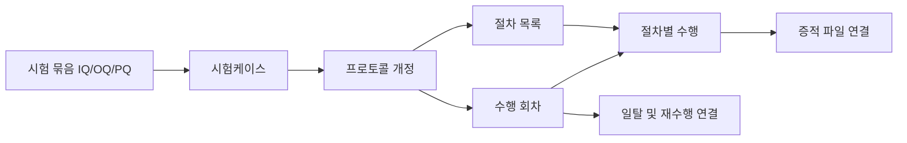
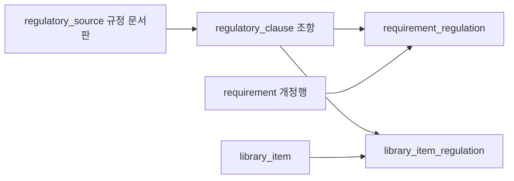

# 데이터 정의서와 UI 비교 검토 보고서

> **검토 대상:** [data-dictionary.md](../data-dictionary.md)의 54개 테이블·821개 컬럼과 현재 ValiDocs UI 코드  
> **작성일:** 2026-09-16  
> **목적:** 향후 시스템의 관계형 데이터 모델을 정리하기 위한 변경 권고안

초안의 기본 업무 영역은 적절합니다. 다만 **실제 화면의 입력·승인 단위가 빠진 부분**, **같은 데이터를 중복 저장하는 부분**, **현재 범위보다 앞서 설계한 운영 기능**이 함께 들어 있습니다. 테이블 개수를 일괄 줄이기보다는 아래 순서로 정리하는 것을 권합니다.

| 우선 결정 | 권고 |
| --- | --- |
| RTM | 독립 수행·승인 단계에서 제외하고 **대시보드 조회 모델**로 구성. 연결 원본과 승인 시점 스냅샷은 보존 |
| F&DS | 한 업무 그룹 안에서 **FDS → DDS** 순서로 배치. 두 문서의 공통 저장 구조 통합 권고 |
| 고정 규정 근거 | **추가하는 것이 타당함.** 규정 문서판·조항·업무 연결을 저장하는 4개 테이블을 이 보고서에 구체적으로 설계 |
| 가장 큰 누락 | VP와 목차, 산출물 편집·개정, 시험 절차·수행 회차, 세분화된 권한, 다중 결재자, QIA 프로세스 |
| 우선 보류 | 예약 리포트, 자동 파일 정리, 백업 작업 관리, 알림 발송 이력. 운영 범위가 확정되면 재검토 |

## 목차

1. [검토 범위와 판정 기준](#scope)
2. [UI와 데이터의 대응 요약](#ui-map)
3. [초안 54개 테이블 전체 판정](#table-review)
4. [RTM을 대시보드로 전환하는 변경안](#rtm)
5. [F&DS 그룹과 FDS·DDS 정리](#design)
6. [기존 테이블의 필드 추가·삭제·이관](#field-review)
7. [누락된 업무 구조와 신규 테이블](#new-model)
8. [고정 규정 근거 데이터 모델](#reference-data)
9. [적용 순서와 확인 기준](#implementation)
10. [근거 및 검토 한계](#evidence)

<a id="scope"></a>

## 1. 검토 범위와 판정 기준

### 1.1 현재 구현과 향후 설계를 구분합니다

현재 프로토타입은 물리 테이블 3개와 JSON 상태 저장을 사용합니다. 사용자가 작성한 초안은 이를 운영용 관계형 구조로 정리하려는 문서이므로, **현재 DB에 테이블이 없다는 이유로 불필요하다고 판단하지 않았습니다.** 화면의 반복 입력, 항목 수, 상태, 이력, 참조 관계를 기준으로 판단했습니다.

초안의 `uuid`, `jsonb`, `timestamptz`, `gen_random_uuid()`는 PostgreSQL 계열을 전제로 한 표현입니다. 현재 D1/SQLite에 그대로 실행하는 마이그레이션은 아닙니다. 아래 신규 구조도 **검토용 설계**이며 테이블 생성·원본 초안 변경은 수행하지 않았습니다.

- 원본 `data-dictionary.md`의 54개 테이블과 821개 컬럼을 파싱하여 목록을 확인했습니다.
- UI JSX, 타입, 저장 처리, 승인·개정·집계 로직을 대조했습니다.
- 현재 브라우저 제어 도구가 없어 이번 검토에서 화면을 클릭하며 확인하지는 않았습니다.
- 여기서 **CSV 규정 근거**는 컴퓨터화 시스템 밸리데이션 관련 근거 문서로 해석했습니다. CSV/XLSX **파일 형식**을 이용한 적재는 별도 절차로 설명합니다.
- 규정의 법적 적용 여부나 조항 내용의 정확성을 판정하는 문서는 아닙니다. 현재 코드의 규정 문자열은 초기 참고 데이터 후보입니다.

### 1.2 판정 용어

| 판정 | 뜻 |
| --- | --- |
| **유지·보완** | 해당 업무가 필요하며 기존 테이블을 중심으로 누락 필드·관계를 보완 |
| **통합** | 기능은 유지하되 공통 테이블 또는 다른 원본 데이터로 합침 |
| **조회 전환** | 별도 수정 가능한 원본 대신 JOIN·집계·뷰로 제공 |
| **현 범위 제외** | 현재 UI의 업무 대상이 아니거나 요구 방향과 맞지 않음. 관련 데이터가 있다면 이관·보존 후 처리 |
| **조건부·보류** | 운영 기능으로 유효할 수 있지만 현재 UI만으로 필수라고 볼 수 없음 |

화면에 없더라도 PK·FK·버전 식별자·작성자·시각·인증·감사 정보는 필요할 수 있습니다. 반대로 화면에 표시된 수치라도 원본에서 계산 가능한 값은 독립 입력 컬럼으로 만들 필요가 없습니다.

<a id="ui-map"></a>

## 2. UI와 데이터의 대응 요약

| UI 영역 | 현재 화면·행동 | 초안의 핵심 차이 | 우선순위 |
| --- | --- | --- | --- |
| 계정·권한 | 복수 역할, 그룹, 메뉴 조회/편집, 프로젝트 조회/편집/폐기 | 역할 매핑만으로 실제 권한 체크박스를 표현하지 못함 | P0 |
| 시스템 인벤토리 | 대분류/중분류/대상, 컴퓨터화 여부, Part 11, 개정·폐기 | 분류·Part 11·개정 이력 누락, 소프트웨어 버전과 개정번호 혼재 | P0 |
| 프로젝트 설정 | 수행 단계 선택, 활동별 결재선, 주·대체 결재자 | 기본 결재선 설정과 실제 승인 인스턴스 구분 부족 | P0 |
| VP | 목차 추가·삭제·순서 변경, 본문·포함 여부 | VP 및 목차 저장 테이블 없음 | P0 |
| VA | 업체·평가일·감사자·첨부·항목 승인 | 초안에는 없는 입력보다 결함 통계 등 현재 사용하지 않는 필드가 많음 | P1 |
| QIA | 모듈 아래 여러 프로세스, 질문 응답, 모듈 승인 | 모듈과 프로세스가 한 행에 섞임. 일부 질문 의미·코드도 불일치 | P0 |
| URS | 요구사항·규정·수용 기준·등록 출처·항목 승인·폐기 | 수용 기준과 출처 누락. RTM 연결 여부는 파생값 | P0 |
| F&DS | FDS/DDS별 여러 파일, 승인번호·버전·교체 이력 | 파일 연결·교체 개정이 부족하고 내부 설계 상세 테이블은 과함 | P0 |
| FRA·DQ | 위험 점수, 승인 URS·설계 버전 연결, 판정·사유 | 점수 체계, 연결 단위, 개정 FK, 판정 코드 보완 필요 | P0 |
| IQ/OQ/PQ | 시험마다 여러 절차·증적, 프로토콜/결과 승인, 재수행 | 시험·절차·수행 회차가 섞여 있으며 PQ 구조가 다른 두 단계와 불일치 | P0 |
| RTM·대시보드 | 연결 현황·커버리지 자동 계산 | 별도 수행/승인 테이블을 원본으로 두지 않는 방향으로 전환 | P0 |
| VSR | 승인된 활동·문서번호·버전·승인자·승인일 요약 | 원본 버전 스냅샷 부족, 일부 통계·결론은 현재 입력 없음 | P1 |
| 산출물 | 목차 편집·AI 초안 적용·버전별 문서·별도 승인·PDF | `report_generation`만으로 저장할 수 없는 문서 본문·개정 구조 누락 | P0 |
| 일탈·프로젝트 종료 | 일탈 조치·재수행·종료, 정상/강제종료 결재 | 일탈 단계별 기록과 종료 요청별 워크플로우 보완 필요 | P0 |
| 규정·라이브러리 | URS·FRA의 규정 문자열, 재사용 템플릿, CSV/XLSX 등록 | 규정 문서판·조항·매핑을 공유할 기준 데이터 없음 | P1 |

`P0`은 업무 모델 확정 전에 정리할 사항, `P1`은 첫 정식 구현에서 보완할 사항, `P2`는 운영 범위 확정 후 추가할 사항입니다.

<a id="table-review"></a>

## 3. 초안 54개 테이블 전체 판정

**No는 원본 초안 번호입니다.** 비교가 가능하도록 유지했으며, 이 보고서의 판정 목록에서는 요청에 따라 FDS 바로 다음에 DDS를 배치했습니다. 상세 필드 변경은 [6절](#field-review), 신규 구조는 [7절](#new-model)을 참고하세요.

| No | 초안 테이블 | 판정 | 권고 및 이유 |
| --- | --- | --- | --- |
| 1 | [organization](../data-dictionary.md#table-organization) | 조건부·유지 | 조직 UI는 없지만 사용자·시스템·그룹의 운영 범위 원본. 단일 조직이면 기본 조직 1건으로 시작 |
| 2 | [app_user](../data-dictionary.md#table-app_user) | 유지·보완 | 이메일 로그인 식별 정책, 권한등급 정리. 운영 인증 필드는 유지 |
| 3 | [role](../data-dictionary.md#table-role) | 유지·보완 | 업무 역할과 인벤토리 역할·관리 권한등급을 구분 |
| 4 | [user_role](../data-dictionary.md#table-user_role) | 유지·보완 | 복수 역할 N:M 유지. 메뉴 접근권한을 이 관계로 대신하지 않음 |
| 5 | [user_group](../data-dictionary.md#table-user_group) | 유지·보완 | 그룹명·설명·활성 상태 관리 |
| 6 | [user_group_member](../data-dictionary.md#table-user_group_member) | 유지·보완 | 다중 그룹 가입과 탈퇴 이력 관리 |
| 7 | [group_role](../data-dictionary.md#table-group_role) | 유지·범위 한정 | 그룹의 역할 부여용. 메뉴/프로젝트의 세부 권한은 별도 grant 사용 |
| 8 | [electronic_signature](../data-dictionary.md#table-electronic_signature) | 유지·보완 | 정확한 승인 대상 개정·의미·서명자 표시 스냅샷 연결 |
| 9 | [audit_trail](../data-dictionary.md#table-audit_trail) | 유지·보완 | UI 메뉴·역할 필터 및 변경 필드 표시를 지원 |
| 10 | [file_asset](../data-dictionary.md#table-file_asset) | 유지·보완 | 파일·저장소 메타데이터 원본. 자동 정리 전용 컬럼은 후속 범위 |
| 11 | [evidence_link](../data-dictionary.md#table-evidence_link) | 유지·보완 | 문서 개정 및 시험 수행 회차·절차까지 연결 대상을 세분화 |
| 12 | [file_cleanup_execution](../data-dictionary.md#table-file_cleanup_execution) | 조건부·보류 | 자동 파일 정리 UI·작업 처리 없음. 해당 운영 기능 도입 시 구성 |
| 13 | [system_asset](../data-dictionary.md#table-system_asset) | 유지·보완 | 현재 분류·Part 11·승인·폐기 상태와 소프트웨어 버전 반영 |
| 14 | [backup_execution](../data-dictionary.md#table-backup_execution) | 조건부·보류 | 플랫폼 자체 백업 관리가 범위일 때 사용. 시험 대상 시스템의 백업 요구사항과 구분 |
| 15 | [library_item](../data-dictionary.md#table-library_item) | 유지·보완 | URS/FRA/IQ/OQ/PQ 5종과 각 입력 항목 반영 |
| 16 | [validation_project](../data-dictionary.md#table-validation_project) | 유지·보완 | 프로젝트 원본 유지. 진행률은 집계, 종료 필드는 요약으로 정의 |
| 17 | [project_member](../data-dictionary.md#table-project_member) | 유지·보완 | 참여자·업무 역할용. 조회/편집/폐기 권한과 구분 |
| 18 | [validation_activity](../data-dictionary.md#table-validation_activity) | 유지·보완 | RTM 제외. F&DS 한 활동, FDS/DDS는 하위 문서 구분 |
| 19 | [project_activity](../data-dictionary.md#table-project_activity) | 유지·보완 | 선택된 수행 단계 관리. RTM은 진행률·승인·종료 분모에서 제외 |
| 20 | [activity_dependency](../data-dictionary.md#table-activity_dependency) | 유지·단순화 | 선택된 단계의 선후행 조건 표현. RTM 선행 승인 조건 제외 |
| 21 | [qia_assessment](../data-dictionary.md#table-qia_assessment) | 유지·보완 | Part 11 질문 의미·응답값·문항판과 문서 승인 구분 |
| 22 | [qia_module_item](../data-dictionary.md#table-qia_module_item) | 유지·분리 | 모듈 1건을 저장하고 프로세스·응답은 자식 구조로 분리 |
| 23 | [vendor_audit](../data-dictionary.md#table-vendor_audit) | 유지·축소 | 파일·감사자·승인 상태 중심. 현재 사용하지 않는 결함 수 등 제외 |
| 24 | [requirement](../data-dictionary.md#table-requirement) | 유지·보완 | 수용 기준·출처·폐기·개정 식별 보완. 연결 여부는 조회값 |
| 25 | [fds_spec](../data-dictionary.md#table-fds_spec) | 통합 | `design_document`에서 `document_type=FDS`로 관리 |
| 46 | [dds_spec](../data-dictionary.md#table-dds_spec) | 통합 | 같은 구조에서 `document_type=DDS`. FDS 다음 순서 유지 |
| 26 | [fds_item](../data-dictionary.md#table-fds_item) | 현 범위 제외 | 업로드 파일 내부 기능을 구조화하여 직접 편집하는 UI 없음 |
| 47 | [dds_item](../data-dictionary.md#table-dds_item) | 현 범위 제외 | 설계 항목 직접 편집 UI 없음. 설계 문서 파일·개정은 유지 |
| 27 | [fds_interface](../data-dictionary.md#table-fds_interface) | 현 범위 제외 | 시스템 인터페이스 원천/대상/전송주기 편집 UI 없음 |
| 28 | [dq_assessment](../data-dictionary.md#table-dq_assessment) | 유지·보완 | DQ 항목 묶음 및 승인 기준 문서 상태 |
| 29 | [dq_item](../data-dictionary.md#table-dq_item) | 유지·보완 | 승인된 URS·FDS/DDS 개정 참조, 각 코멘트, 판정·Fail 사유 |
| 30 | [fra_assessment](../data-dictionary.md#table-fra_assessment) | 유지·보완 | 위험 평가 묶음·문서 승인·개정 관리 |
| 31 | [fra_item](../data-dictionary.md#table-fra_item) | 유지·보완 | SEV/OCC/DET 체계와 URS 개정 참조. 계산값은 원본과 분리 |
| 32 | [iq_assessment](../data-dictionary.md#table-iq_assessment) | 통합 권고 | `qualification_assessment(kind=IQ)`로 공통화 |
| 33 | [iq_item](../data-dictionary.md#table-iq_item) | 통합 권고 | `qualification_case`로 공통화. 절차·수행 회차 분리 |
| 34 | [oq_assessment](../data-dictionary.md#table-oq_assessment) | 통합 권고 | `qualification_assessment(kind=OQ)` |
| 35 | [oq_item](../data-dictionary.md#table-oq_item) | 통합 권고 | `qualification_case` |
| 36 | [pq_assessment](../data-dictionary.md#table-pq_assessment) | 통합 권고 | `qualification_assessment(kind=PQ)`. 실제 UI는 IQ/OQ와 동일한 시험 모델 |
| 37 | [pq_item](../data-dictionary.md#table-pq_item) | 통합 권고 | 프로토콜·결과 상태, 여러 URS·절차가 가능한 공통 구조 적용 |
| 38 | [rtm_assessment](../data-dictionary.md#table-rtm_assessment) | 조회 전환 | 대시보드 집계 뷰. RTM 자체 작성·승인·개정 원본 제외 |
| 39 | [rtm_item](../data-dictionary.md#table-rtm_item) | 조회 전환 | 요구사항·위험·설계·시험 관계로 구성. 수동 SOP/조치 정보는 원본으로 이관 |
| 40 | [vsr_assessment](../data-dictionary.md#table-vsr_assessment) | 유지·보완 | 최종 보고 및 승인 대상. 원본 데이터 스냅샷 연결 |
| 41 | [vsr_item](../data-dictionary.md#table-vsr_item) | 유지·보완 | 승인 시점 활동 요약. 원본과 별개로 수동 변경하지 않음 |
| 42 | [workflow_instance](../data-dictionary.md#table-workflow_instance) | 유지·보완 | 문서뿐 아니라 인벤토리·폐기·종료 요청도 대상으로 명시 |
| 43 | [workflow_step](../data-dictionary.md#table-workflow_step) | 유지·분리 | 직렬/병렬 모드 추가. 한 단계 여러 담당자는 자식 테이블 |
| 44 | [approval_action](../data-dictionary.md#table-approval_action) | 유지·보완 | 실제 처리자·담당 배정·서명·의미 연결 |
| 45 | [traceability_link](../data-dictionary.md#table-traceability_link) | 유지·보완 | RTM 제거 후에도 필요한 원본 관계. 대상 종류·개정 식별 보완 |
| 48 | [deviation](../data-dictionary.md#table-deviation) | 유지·보완 | 발생 수행 회차, 즉시 조치·시정조치·재수행·완료보고·종료 분리 |
| 49 | [report_generation](../data-dictionary.md#table-report_generation) | 조건부·축소 | 서버 PDF 생성 작업을 도입하면 사용. 현재 산출물 본문·승인 저장소를 대신하지 못함 |
| 50 | [report_schedule](../data-dictionary.md#table-report_schedule) | 조건부·보류 | 예약 리포트 UI·실행기 없음. 정기 발행 범위 확정 후 도입 |
| 51 | [ai_generation_job](../data-dictionary.md#table-ai_generation_job) | 조건부·유지 | 실제 AI 연동 시 요청·모델·실패 이력용. 현재 생성 동작은 데모 구현 |
| 52 | [ai_generation_result](../data-dictionary.md#table-ai_generation_result) | 조건부·유지 | 생성 결과 묶음의 검토·적용 이력. 문서 섹션과 연결 필요 |
| 53 | [ai_result_item](../data-dictionary.md#table-ai_result_item) | 조건부·유지 | 항목별 선택 적용 UI는 존재. 실제 저장 대상을 새 문서·시험 모델에 맞춤 |
| 54 | [notification_delivery](../data-dictionary.md#table-notification_delivery) | 조건부·보류 | 화면 토스트/승인 대기 목록과 외부 알림 발송은 다름. 발송 기능 확정 후 도입 |

통합된 시험·설계 테이블은 기능 삭제가 아닙니다. **업무 종류를 구분하는 공통 구조**로 바꾸자는 권고입니다. 시험 6개 테이블을 그대로 유지하는 설계도 가능하지만, 그 경우에도 절차·수행 회차·개정·승인 단위 보완은 필요합니다.

<a id="rtm"></a>

## 4. RTM을 대시보드로 전환하는 변경안

### 4.1 이미 반영된 부분과 남은 부분

| 확인 대상 | 현재 구현 | 필요한 정리 |
| --- | --- | --- |
| 좌측 수행 메뉴 | RTM 없음 | 유지 |
| 대시보드 수행 단계 표시 | `displayStages`에서 RTM 필터 | 유지하되 집계 기준도 동일하게 적용 |
| 전체 진행률·완료 단계 수 | 표시용 배열이 아닌 `stages`로 계산하여 RTM이 포함될 수 있음 | 실제 수행 활동만 분모로 사용 |
| 정상종료 조건 | `stages`의 진행률·승인·산출물 존재를 검사 | RTM 독립 승인·산출물 생성 조건 제거 |
| Level별 기본 활동 | Level 1/2 등에 RTM 포함 | 초기 선택·기존 프로젝트 활동 목록에서 제외 |
| RTM 전용 기능 | 라우트·승인 경로·문서 상태 존재 | 대시보드 조회와 필요한 원본 관계로 이관 |
| VSR·승인 연쇄 | RTM 단계·승인본을 참조 | RTM 승인 완료 대신 원본 단계의 승인 상태 및 추적 결과를 사용 |

근거: [메뉴](../app/page.tsx#L53), [RTM 라우트](../app/page.tsx#L446), [진행률·종료 계산](../app/features/ValidationPlanningFeatures.tsx#L1081), [활동 기본값](../app/features/AdminProjectFeatures.tsx#L4688), [VSR 입력](../app/features/TraceSummaryFeatures.tsx#L770).

### 4.2 테이블·필드 조정

- `rtm_assessment`, `rtm_item`을 **새 운영 모델의 수정 가능한 원본 테이블에서 제외**합니다. `project_traceability_view` 같은 조회 모델로 구성할 수 있습니다.
- `traceability_link`와 URS·FRA·DQ·시험 원본 간 업무 관계 및 향후 FK 설계는 유지합니다. 원본 FK에서 바로 알 수 있는 관계를 링크 테이블에 중복 저장한다면 어느 쪽이 기준인지 정해야 합니다.
- `requirement.is_rtm_linked`는 저장하지 않고 필요한 관계 존재 여부로 계산합니다.
- `total_urs_count`, 연결률·커버리지, 복사한 요구사항 본문·시험 결과는 최신 조회에서는 계산합니다.
- **예외:** 현재 RTM에만 저장된 `sopId`, 수동 연결·조치 정보는 삭제하면 안 됩니다. FRA 통제 정보의 `control_type`, `sop_reference` 또는 명시적인 추적 관계로 먼저 이관합니다.
- 승인된 VSR·프로젝트 종료 시점의 결과가 필요하면 당시 원본 개정 ID와 집계 결과를 **문서 승인 스냅샷**으로 보관합니다. RTM을 독립 수행 단계로 되돌릴 필요는 없습니다.

### 4.3 대시보드에 남길 항목

| 항목 | 데이터 원본 |
| --- | --- |
| URS 번호·본문·버전 | 폐기되지 않은 승인 URS 개정 |
| 위험 연결·조치 유형 | 해당 URS와 연결된 FRA 개정·통제 정보 |
| FDS·DDS 연결 | 승인된 설계 문서 개정 |
| DQ 판정 | DQ 항목과 연결된 URS·설계 개정 |
| IQ/OQ/PQ 연결·결과 | 연결 시험, 최신 유효 수행 회차, 프로토콜·결과 승인 상태 |
| 누락·최신 버전 불일치 | 필요한 관계의 존재 여부와 현재 승인 개정 비교 |
| 연결 커버리지 | 공통 집계 규칙으로 계산 |

**연결 커버리지와 시험 적합·최종 승인은 구분해야 합니다.** 현재 코드는 수행된 시험의 `Fail`도 연결된 시험으로 계산할 수 있습니다. 따라서 커버리지 100%를 “모든 시험 Pass”나 “모든 승인 완료”로 사용하면 안 됩니다.

현재 대시보드와 RTM 전용 계산은 SOP 처리도 다릅니다. 대시보드는 SOP 참조가 있어야 시험 영역 점수를 부여하지만 RTM 전용 화면은 조치 유형이 SOP라는 이유만으로 점수를 부여합니다. 집계 서비스를 하나로 정리하면서 다음 기준을 확정해야 합니다.

- 미선택 IQ/OQ/PQ, `No Action`, `SOP`, `N/A`를 분모·상태에 어떻게 반영할지.
- 폐기 항목과 오래된 개정 연결을 제외하거나 경고하는 기준.
- 시험 **연결됨 / 수행됨 / 적합함 / 승인됨**을 각각 어떤 상태로 표시할지.
- 조회 커버리지와 프로젝트 정상종료 가능 여부를 별도 판정할 것.

근거: [대시보드 점수](../app/features/ValidationPlanningFeatures.tsx#L849), [관계 생성](../app/features/ValidationPlanningFeatures.tsx#L885), [RTM 전용 점수](../app/features/TraceSummaryFeatures.tsx#L405).

<a id="design"></a>

## 5. F&DS 그룹과 FDS·DDS 정리

### 5.1 권장 배치

```text
Validation 수행 활동
  VP → VA → QIA → URS → F&DS → FRA → DQ → IQ → OQ → PQ → VSR
                            ├─ FDS 문서 목록
                            └─ DDS 문서 목록

대시보드
  진행 현황 / 승인 대기 / 요구사항 추적성(RTM)
```

위 순서는 **전체 활동의 기본 표시 순서**입니다. 모든 프로젝트가 11개 활동을 반드시 수행한다거나 DDS가 FDS 승인 후에만 등록 가능하다는 의미는 아닙니다.

### 5.2 저장 구조

현재 UI는 FDS/DDS별로 **여러 업로드 문서**를 관리합니다. 파일 내부 기능·인터페이스·상세 설계 항목을 직접 편집하는 화면은 없습니다.

| 초안 | 권장 구조 | 처리 |
| --- | --- | --- |
| `fds_spec`, `dds_spec` | `design_document` | `document_type=FDS/DDS`, 프로젝트 1:N 문서 |
| 두 테이블의 버전·상태 | `design_document_revision` | 문서 1:N 개정, 업로드 파일·승인 상태·교체 이력 |
| `fds_item`, `dds_item`, `fds_interface` | 현재 범위에서 별도 테이블 제외 | 향후 파일 내용을 구조화하여 편집할 때 도입 |
| `dq_item.fds_mapping`, `dds_mapping` | 승인된 설계 **개정** 참조 | 문자열 번호만 연결하지 않음 |
| 추적 관계의 `FDS_ITEM`, `DDS_ITEM` | `DESIGN_DOCUMENT_REVISION` 등 | 문서 단위 연결에 맞춰 대상 코드 변경 |

`design_document`의 `document_type`로 FDS를 먼저, DDS를 다음에 표시하면 됩니다. 두 종류가 비슷하다는 이유만으로 모든 DDS에 단일 `fds_id`를 필수로 요구할 근거는 현재 UI에 없습니다. 구체적인 문서 간 대응이 필요하면 추적 관계로 관리합니다.

근거: [문서 타입·교체 이력](../app/features/ValidationPlanningFeatures.tsx#L3579), [FDS/DDS 화면](../app/features/ValidationPlanningFeatures.tsx#L3854), [DQ 연결 대상](../app/features/QualificationTraceFeatures.tsx#L327).


<a id="field-review"></a>

## 6. 기존 테이블의 필드 추가·삭제·이관

아래는 차이가 있는 필드 중심입니다. **삭제는 값을 잃어도 된다는 뜻이 아닙니다.** 대체 컬럼·자식 테이블·스냅샷으로의 이관을 함께 표시했습니다. 공통 식별자·작성/수정 이력은 특별한 이유가 없으면 유지합니다.

### 6.1 계정·권한·감사

| 대상 | 추가·수정 | 제외·선택·이관 |
| --- | --- | --- |
| `app_user` | 관리 권한등급이 업무 역할과 별도라면 `permission_level` 또는 관리역할 코드 추가. 이메일 초대와 로그인 식별 정책 명시 | `username`과 `email`이 같은 식별자면 중복 입력 금지. 부서·직급은 현재 UI 필수값에서 제외 |
| `role`, `user_role` | 시스템 관리자/어드민/작성자/검토자/승인자/뷰어 및 복수 역할 지원. `role_category` 등으로 의미 구분 | 역할 N:M을 단일 사용자 컬럼으로 축소하지 않음 |
| 그룹·프로젝트 권한 | `access_permission_grant` 추가. 주체, 메뉴/프로젝트 범위, `can_view/can_edit/can_dispose` | `group_role`, `project_member.role_id`를 메뉴 체크박스의 대용으로 사용하지 않음 |
| 인벤토리 승인 담당자 | 작성/검토/승인/폐기 담당자 관계. `inventory_role_grant` 또는 scope가 명확한 기존 역할 매핑 | 메뉴 편집 가능과 승인·폐기 가능을 같은 권한으로 취급하지 않음 |
| `audit_trail` | `menu_code`, `actor_role_snapshot`, 필요 시 `actor_display_snapshot`. 변경 경로 `field_path`는 JSON diff 또는 명시 필드로 제공 | 로그인·시스템 이벤트처럼 대상 레코드가 없는 경우 `target_record_id` 필수 규칙 완화 |
| `electronic_signature` | 대상 개정 식별, 서명 의미, 당시 표시명·역할 스냅샷. 폐기·종료·결재선 적용까지 대상 범위 정의 | `content_hash`, 재인증 방식·결과는 UI에 보이지 않아도 유지. 비밀번호 원문은 저장하지 않음 |

권한은 직접 부여와 그룹 상속을 구분하고 **유효 권한은 합산 조회**하는 편이 좋습니다. 그룹에서 상속된 결과를 개인 직접 부여로 다시 복제하면 탈퇴 뒤에도 권한이 남을 수 있습니다. `edit` 또는 `dispose`가 가능하면 `view`도 가능해야 하는 등의 규칙도 한 곳에서 검증해야 합니다. Audit Trail 메뉴의 `can_edit`는 현재 UI 정책에 맞춰 항상 `false`로 제한합니다.

`password_hash`, 최종 로그인·비밀번호 변경일, 계정 잠금은 운영 인증 설계입니다. 프로토타입이 임의 입력을 허용한다는 이유로 이 필드를 삭제하지 않습니다. 외부 인증을 채택하면 해시 대신 외부 주체 식별자를 사용하는 식으로 인증 방식을 확정합니다.

근거: [계정·권한 타입](../app/features/AdminProjectFeatures.tsx#L2570), [메뉴 권한 UI](../app/features/AdminProjectFeatures.tsx#L4314), [프로젝트 권한 UI](../app/features/AdminProjectFeatures.tsx#L6021), [감사 필드](../app/features/AdminProjectFeatures.tsx#L2101).

### 6.2 시스템·프로젝트·라이브러리

| 대상 필드 | 권고 | 이유 |
| --- | --- | --- |
| `system_asset.system_type` | 신규 설계는 대분류·중분류·대상으로 대체 | UI 타입에서 기존 단일 분류는 레거시 호환용 |
| 누락: 시스템 분류 | `major_category`, `middle_category`, `target_type` 또는 분류 마스터 FK | 실제 입력 3단계 |
| `system_asset.version` | `software_version`와 `revision_number` 분리 | 설치 소프트웨어 버전과 인벤토리 개정은 다른 값 |
| `system_asset.gxp_type` | `gxp_applicability` 등 대상/비대상 필드로 대응 | GMP/GLP/GDP 종류 선택 UI가 아님. 종류가 필요하면 별도 선택 속성 |
| 누락: Part 11 | `part11_applicability` 추가 | 컴퓨터화 시스템 등록 시 입력·검증 |
| `system_asset.gamp_category` | 코드값 재확인 | UI는 Category 1/2/3/4, 초안 예시는 3/4/5. 이 검토로 규정상 정답을 단정하지 않음 |
| `system_asset.status` | `approval_status`, `lifecycle_status` 분리 | 승인 진행과 활성/폐기를 한 코드로 표현하면 혼동 |
| 누락: 시스템 개정·폐기 | `system_asset_revision`, `disposed_at`, `disposal_reason`, 서명 연결 | 개정 사유·승인 이력·연결 프로젝트 영향 보존 |
| `identification_status` | 입력 원본에서 제외하거나 후속 기능으로 분리 | 현재 UI는 별도 등록완료 상태를 편집하지 않음 |
| `validation_project.progress_rate` | 계산값 또는 갱신 시각이 있는 캐시로 명시 | 수행 단계·승인 결과에서 계산. RTM 분모 제외 |
| `validation_project.gamp_category` | 시스템 참조 또는 확정 시 스냅샷 | 프로젝트에서 독립 수정하는 중복 원본 불필요 |
| `validation_level` | Level 1/2/3/사용자 지정에 대응 | 초안 Level 4와 UI의 사용자 지정 개념 구분 |
| `validation_project.status` | 진행중/정상종료/강제종료를 구분하는 코드 확정 | 종료 요청의 검토중/승인중은 요청 객체의 상태 |
| 프로젝트 `start_date`, `context_status` | 선택·후속 범위 | 현 UI의 직접 입력·처리 근거 부족 |
| `library_item.module_type` | URS/FRA/IQ/OQ/PQ | 초안의 URS/IQ/OQ 범위 확장 |
| URS 라이브러리 | `provision_type`, 분류 3단계, `function_name`, `application_scope` 추가 | 기본 제공/사용자 지정 및 분류·기능·범위 입력 |
| FRA 라이브러리 | `risk_scenario`, `severity`, `occurrence`, `detectability` 추가 | 위험 템플릿 입력 |
| 시험 라이브러리 | `test_content` 추가 또는 공통 본문 필드의 의미 명확화 | 시험 내용·예상 결과·수용 기준 구분 |

시스템과 프로젝트는 **시스템 1:N 프로젝트**로 시작할 수 있습니다. `validation_project.system_id`를 관계의 원본으로 삼고 인벤토리의 연결 프로젝트 목록은 역조회합니다. 현재 이름 문자열 연결을 유지하거나 양쪽에 프로젝트 이름 배열을 중복 저장할 필요는 없습니다.

현재 UI는 폐기된 시스템의 관리번호도 재사용하지 못하게 합니다. 운영 모델도 이 정책을 따르면 `(organization_id, management_number)` 유일성을 활성 행에만 한정하지 않아야 합니다. [중복 검사](../app/features/AdminProjectFeatures.tsx#L902)

라이브러리의 새 분류·기능·적용범위 필드와 기존 `category/title/acceptance_criteria`가 같은 뜻이라면 이관 규칙을 정해 하나를 원본으로 삼습니다. 모든 모듈별 컬럼을 무조건 필수로 두지 말고 모듈에 맞는 조건을 적용합니다.

근거: [시스템 입력폼](../app/features/AdminProjectFeatures.tsx#L1318), [인벤토리 개정](../app/features/AdminProjectFeatures.tsx#L966), [라이브러리 타입](../app/features/AdminProjectFeatures.tsx#L1515), [라이브러리 편집](../app/features/AdminProjectFeatures.tsx#L2037).

### 6.3 VA·QIA·URS

| 대상 | 추가·수정 | 제외·이관 |
| --- | --- | --- |
| `vendor_audit` | 첨부 `file_asset_id` 또는 파일 연결, 감사자 사용자 ID, 승인번호·승인버전, 폐기 정보 | `critical_defects`, `major_defects`, `minor_defects`는 현재 코드에서 명시적으로 제거하는 레거시 값 |
| VA 평가 유형·결과 | 운영 요구가 생기면 선택 설계 | `audit_type`, `audit_result`는 현 UI 입력 없음. `system_name`은 프로젝트 참조 또는 표시 스냅샷 |
| `qia_assessment.p11_q1`~`p11_q6` | 질문 문구·의미를 UI와 정합화. `question_set_version`, `rule_version` 보존 | 기존 컬럼 번호만 맞춰 응답을 이관하면 안 됨. 특히 q6의 Closed/Open은 현재 Yes/No 질문과 다름 |
| `qia_assessment.part11_result` | 응답 기반 계산 및 승인 시 스냅샷 | 응답과 독립적으로 수정하는 원본값으로 두지 않음 |
| `qia_module_item` | 모듈 승인번호·상태·버전·폐기 | `process_code/name`, 10개 응답을 `qia_process`로 이동. 프로세스 설명 추가 |
| QIA 응답 코드 | UI의 `O/X/▲`와 초안 `O/X/△` 의미·매핑 명시 | 표기만 바꾸고 기존 의미를 추정하지 않음 |
| `requirement` | `acceptance_criteria`, `source_type`, 필요 시 출처 ID, 폐기·서명 관계 | `is_rtm_linked`는 삭제 후 조회 계산 |
| `requirement.item_number` | 승인 전 NULL 허용, 승인 시 번호 부여 | 초안 상태부터 번호를 강제하면 현재 UI 흐름과 다름 |
| `requirement.regulation` | 규정 조항 N:M 연결 + 표시 스냅샷 또는 수기 근거 | 규정 마스터 적용 뒤 자유문자열만 단독 기준으로 사용하지 않음 |

GxP Q1~Q10도 초안과 현재 UI의 질문 의미를 다시 대조해야 합니다. 프로세스 테이블로 옮기는 것만으로는 충분하지 않으며, `q1_val`~`q10_val`을 유지하더라도 컬럼 설명·질문판을 재정의하고 기존 응답은 의미를 확인한 뒤 이관합니다.

QIA는 **평가 헤더 → 모듈 → 프로세스**의 계층입니다. 모듈을 먼저 등록하고 프로세스를 나중에 추가할 수 있어야 합니다. 질문 10개를 당장 별도 행으로 정규화하는 것은 선택이지만, 질문 세트와 판정 규칙의 버전은 필요합니다. 질문 관리 화면까지 만들 때는 `qia_question_definition`, `qia_response`를 도입할 수 있습니다.

근거: [VA 레거시 제거](../app/features/ValidationPlanningFeatures.tsx#L1953), [QIA 계층](../app/features/ValidationPlanningFeatures.tsx#L2377), [실제 질문](../app/features/ValidationPlanningFeatures.tsx#L2392), [Part 11 질문](../app/features/ValidationPlanningFeatures.tsx#L2404), [URS 타입](../app/features/ValidationPlanningFeatures.tsx#L2851).

### 6.4 FRA·DQ·추적 관계

| 대상 | 추가·변경 | 제외·계산 전환 |
| --- | --- | --- |
| `fra_item` 점수 | `severity` 1~5, `occurrence` 1~5, `detectability` H/M/L | 기존 `pi_score/ll_score/dl_score`를 새 점수와 동시에 원본으로 유지하지 않음 |
| FRA 결과 | 판정 규칙 버전과 필요 시 승인 결과 스냅샷 | `risk_value`, `risk_level`, 자동 산출 조치 계획은 독립 편집 원본에서 제외 |
| FRA 연결 | 승인 URS 개정 ID, 출처, 항목 승인·폐기, 수동 SOP 참조 | `test_reference` 문자열은 실제 시험 연결로 대체 |
| `dq_item` 관계 | `requirement_id`는 정확한 개정행 참조, `fds_revision_id`, `dds_revision_id` | `fds_mapping/dds_mapping` 문자열을 관계의 유일한 근거로 사용하지 않음 |
| DQ 설명 | `fds_comment`, `dds_comment`, `fail_reason` 분리 | `fds_feature_name/dds_description`는 현 화면의 코멘트 의미로 재정의 |
| DQ 상태 | `result_status`에 N/A, `executed_by/at`, 항목 승인번호·상태·버전·폐기 | `reviewed_by`만으로 수행자·최종 확인자를 모두 표현하지 않음 |
| `traceability_link` | 실제 문서·시험 개정 대상, `source_revision_id/target_revision_id`에 해당하는 식별 방식, 프로젝트 일치 검증 | 제거한 FDS/DDS 상세항목·RTM 엔터티를 신규 대상 코드에서 제외 |

현재 FRA 화면의 계산 항목은 다음과 같습니다. 아래는 코드의 동작을 설명하며, 규정상 표준 평가식이라는 뜻은 아닙니다.

| 화면 계산 항목 | 현재 코드의 계산 | 저장 권고 |
| --- | --- | --- |
| RP | SEV × OCC | 조회 계산 또는 승인 시점 스냅샷 |
| RC | RP가 5 미만이면 3, 5~9이면 2, 10 이상이면 1 | 위와 같음 |
| RPG | RC와 DET의 코드 내 매트릭스 | 판정 규칙 버전과 함께 보존 |
| NT | RP가 24를 초과하면 Y, 아니면 N | 조회 계산 또는 승인 시점 스냅샷 |
| Action Plan | RPG L→No Action, M→SOP 수정/삭제, H→Test 수행 | 자동 산출 계획과 수동 SOP 연결·이행 기록을 구분 |

DQ는 승인된 FDS 또는 DDS 중 필요한 문서를 연결할 수 있어야 하며, Fail 판정에는 사유가 필요합니다. 기존 `urs_no/urs_description` 등 복사 필드를 남긴다면 **승인 당시 표시용 스냅샷**으로 명시합니다.

`traceability_link`의 다형 참조는 컬럼을 FK라고 표기해도 DB가 대상 테이블을 자동 검증하지 않습니다. 허용된 타입, 대상 존재, 동일 프로젝트, 승인 개정의 유효성을 애플리케이션에서 검증하거나 관계별 FK 테이블로 나눠야 합니다. 이미 `dq_item`의 FK로 표현되는 관계는 뷰에서 파생하고 이중 편집하지 않는 것을 권합니다.

근거: [FRA 점수·계산](../app/features/ValidationPlanningFeatures.tsx#L3957), [DQ 타입](../app/features/QualificationTraceFeatures.tsx#L281), [DQ 승인 설계 검증](../app/features/QualificationTraceFeatures.tsx#L912), [Fail 사유 검증](../app/features/QualificationTraceFeatures.tsx#L747).

### 6.5 IQ/OQ/PQ·일탈

| 초안 필드·규칙 | 권고 |
| --- | --- |
| 시험 종류마다 반복한 헤더·항목 | 공통 `qualification_assessment`와 `qualification_case`로 통합하고 `kind`로 구분 |
| `*_item.step_no` | 시험 번호와 절차 순번을 분리. 절차 순번은 `qualification_step.step_order`로 이동 |
| `urs_no` 한 개 | 시험은 여러 URS를 연결하므로 개정 기준 N:M 관계 사용 |
| 누락: 수용 기준·출처 | 케이스 개정에 `acceptance_criteria`, `source_type`, 출처 참조 추가 |
| `actual_result`, `qualification_result`, `executed_by/at` | `qualification_execution`의 수행 회차에 귀속 |
| 누락: 절차별 완료·첨부 | `qualification_step_execution`과 `evidence_link` 연결 |
| `protocol_status`, `record_status` | 프로토콜 승인과 수행 결과 승인을 구분. PQ에도 동일하게 적용 |
| 상위 헤더 승인 → 전체 항목 자동 동기화 | 제거. UI는 항목·선택 항목 단위로 프로토콜/결과를 승인 |
| 미수행·N/A | 미수행은 결과 없음 + 수행 상태로 구분. 판정 N/A와 혼용하지 않음 |
| PQ 일정·수행방식·주 수행자 | `start_scheduled_date`, `target_completion_date`, `execution_method`, `primary_executor`는 현재 범위에서 선택·보류 |
| `deviation.resolution` | `immediate_action`, `corrective_action`, `completion_report`, `closure_reason`으로 의미 분리 |
| `deviation.deviation_status` | 조치 승인 대기 → 재수행 가능 → 완료보고 대기 → 종료를 표현. OPEN/INVESTIGATING/RESOLVED/CLOSED와 단순 치환하지 않고 승인 상태와 업무 상태를 구분 |
| 일탈의 시험 참조 | 발생 `execution_id` 및 재수행 회차 연결. 케이스 ID만으로는 어느 수행에서 발생했는지 불명확 |
| 일탈 승인자 1쌍 | 조치 승인 / 완료보고 승인 / 재수행 없는 종결을 각각 워크플로우·서명으로 추적 |
| `deviation.severity` | 현 UI 입력 없음. 기본값 MINOR로 자동 확정하지 말고 선택·후속 요구로 분리 |

승인 대상은 **프로토콜=케이스 개정**, **결과=수행 회차**로 구분합니다. 재수행은 이전 결과를 덮어쓰지 않고 새 회차로 저장합니다. 기존 승인이 끝난 결과의 정정이 필요하면 그 정정 이력·승인 대상도 별도로 보존해야 합니다. 기존 `deviation.resolution`은 여러 조치 필드로 자동 분해하기 어려우므로 원문을 보존하고 이관 내용을 확인합니다.

근거: [시험·절차·회차 타입](../app/features/QualificationTestFeatures.tsx#L81), [공통 시험 화면](../app/features/QualificationTestFeatures.tsx#L677), [항목별 승인](../app/features/QualificationTestFeatures.tsx#L789), [절차 증적](../app/features/QualificationTestFeatures.tsx#L1828), [일탈 처리](../app/features/QualificationTestFeatures.tsx#L1664).

### 6.6 워크플로우·프로젝트 종료

| 대상 | 변경안 |
| --- | --- |
| `workflow_instance` | 문서 개정 외 시스템 개정·폐기·종료 요청도 대상. `approval_scope`로 PROTOCOL/RESULT/DOCUMENT/DEVIATION_ACTION/DEVIATION_CLOSE 등을 구분 |
| `workflow_step.assignee_id` | `workflow_step_assignee`로 이동. 단계별 `execution_mode=SERIAL/PARALLEL` 추가 |
| 담당자 관계 | 주 담당자·대체자, 배정 순서·상태, 처리 시각 필요 |
| `approval_action` | `workflow_step_assignee_id`로 처리 배정 연결. REVIEW/APPROVE/REJECT에는 배정·실제 처리자를 검증하고, 대응 배정이 없는 SUBMIT/CANCEL에는 NULL 허용. `actor_id` 유지 |
| 단계 유형 | 프로젝트 기본 설정의 작성자 후보와 실제 상신 행위를 구분. 실행 단계에 작성 단계를 저장할지, 제출 액션으로 관리할지 일관되게 정의 |
| `workflow_step.due_at` | 현재 UI에 기한 설정 없음. 선택 필드 또는 후속 요구 |
| 활동별 기본 결재선 | `project_workflow_config`에 설정을 저장하고 실제 인스턴스에는 당시 설정을 복사·고정 |
| 프로젝트 종료 | `project_closure_request`로 요청 버전·진행상태·경로·진행률 스냅샷 보존 |

초안에는 이미 `validation_project.closure_type/closure_reason/closure_requested_by/closure_requested_at/closed_at`와 CLOSE-n 서명 규칙이 있습니다. **종료 정보 전체가 누락된 것이 아니라**, 작성자 서명 이후 검토·승인 상태와 요청별 이력을 표현할 구조가 부족합니다. 기존 프로젝트 컬럼은 최종/현재 요청의 요약으로 둘 수 있습니다.

종료 요청 PK를 새로운 서명 대상으로 삼으면 기존 CLOSE-n의 `target_record_id/target_version` 규칙도 함께 변경해야 합니다. 프로젝트 기본정보 수정·생성과 승인 대상 문서·종료 요청을 동일한 결재 행위로 취급하지 않습니다.

근거: [단계·대체자 설정](../app/features/AdminProjectFeatures.tsx#L67), [설정 적용](../app/features/AdminProjectFeatures.tsx#L5687), [종료 요청 타입](../app/features/ProjectClosureWorkflow.tsx#L32), [검토·승인 처리](../app/features/ProjectClosureWorkflow.tsx#L200).

### 6.7 VSR·산출물·파일·AI·운영 작업

| 대상 | 추가·정리 | 줄이거나 보류할 부분 |
| --- | --- | --- |
| `vsr_assessment` | 원본 스냅샷·`source_fingerprint`, `captured_at`, 문서 개정 연결 | `overall_conclusion/conclusion_remarks`는 현 입력 UI가 없어 필수값 강제 보류 |
| `vsr_item` | `project_activity_id`, 승인 산출물 개정 참조, 문서번호·버전·승인자 표시 스냅샷 | 날짜·Pass/Fail 수·일탈 통계는 수동 원본 대신 집계 또는 승인 스냅샷 |
| VSR 활동 코드 | RTM 제외. F&DS로 통합. VSR 자체 승인은 헤더에서 관리 | VSR 상세행에 자기 자신의 승인 결과를 재귀적으로 포함하는 구조 제외 권고 |
| 누락: 산출물 본문 | 문서·개정·섹션·순서·작성 출처·별도 승인·근거 승인본 연결 | `report_generation`에 본문·개정 생명주기를 억지로 넣지 않음 |
| `file_asset` | 저장 객체 키, 파일 존재/메타데이터만 여부, 필요 시 내용 해시 | 파일 정리 기능 미도입 시 `is_temporary`, `expires_at`, `cleanup_status`, `cleanup_execution_id`, `cleaned_at`, `cleanup_error_message`는 후속 설계 |
| `file_asset.mime_type` | 미확인 허용 또는 업로드 시 기본값 정책 | 현재 업로드는 MIME 값이 비어 있을 수 있으므로 NN만 선언하고 처리 생략하면 안 됨 |
| `evidence_link` | 문서 개정·VP·시험 수행·절차 수행 대상 추가. 제거한 대상 코드 정리 | 파일명만 저장하는 VA/F&DS도 실제 파일 ID로 이관 |
| `report_generation` | 서버 생성 시 작업 이력으로 사용. 결과 `file_asset`과 문서 개정 구분 | 현재 PDF는 브라우저 생성. 예약·retry·worker 컬럼을 첫 UI 구현의 필수 요건으로 간주하지 않음 |
| AI 3개 테이블 | 실제 연동 시 모델 식별·입력 스냅샷·결과 선택·적용 대상 추적 | 현재 deterministic/타이머 기반 데모 생성에서 성공한 실제 모델 호출이 있었다고 기록하지 않음 |
| AI 대상 코드 | 문서 섹션·공통 시험 케이스·개정 대상까지 포함 | 기존 OQ_REPORT/PQ_REPORT/VSR_REPORT 등에만 고정하지 않음 |
| `notification_delivery` | 외부 발송 기능이 결정되면 채널·전송결과 관리 | UI 토스트·승인 대기 목록을 이메일/메신저 발송 이력과 동일시하지 않음 |
| `backup_execution` | 애플리케이션이 백업을 제어하는 범위일 때 관리 | 시험 템플릿에 “백업 확인”이 있다는 이유만으로 플랫폼 백업 스케줄러를 만들지 않음 |

현재 `UPLOADS`가 없으면 파일 원본 없이 메타데이터만 등록될 수 있습니다. 미래 모델의 `file_asset`은 저장 완료 여부를 구분해야 하며, 문서·시험의 정상 완료 조건에서 원본이 필요한 경우 이를 확인해야 합니다.

근거: [VSR 표](../app/features/TraceSummaryFeatures.tsx#L1023), [VSR 원본 변경 감지](../app/features/TraceSummaryFeatures.tsx#L879), [문서 저장 타입](../app/features/DeliverableDocumentWorkspace.tsx#L198), [문서 AI 생성](../app/features/DeliverableDocumentWorkspace.tsx#L2037), [시험 AI 데모](../app/features/QualificationTestFeatures.tsx#L1085), [Audit PDF](../app/features/AdminProjectFeatures.tsx#L2287), [업로드 API](../app/api/upload/route.ts#L19).


<a id="new-model"></a>

## 7. 누락된 업무 구조와 신규 테이블

아래 이름은 **권장 이름**입니다. 같은 역할을 수행하는 공통 구조로 구현해도 됩니다. 신규 개수를 늘리는 것이 목적이 아니라, 화면의 반복 단위와 승인·개정 단위를 명확히 하는 것이 목적입니다.

### 7.1 우선 보강할 구조

| 신규·통합 구조 | 핵심 컬럼 후보 | 저장 단위·관계 |
| --- | --- | --- |
| `vp_plan` | `vp_id`, `project_id`, 논리 식별자, `version`, `revision_number`, `status`, 작성·수정 정보 | VP 개정 1건. 공통 승인 워크플로우 연결 |
| `vp_section` | `section_id`, `vp_id`, `section_key`, `title`, `content`, `is_enabled`, `sort_order` | VP 개정의 목차 1건. 동적 추가·삭제·정렬 |
| `access_permission_grant` | `grant_id`, `user_id` 또는 `user_group_id`, `scope_type`, `menu_code` 또는 `project_id`, `can_view`, `can_edit`, `can_dispose`, 활성·이력 | 개인/그룹에 부여한 메뉴/프로젝트 권한 1건 |
| `inventory_role_grant` | `grant_id`, 사용자 또는 그룹 FK, `role_code`, 활성·이력 | 인벤토리 작성·검토·승인·폐기 담당 관계. scope를 확장한 기존 role 매핑으로 구현해도 됨 |
| `project_workflow_config` | `config_id`, `project_activity_id`, `config_version`, `route_definition`, `applied_signature_id`, `applied_at`, 활성 여부 | 활동별 기본 결재선 설정. JSON을 쓰면 단계·주/대체자 구조를 명세해야 함 |
| `workflow_step_assignee` | `assignment_id`, `workflow_step_id`, `assignee_id`, `substitute_user_id`, `assignee_order`, `assignment_status`, `completed_at` | 단계 내부 담당자 1건. 단계와 담당자 순서를 분리 |
| `system_asset_revision` | `system_revision_id`, `system_id`, `revision_number`, `snapshot_json`, `change_reason`, `approval_status`, 작성자·시각 | 인벤토리 개정의 당시 값과 승인 대상 |
| `qia_process` | `process_id`, `qia_module_item_id`, `process_code`, `process_name`, `description`, 10문항 응답, 문항판·정렬 순서 | 모듈의 프로세스 1건. 질문 관리 도입 시 응답 자식 구조로 확장 |
| `project_closure_request` | `closure_request_id`, `project_id`, `request_version`, `closure_type`, `reason`, `status`, `progress_snapshot`, 요청자·시각, `workflow_instance_id`, `completed_at` | 정상/강제 종료 요청 1건 |

**관계 제약 예시:** 권한 주체는 사용자·그룹 중 정확히 하나, MENU 범위면 메뉴 코드만, PROJECT 범위면 프로젝트 FK만 채웁니다. 같은 활성 권한의 중복을 제한하며 그룹 상속 결과는 이 테이블에 다시 직접 부여 행으로 복사하지 않습니다.

프로젝트 기본 결재선과 실제 승인 인스턴스는 별개입니다. 기본 설정을 바꾸더라도 이미 시작한 인스턴스의 서명자와 순서가 조용히 바뀌지 않도록 인스턴스 생성 시 설정을 고정합니다.

### 7.2 설계 파일과 시험의 공통 모델

| 구조 | 핵심 컬럼 후보 | 책임 |
| --- | --- | --- |
| `design_document` | `design_document_id`, `project_id`, `document_type`, `approval_number`, `owner_id`, `lifecycle_status` | FDS 또는 DDS 문서의 지속 식별자 |
| `design_document_revision` | `design_revision_id`, `design_document_id`, `file_id`, `version`, `revision_number`, `status`, 업로드자·시각, 교체시각·사유 | 승인/교체 대상 파일 개정. DQ는 이 개정을 참조 |
| `qualification_assessment` | `assessment_id`, `project_id`, `kind`, 문서번호·제목, 활동 연결 | IQ/OQ/PQ 단계별 시험 묶음 |
| `qualification_case` | `case_id`, `assessment_id`, `case_number`, `lifecycle_status`, 폐기 정보 | 시험케이스의 지속 식별자 |
| `qualification_case_revision` | `case_revision_id`, `case_id`, `version`, `revision_number`, `title`, `test_description`, `expected_result`, `acceptance_criteria`, `source_type`, 출처 참조, `protocol_status` | 프로토콜 내용·승인 대상. URS 관계도 정확한 개정 기준 |
| `qualification_step` | `step_id`, `case_revision_id`, `step_order`, `instruction` | 프로토콜 개정의 절차 1건 |
| `qualification_execution` | `execution_id`, `case_revision_id`, `attempt_no`, `actual_result`, `verdict`, `execution_status`, 수행자·시각, `record_status`, 수행 서명 참조 | 시험 수행 1회. 결과 승인 대상 |
| `qualification_step_execution` | `step_execution_id`, `execution_id`, `step_id`, `is_confirmed`, 처리자·시각 | 특정 수행 회차의 절차 완료 기록. 증적 파일 연결 대상 |

권장 제약은 `(case_id, revision_number)`, `(case_revision_id, step_order)`, `(case_revision_id, attempt_no)`, `(execution_id, step_id)`의 중복 방지입니다. 절차 수행의 `step_id`가 해당 실행의 프로토콜 개정에 속하는지도 검사합니다.

프로토콜 승인 후 수정은 새 케이스 개정을 만들고, 재수행은 새 수행 회차를 만듭니다. 이 둘은 서로 다른 사건입니다. 시험 결과 정정이 필요할 때는 승인된 결과를 덮어쓰지 않는 별도의 정정 버전 정책을 둡니다.



### 7.3 산출물은 생성 작업과 별도로 저장

| 구조 | 핵심 컬럼 후보 | 책임 |
| --- | --- | --- |
| `approval_release` | `release_id`, `project_activity_id`, `release_version`, `source_revision_refs`, `table_snapshot`, 승인자·시각, 무효화 시각·원인 | 승인된 업무 항목들의 기준 데이터 스냅샷 |
| `deliverable_document` | `document_id`, `project_id`, `project_activity_id`, `document_type`, `document_number` | 산출물의 지속 식별자 |
| `deliverable_revision` | `document_revision_id`, `document_id`, `version`, `revision_number`, `title`, `approval_release_id`, `approval_status`, `source_fingerprint`, `revision_reason`, 재승인 원인, 선택적 `file_id` | 작성·검토·승인하는 산출물 개정 |
| `deliverable_section` | `section_id`, `document_revision_id`, `section_key`, `title`, `content`, `sort_order`, `source_type` | 실제 작성한 목차·본문. AI/수동 작성 출처 |

현재 UI에는 **업무 항목 승인**과 **생성한 산출물 문서 승인**이 따로 있습니다. 예를 들어 시험 결과가 승인되었다고 PDF 문서 자체의 작성·검토·승인이 자동 완료되는 것은 아닙니다. 두 상태를 `report_generation.generation_status` 하나로 표현할 수 없습니다.

VP의 원본 계획 목차와 VP 산출물 섹션도 역할을 구분합니다. 산출물은 원본 승인본을 참조해 생성하며, 동일한 원본을 두 테이블에서 독립적으로 편집하지 않습니다. VSR 헤더의 상태와 산출물 상태가 중복되면 각각 **업무 확인 상태 / 문서 승인 상태**인지 명시하거나 공통 문서 개정의 상태를 참조합니다.

`report_generation`은 도입하더라도 이 문서 개정을 PDF 등으로 변환하는 **작업 이력**을 담당합니다. 생성된 파일은 `file_asset`, 원본 문서 내용은 위 문서 구조가 맡습니다.

### 7.4 공통 개정·폐기·원본 관계 규칙

| 주제 | 권고 규칙 |
| --- | --- |
| 논리 ID와 개정 ID | 지속적인 업무 대상을 가리키는 ID와 승인된 개정 행의 PK를 구분 |
| 기존 버전 테이블 | `requirement` 등 한 테이블에 개정행을 저장한다면 논리 식별자와 개정 번호를 추가·명확화. `requirement_id`가 개정행 PK인지 먼저 확정 |
| 버전 유일성 | 같은 논리 객체의 개정 번호 중복 금지. `is_current_version`의 현재가 최신 초안인지 최신 승인본인지 구분 |
| 승인 후 변경 | 승인 당시 본문·연결 원본·질문·규정판을 보존하고 변경은 새로운 개정으로 처리 |
| 폐기 | `deleted_at`만으로 업무상 폐기를 표현하지 않음. 폐기 상태·사유·시각·서명 연결 별도 |
| 번호 | 내부 PK와 URS/DQ/시험 승인번호를 구분. 승인 전 번호 없는 초안을 지원 |
| 무효화 | 상위 개정 때문에 무효화된 원인 개정과 영향을 받은 승인본 관계를 기록. 기존 감사·워크플로우·release 구조를 활용 |
| 상태 코드 | UI 표시문구와 DB 코드의 매핑을 명시. 공백/구형 코드·N/A·미판정 처리까지 이관 규칙에 포함 |

### 7.5 추가 범위가 생기면 도입할 기준 데이터

| 후보 | 지금 필요한 최소 조치 | 추가 테이블 도입 시점 |
| --- | --- | --- |
| QIA 질문 | 질문 문구·응답형·세트 버전·판정 규칙 버전 고정 | 운영자가 질문을 편집하면 `qia_question_definition`, `qia_response` |
| 시스템 분류 | 대분류/중분류/대상의 허용 조합을 하나의 정의로 관리 | 분류를 운영 중 관리하면 계층형 `system_classification` |
| 시스템 패키지 | 라이브러리 항목 묶음 및 버전을 명시 | 화면에서 패키지를 관리·배포하면 `library_package`, `library_package_item` |
| 활동 선후행 | 선택된 활동과 요구 승인 범위를 동일 함수로 판정 | 운영자 규칙 편집이 필요하면 기존 `activity_dependency` 조건식 확장 |

특히 시험 UI는 직전 선택 단계에서 **최종 승인 시험이 하나라도 있는지**를 검사하는 경로가 있고, 대시보드 완료는 **전체 시험 승인과 일탈 종료**를 봅니다. 초안의 선행 활동 전체 승인 규칙과도 다릅니다. `activity_dependency.required_status`만 추가하고 판단 함수를 여러 개 두지 말고, “어느 대상의 몇 개 승인이 필요한가”를 단계별로 확정해야 합니다. [실행 허용 검사](../app/features/QualificationTestFeatures.tsx#L779), [대시보드 완료](../app/features/ValidationPlanningFeatures.tsx#L1069)

<a id="reference-data"></a>

## 8. 고정 규정 근거 데이터 모델

### 8.1 판단: 추가하는 것이 타당합니다

현재 URS와 라이브러리는 규정 근거를 각각 자유문자열로 저장합니다. 같은 조항의 표기가 달라지거나, 기준 문서가 개정되었을 때 과거 승인본의 근거까지 바뀌는 문제가 생길 수 있습니다. **규정 근거는 재사용하는 기준 데이터로 관리하고, 승인된 업무 데이터는 적용 당시 판을 참조**하도록 구성하는 것을 권합니다.

이를 위해 아래 **4개 테이블**을 제안합니다. 한 범용 `common_code` 테이블에 규정명·본문·문서판·연결을 모두 넣는 방식은 권하지 않습니다.



**표기:** 아래 타입은 초안의 PostgreSQL 표기에 맞춘 제안입니다. `필수=조건부`는 해당 업무 조건에서 검사한다는 의미입니다. 공통 PK는 `uuid`, 시각은 `timestamptz`, 작성·수정자는 필요 시 `app_user` FK로 구성합니다.

### 8.2 regulatory_source — 규정·지침·SOP의 특정 문서판

**1행 = 하나의 기준 문서의 특정 판본**입니다. 변경된 판본을 기존 행에 덮어쓰지 않습니다.

| 컬럼 | 타입 | 필수 | 의미 |
| --- | --- | --- | --- |
| `regulatory_source_id` | `uuid` | Y | PK |
| `source_code` | `varchar(100)` | Y | 지속 문서 코드. 같은 문서의 판본끼리 공통 |
| `source_type` | `varchar(30)` | Y | REGULATION / GUIDELINE / INTERNAL_SOP 등 |
| `title` | `text` | Y | 문서명 |
| `issuing_body` | `varchar(200)` | N | 발행기관·내부 발행부서 |
| `edition` | `varchar(100)` | Y | 문서 판본·개정번호. 미확인 자료는 검토 전 상태로 관리 |
| `language_code` | `varchar(20)` | Y | 원문 언어 |
| `published_on`, `effective_from`, `effective_to` | `date` | N | 발행일·적용 기간. 확인된 값만 저장 |
| `source_url` | `text` | 조건부 | 원문 출처 링크 |
| `source_file_id` | `uuid` | 조건부 | `file_asset.file_id`. 내부 SOP 등 보관 원문 |
| `content_hash` | `varchar(64)` | N | 보관 원문 파일이 있으면 그 내용 식별값 |
| `status` | `varchar(20)` | Y | DRAFT / VERIFIED / RETIRED 등 운영 검토 상태 |
| `verified_by`, `verified_at` | `uuid`, `timestamptz` | 조건부 | VERIFIED 전환 담당자·시각 |
| `created_at`, `updated_at` | `timestamptz` | Y | 관리 시각 |

권장 제약: `(source_code, edition, language_code)` 유일성, 검토 완료 시 원문 URL 또는 원문 파일 중 하나 이상 확보. 적용 기간이 모두 있으면 종료일이 시작일보다 빠를 수 없습니다. `status=VERIFIED`는 등록 내용의 검토 완료를 뜻하며 특정 프로젝트에 법적으로 적용된다는 자동 판정은 아닙니다.

### 8.3 regulatory_clause — 문서판의 조항·근거 항목

| 컬럼 | 타입 | 필수 | 의미 |
| --- | --- | --- | --- |
| `regulatory_clause_id` | `uuid` | Y | PK |
| `regulatory_source_id` | `uuid` | Y | 특정 문서판 FK |
| `clause_code` | `varchar(100)` | Y | 조항·절 식별 코드 |
| `title` | `text` | N | 조항 제목 |
| `summary` | `text` | Y | 업무에 사용할 근거 요약 |
| `source_locator` | `text` | N | 원문 페이지·절·앵커 등 위치 |
| `original_text` | `text` | N | 보관 정책상 필요한 경우 원문. 요약과 구분 |
| `sort_order` | `integer` | Y | 표시 순서 |
| `is_active` | `boolean` | Y | 신규 연결에서 선택 가능한지 여부 |
| `created_at`, `updated_at` | `timestamptz` | Y | 관리 시각 |

권장 제약: `(regulatory_source_id, clause_code)` 유일성. 업무 승인본에서 참조한 문서판·조항의 의미를 바꾸는 수정은 새 판본으로 관리합니다. 비활성화해도 과거 연결은 유지합니다.

### 8.4 requirement_regulation — URS 개정과 규정 근거 연결

| 컬럼 | 타입 | 필수 | 의미 |
| --- | --- | --- | --- |
| `requirement_regulation_id` | `uuid` | Y | PK |
| `requirement_id` | `uuid` | Y | `requirement`의 **특정 개정행** FK |
| `regulatory_clause_id` | `uuid` | Y | 특정 문서판의 조항 FK |
| `application_note` | `text` | N | 이 요구사항에 해당 근거를 연결한 이유·범위 |
| `citation_snapshot` | `text` | Y | 적용 당시 표시명·조항·판본 문자열 |
| `sort_order` | `integer` | Y | 요구사항 화면의 근거 표시 순서 |
| `created_by`, `created_at` | `uuid`, `timestamptz` | Y | 연결 작성자·시각 |

권장 제약: `(requirement_id, regulatory_clause_id)` 유일성. 별도의 `requirement_revision` 테이블을 채택하면 FK 컬럼을 그 개정 ID로 바꿉니다. 프로젝트별 근거를 나중 판본으로 자동 교체하지 않습니다.

### 8.5 library_item_regulation — 라이브러리와 규정 근거 연결

| 컬럼 | 타입 | 필수 | 의미 |
| --- | --- | --- | --- |
| `library_item_regulation_id` | `uuid` | Y | PK |
| `library_id` | `uuid` | Y | `library_item.library_id` FK |
| `regulatory_clause_id` | `uuid` | Y | 특정 문서판의 조항 FK |
| `application_note` | `text` | N | 템플릿에서의 적용 설명 |
| `citation_snapshot` | `text` | Y | 템플릿에 표시할 근거 문자열 |
| `sort_order` | `integer` | Y | 표시 순서 |
| `created_at`, `updated_at` | `timestamptz` | Y | 관리 시각 |

권장 제약: `(library_id, regulatory_clause_id)` 유일성. 라이브러리에서 URS를 생성할 때 해당 시점의 근거를 URS 연결로 복사합니다. 이후 라이브러리 수정은 이미 생성·승인된 URS를 변경하지 않습니다.

### 8.6 기존 regulation 문자열과 연결하는 방법

| 현재 입력 | 처리 |
| --- | --- |
| 확인된 문서판·조항 | 마스터 조항 선택으로 연결하고 표시 문자열 보관 |
| 여러 규정이 한 문자열에 들어 있음 | 조항별 연결로 분리. 자동 분리가 불명확하면 사용자 검토 대상으로 표시 |
| 내부 SOP | `source_type=INTERNAL_SOP`인 문서판·조항으로 등록 |
| 아직 마스터에 없는 수기 근거 | 기존 `regulation`을 수기 보조 값 또는 `regulation_note`로 보존. 임의 조항 ID를 만들어 자동 연결하지 않음 |
| 라이브러리에서 가져온 요구사항 | 근거 ID·판본·표시문구를 그 시점 기준으로 복사 |
| 과거 승인 문서 | 당시 문자열과 근거판을 보존. 최신 마스터 표시명만 다시 조회하여 덮어쓰지 않음 |

원문 기준일·판본이 확인되지 않은 기존 데모 문자열을 VERIFIED로 일괄 등록하지 않습니다. 먼저 검토 대기 자료로 분류해야 합니다.

### 8.7 초기 적재 및 CSV/XLSX 입력안

사용자가 아직 실제 근거 데이터 파일을 제공하지 않았으므로, 이번 결과는 **적재 가능한 테이블 구조와 처리 규칙**까지입니다. 데이터 원문을 임의로 만들어 채우지는 않았습니다.

```text
source_code, source_type, title, issuing_body, edition, language_code,
source_url, published_on, effective_from,
clause_code, clause_title, summary, source_locator, sort_order
```

1. 파일을 읽어 문서판과 조항의 필수값·코드·날짜를 검증합니다.
2. `(source_code, edition, language_code)`로 문서판을 찾거나 생성합니다.
3. 문서판 안의 `clause_code`로 중복을 검사합니다. 같은 파일을 다시 가져와도 같은 근거가 중복 생성되지 않도록 합니다.
4. 기존 검토 완료 판본과 의미가 충돌하면 자동 덮어쓰기 대신 검토 대상으로 분리합니다.
5. 기존 URS·라이브러리 문자열의 자동 매칭 결과를 미리보기로 제시하고, 확정한 항목만 연결합니다.
6. 승인된 업무 데이터가 사용하는 판본·조항은 새 마스터 적재로 변경하지 않습니다.

현 라이브러리 CSV/XLSX 등록은 라이브러리 항목을 가져오는 기능입니다. 규정 마스터 적재와 목적·검증 규칙이 다르므로 같은 업로드라고 해서 자동으로 처리되는 것으로 가정하면 안 됩니다. [현 파일 등록](../app/features/AdminProjectFeatures.tsx#L1681)

반복적인 대량 적재·오류 재처리가 필요하면 이후 `reference_import_batch` 같은 적재 이력을 추가할 수 있습니다. 단순 초기 기준 데이터 등록만으로 이 작업 테이블까지 필수인 것은 아닙니다.


<a id="implementation"></a>

## 9. 적용 순서와 확인 기준

### 9.1 권장 작업 순서

| 순서 | 작업 | 완료 기준 |
| --- | --- | --- |
| 1 · P0 | 수행 단계와 승인 단위 확정 | RTM은 대시보드, F&DS는 한 활동, 시험 프로토콜/결과·산출물 승인 분리 |
| 2 · P0 | 논리 ID·개정 ID·폐기 규칙 확정 | 모든 서명·추적 관계가 정확한 개정을 가리키며 과거 승인본 보존 |
| 3 · P0 | 권한·기본 결재선·다중 담당자 보완 | 개인/그룹 메뉴 권한과 활동별 직렬/병렬 경로 표현 가능 |
| 4 · P0 | VP·QIA 프로세스·설계 파일 구조 추가 | UI 반복 입력 단위마다 저장 구조 존재 |
| 5 · P0 | 시험 공통 모델·절차·수행회차·일탈 연결 | 여러 URS, 절차별 첨부, 재수행, 항목별 두 종류 승인 가능 |
| 6 · P0 | 산출물 본문·버전·승인 스냅샷 추가 | 저장·개정·PDF가 동일한 승인본을 재현 |
| 7 · P1 | 규정 근거 4개 테이블과 초기 적재 준비 | 동일 조항 중복 방지, 판본 선택·과거 참조 보존 |
| 8 · P1 | VA·FRA·DQ·VSR 필드/코드 정합화 | 현재 UI와 컬럼 의미·허용값 일치 |
| 9 · P2 | 운영 기능 범위 확정 | 예약/알림/백업/정리/실제 AI·서버 PDF의 도입 여부 결정 후 작업 테이블 반영 |

### 9.2 UI와 설계가 맞는지 확인할 시나리오

- [ ] RTM 독립 승인이 없어도 선택한 실제 수행 활동과 필요한 산출물 조건을 충족하면 정상종료를 판단할 수 있다.
- [ ] 대시보드는 RTM 연결률, 실패 시험, 승인 미완료, 오래된 개정 연결을 구분하여 보여준다.
- [ ] FDS와 DDS는 같은 그룹에서 이 순서로 보이며, 각각 여러 문서와 파일 교체 이력을 저장할 수 있다.
- [ ] 새 FDS 파일을 등록해도 이전 DQ가 참조한 승인 파일 개정은 바뀌지 않는다.
- [ ] VP 목차를 추가·재정렬하고 일부를 제외한 상태가 승인 문서에 그대로 반영된다.
- [ ] QIA 모듈 1개에 프로세스 2개를 등록하고 각각 다른 응답을 저장할 수 있다.
- [ ] 시험 1건에 여러 URS와 여러 절차를 연결하고, 1차 Fail 증적과 2차 재수행 증적을 구분한다.
- [ ] 프로토콜 승인과 수행 결과 승인이 서로 다른 대상·서명으로 남는다.
- [ ] 직렬 2명 후 병렬 2명의 승인 경로와 각 담당자의 실제 처리자를 보존한다.
- [ ] 그룹에서 탈퇴하면 상속 권한은 없어지고 별도 직접 부여 권한만 남는다.
- [ ] 정상/강제 종료 요청이 검토중일 때 프로젝트 상태와 요청 상태를 별도로 조회할 수 있다.
- [ ] 규정의 새 판본을 적재해도 이전 승인 URS·VSR의 근거 판본이 바뀌지 않는다.
- [ ] 라이브러리 근거 수정이 이미 생성한 프로젝트 요구사항에 자동 전파되지 않는다.

위 항목은 **향후 구현의 확인 기준**이며 이번 검토에서 실행한 테스트 결과가 아닙니다.

### 9.3 기존 초안을 수정할 때 함께 변경할 부분

테이블 목록만 변경하면 문서 내부 규칙이 서로 맞지 않을 수 있습니다. 다음 항목을 묶어서 수정해야 합니다.

| 변경 | 함께 수정할 초안 요소 |
| --- | --- |
| FDS/DDS 통합·상세항목 제외 | 도메인 순서, PK/FK, `evidence_link`·`traceability_link`·AI 대상 enum |
| IQ/OQ/PQ 통합 | 연결 대상 이름, 번호 규칙, 상태 CHECK, 시험 단계 FK, 승인 대상·일탈 참조 |
| RTM 조회 전환 | 활동 seed·Level 구성·선후행·VSR 상세·승인 경로 적용·종료 기준·파일/추적 대상 enum |
| 결재자 분리 | `workflow_step.assignee_id` 이관, 액션의 배정 참조, 복합 UNIQUE |
| 문서 개정 추가 | 서명 대상, 생성 작업의 원본 문서, 파일·스냅샷 연결 |
| 규정 마스터 추가 | 기존 `regulation`의 역할, CSV 헤더·매핑, 문서판/조항 유일성 |

새 스키마의 최종 테이블·컬럼 수는 위 통합안과 P2 도입 범위를 확정한 뒤 다시 계산해야 합니다. 원본의 **54개·821개** 수치를 수정 후에도 그대로 유지하면 안 됩니다.

<a id="evidence"></a>

## 10. 근거 및 검토 한계

### 10.1 주요 근거

| 근거 | 확인한 내용 |
| --- | --- |
| [원본 데이터 정의서](../data-dictionary.md) | 전체 54테이블·821컬럼 및 제약·업무 규칙 |
| [메인 화면](../app/page.tsx) | 수행 메뉴, 대시보드·F&DS·RTM 라우트 |
| [관리 기능](../app/features/AdminProjectFeatures.tsx) | 인벤토리·계정·권한·라이브러리·프로젝트·기본 결재선 |
| [검증 계획 기능](../app/features/ValidationPlanningFeatures.tsx) | 대시보드·VP·VA·QIA·URS·F&DS·FRA |
| [설계 적격성 기능](../app/features/QualificationTraceFeatures.tsx) | DQ 판정 및 요구사항·설계 연결 |
| [시험 기능](../app/features/QualificationTestFeatures.tsx) | IQ/OQ/PQ 공통 모델, 절차·수행·재수행·일탈 |
| [추적·요약 기능](../app/features/TraceSummaryFeatures.tsx) | RTM 계산·승인 잔존, VSR 데이터 |
| [산출물 작업 공간](../app/features/DeliverableDocumentWorkspace.tsx) | 문서 개정·섹션·승인 기준 데이터·AI 데모 |
| [승인 경로](../app/features/ApprovalRouteSelector.tsx) | 직렬·병렬 단계와 서명 진행 |
| [프로젝트 종료](../app/features/ProjectClosureWorkflow.tsx) | 정상/강제 종료 요청 및 검토·승인 |
| [승인 연쇄 처리](../app/api/_approval-cascade.ts) | 상위 변경에 따른 승인 무효화 |
| [현재 물리 테이블 명세](../TABLE_SPECIFICATION.md) | 프로토타입 저장 방식과 향후 관계형 초안의 구분 |
| [현재 JSON 데이터 사전](JSON_DATA_DICTIONARY.md) | 화면별 실제 저장 필드와 타입의 보조 대조 |

### 10.2 해석 시 주의

- **확인된 사실:** 코드에 있는 입력폼·상태·저장 데이터·계산식·제약 검사입니다.
- **설계 권고:** 공통 시험 테이블, 규정 마스터, 개정·스냅샷 구조 등은 향후 시스템에 맞춘 제안입니다.
- **미확정 운영 범위:** 조직 다중화, 자체 인증/외부 인증, 정기 리포트, 알림, 백업 제어, 실제 AI 모델 호출은 UI만으로 최종 확정하지 않았습니다.
- **운영 중요 데이터:** 화면에 표시되지 않는 인증·무결성·감사 데이터까지 삭제하자는 권고는 아닙니다.
- **원본 보존:** 이번 산출물은 이 검토 보고서입니다. 사용자가 만든 `data-dictionary.md`, 애플리케이션 코드, DB 마이그레이션은 수정하지 않았습니다.

[↑ 목차로 돌아가기](#목차)

