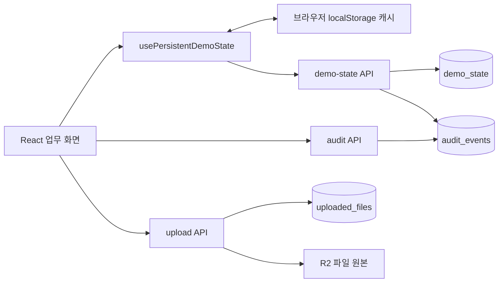
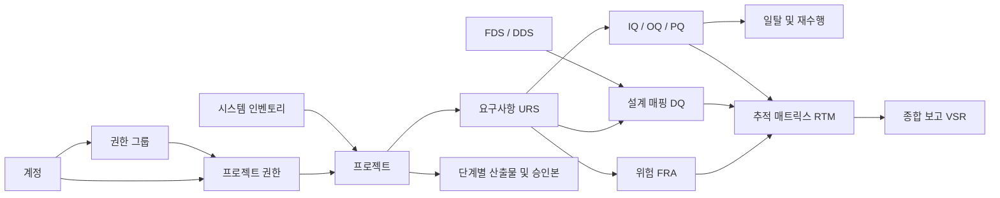

# ValiDocs 테이블 명세서

> 검증 프로젝트의 계획, 요구사항, 시험, 승인, 산출물을 관리하는 **ValiDocs 데모 프로젝트**의 현재 소스 코드를 분석한 문서입니다.
>
> **핵심 구조:** 물리 DB 테이블은 **3개·20개 컬럼**입니다. 계정·프로젝트·검증 항목은 별도 테이블이 아니라 `demo_state.value`에 JSON으로 저장됩니다.

| 항목 | 내용 |
| --- | --- |
| 분석 기준일 | 2026-09-16 |
| 분석 대상 | 현재 폴더의 애플리케이션, API, Drizzle 스키마, SQL 마이그레이션 |
| 데이터베이스 | Cloudflare D1 바인딩 `DB` / SQLite 방언 |
| 파일 저장소 | Cloudflare R2 바인딩 `UPLOADS` |
| 명세 기준 | 물리 컬럼은 SQL 마이그레이션 기준, 저장·조회 동작은 API 구현 기준 |
| 검증 범위 | 소스 정적 분석 및 메모리 SQLite 스키마 대조. 배포된 DB의 실제 스키마·데이터 건수는 확인하지 않음 |
| 상세 부록 | [JSON 업무 데이터 사전](docs/JSON_DATA_DICTIONARY.md) — 계정·프로젝트·검증·승인·산출물의 내부 필드 |

## 목차

1. [프로젝트와 시스템 구조](#system)
2. [저장 구조와 테이블 목록](#storage)
3. [물리 테이블 상세 명세](#tables)
4. [JSON 저장 키 목록](#json-keys)
5. [데이터 관계와 업무 흐름](#relations)
6. [API별 읽기·쓰기](#api)
7. [데이터 규칙과 구현상 확인 사항](#cautions)
8. [분석 근거와 검증 결과](#evidence)

<a id="system"></a>

## 1. 프로젝트와 시스템 구조

### 1.1 어떤 시스템인가요?

ValiDocs는 시스템·장비 인벤토리를 등록하고, 검증 프로젝트를 생성하여 요구사항부터 시험 결과와 최종 보고서까지 관리하는 웹 데모입니다. 계정·그룹·권한, 직렬·병렬 승인 경로, 전자서명 형태의 확인 절차, 개정 및 승인 초기화, 첨부파일, 감사 이력을 구현합니다.

| 업무 영역 | 주요 기능 | 주요 구현 파일 |
| --- | --- | --- |
| 공통 화면 | 로그인, 메뉴, 프로젝트 선택, 권한에 따른 화면 구성 | [app/page.tsx](app/page.tsx) |
| 시스템 관리 | 인벤토리, 계정, 그룹, 권한, 라이브러리, 프로젝트 관리 | [AdminProjectFeatures.tsx](app/features/AdminProjectFeatures.tsx) |
| 검증 계획 | VP, VA, QIA, URS, F&DS, FRA 작성·확인 | [ValidationPlanningFeatures.tsx](app/features/ValidationPlanningFeatures.tsx) |
| 설계 적격성 | 요구사항과 설계 문서 연결, DQ 판정 | [QualificationTraceFeatures.tsx](app/features/QualificationTraceFeatures.tsx) |
| 시험과 일탈 | IQ/OQ/PQ 프로토콜, 수행 결과, 첨부, 일탈 및 재수행 | [QualificationTestFeatures.tsx](app/features/QualificationTestFeatures.tsx) |
| 추적 및 보고 | RTM 연결 현황, VSR 종합 보고 | [TraceSummaryFeatures.tsx](app/features/TraceSummaryFeatures.tsx) |
| 산출물 | 승인 데이터 스냅샷, 문서 초안, 개정본, PDF | [DeliverableDocumentWorkspace.tsx](app/features/DeliverableDocumentWorkspace.tsx) |
| 프로젝트 종료 | 정상·강제 종료 요청과 승인 기록 | [ProjectClosureWorkflow.tsx](app/features/ProjectClosureWorkflow.tsx) |

현재 사용자 메뉴에는 **11개 검증 단계**가 있습니다. 아래 표는 내부 추적성 데이터인 **RTM을 포함한 12종**으로, 승인 연쇄 처리와 산출물 코드의 범위를 나타냅니다. 프로젝트의 `activities`에 선택된 단계에 따라 수행 범위가 달라집니다.

| 코드 | 의미 | 관리 데이터 |
| --- | --- | --- |
| VP | Validation Plan / 검증 계획 | 계획 문서와 섹션 |
| VA | Vendor Assessment / 공급업체 평가 | 평가 항목, 첨부, 평가 결과 |
| QIA | Quality Impact Assessment / 품질 영향 평가 | 모듈·프로세스별 응답 |
| URS | User Requirements Specification / 사용자 요구사항 | 요구사항, 수용 기준, 버전 |
| F&DS | Functional & Design Specification / 기능·설계 명세 | FDS·DDS 문서 |
| FRA | Functional Risk Assessment / 기능 위험 평가 | 요구사항별 위험 및 평가값 |
| DQ | Design Qualification / 설계 적격성 평가 | 요구사항과 설계의 연결·판정 |
| IQ | Installation Qualification / 설치 적격성 평가 | 설치 시험 및 결과 |
| OQ | Operational Qualification / 운전 적격성 평가 | 운전 시험 및 결과 |
| PQ | Performance Qualification / 성능 적격성 평가 | 성능 시험 및 결과 |
| RTM | Requirements Traceability Matrix / 요구사항 추적표 | 요구사항 → 위험 → 설계 → 시험 연결 |
| VSR | Validation Summary Report / 검증 요약 보고서 | 단계별 승인 결과 종합 |

### 1.2 기술 및 폴더 구성

[package.json](package.json) 기준으로 React 19, Next.js 16의 App Router 구조, TypeScript, vinext/Vite, Drizzle ORM을 사용합니다. 기본 `build`는 vinext이고, `vercel-build`는 Next.js 빌드입니다. 실제 API의 DB 접근은 대부분 `DB.prepare()` / `DB.batch()`를 이용한 SQL입니다.

```text
DVT_demo-main/
├── app/
│   ├── page.tsx                 # 메인 클라이언트 화면과 메뉴
│   ├── features/                # 업무 기능, JSON 타입, 영속 상태 훅
│   └── api/                     # 상태·감사·업로드·권한·승인 초기화 API
├── db/
│   ├── schema.ts                # 물리 테이블 3개 정의
│   └── index.ts                 # D1 + Drizzle 연결 헬퍼
├── drizzle/                     # SQL 마이그레이션 및 스냅샷
├── worker/                      # Cloudflare Worker 진입점
├── .openai/hosting.json          # DB / UPLOADS 바인딩 선언
├── examples/d1/                  # 독립적인 notes 예제
├── tests/                       # 화면·소스 계약 검증
├── sequence diagram/            # 기존 업무 시퀀스 설명
├── design_baseline/             # 배포 디자인 기준 자료
└── docs/JSON_DATA_DICTIONARY.md  # 이 명세서의 JSON 상세 부록
```

<a id="storage"></a>

## 2. 저장 구조와 테이블 목록

### 2.1 데이터가 저장되는 위치



위 그림은 `DB`와 `UPLOADS`가 모두 연결된 경우입니다. `DB`가 없으면 DB 대신 서버 프로세스 메모리를 사용하며, `UPLOADS`가 없으면 파일 본문은 보관하지 않습니다.

| 저장 대상 | 위치 | 저장 단위 |
| --- | --- | --- |
| 계정·프로젝트·검증 업무 데이터 | `demo_state.value` | 키 하나당 JSON 배열 또는 객체 전체 |
| 변경 및 서명 관련 감사 이력 | `audit_events` | 이벤트 또는 변경 필드별 행 |
| 파일 메타데이터 | `uploaded_files` | 업로드 파일 1개당 1행 |
| 파일 본문 | R2 `UPLOADS` | `object_key`로 식별하는 객체 |
| 미완료 저장 복구·문서 편집 상태 | 브라우저 `localStorage` | 영속 상태 캐시·문서 작업본 |

### 2.2 물리 테이블 목록

| 번호 | 테이블명 | 논리명 | PK | 컬럼 수 | 역할 |
| --- | --- | --- | --- | --- | --- |
| T01 | [`demo_state`](#table-demo-state) | 업무 상태 저장 | `key` | 3 | 각 업무 데이터셋의 JSON 저장 |
| T02 | [`audit_events`](#table-audit-events) | 감사 이벤트 | `id` | 9 | 수행자, 작업, 사유, 변경 전후 값 |
| T03 | [`uploaded_files`](#table-uploaded-files) | 업로드 파일 정보 | `id` | 8 | R2 연결 키 및 파일 메타데이터 |

**외래키(FK)는 세 테이블 모두 없습니다.** 별도의 `users`, `projects`, `requirements`, `tests` 테이블은 현재 구현에 없습니다. `examples/d1/db/schema.ts`의 `notes`는 예제 전용이므로 본 명세의 서비스 테이블 수에 포함하지 않습니다.

<a id="tables"></a>

## 3. 물리 테이블 상세 명세

**표 읽는 법:** `NULL 허용 = 아니요`는 마이그레이션의 `NOT NULL`을 뜻합니다. `—`는 별도 키 또는 기본값 선언이 없다는 뜻입니다. 모든 `TEXT` 컬럼은 길이가 지정되지 않았으며, 날짜도 DB 날짜 타입이 아닌 문자열로 저장됩니다. 애플리케이션에서 생성하는 UUID·시각은 DB의 `DEFAULT`와 구분합니다.

<a id="table-demo-state"></a>

### T01. `demo_state` — 업무 상태 저장

| 항목 | 명세 |
| --- | --- |
| 행의 의미 | 특정 저장 키에 해당하는 업무 데이터셋 전체 |
| 기본키 | `key` |
| 주요 조회 | `WHERE key = ?` |
| 저장 방식 | 같은 키가 있으면 `value`, `updated_at`을 갱신하는 UPSERT |
| 정의 | [Drizzle 스키마](db/schema.ts#L3), [DDL](drizzle/0000_famous_violations.sql#L13) |
| 처리 | [demo-state API](app/api/demo-state/route.ts) |

| 컬럼명 | 논리명 | DB 타입 | NULL 허용 | 키 | DB 기본값 | 값·생성 규칙 |
| --- | --- | --- | --- | --- | --- | --- |
| `key` | 데이터셋 식별자 | `TEXT` | 아니요 | PK | — | 화면·기능이 정한 키. 예: `admin.projects.v1` |
| `value` | 업무 데이터 | `TEXT` | 아니요 | — | — | `JSON.stringify()` 결과. JSON 객체·배열 등이 들어감 |
| `updated_at` | 최종 변경 시각 | `TEXT` | 아니요 | — | — | 저장 시 서버에서 `new Date().toISOString()` 생성 |

- `admin.projects.v1` 한 행의 `value`에 여러 프로젝트가 배열로 들어갑니다. 프로젝트 수와 `demo_state` 행 수는 같지 않습니다.
- 일반 POST 검증은 키의 존재와 `value !== undefined`를 확인합니다. 모든 키에 대한 고정 JSON 스키마 검증이나 DB `json_valid` 제약은 없습니다. 일부 인벤토리 승인 정책은 별도로 검증합니다.
- JSON `null`은 SQL `NULL`과 다릅니다. `value`에 문자열 `"null"`을 저장할 수 있습니다.
- 버전·프로젝트·항목 관계는 JSON 필드 또는 저장 키에 포함됩니다.

<a id="table-audit-events"></a>

### T02. `audit_events` — 감사 이벤트

| 항목 | 명세 |
| --- | --- |
| 행의 의미 | 업무 이벤트 또는 한 필드의 변경 기록 |
| 기본키 | `id` — `INTEGER PRIMARY KEY AUTOINCREMENT` |
| 주요 조회 | `ORDER BY id DESC LIMIT 200` |
| 주요 기록 경로 | 업무 상태 저장, 명시적 감사 이벤트, 승인 초기화 |
| 정의 | [Drizzle 스키마](db/schema.ts#L9), [DDL](drizzle/0000_famous_violations.sql#L1) |
| 처리 | [demo-state API](app/api/demo-state/route.ts), [audit API](app/api/audit/route.ts), [reset-approvals API](app/api/reset-approvals/route.ts) |

| 컬럼명 | 논리명 | DB 타입 | NULL 허용 | 키 | DB 기본값 | 값·생성 규칙 |
| --- | --- | --- | --- | --- | --- | --- |
| `id` | 이벤트 ID | `INTEGER` | 아니요 | PK | — | DB 자동 증가. `AUTOINCREMENT`는 `DEFAULT`와 별개 |
| `timestamp` | 발생 시각 | `TEXT` | 아니요 | — | — | 서버가 생성한 ISO 8601 UTC 문자열 |
| `user` | 수행자 | `TEXT` | 아니요 | — | — | `getDemoIdentity()`가 결정한 사용자 식별값 |
| `role` | 수행 당시 역할 | `TEXT` | 아니요 | — | — | 요청 당시의 역할 문자열 |
| `menu` | 발생 메뉴·데이터셋 | `TEXT` | 아니요 | — | — | 요청의 메뉴명. 상태 저장에서는 미입력 시 저장 키 |
| `action` | 작업·변경 경로 | `TEXT` | 아니요 | — | — | 예: `UPDATE:$.name`. 작업명과 JSON 필드 경로 결합 등 |
| `reason` | 변경 사유 | `TEXT` | 예 | — | — | 요청 사유. 미입력·빈 값은 SQL `NULL` 가능 |
| `before_value` | 변경 전 값 | `TEXT` | 예 | — | — | JSON 직렬화한 값. 호출 경로에 따라 SQL `NULL` 또는 문자열 `"null"` |
| `after_value` | 변경 후 값 | `TEXT` | 아니요 | — | — | JSON 직렬화한 값. 대상 값이 없으면 문자열 `"null"` |

- 상태 저장 API는 JSON을 필드 경로로 펼쳐 변경을 비교합니다. 일반 상태 변경의 필드 차이는 한 요청당 최대 100개까지 기록합니다.
- 최초 저장은 `$` 경로에 전체 값이 기록될 수 있습니다. 매 이벤트가 업무 객체 전체 스냅샷인 것은 아닙니다.
- `/api/audit`는 `fields` 배열이 비어 있지 않으면 각 필드를, 없으면 `record` 이벤트를 기록합니다.
- DB의 FK로 계정을 연결하지 않습니다. 계정 이름·역할이 변경되어도 과거 이력은 저장 당시 문자열을 유지합니다.
- 현재 API에 특정 데모 사용자의 기준 시각 이전 이력을 정리하는 `DELETE` 분기가 있습니다. 변경·삭제 불가 감사 원장으로 해석하면 안 됩니다.

<a id="table-uploaded-files"></a>

### T03. `uploaded_files` — 업로드 파일 정보

| 항목 | 명세 |
| --- | --- |
| 행의 의미 | 업로드 요청으로 등록한 파일 1개의 메타데이터 |
| 기본키 | `id` |
| 파일 원본 | R2 `UPLOADS` 바인딩이 있을 때만 저장 |
| 정의 | [Drizzle 스키마](db/schema.ts#L21), [DDL](drizzle/0000_famous_violations.sql#L19) |
| 처리 | [upload API](app/api/upload/route.ts), [클라이언트 업로드 헬퍼](app/features/uploadFile.ts) |

| 컬럼명 | 논리명 | DB 타입 | NULL 허용 | 키 | DB 기본값 | 값·생성 규칙 |
| --- | --- | --- | --- | --- | --- | --- |
| `id` | 파일 ID | `TEXT` | 아니요 | PK | — | 서버의 `crypto.randomUUID()` |
| `object_key` | 객체 저장소 키 | `TEXT` | 아니요 | — | — | UUID + `-` + 정제한 파일명. R2 객체 키 |
| `original_name` | 원본 파일명 | `TEXT` | 아니요 | — | — | 업로드한 `file.name` |
| `content_type` | MIME 타입 | `TEXT` | 예 | — | — | `file.type`, 빈 값이면 SQL `NULL` |
| `size` | 파일 크기 | `INTEGER` | 아니요 | — | — | `file.size`, 바이트 단위 |
| `owner` | 업로드 수행자 | `TEXT` | 아니요 | — | — | 요청의 사용자 식별값 |
| `menu` | 업로드 메뉴 | `TEXT` | 아니요 | — | — | 폼의 `menu`, 미입력 시 애플리케이션 값 `Attachment` |
| `created_at` | 업로드 시각 | `TEXT` | 아니요 | — | — | 서버가 생성한 ISO 8601 UTC 문자열 |

`object_key`의 파일명 부분은 영문·숫자·`.`·`_`·`-` 이외의 문자를 `_`로 치환합니다. `object_key`에 별도 UNIQUE 제약은 없습니다. 파일 크기·타입에 대한 DB CHECK도 없습니다.

업무 JSON에 들어가는 첨부 객체와 물리 컬럼의 대응은 다음과 같습니다.

| 첨부 JSON 필드 | 물리 컬럼 | 비고 |
| --- | --- | --- |
| `id` | `uploaded_files.id` | 논리적 파일 참조. FK 없음 |
| `key` | `uploaded_files.object_key` | R2 객체 식별자 |
| `name` | `uploaded_files.original_name` | 표시 파일명 |
| `size` | `uploaded_files.size` | 바이트 |
| `type` | `uploaded_files.content_type` | API의 빈 문자열과 DB의 SQL `NULL` 표현이 다를 수 있음 |

### 3.4 공통 제약 및 인덱스

| 항목 | 현재 선언 |
| --- | --- |
| 기본키 | `demo_state.key`, `audit_events.id`, `uploaded_files.id` |
| 외래키 | 없음 |
| 별도 UNIQUE / CHECK / DEFAULT | 없음 |
| 보조 인덱스 | 명시적으로 정의한 보조 인덱스 없음 |
| SQLite 기본키 인덱스 | 텍스트 PK에는 자동 인덱스가 생성됨. `audit_events.id`는 INTEGER PK |
| DB 트리거 | 없음 |
| 논리 삭제 | 물리 테이블 공통 삭제 컬럼 없음. 일부 JSON 항목의 `unused`, 상태 필드로 표현 |

<a id="json-keys"></a>

## 4. JSON 저장 키 목록

아래 항목은 모두 **`demo_state`의 행을 구분하는 키**이며, 별도 SQL 테이블이 아닙니다. 실제 JSON 필드·타입·선택 여부는 [상세 데이터 사전](docs/JSON_DATA_DICTIONARY.md)에 정리했습니다.

### 4.1 키 표기 규칙

| 표기 | 의미 | 예시 |
| --- | --- | --- |
| `{projectId}` | 원본 프로젝트 ID. 일부 화면에서는 미지정 시 `demo` | `VAL-2026-014` |
| `{projectKey}` | 프로젝트 ID, 대체 프로젝트명을 소문자로 변환하고 영문·숫자·한글 이외 연속 문자를 `-`로 정리 | `val-2026-014` |
| `{scope}` | 기능별 소문자 승인 범위 | `vp`, `va`, `qia`, `urs`, `f&ds`, `fra`, `rtm`, `vsr` |
| `{stage}` | 산출물 단계 소문자. `&`는 `and`로 치환 | `vp`, `fands`, `iq`, `vsr` |
| `{kind}` | 프로젝트 종료 구분 | `정상종료`, `강제종료` |

원본 ID와 정규화한 키는 서로 다릅니다. 예를 들어 `validation.val-2026-014.urs`와 `VAL-2026-014:iq-qualification`은 같은 프로젝트를 다른 규칙으로 표현합니다.

### 4.2 공통 관리 데이터

| 저장 키 | JSON 루트 타입 | 업무 의미 |
| --- | --- | --- |
| `admin.accounts.v1` | [AccountRecord](docs/JSON_DATA_DICTIONARY.md#account-record)`[]` | 계정·업무 역할 |
| `admin.permission-groups.v1` | [PermissionGroupRecord](docs/JSON_DATA_DICTIONARY.md#permission-group)`[]` | 권한 그룹·그룹 구성원 |
| `admin.direct-permissions.v1` | [DirectPermissionGrant](docs/JSON_DATA_DICTIONARY.md#direct-permission)`[]` | 개인·그룹별 프로젝트 권한 |
| `admin.system-permissions.v1` | [SystemPermissionGrant](docs/JSON_DATA_DICTIONARY.md#system-permission)`[]` | 계정별 시스템 메뉴 권한 및 부여 출처 |
| `admin.permissions.inventory-approvers.v1` | [InventoryApprovalPolicy](docs/JSON_DATA_DICTIONARY.md#inventory-policy) | 인벤토리 작성·검토·승인·폐기 담당자 |
| `admin.system-inventory.v1` | [SystemRecord](docs/JSON_DATA_DICTIONARY.md#system-record)`[]` | 시스템·장비 인벤토리 |
| `admin.system-history.v1` | [SystemHistory](docs/JSON_DATA_DICTIONARY.md#system-history)`[]` | 인벤토리 변경·승인 이력 |
| `admin.projects.v1` | [ManagedProject](docs/JSON_DATA_DICTIONARY.md#managed-project)`[]` | 프로젝트와 승인 워크플로우 |
| `admin.library.v1` | [LibraryStore](docs/JSON_DATA_DICTIONARY.md#library-store) | URS/FRA/IQ/OQ/PQ 템플릿 |
| `validation.approval-reset-events.v1` | [ApprovalResetEvent](docs/JSON_DATA_DICTIONARY.md#approval-reset-event)`[]` | 시스템 개정으로 발생한 프로젝트 승인 초기화 기록 |

### 4.3 프로젝트별 검증·문서 데이터

| 저장 키 패턴 | JSON 루트 타입 | 업무 의미 |
| --- | --- | --- |
| `validation.{projectKey}.vp` | [VPState](docs/JSON_DATA_DICTIONARY.md#vp-state) | 검증 계획 |
| `validation.{projectKey}.va-assessment` | [VAAssessment](docs/JSON_DATA_DICTIONARY.md#va-assessment) | 단일 평가·기존 화면 호환 상태 |
| `validation.{projectKey}.va-assessments` | [VAAssessment](docs/JSON_DATA_DICTIONARY.md#va-assessment)`[]` | 공급업체 평가 목록 |
| `validation.{projectKey}.qia` | [QIAModule](docs/JSON_DATA_DICTIONARY.md#qia-module)`[]` | 모듈별 품질 영향 평가 |
| `validation.{projectKey}.qia-document` | [QIADocumentState](docs/JSON_DATA_DICTIONARY.md#qia-document) | QIA 문서 승인·버전 |
| `validation.{projectKey}.urs` | [URSItem](docs/JSON_DATA_DICTIONARY.md#urs-item)`[]` | 요구사항 목록 |
| `validation.{projectKey}.urs-document` | [URSDocumentState](docs/JSON_DATA_DICTIONARY.md#urs-document) | 요구사항 문서 버전·개정 대기 항목 |
| `validation.{projectKey}.fds` | [DesignState](docs/JSON_DATA_DICTIONARY.md#design-state) | FDS와 DDS를 함께 저장 |
| `validation.{projectKey}.fra` | [FRAState](docs/JSON_DATA_DICTIONARY.md#fra-state) | 위험 평가 목록과 문서 상태 |
| `{projectId}:dq-mappings` | [DQMapping](docs/JSON_DATA_DICTIONARY.md#dq-mapping)`[]` | 요구사항·설계 매핑과 DQ 판정 |
| `{projectId}:iq-qualification` | [State](docs/JSON_DATA_DICTIONARY.md#qualification-state) | IQ 시험·일탈 |
| `{projectId}:oq-qualification` | [State](docs/JSON_DATA_DICTIONARY.md#qualification-state) | OQ 시험·일탈 |
| `{projectId}:pq-qualification` | [State](docs/JSON_DATA_DICTIONARY.md#qualification-state) | PQ 시험·일탈 |
| `{projectId}:rtm` | [RTMRow](docs/JSON_DATA_DICTIONARY.md#rtm-row)`[]` | 추적 매트릭스 |
| `{projectId}:rtm-document` | [RTMDocumentState](docs/JSON_DATA_DICTIONARY.md#rtm-document) | RTM 문서 승인·원본 식별값 |
| `{projectId}:vsr` | [VSRState](docs/JSON_DATA_DICTIONARY.md#vsr-state) | 종합 보고서 |
| `approval-routes.{projectKey}.{scope}` | 계획 단계: 항목 키별 승인 경로 객체 / RTM·VSR: 단일 승인 경로 또는 `null` | 확인자 지정 및 서명 진행 상태 |
| `{projectId}:dq-mappings:approval-routes` | `Record<string, DQApprovalRoute>` | DQ 항목별 확인 경로 |
| `deliverable-document:{projectId}:{stage}:v1` | [WorkspaceStore](docs/JSON_DATA_DICTIONARY.md#workspace-store) | 산출물 초안, 문서 개정본, 승인 데이터 스냅샷 |
| `project-closure:{projectId}:{kind}:v1` | `ProjectClosureRequest` 또는 `null` | 정상·강제 종료 승인 요청 |

`v1`은 저장 키의 네임스페이스입니다. 업무 문서의 `version`이나 승인본의 `currentVersion`과 같지 않습니다. 일부 데이터는 화면 진입 후 `initializeIfMissing` 옵션 또는 첫 변경 시 저장되므로, 코드에 키가 있다고 DB에 반드시 행이 존재하는 것은 아닙니다.

<a id="relations"></a>

## 5. 데이터 관계와 업무 흐름

### 5.1 논리적 관계

아래는 JSON 내부의 업무 관계입니다. DB에 선언된 ERD 또는 FK 관계가 아닙니다.



| 참조 필드 | 연결 대상 | 구현상 특징 |
| --- | --- | --- |
| 계정 `groupId`, `groupIds[]` / 그룹 `members[]` | 그룹 `id` / 계정 `id` | 양쪽 JSON에 관계가 표현됨 |
| 시스템 권한 `accountId`, `sourceId` | 계정·그룹 ID | 직접 부여인지 그룹 유래인지 `sourceType`으로 구분 |
| 프로젝트 권한 `subjectId`, `projectId` | 계정 또는 그룹 ID, 프로젝트 ID | `subjectType`에 따라 대상 구분. 프로젝트명 호환 필드도 있음 |
| 프로젝트 `system` | 인벤토리 `name` | ID가 아닌 이름을 이용한 연결 |
| 인벤토리 `linkedProjects[]` | 프로젝트 `name` | 프로젝트명 목록 |
| 시스템 이력 `systemId` | 인벤토리 `id` | FK 없는 문자열 참조 |
| 승인 경로 `signerIds[]`, 워크플로우 `userId` | 계정 `id` | 대리자 `substituteUserId` 포함 가능 |
| FRA·DQ·RTM의 `ursId`, 시험의 `ursIds[]` | URS 업무 ID | 버전·폐기 여부를 화면 로직에서 확인 |
| DQ의 `fdsId`, `ddsId` 등 | 설계 문서 식별값 | 기존 `designId` 형식도 호환 |
| 일탈 `testId` | 같은 시험 상태의 `tests[].id` | `kind`로 IQ/OQ/PQ 구분 |
| 첨부 `id`, `key` | 파일 메타데이터 및 R2 객체 | DB FK·자동 정리 제약 없음 |

### 5.2 승인과 개정의 영향

일반 흐름은 **시스템 등록 → 프로젝트 준비 → 검증 수행 → 확인·승인 → 산출물 생성·승인 → 프로젝트 종료**입니다.

상위 단계의 승인이 없어지거나 승인 기준 데이터가 개정되면 서버는 저장 키와 단계 순서를 판별하여 관련 후속 상태를 무효화합니다. 산출물에는 `invalidatedAt`, `invalidatedByStage`, `reapprovalReason` 등 재승인 관련 값이 남을 수 있습니다. 인벤토리 개정에 따른 승인 초기화는 별도 API와 초기화 이벤트 데이터셋도 사용합니다. 이는 DB의 `ON DELETE CASCADE`가 아닌 [애플리케이션 로직](app/api/_approval-cascade.ts)입니다.

별도의 `/api/reset-approvals`는 `validation.{projectKey}.`와 `{projectId}:` 접두사의 상태만 검색합니다. `deliverable-document:`와 `approval-routes.` 키가 이 API에서 직접 검색되는 것은 아니므로, 모든 저장 키를 일괄 초기화한다고 해석하면 안 됩니다.

<a id="api"></a>

## 6. API별 읽기·쓰기

| API | 방식 | 읽는 테이블 | 쓰는 테이블 | 주요 동작 |
| --- | --- | --- | --- | --- |
| `/api/demo-state?key=...` | GET | `demo_state` | — | JSON 데이터셋 한 개 조회 |
| `/api/demo-state` — 키 없음 | GET | `audit_events` | 조건부 `audit_events` 삭제 | 최근 200개 감사 이벤트. 특정 데모 이력 정리 분기 존재 |
| `/api/demo-state` | POST | `demo_state` | `demo_state`, `audit_events` | 상태 UPSERT, 필드별 이력, 연관 승인 초기화 |
| `/api/audit` | POST | — | `audit_events` | 명시적 이벤트·서명 관련 변경 기록 |
| `/api/upload` | POST | — | `uploaded_files` 및 R2 | 파일·메타데이터 등록 |
| `/api/my-system-permissions` | GET | `demo_state` | — | 현재 계정의 시스템 권한 부여 내역 조회 |
| `/api/reset-approvals` | POST | `demo_state` | `demo_state`, `audit_events` | 프로젝트의 관련 승인 상태 초기화 |

권한 판정 헬퍼도 `demo_state`의 계정·시스템 권한 데이터(그룹에서 부여된 권한 포함)를 읽습니다. 위 표의 조회 API 중 일부는 처음 접근할 때 `CREATE TABLE IF NOT EXISTS`를 실행합니다.

<a id="cautions"></a>

## 7. 데이터 규칙과 구현상 확인 사항

### 7.1 실행 환경에 따른 저장 범위

| DB 바인딩 | R2 바인딩 | 업무 상태·감사·파일 메타데이터 | 파일 원본 |
| --- | --- | --- | --- |
| 있음 | 있음 | D1 | R2 |
| 있음 | 없음 | D1 | 저장하지 않음 |
| 없음 | 있음 | 서버 메모리 | R2 |
| 없음 | 없음 | 서버 메모리 | 저장하지 않음 |

메모리 저장은 `globalThis`의 Map·배열을 이용합니다. 서버 재시작이나 다른 인스턴스에서의 지속성을 보장하지 않습니다. 메모리 감사 배열은 최신 500개로 제한됩니다. 로컬 JSON 캐시가 서버보다 최신이거나 저장 대기 상태라면, 쓰기 가능한 사용자가 다시 접속할 때 서버로 복구 저장할 수 있습니다.

`DEMO_DATA_EPOCH` 변경 시 브라우저의 이전 영속 캐시·문서 작업본과 메모리 데이터가 초기화되는 경로가 있습니다. 동일한 방식으로 D1 전체 데이터를 초기화하는 로직은 아닙니다. 관련 구현: [런타임 저장소](app/api/_runtime.ts), [영속 상태 훅](app/features/usePersistentDemoState.ts), [데이터 세대 값](app/demoDataEpoch.ts).

### 7.2 명세를 해석할 때 확인할 차이

| 구분 | 확인된 구현 | 명세 해석 |
| --- | --- | --- |
| DDL과 런타임 생성문 | 마이그레이션은 텍스트 PK에 `NOT NULL`을 명시하지만 API 생성문은 생략 | `demo_state.key`, `uploaded_files.id`의 NULL 제약이 생성 경로에 따라 다를 수 있음 |
| 정수 PK | 런타임에서 `audit_events.id`의 명시적 `NOT NULL`도 생략 | `INTEGER PRIMARY KEY AUTOINCREMENT`의 ID 자동 생성 특성은 유지 |
| 마이그레이션 갱신 | API는 `CREATE TABLE IF NOT EXISTS` 사용 | 이미 생성된 테이블의 제약을 이 문장으로 변경하지 않음 |
| JSON 무결성 | 대부분의 구조가 TypeScript와 화면 로직에 정의 | JSON 필드의 필수 표시를 DB 제약으로 해석하면 안 됨 |
| 동시 저장 | 키 단위 JSON 전체 UPSERT. 버전 비교 조건 없음 | 같은 키를 동시에 수정하면 나중 저장이 앞선 내용을 덮을 수 있음 |
| 인증·전자서명 | 데모 세션·역할 헤더와 화면의 데모 확인 절차 사용 | 운영용 인증·전자서명 검증을 보장하는 구현으로 해석하지 않음 |
| 파일 저장 | R2 미연결이어도 메타데이터 등록 가능 | DB 파일 행이 있다고 원본이 반드시 존재하는 것은 아님 |
| R2·DB 처리 | 객체 저장 후 DB 메타데이터 삽입 | 두 저장소를 묶는 원자적 트랜잭션은 없음 |
| 기존 안내 문서 | README는 초기 스타터 설명. 시퀀스 문서에는 일부 감사 제외 설명 | 이 문서는 현재 코드와 실제 API 동작을 우선함 |
| 감사 기록 범위 | 상태 저장 API는 관리·라이브러리 키도 변경 이력을 기록 | 화면의 별도 감사 제외 설정만으로 DB 감사가 생략되는 것은 아님 |

### 7.3 타입·값 해석

- 물리 날짜 컬럼은 API가 ISO 8601 UTC 값으로 기록합니다. JSON 내부의 `updated`, `registered`, 업무 날짜 등은 표시용 문자열·날짜 문자열도 사용하므로 모두 동일한 형식은 아닙니다.
- 업무 상태는 DB ENUM이 아닌 문자열입니다. 예를 들어 검증의 `승인완료`와 인벤토리의 `승인 완료`는 공백도 다릅니다. 상세 코드값은 부록을 따릅니다.
- JSON 배열 항목의 `id`, `uid`, `itemNo`는 서로 다른 용도로 사용됩니다. 물리 PK나 전역 UNIQUE로 보장되지 않습니다.
- 승인 이력, 산출물 개정본, 시험 재수행 이력은 JSON 배열로 저장됩니다. 별도의 이력 테이블은 없습니다.

<a id="evidence"></a>

## 8. 분석 근거와 검증 결과

### 8.1 주요 근거

| 근거 | 확인 내용 |
| --- | --- |
| [db/schema.ts](db/schema.ts) | 물리 테이블 및 Drizzle 필드 선언 |
| [drizzle/0000_famous_violations.sql](drizzle/0000_famous_violations.sql) | 실제 생성 DDL, PK·NULL·자동 증가 |
| [drizzle/meta/0000_snapshot.json](drizzle/meta/0000_snapshot.json) | 생성된 스키마 메타데이터 |
| [drizzle.config.ts](drizzle.config.ts) | 루트 스키마 경로 및 SQLite 방언 |
| [app/api/](app/api/) | 런타임 DDL, SQL, 저장·감사·업로드·권한 동작 |
| [app/features/](app/features/) | JSON 타입·저장 키·참조 관계·업무 흐름 |
| [worker/index.ts](worker/index.ts), [vite.config.ts](vite.config.ts), [next.config.ts](next.config.ts) | 실행 환경 및 빌드 구성 |
| [.openai/hosting.json](.openai/hosting.json) | D1·R2 바인딩 선언 |
| [sequence diagram/README.md](<sequence diagram/README.md>) | 기존 업무 설명과 현재 코드의 차이 대조 |

### 8.2 수행한 검증

| 검증 | 결과 |
| --- | --- |
| SQL 마이그레이션을 메모리 SQLite에 적용 | 테이블 3개 생성 확인 |
| 20개 컬럼의 이름·타입·NULL·기본값·PK를 Drizzle 스냅샷과 대조 | 일치 |
| API 전체 런타임 `CREATE TABLE` 검색 | 동일한 3개 테이블. 추가 런타임 전용 업무 테이블 없음 |
| 인덱스·외래키 조회 | 텍스트 PK 자동 인덱스 외 추가 인덱스 및 FK 없음 |
| 마이그레이션과 런타임 DDL 비교 | PK의 명시적 `NOT NULL` 차이 확인, 본문에 기록 |
| 예제 스키마와 서비스 스키마 구분 | `notes` 예제 제외 |

테이블이나 저장 키가 변경되면 이 문서와 [JSON 업무 데이터 사전](docs/JSON_DATA_DICTIONARY.md)을 함께 갱신해야 합니다.
